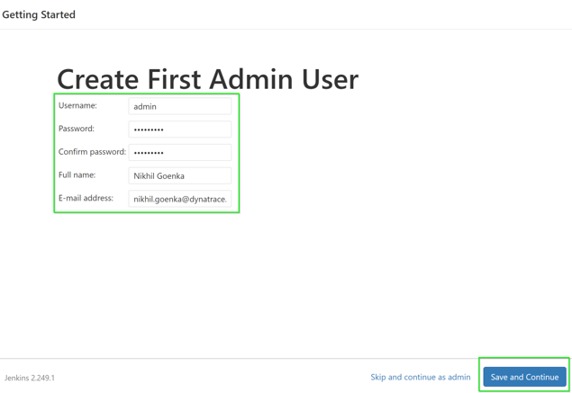
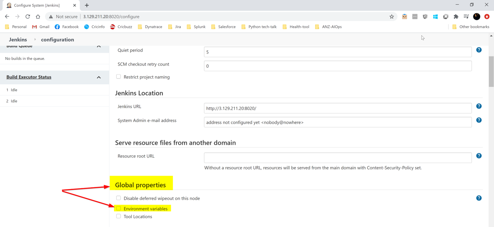
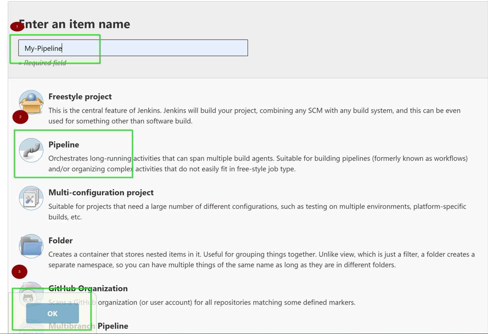
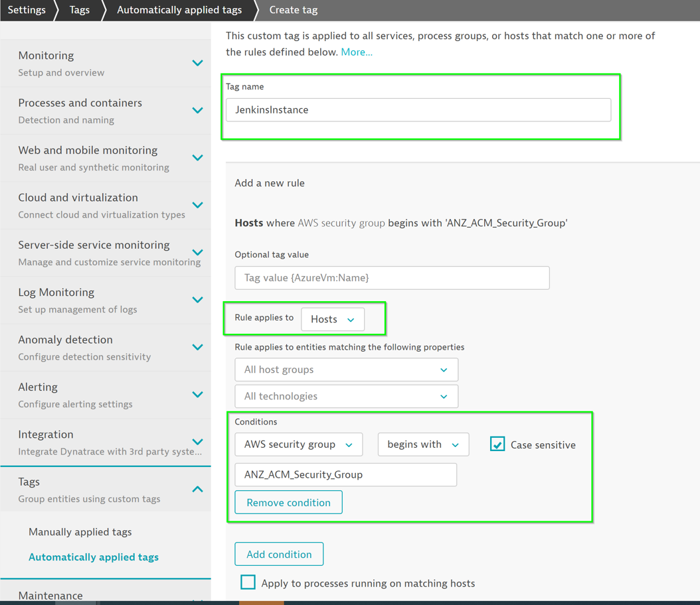
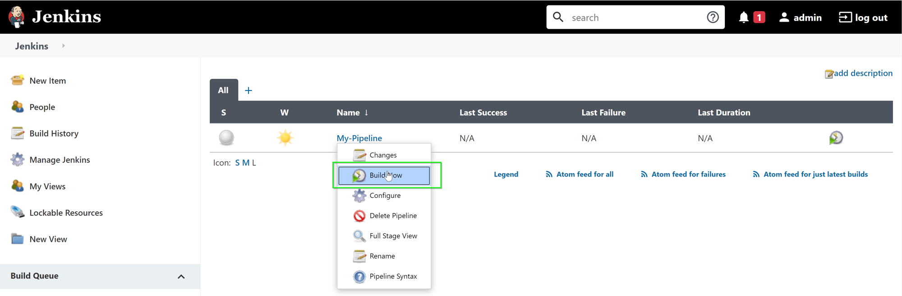

summary: Automate Delivery Session 1
id: automate-delivery-1
categories: automate-delivery
tags: anz
status: Published 
authors: Brandon Neo
Feedback Link: mailto:d1-apac@dynatrace.com
Analytics Account: UA-175467274-1

# Automate Delivery - Session 1
<!-- ------------------------ -->
## Introduction 
Duration: 1

This lab is the third session of the AIOps Enablement Series for ANZ Bank. This track focuses on the Automate Delivery, which relates to how you could integate Dynatrace with orchestration tools to create **Progressive Delivery**.


Throughout these labs, we will be using the **deployment approach / strategies** based on the example below.


### What You’ll Learn 
- Integrate Jenkins with Dynatrace  
- Setup Docker Pipeline in Jenkins
- Leveraging Auto tags Rules for pipelines in Dynatrace
  - Creating tags from Build Stages 

Negative
: As different teams might have their own proprietary test-beds/suits, so we will demo stimulating requests using curl commands too.

<!-- ------------------------ -->
## Useful Commands ✅ 

Positive
: To start the docker with sample application:
   `docker run -d --name SampleBankApp -p 4000:3000 nikhilgoenka/sample-bank-app`
  * This would start the docker on port localhost:4000 with docker name as **SampleBankApp**
   
Positive
: To start the jenkins docker:
   `docker run -d --network mynetwork --name Jenkins-Dynatrace -p 8020:8080  -v /var/jenkins:/var/jenkins_home -v /var/run/docker.sock:/var/run/docker.sock nikhilgoenka/jenkins-dynatrace-workshop`
   * -d runs the docker in daemon mode.
   * -p 8020:8080 - By default, jenkins docker would be running on 8080. Specifying **-p 8020:8080** binds the 8080 in docker to localhost on 8020. So, you can forward/listen requests from docker using `localhost:8020`.
   * -v Bind mounts a volume.
    By default, jenkins docker is maintaining the pipeline/data information in /var/jenkins_home. 
    Specifying **-v /var/jenkins:/var/jenkins_home** would mount the localhost:/var/jenkins directory so that the pipeline data is not lost once pipeline is re-started.
    Specifying **-v /var/run/docker.sock:/var/run/docker.sock** will allow the jekins docker to leverage the dockerd running on localhost. This would be required since we are starting the
    sample-app dockers while running the pipeline.

Positive
: To run the ansible-tower docker:
   `docker run -d --name ansible-tower -p 8090:443 ybalt/ansible-tower`
   This would start the docker on port **localhost:8090** with docker name as **ansible-tower**

**Other useful commands:**
* To **view all docker containers**: `docker ps -a`
* To **view the downloaded images** on localhost: `docker images`
* To **remove a particular image**: `docker rmi <IMAGE-NAME>`
* To **stop a docker**: `docker stop <CONTAINER-ID>`
* To **remove a docker**: `docker rm <CONTAINER-ID>`
* To **run a docker in interactive bash**: `docker run -it <CONTAINER> /bin/bash`
* To **delete all the unused images**: `docker system prune -a -f`
* To **pull a particular image**: `docker pull <docker-image>`
* Jenkins pipeline:
   Command: `https://github.com/nikhilgoenkatech/JenkinsBankApp`

<!-- ------------------------ -->
## Preconfiguration Setup
Duration: 5

Log back into your Dynatrace environment and check if OneAgent is still running.

On your left navigation, select **Hosts** and you should still see a monitored EC2 host. 

### Check if OneAgent is running

Log back into your Dynatrace environment and check if OneAgent is still running.

On your left navigation, select **Hosts** and you should still see a monitored EC2 host. 

### Running Jenkins in Docker

The Jenkins docker would already be present in your ubuntu instances and can be seen with “docker images”


To run the Jenkins docker, execute `docker run -d --network mynetwork --name Jenkins-Dynatrace -p 8020:8080  -v /var/jenkins:/var/jenkins_home -v /var/run/docker.sock:/var/run/docker.sock nikhilgoenka/jenkins-dynatrace-workshop`

### Retrieving Jenkins Password

The initial password can be retrieved as `cat /var/jenkins/secrets/initialAdminPassword`


With the retrieved password, access the Jenkins URL via your web browser. 

Within your Host View, dropdown the **Properties and Tags** and you will get a list of various metadata associated with the host created. Locate the **Public IP Address** and copy its value.


Open up your **web browser** and access the Jenkins URL via `<IP address>:8020`

<!-- ------------------------ -->
## Setting up Jenkins 
Duration: 15

### Installing Docker Pipeline Plugin
Once you login, you will see the screen as below. Click on “Install suggested plugins” as below:


Further, add an admin user with username “admin” and password “dynatrace” 



* Click on **Manage Jenkins** on the left menu


* Click on **Manage Plugins** as highlighted below:


* Now, click on **Available plugins** and input `docker` in the **search bar**
* Select **Docker Pipeline**
* Click on **Install without restart** 


### Configure Environment Variables

Within Jenkins, click on **Manage Jenkins  > Configure System**


* Look for **environment variables** as per image below:




* Add the following environment variables:
  * DT_URL with value https://mou612.managed-sprint.dynalabs.io/e/{environmentid}
  * DT_TOKEN
  * PUBLIC_IP

To get your **DT_TENANT**, go to the Web Browser and extract the URL path as per below. 


To get your **DT_TOKEN**, go to **Settings > Integration > Dynatrace API > Generate Token** and follow the below:

- Create a token with **LoadTest**
- Toggle **Data ingest, eg: metrics and events**
- Click on **Generate**
- Clck on **Copy**

To get your **PUBLIC_IP**, get it from the earlier [step](workshops/automate-delivery-1/index.html?index=..%2F..anz#2)  


### Configure Jenkins Pipeline

* Click on “New Item” on the left side:


* Add a pipeline as per below:
  * Item name - `My Pipeline`
  * Choose **Pipeline**
  * Click on **OK**



* Use the pipeline definitions as per below:
  * Definition - Dropdown **Pipeline script from SCM**
  * SCM - Dropdown **Git**
  * Repository URL - `https://github.com/nikhilgoenkatech/JenkinsBankApp/`
  * Click on **OK**


<!-- ------------------------ -->
## Create Auto Tag rule for Jenkins
Duration: 10

### Creating Auto Tags

Within Dynatrace, on the left menu go to **Settings > Tags > Automatically applied tags**

Use the following:
* Tag name - `JenkinInstance`
* Optional Tag value - `{Ec2Instance:SecurityGroup}`
* Conditions - 
  * Dropdown **AWS Security Group** 
  * Dropdown **begins with** 
  * ANZ_ACM_Security_Group
  * **Check** Case sensitive 
* Click on **Save**



Within the Host Properties and tags, **JenkinsInstance tag** will be added


### Creating Tags for Build Stages

Use the following:
* Tag name - `DockerService`
* Rule applies to - Dropdown **Services**
* Optional Tag value - `{ProcessGroup:DetectedName}`
* Conditions - 
  * Dropdown **Docker container name** 
  * Dropdown **exists** 
* Click on **Save**


Use the following:
* Tag name - `Environment`
* Rule applies to - Dropdown **Services**
* Optional Tag value - `{ProcessGroup:Environment:ENVIRONMENT}`
* Conditions - 
  * Dropdown **ENVIRONMENT (Environment)** 
  * Dropdown **exists** 
* Click on **Save**


### Build Pipeline in Jenkins

Back in Jenkins, click on **Build Now** for the **My-Pipeline**



### Understanding the Build Pipeline process

Referring to the Jenkins File, the following code handles the **pushing of Jenkins deployment information** into Dynatrace.

```yaml
        dir ('dynatrace-scripts') {
            // push a deployment event on the host with the tag JenkinsInstance created using automatic tagging rule
            sh './pushdeployment.sh HOST CONTEXTLESS JenkinsInstance ANZ_ACM_Security_Group ' +
               '${BUILD_TAG} ${BUILD_NUMBER} ${JOB_NAME} ' + 
               'Jenkins ${JENKINS_URL} ${JOB_URL} ${BUILD_URL} ${GIT_COMMIT}'
```


Referring to the Jenkins File, the following code handles the **pushing of deployment information** into Dynatrace. 
This step utilizes environment varibles such as **DT_CLUSTER_ID**, **DT_TAGS** and **DT_CUSTOM_PROP**

```yaml
    stage('DeployStaging') {
        // Lets deploy the previously build container
        def app = docker.image("sample-bankapp-service:${BUILD_NUMBER}")
        app.run("--network mynetwork --name SampleOnlineBankStaging -p 3000:3000 " +
                "-e 'DT_CLUSTER_ID=SampleOnlineBankStaging' " + 
                "-e 'DT_TAGS=Environment=Staging Service=Sample-NodeJs-Service' " +
                "-e 'DT_CUSTOM_PROP=ENVIRONMENT=Staging JOB_NAME=${JOB_NAME} " + 
                    "BUILD_TAG=${BUILD_TAG} BUILD_NUMBER=${BUILD_NUMBER}'")
```


### Review changes in Dynatrace

You can see the changes reflected in **SampleOnlineBankStaging Process View**


You also can see the changes reflected in **node-bank2 Service View**


<!-- ------------------------ -->

## Feedback
Duration: 3

We hope you enjoyed this lab and found it useful. We would love your feedback!
<form>
  <name>How was your overall experience with this lab?</name>
  <input value="Excellent" />
  <input value="Good" />
  <input value="Average" />
  <input value="Fair" />
  <input value="Poor" />
</form>

<form>
  <name>What did you benefit most from this lab?</name>
  <input value="Integrate Jenkins with Dynatrace" />
  <input value="Setup Docker Pipeline in Jenkins" />
  <input value="Leveraging Auto tags Rules for pipelines in Dynatrace" />
  <input value="Creating tags from Build Stages" />
</form>

<form>
  <name>How likely are you to recommend this lab to a friend or colleague?</name>
  <input value="Very Likely" />
  <input value="Moderately Likely" />
  <input value="Neither Likely nor unlikely" />
  <input value="Moderately Unlikely" />
  <input value="Very Unlikely" />
</form>

Positive
: 💡 For other ideas and suggestions, please **[reach out via email](mailto:APAC-SE-Central@dynatrace.com?subject=Automate Feedback 1 - Ideas and Suggestions")**.