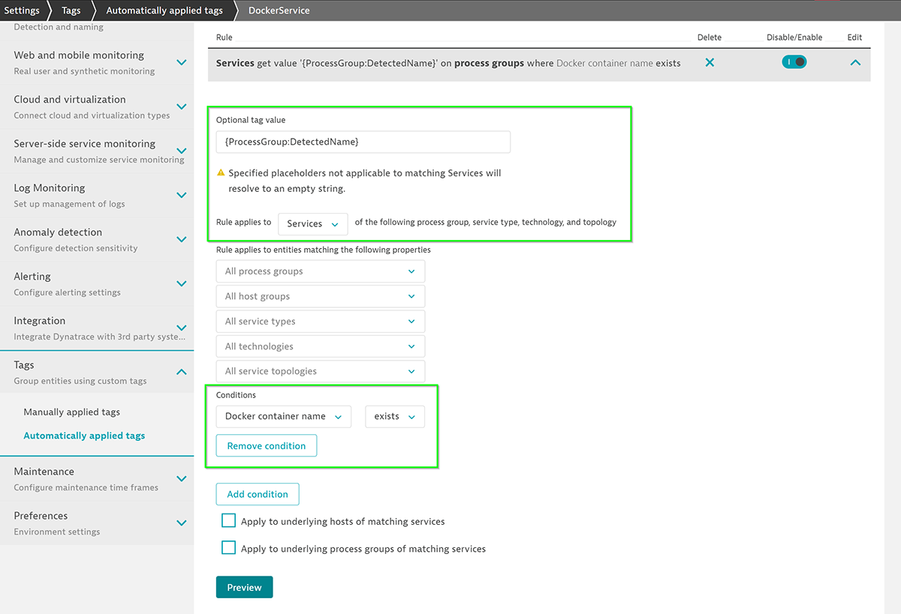
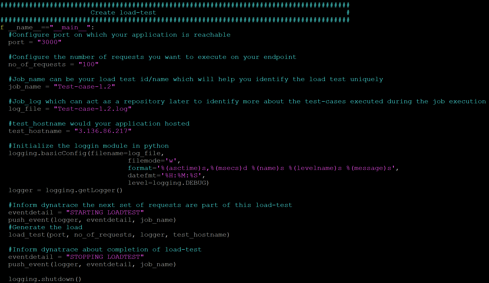

summary: Automate Feedback Session 1
id: automate-feedback-1
categories: automate-feedback
tags: anz
status: Published 
authors: Brandon Neo
Feedback Link: mailto:d1-apac@dynatrace.com
Analytics Account: UA-175467274-1

# Automate Feedback - Session 1
<!-- ------------------------ -->
## Introduction 
Duration: 1

This lab is the first session of the AIOps Enablement Series for ANZ Bank. This track focuses on the Automate Feedback, which relates to how you could integate Dynatrace with load testing tools to create **Performance as a service**.


<!-- ------------------------ -->
## Install OneAgent
Duration: 10

In this exercise, we will deploy the OneAgent to a Linux instance and let the OneAgent discover what is running in that instance.

### Download the OneAgent

Use PuTTy (Windows) or Terminal (Mac), ssh into the instance (IP address using the your PEM Key)

Open your browser and access the Dynatrace URL.

Select Deploy Dynatrace from the navigation menu.


Click the Start installation button and select Linux.


Choose the installer type from the drop-down list (we'll use the default x86/64). 
Use the Linux shell script installer on any Linux system that's supported by Dynatrace, regardless of the packaging system your distribution depends on.

**Copy** the command provided in the "Use this command on the target host" text field. **Paste** the command into your terminal window and execute it.


Example: 

```bash
$  wget  -O Dynatrace-OneAgent-Linux-1.171.252.sh <follow screen shot above>
--2019-08-07 10:17:45--  https://<URL>
Resolving <URL>... <IP>
Connecting to <URL> | <IP>|:443... connected.
HTTP request sent, awaiting response... 200 OK
Length: 139134801 (133M) [application/octet-stream]
Saving to: ‘Dynatrace-OneAgent-Linux-1.171.252.sh’

100%[======================================>] 139,134,801 84.3MB/s   in 1.6s

2019-08-07 10:17:47 (84.3 MB/s) - ‘Dynatrace-OneAgent-Linux-1.171.252.sh’ saved [139134801/139134801]

$
```

### Execute the installation script

(Optional) Once the download is complete, you can verify the signature by copying the command from the "Verify signature" text field, then pasting the command into your terminal window and executing it. Make sure your system is up to date, especially SSL and related certificate libraries.

**Copy** the command that's provided in the text box "And run the installer with root rights" text field.


**Paste** the command into your terminal window and execute it. You’ll need to make the script executable before you can run it.

**Note that you’ll need root access.**  You can use sudo to run the installation script. To do this, type the following command into the directory where you downloaded the installation script.

Example:

```bash
$ sudo /bin/sh Dynatrace-OneAgent-Linux-1.171.252.sh
10:21:42 Checking root privileges...
10:21:42 OK
10:21:42 Installation started ...
...
10:22:14 Starting agents...
10:22:14 oneagent service started
10:22:14 Checking if agent is connected to the server...
10:22:16 Dynatrace OneAgent has successfully connected to Dynatrace Cluster Node. After completing Dynatrace OneAgent installation on this machine, please return to your browser to complete the remainder of the installation.
$

```

<!-- ------------------------ -->
## Restart Docker
Duration: 10


<!-- ------------------------ -->
## Access Sample Banking Application
Duration: 10

### Creating Tags

Tagging is a powerful mechanism. However, to reap its benefits, tagging should be used carefully and in a meaningful way. To guide you towards this end, we provide you with specific recommendations and best practices, which are described below. With auto-tagging based on metadata, tags can be generated automatically and assigned to monitored entities with the specific metadata values that Dynatrace detects automatically.

Positive
: Documentation for [Best Practices for Tagging](https://www.dynatrace.com/support/help/how-to-use-dynatrace/tags-and-metadata/) 

### Naming Rules

Dynatrace automatically provides names, but they don’t enable you to quickly identify where an application or service belongs to. To achieve this, it's recommended that you use service naming rules and process group naming rules. This can be done in Dynatrace using metadata imported from the monitored applications.

You can use Dynatrace Naming Rules to differentiate requests



Positive
: Documented steps can be found [here](https://www.dynatrace.com/support/help/how-to-use-dynatrace/tags-and-metadata/setup/how-to-define-tags/)

### Annotate Dynatrace with Events 

The Events API delivers details about all uncorrelated events that Dynatrace collects within your environment. Information returned for each event includes attributes about the event source, the entity where the event was collected, and other event-specific details.

PUSH endpoint enables third-party systems such as CI platforms (Jenkins, Bamboo, Electric Cloud, etc.) to provide additional details for Dynatrace automated root cause analysis.


Positive
: Documented steps can be found [here](https://www.dynatrace.com/support/help/dynatrace-api/environment-api/events/push-deployment-events-from-jenkins/)

### Compare and Analyze events

There are different ways to analyze the data. Your approach should be based on the type of performance analysis you want to do (for example, crashes, resource and performance hotspots, or scalability issues). 


Positive
: Documented steps can be found [here](https://www.dynatrace.com/support/help/shortlink/load-testing-process#compare--analyze)

<!-- ------------------------ -->
## Automate with Curl
Duration: 10

The steps that we ran through could be automated with by initiating HTTP requests through curl.




<!-- ------------------------ -->

## Feedback
Duration: 3

We hope you enjoyed this lab and found it useful. We would love your feedback!
<form>
  <name>How was your overall experience with this lab?</name>
  <input value="Excellent" />
  <input value="Good" />
  <input value="Average" />
  <input value="Fair" />
  <input value="Poor" />
</form>

<form>
  <name>What did you benefit most from this lab?</name>
  <input value="Defining Load Testing Request Attribute" />
  <input value="Annotate Dynatrace with Events from Load Testing" />
  <input value="Automating with Curl" />
  <input value="Compare and Analyze events" />
</form>

<form>
  <name>How likely are you to recommend this lab to a friend or colleague?</name>
  <input value="Very Likely" />
  <input value="Moderately Likely" />
  <input value="Neither Likely nor unlikely" />
  <input value="Moderately Unlikely" />
  <input value="Very Unlikely" />
</form>

Positive
: 💡 For other ideas and suggestions, please **[reach out via email](mailto:d1-apac@dynatrace.com?subject=Automate Feedback 1 - Ideas and Suggestions")**.