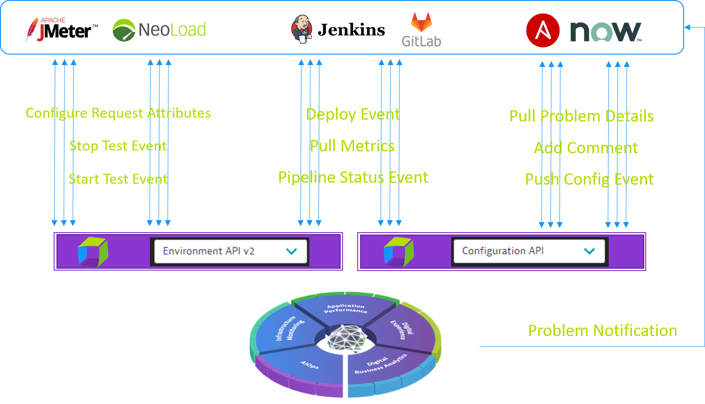
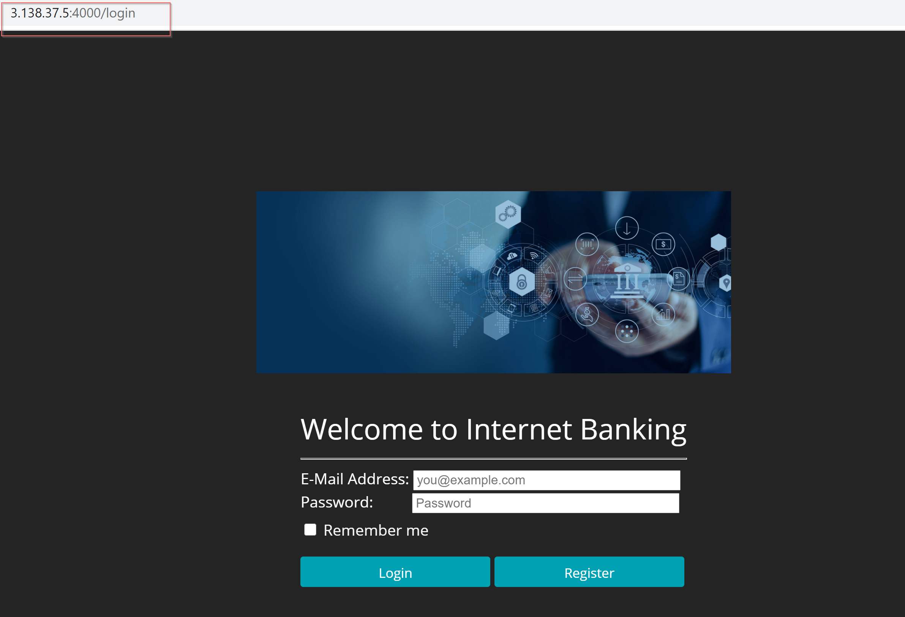
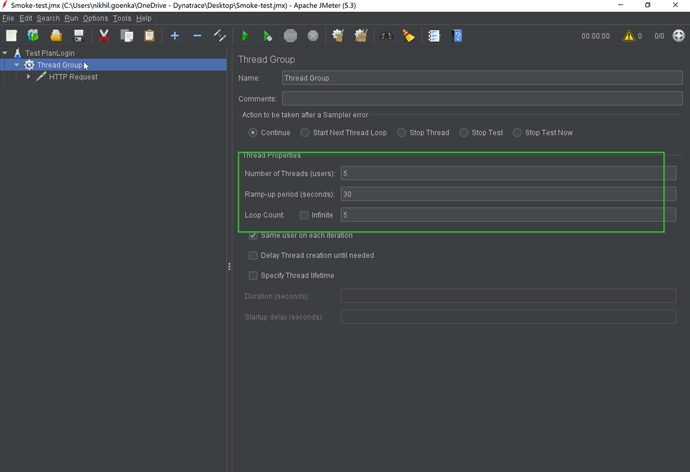
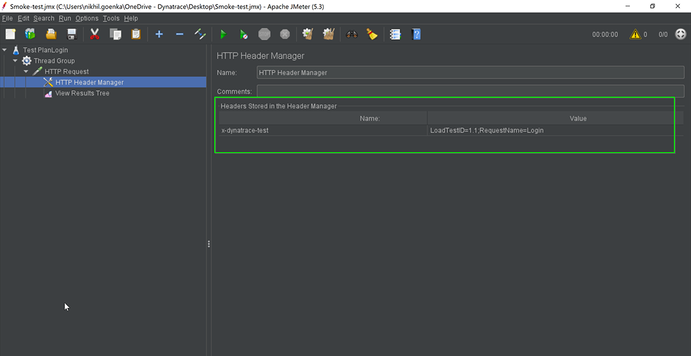
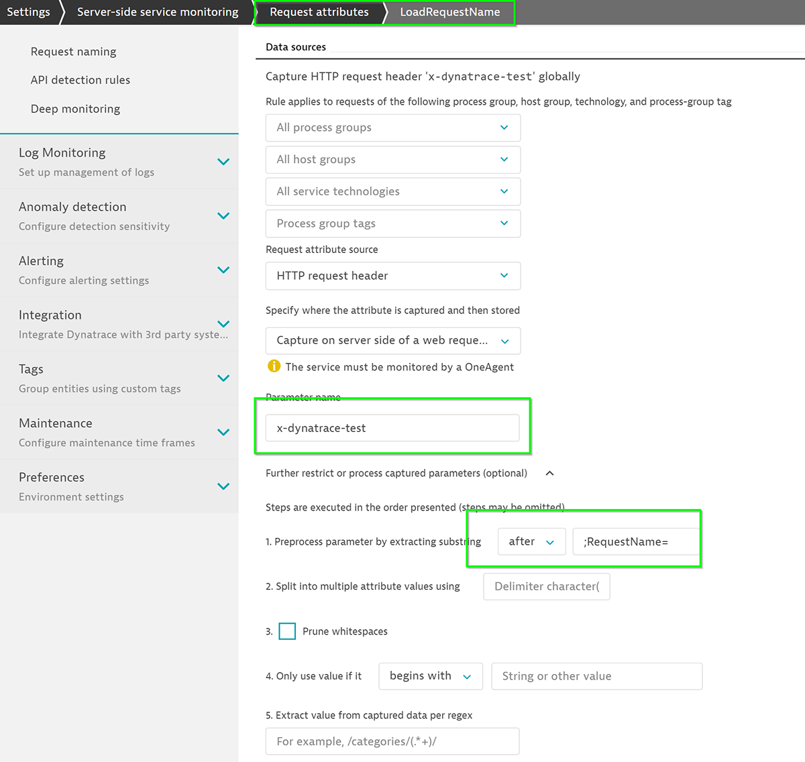
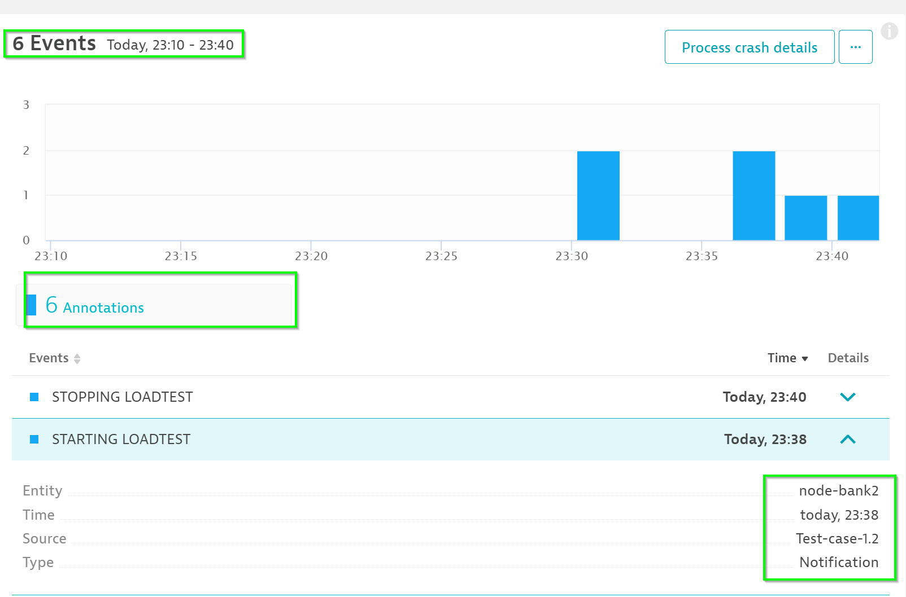

summary: Automate Feedback Session 1
id: automate-feedback-1
categories: automate-feedback
tags: anz
status: Published 
authors: Brandon Neo
Feedback Link: mailto:d1-apac@dynatrace.com
Analytics Account: UA-175467274-1

# Automate Feedback - Session 1
<!-- ------------------------ -->
## Introduction 
Duration: 1

This lab is the first session of the AIOps Enablement Series for ANZ Bank. This track focuses on the Automate Feedback, which relates to how you could integate Dynatrace with load testing tools to create **Performance as a service**.



<!-- ------------------------ -->
## Useful Commands ✅ 

Positive
: To start the docker with sample application:
   `docker run -d --name SampleBankApp -p 4000:3000 nikhilgoenka/sample-bank-app`
  * This would start the docker on port localhost:4000 with docker name as **SampleBankApp**
   
Positive
: To start the jenkins docker:
   `docker run -d --network mynetwork --name Jenkins-Dynatrace -p 8020:8080  -v /var/jenkins:/var/jenkins_home -v /var/run/docker.sock:/var/run/docker.sock nikhilgoenka/jenkins-dynatrace-workshop`
   * -d runs the docker in daemon mode.
   * -p 8020:8080 - By default, jenkins docker would be running on 8080. Specifying **-p 8020:8080** binds the 8080 in docker to localhost on 8020. So, you can forward/listen requests from docker using `localhost:8020`.
   * -v Bind mounts a volume.
    By default, jenkins docker is maintaining the pipeline/data information in /var/jenkins_home. 
    Specifying **-v /var/jenkins:/var/jenkins_home** would mount the localhost:/var/jenkins directory so that the pipeline data is not lost once pipeline is re-started.
    Specifying **-v /var/run/docker.sock:/var/run/docker.sock** will allow the jekins docker to leverage the dockerd running on localhost. This would be required since we are starting the
    sample-app dockers while running the pipeline.

Positive
: To run the ansible-tower docker:
   `docker run -d --name ansible-tower -p 8090:443 ybalt/ansible-tower`
   This would start the docker on port **localhost:8090** with docker name as **ansible-tower**

**Other useful commands:**
* To **view the downloaded images** on localhost: `docker images`
* To **remove a particular image**: `docker rmi <IMAGE-NAME>`
* To **stop a docker**: `docker stop <CONTAINER-ID>`
* To **remove a docker**: `docker rm <CONTAINER-ID>`
* To **run a docker in interactive bash**: `docker run -it <CONTAINER> /bin/bash`
* To **delete all the unused images**: `docker system prune -a -f`
* To **pull a particular image**: `docker pull <docker-image>`
* Jenkins pipeline:
   Command: `https://github.com/nikhilgoenkatech/JenkinsBankApp`


<!-- ------------------------ -->
## OneAgent Installation
Duration: 10

In this exercise, we will deploy the OneAgent to a Linux instance and let the OneAgent discover what is running in that instance.

### Download the OneAgent

Use PuTTy (Windows) or Terminal (Mac), ssh into the instance (IP address using the your PEM Key)

Open your browser and access the Dynatrace URL.

Select Deploy Dynatrace from the navigation menu.


Click the Start installation button and select Linux.


Choose the installer type from the drop-down list (we'll use the default x86/64). 
Use the Linux shell script installer on any Linux system that's supported by Dynatrace, regardless of the packaging system your distribution depends on.

**Copy** the command provided in the "Use this command on the target host" text field. **Paste** the command into your terminal window and execute it.


Example: 

```bash
$  wget  -O Dynatrace-OneAgent-Linux-1.171.252.sh <follow screen shot above>
--2019-08-07 10:17:45--  https://<URL>
Resolving <URL>... <IP>
Connecting to <URL> | <IP>|:443... connected.
HTTP request sent, awaiting response... 200 OK
Length: 139134801 (133M) [application/octet-stream]
Saving to: ‘Dynatrace-OneAgent-Linux-1.171.252.sh’

100%[======================================>] 139,134,801 84.3MB/s   in 1.6s

2019-08-07 10:17:47 (84.3 MB/s) - ‘Dynatrace-OneAgent-Linux-1.171.252.sh’ saved [139134801/139134801]

$
```

### Execute the installation script

(Optional) Once the download is complete, you can verify the signature by copying the command from the "Verify signature" text field, then pasting the command into your terminal window and executing it. Make sure your system is up to date, especially SSL and related certificate libraries.

**Copy** the command that's provided in the text box "And run the installer with root rights" text field.


**Paste** the command into your terminal window and execute it. You’ll need to make the script executable before you can run it.

**Note that you’ll need root access.**  You can use sudo to run the installation script. To do this, type the following command into the directory where you downloaded the installation script.

Example:

```bash
$ sudo /bin/sh Dynatrace-OneAgent-Linux-1.171.252.sh
10:21:42 Checking root privileges...
10:21:42 OK
10:21:42 Installation started ...
...
10:22:14 Starting agents...
10:22:14 oneagent service started
10:22:14 Checking if agent is connected to the server...
10:22:16 Dynatrace OneAgent has successfully connected to Dynatrace Cluster Node. After completing Dynatrace OneAgent installation on this machine, please return to your browser to complete the remainder of the installation.
$

```

<!-- ------------------------ -->
## Restart Docker
Duration: 10

### Exploring Dynatrace

Login to your Dynatrace environment and explore around **Smartscape**, **Host View**. 

Go to **Host > EC2-instance > SampleOnlineBankProduction (Process)**

You will discover that Dynatrace automatically monitors your host metrics, processes but **services** are missing.


### Restarting SampleBankApp

For Dynatrace to get Services (code level visibility), you will need to restart the Application services. Since the application is containerized, the easiest way to do that is to restart the docker containers.

To **list all the docker containers**, run `docker ps -a`

Run the following command to restart `docker restart SampleBankApp` to **restart the Sample Banking App**

To check and **verify that SampleBankApp container has restarted**, run `docker ps -a` again


### Automatic Service Detection

As OneAgent automatically monitors your host, changes are reflected in real-time. Back in your Process screen, you will find the process updated with services.


<!-- ------------------------ -->
## Access Sample Banking Application
Duration: 10

Within your Host View, dropdown the **Properties and Tags** and you will get a list of various metadata associated with the host created. Locate the **Public IP Address** and copy its value.

Open up your **web browser** and access the sample app with `<IP address>:4000/login`



### Login to Sample Bank App

Access the banking App with the **either** of the below credentials

* Username: **guestuser1@mybank.com**
* Password: **GuestUser12@**

**OR**

* Username: **guestuser2@mybank.com**
* Password: **GuestUser12@**

<!-- ------------------------ -->
## JMeter Performance Testing

For the purposes of the lab, we will be demo with the **Jmeter thick client**. The same capabilites will be triggered and used within the labs using CLI. 






<!-- ------------------------ -->
## Defining Request Attributes
Duration: 10

You can use any (or multiple) HTTP headers or HTTP parameters to pass context information. 
The extraction rules can be configured via **Settings > Server-side service monitoring > Request attributes.**

The header x-dynatrace-test is used in the following examples with the following set of key/value pairs for the header:

|    |           |
|----|-----------|
| **Code**  |**Description**   |
| **VU**  |   Virtual User ID of the unique user who sent the request.      |
| **SI**  |   Source ID identifies the product that triggered the request (JMeter, LoadRunner, Neotys, or other)     |
| **TSN**   |   Test Step Name is a logical test step within your load testing script (for example, Login or Add to cart.     |
| **LSN** |   Load Script Name - name of the load testing script. This groups a set of test steps that make up a multi-step transaction (for example, an online purchase).      |
| **LTN**  |   The Load Test Name uniquely identifies a test execution (for example, 6h Load Test – June 25)     |
| **PC**  |   Page Context provides information about the document that is loaded in the currently processed page.     |


### Setup Request Attributes

Go to **Settings > Server-side service monitoring > Request Attributes**

Click on **Define a new request attribute** and use the following:

* Request attribute name – **LoadTestID**
* Request attribute source – **HTTP Request Header**
* Parameter name - `x-dynatrace-test`
* **Expand out** Further restrict or process captured parameters (optional)
* Preprocess parameter by extracting substring **between** (dropdown) and  `LoadTestID=;` in field
* Click on **Save**


Click on **Define a new request attribute** and use the following:

* Request attribute name – **LoadTestName**
* Request attribute source – **HTTP Request header**
* Parameter name - `x-dynatrace-test`
* **Expand out** Further restrict or process captured parameters (optional)
* Preprocess parameter by extracting substring **after** (dropdown) and  `;RequestName=` in field
* Click on **Save**



### Simulate load from JMeter 
Using the .JMX load from the local folder, access the simulate the requests with the local .JMX file

To **run load test using JMeter**, the following format is used:

   **jmeter -n -t [jmx file] -l [results file]**
   *  -n indicates nonGUI mode
   *  -t JMX test plan that you plan to run
   *  -l logfile where the execution would be logged.

To run the **Test-Plan available in /home/ubuntu/directory**, execute the below command:

```bash
./jmeter -n -t /home/ubuntu/ACMD1Workshops/additional_resources/app_docker/scripts/Smoke-test-Jmeter.jmx -l output.log
```


### Exploring Dynatrace 

Once you have triggered your load, you can also see the load test events appearing within your **event section** in your **host view**.



<!-- ------------------------ -->
## Trigger load with Python Script
Duration: 10

Dynatrace's platform allows event information to be ingested via various means. If you are using a load test tool like jMeter, the jmx script above should apply for most. Alternatively, you can also send events in via a Python script. Below is an example of using that.


Run the command below to trigger the script

```bash
cd /home/ubuntu/ACMD1Workshops/additional_resources/app_docker/scripts/
./smoke-test.py 
```

<!-- ------------------------ -->


## Feedback
Duration: 3

We hope you enjoyed this lab and found it useful. We would love your feedback!
<form>
  <name>How was your overall experience with this lab?</name>
  <input value="Excellent" />
  <input value="Good" />
  <input value="Average" />
  <input value="Fair" />
  <input value="Poor" />
</form>

<form>
  <name>What did you benefit most from this lab?</name>
  <input value="Defining Load Testing Request Attribute" />
  <input value="Annotate Dynatrace with Events from Load Testing" />
  <input value="Automating with Curl" />
  <input value="Compare and Analyze events" />
</form>

<form>
  <name>How likely are you to recommend this lab to a friend or colleague?</name>
  <input value="Very Likely" />
  <input value="Moderately Likely" />
  <input value="Neither Likely nor unlikely" />
  <input value="Moderately Unlikely" />
  <input value="Very Unlikely" />
</form>

Positive
: 💡 For other ideas and suggestions, please **[reach out via email](mailto:d1-apac@dynatrace.com?subject=Automate Feedback 1 - Ideas and Suggestions")**.