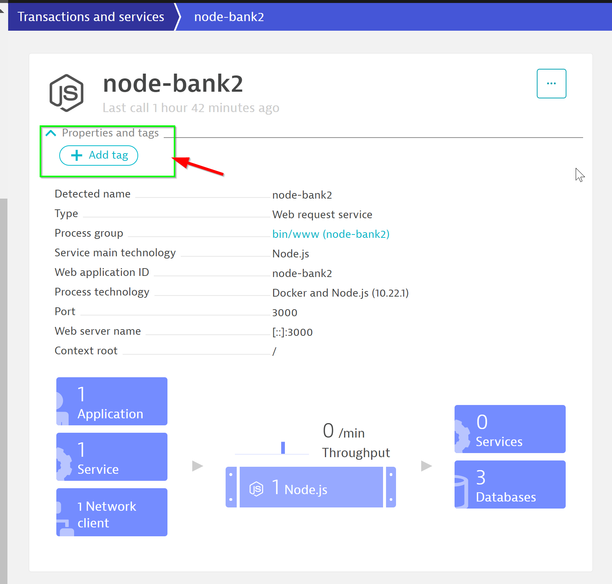
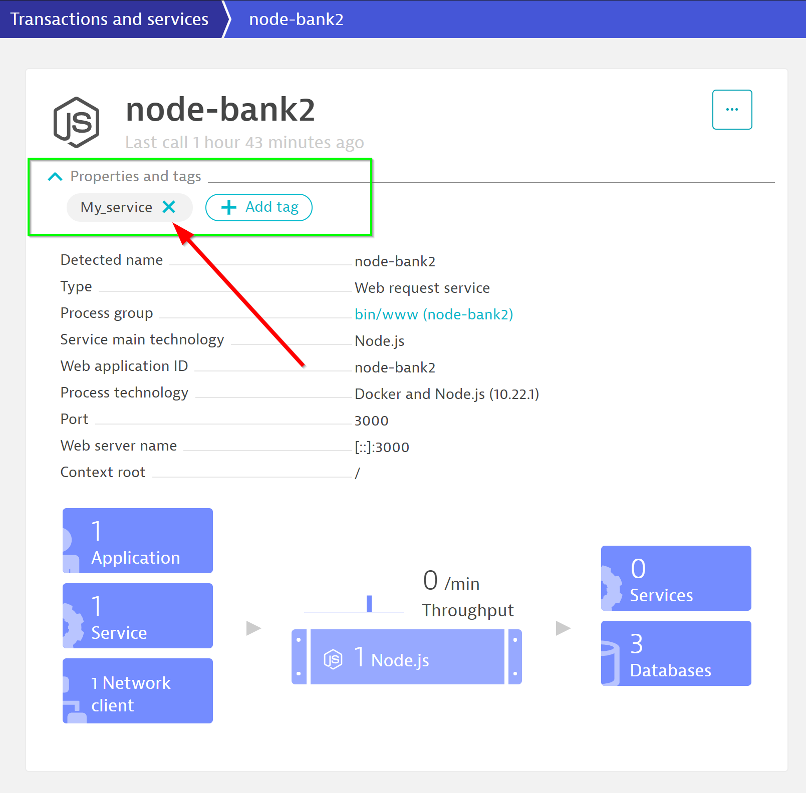
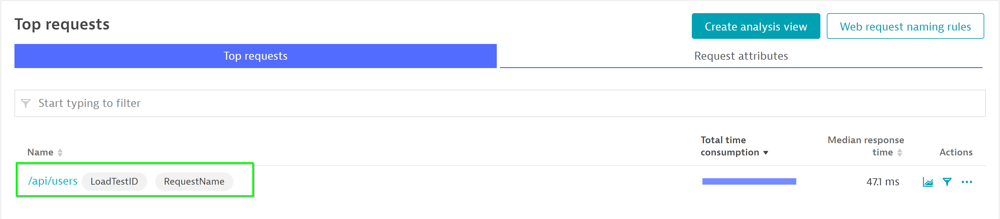
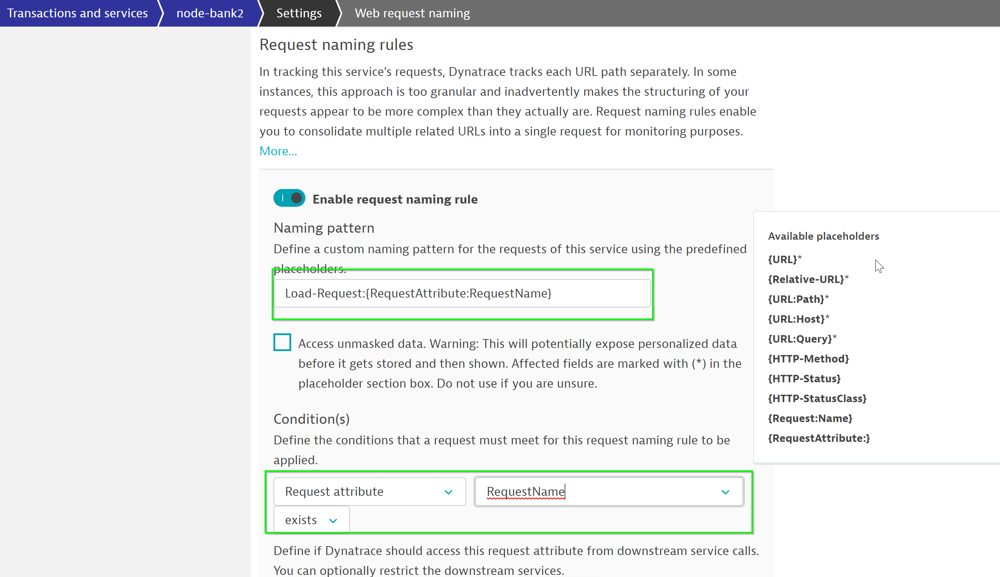
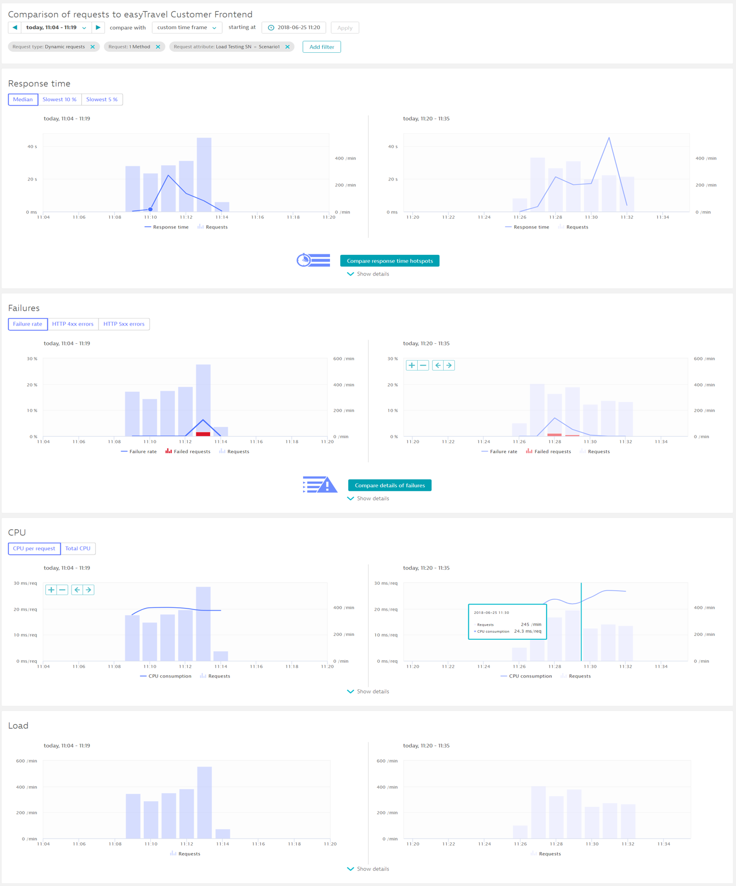
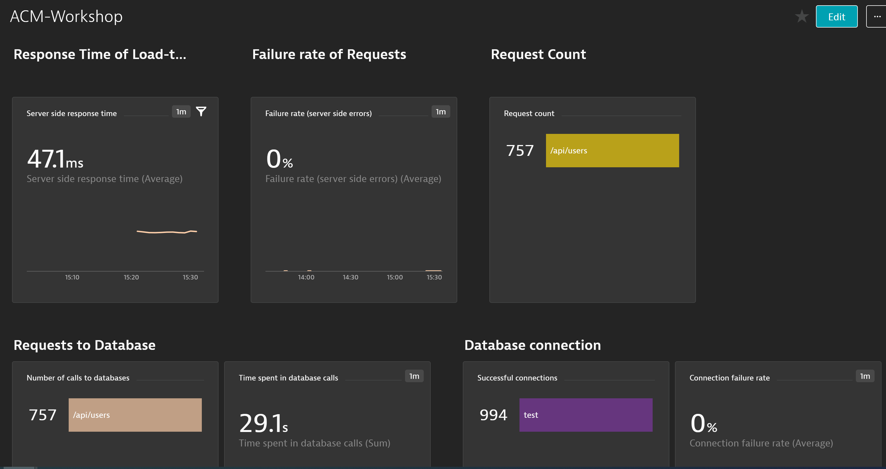
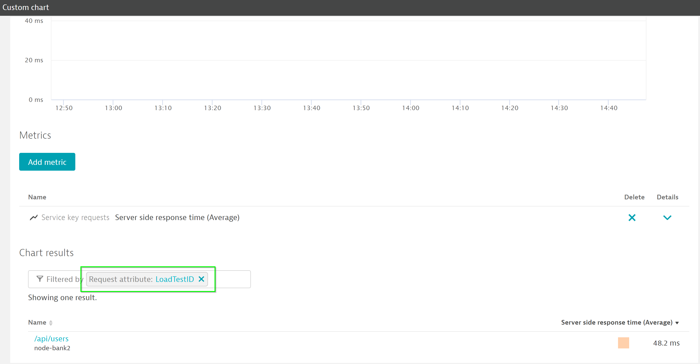

summary: Automate Feedback Session 2
id: automate-feedback-2
categories: automate-feedback
tags: anz
status: Published 
authors: Brandon Neo
Feedback Link: mailto:d1-apac@dynatrace.com
Analytics Account: UA-175467274-1

# Automate Feedback - Session 2
<!-- ------------------------ -->
## Introduction 
Duration: 1

This lab is the second session of the AIOps Enablement Series for ANZ Bank. This track focuses on the Automate Feedback, which relates to how you could integate Dynatrace with load testing tools to create **Performance as a service**.


### What You’ll Learn 
- Creating Manual Tags in Dynatrace to define unique entity
- Load test web requests renaming
- Compare features to differentiate load test / actual requests
- Mark Load test requests as Key Requests
- Create dashboards for load-requests basic tiles
  - Response time
  - Failure rates
  - Database performance

<!-- ------------------------ -->
## Useful Commands ✅ 

Positive
: To start the docker with sample application:
   `docker run -d --name SampleBankApp -p 4000:3000 nikhilgoenka/sample-bank-app`
  * This would start the docker on port localhost:4000 with docker name as **SampleBankApp**
   
**Other useful commands:**
* To **view all docker containers**: `docker ps -a`
* To **view the downloaded images** on localhost: `docker images`
* To **remove a particular image**: `docker rmi <IMAGE-NAME>`
* To **stop a docker**: `docker stop <CONTAINER-ID>`
* To **remove a docker**: `docker rm <CONTAINER-ID>`
* To **run a docker in interactive bash**: `docker run -it <CONTAINER> /bin/bash`
* To **delete all the unused images**: `docker system prune -a -f`
* To **pull a particular image**: `docker pull <docker-image>`

<!-- ------------------------ -->
## Prerequisites

This lab is the second session of the AIOps Enablement Series for ANZ Bank. Please refer back to previous steps below to setup your environment.

- [Installing OneAgent](../../workshops/automate-feedback-1/index.html?index=..%2F..anz#2)
- [Defining Request Attributes](../../workshops/automate-feedback-1/index.html?index=..%2F..anz#6)

### Resuming ⏯ from your Session 1 

As part of the training, you might have just restarted your ec2-instance. If so, follow the steps below:

Positive
: To **start the Docker service** with this command - `service docker start`

Positive
: TO **start the SampleBankApp** with this command - `docker start SampleBankApp`

<!-- ------------------------ -->
## Tag-based Analysis of Requests
Duration: 15

By integrating Dynatrace into your existing load testing process, you can stop broken builds in your delivery pipeline earlier. Tagging is a powerful mechanism and should be used carefully and in a meaningful way. To guide you towards this end, we provide you with specific recommendations and [best practices](https://www.dynatrace.com/support/help/how-to-use-dynatrace/tags-and-metadata/). 

### Defining a Unique Entity



In Dynatrace, on the left menu bar, go to **Transactions and services > node-bank2** and follow the steps below:

- Dropdown **Properties and tags** 
- Click on **Add tag**
- Name the new Tag `My_service`



Official Dynatrace documentation could be found [here](https://www.dynatrace.com/support/help/how-to-use-dynatrace/tags-and-metadata/setup/how-to-define-tags/)

### Trigger Load with Python script

As per the last lab we have written a Python script to automate the load tests for JMeter. We will now edit it to **push events** into Dynatrace. Within the shell terminal, run the following command to edit the Python script. 

```bash
cd /home/ubuntu/ACM1Workshop/additional_resources/app_docker/scripts/
vim smoke-test.py
```
Within the text editor, scroll to the bottom. **Uncomment** the script so as to match the below.

```bash
   #Inform dynatrace the next set of requests are part of this load-test
   eventdetail = "STARTING LOADTEST"
   push_event(logger, eventdetail, job_name)
   #Generate the load
   load_test(port, no_of_requests, logger, test_hostname)

   #Inform dynatrace about completion of load-test
   eventdetail = "STOPPING LOADTEST"
   push_event(logger, eventdetail, job_name)

   logging.shutdown()
```

**Screenshot of edited script**


### Replacing Dynatrace Variables

Within the middle section of the script, append the values of **DT_TENANT** and **DT_TOKEN**

To get your **DT_TENANT**, go to the Web Browser and extract the URL path as per below. 

**EXAMPLE URL**
https://mou612.managed-sprint.dynalabs.io/e/**DT-TENANT**/


To get your **DT_TOKEN**, go to **Settings > Integration > Dynatrace API > Generate Token** and follow the below:

- Create a token with **LoadTest**
- Toggle **Data ingest, eg: metrics and events**
- Click on **Generate**
- Clck on **Copy**


Back in your shell terminal, replace the **DT_TENANT** and **DT_TOKEN**. Your script should look like the below.


**Save the text editing session** with command `:wq`

Run the script with command `python3 smoke-test.py`

### Check Load Test Events

The script will append load test events within Dynatrace which will add additional insights for our DAVIS AI to use. 

Note the **Start events** and **Stop events**


<!-- ------------------------ -->
## Configuring Loadtest Requests
Duration: 15

### Mark Requests as Key Requests

In Dynatrace, on the left menu bar, go to **Transactions and services > node-bank2**

Click on **View dynamic requests** and use **/api/users** within the filter bar

Note that the Top requests has now been filtered with /api/users 



Click on the **...** button on the top right and choose **Mark as key request**


Notice that the /api/users has been marked as a key request.


### Web Requests Naming Rules

Dynatrace automatically provides names, but they don’t enable you to quickly identify where an application or service belongs to. To achieve this, it's recommended that you use service naming rules and process group naming rules. This can be done in Dynatrace using metadata imported from the monitored applications.

You can use Dynatrace Naming Rules to differentiate requests


- Click on **Web Request naming rules**
- Click on **Add rule** undesr Request naming rules
- Use `Load-Request:{RequestAttribute:RequestName}` under Naming Pattern
- Choose **Request attribute** `RequestName` **exists** under Condition(s)
- Click on **Save**



With the naming rule now applied, you would see a newly created request.


### Populate requests

Within the SSH Terminal, run the Python script command again `python3 smoke-test.py` to populate requests.

<!-- ------------------------ -->
## Compare and Analyze events
Duration: 15

There are many different ways to analyze the data. Your approach should be based on the type of performance analysis you want to do (for example, crashes, resource and performance hotspots, or scalability issues). 



Official Dynatrace Documentation [here] (https://www.dynatrace.com/support/help/shortlink/load-testing-process#compare--analyze)

<!-- ------------------------ -->
## Creating Dashboards for Load Tests
Duration: 10

Dynatrace provides versatile dashboarding and charting mechanisms. You can create dashboards to reflect load test performance.



### Creating custom charts

In Dynatrace, on the left menu bar, go to **Create custom chart**

Choose and chart **Client side response time** and **Server side response time** metrics


You can filter on **LoadTestID** and chart only requests with that attribute.



<!-- ------------------------ -->

## Feedback
Duration: 3

We hope you enjoyed this lab and found it useful. We would love your feedback!
<form>
  <name>How was your overall experience with this lab?</name>
  <input value="Excellent" />
  <input value="Good" />
  <input value="Average" />
  <input value="Fair" />
  <input value="Poor" />
</form>

<form>
  <name>What did you benefit most from this lab?</name>
  <input value="Tag-based Analysis of Requests" />
  <input value="Configuring Load Test Requests" />
  <input value="Comparing and Analyzing Requests" />
  <input value="Creating Dashboardings" />
</form>

<form>
  <name>How likely are you to recommend this lab to a friend or colleague?</name>
  <input value="Very Likely" />
  <input value="Moderately Likely" />
  <input value="Neither Likely nor unlikely" />
  <input value="Moderately Unlikely" />
  <input value="Very Unlikely" />
</form>

Positive
: 💡 For other ideas and suggestions, please **[reach out via email](mailto:APAC-SE-Central@dynatrace.com?subject=Automate Feedback 1 - Ideas and Suggestions")**.