summary: Automate Operations Session 1
id: automate-operations-1
categories: automate-operations
tags: anz
status: Published 
authors: Nikhil Goenka
Feedback Link: mailto:d1-apac@dynatrace.com
Analytics Account: UA-175467274-1

# Automate Operations - Session 1
<!-- ------------------------ -->
## Introduction 
Duration: 1

This lab is the third session of the AIOps Enablement Series for ANZ Bank. This track focuses on the Automate Operations, which relates to how you could integate Dynatrace with orchestration tools to **Automate Operations**.

### What You’ll Learn 
- Integrate Ansible with Dynatrace  
- Stimulate an issue in Dynatrace and let DAVIS AI pick up the issue automatically
- Auto-remediate using ansible-remediation scripts

<!-- ------------------------ -->
## Useful Commands ✅ 

Positive
: To start the docker with sample application:
   `docker run -d --name SampleBankApp -p 4000:3000 nikhilgoenka/sample-bank-app`
  * This would start the docker on port localhost:4000 with docker name as **SampleBankApp**
   
Positive
: To start the jenkins docker:
   `docker run -d --network mynetwork --name Jenkins-Dynatrace -p 8020:8080  -v /var/jenkins:/var/jenkins_home -v /var/run/docker.sock:/var/run/docker.sock nikhilgoenka/jenkins-dynatrace-workshop`
   * -d runs the docker in daemon mode.
   * -p 8020:8080 - By default, jenkins docker would be running on 8080. Specifying **-p 8020:8080** binds the 8080 in docker to localhost on 8020. So, you can forward/listen requests from docker using `localhost:8020`.
   * -v Bind mounts a volume.
    By default, jenkins docker is maintaining the pipeline/data information in /var/jenkins_home. 
    Specifying **-v /var/jenkins:/var/jenkins_home** would mount the localhost:/var/jenkins directory so that the pipeline data is not lost once pipeline is re-started.
    Specifying **-v /var/run/docker.sock:/var/run/docker.sock** will allow the jekins docker to leverage the dockerd running on localhost. This would be required since we are starting the
    sample-app dockers while running the pipeline.

Positive
: To run the ansible-tower docker:
   `docker run -d --name ansible-tower -p 8090:443 ybalt/ansible-tower`
   This would start the docker on port **localhost:8090** with docker name as **ansible-tower**

**Other useful commands:**
* To **view all docker containers**: `docker ps -a`
* To **view the downloaded images** on localhost: `docker images`
* To **remove a particular image**: `docker rmi <IMAGE-NAME>`
* To **stop a docker**: `docker stop <CONTAINER-ID>`
* To **remove a docker**: `docker rm <CONTAINER-ID>`
* To **run a docker in interactive bash**: `docker run -it <CONTAINER> /bin/bash`
* To **delete all the unused images**: `docker system prune -a -f`
* To **pull a particular image**: `docker pull <docker-image>`
* **Jenkins pipeline**:
   Command: `https://github.com/nikhilgoenkatech/JenkinsBankApp`

<!-- ------------------------ -->

## Preconfiguration Setup
We will run some commands that would need root permissions, so make sure you are root by running `sudo su`

We will be running application on dockers to stimulate and remediate the issues; so ansible-tower docker should be able communicate with the other dockers using docker-network.

In order it works as expected, start with checking if you already have a network present by issuing  `docker network ls`
If there is no network, create a network by issuing the command: `docker network create mynetwork`
   
Now, run **ansible-tower docker** as `docker create -v /var/lib/postgresql/9.6/main --name tower-data nikhilgoenka/ansibletower /bin/true`

The above would create a postgres data volume which can be used to retain and retrieve the ansible-tower data. Once, the volume is created, run the ansible-tower docker as `docker run -d --network mynetwork --name ansible-tower --volumes-from tower-data -p 8090:443 nikhilgoenka/ansibletower`
   
From within your terminal, let us install **python-docker** on the hosts so that ansible-tower can perform operations on the host. To install python-docker, run `apt-get install python-pip` followed by `pip install docker`. This would install docker library that ansible would use in order to remediate the issue.
   
Further, we would need d1pacmworkshop user to access/change/modify docker, so let us give it required permissions on the docker. To do so, run  
`sudo usermod -aG docker d1pacmworkshop` 
This would add d1pacmworkshop user to docker group and it will get the required permissions to access/change the docker.

Lastly, navigate to `/home/ubuntu/ACMD1Workshop/additional_resources/app_docker/scripts` folder and run  
`wget https://raw.githubusercontent.com/nikhilgoenkatech/AIOPSAnsibleBankPlaybooks/main/synthetic-monitor.sh` to download the synthetic scripts that would be run in order to validate the auto-remediation. Further, give the script execute permission using `chmod +x synthetic-monitor.sh`

Now, let us run the docker for **SampleBankApp** on which we will run playbooks and remediate issues as below:  
`docker rm SampleBankApp`
`docker run --network mynetwork -d --name SampleBankApp -p 3000:3000 nikhilgoenka/sample-bank-app:1.0`  
This would start the sample-bank-app on port 3000.

Connect to your ansible-tower instance by opening "https://my-IP:8090/" (replace my-IP with your instance IP) in your browser and click on "Advanced" followed by proceed     
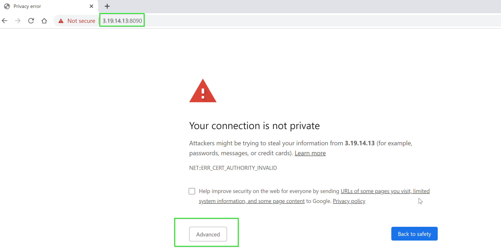

Also, access the sample-bank app from your browser at "http://MY-IP:3000/login" to populate the service "node-bank" under "Transactions & Services"

## Configure Ansible
Login into your ansible docker using credentials **admin** and password **dynatrace**
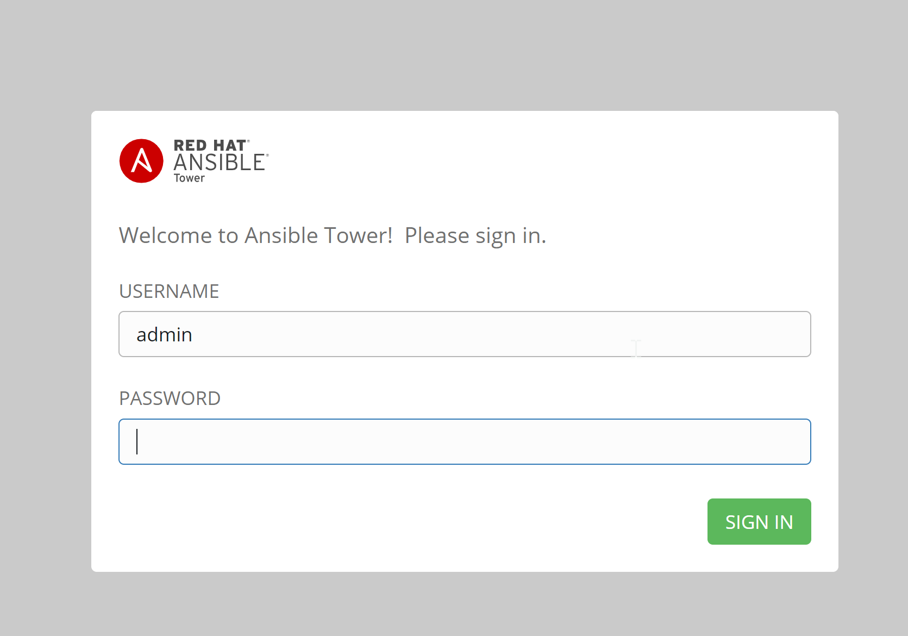

Import the license by clicking on "Browse" and uploading the license that was earlier shared with you in email.  

Ansible Architecture consists of following important pillars which would need to be configured in order to leverage its functionality:
1. **Inventory**: Inventory is a collection of your hosts. So, all the hosts under one-app can be part of your inventory.
2. **Projects**: Project is a collection of playbooks that would run on different hosts/inventories.
3. **Credentials** : Credentials are the credentials that ansible playbook would use to SSH on your hosts/inventories.
4. **Template** : The playbook can have it's own set of rules like vars, etc. and are referred to as Job-templates.
So, let us configure each of these important parameters.

### Setting up inventory
Now, create the inventory by clicking on **Inventory** in the left-side as seen below:  

That would open the page displaying the existing inventories. Delete the existing inventory for a clearer view before adding one as seen below:  
**Delete existing inventory and select "Inventory"**  
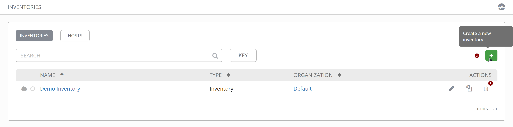  

**Inventory Details**  
  

Negative  
: Inventories consists of all the hosts that you plan to run the playbook on. So, inventories act as the repository of the hosts.

Once you add the inventory, you will get an option to **add hosts** for that inventory. Add the host by navigating to the "Hosts" tab.  
Add host with host-name=my-IP and description as "Application-Docker-Server" (replace my-IP with the actual IP of your instance).  

**Add hosts**  
  

**New host details**  
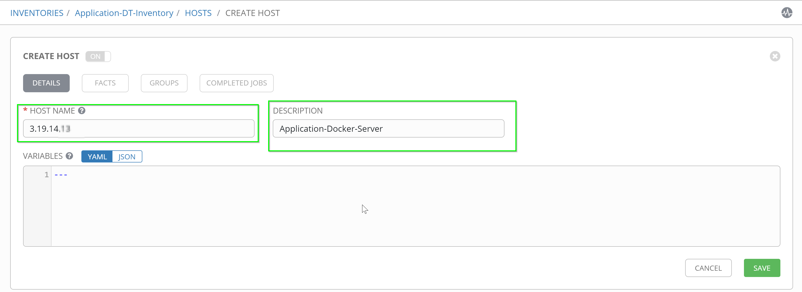  
   
### Setting up Project
Positive  
: Project is a collection of ansible playbooks. 

So, let us add a **project**. To add/edit projects, click on "Projects". Start by deleting the existing "Demo Project" for a cleaner view, followed by clicking on "+" and "Project" to add your projects.  
**Project-name**: Application-playbooks  
**SCM Type**: Git  
**SCM URL**: `https://github.com/nikhilgoenkatech/AIOPSAnsibleBankPlaybooks`  

**Create Project**  
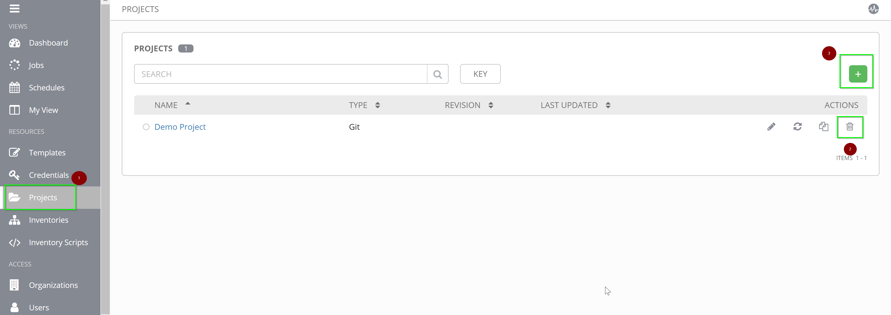

### Setting up Credentials  
With the hosts and playbooks added, now add the credentials that ansible will use in order to connect to the configured hosts and run the playbook from projects.  
Navigate to **Credentials** as shown below.  
  

Delete the existing "Demo Credentials" and add credentials for your AWS host.  
  
**Name**: Application-servers  
**Credential Type**: Machine  
**Username**: `d1pacmworkshop`  
**Password**: `dynatrace`  
  

### Setting up Templates  
Add a template by navigating to **Templates** on the left-hand side and delete the existing template before proceeding to add a new **Job Template**:  

**Delete Templates**  
  

Configure the Template with the values as below:  
  
**Name**: Process-unavailable  
**Inventory**: Application-DT-inventory  
**Project**: Application-playbooks  
**Playbook**: process-restart.yaml  

Also, please configure extra variables which will be used in your playbook as below:  
  
**tenanturl**: your-tenant-url  
**dttoken**: your-token  
**dtcommentapiurl**: your-tenant-url/api/v1/problem/details/{{pid}}/comments?Api-Token={{dttoken}}  
**dtdeploymentapiurl**: your-dynatrace-url/api/v1/events?Api-Token={{dttoken}}  
**my_ip**: your-aws-instance-ip  

Also, please select the **Prompt on launch** which would enable the dynatrace-payload to be available for the job when triggered.  

Positive  
: Replace your-tenant-url with "https://xxx.live.dynatrace.com" for SaaS where for managed, change to "https://managed.server/e/{environment-id}"  

A template would like below once configured fully.  
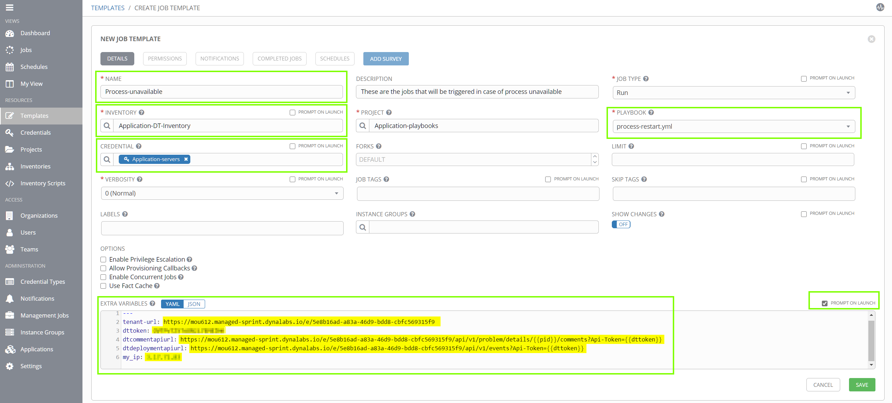  

## Integrate Ansible-tower and Dynatrace  

### Availability alert  
Enable the **availability alert** for the NodeJS process. Within dynatrace-tenant, navigate to **Technologies > NodeJS Process-Group > Settings > Availability monitoring** and toggle the "Enable process group availability monitoring" as below:  
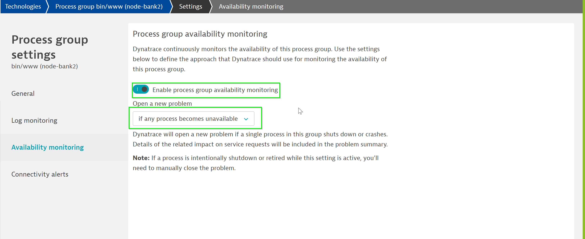  

### Configure Alerting Profile  
Let us further set the Alerting profile so that the problems can be notified to 3rd party like email, slack-integration, etc.  
Within your tenant, navigate to "Settings > Alerting > Alerting profiles". Now, add a new alerting profile "Ansible-playbook" and set the rules as below for 
"Availability event".  
  

### Problem notification  
Once alerting profile is setup, let us setup the problem notification so that the problem information is relayed to ansible-tower. To do so, within your tenant navigate to **Settings > Integration > Problem Notifications and click on Set up notifications**  
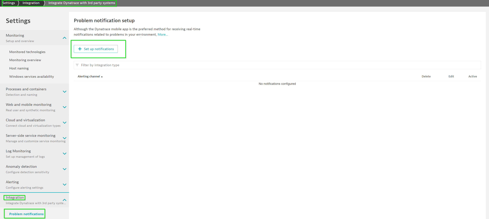  

Select **Ansible Tower** as the 3rd party integration tool  
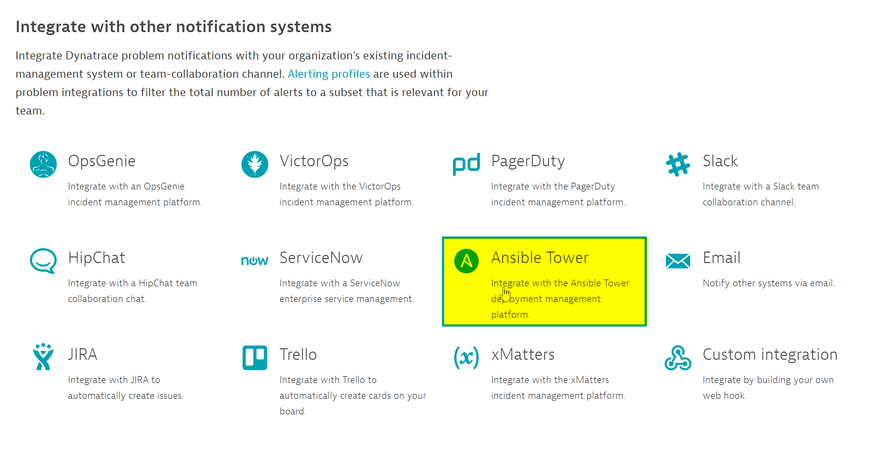  

Configure the notification as below:  
  
**Ansible Tower job template URL**: URL of template added earlier  
**Username**: admin  
**Password**: dynatrace  
  

## Stimulate the issue that triggers auto-remediation endpoint  
Now, within your browser go to http://my-IP:3000/login and log-in with **incorrect credentials**. This would crash the docker in the backend resulting in the service no longer available.  
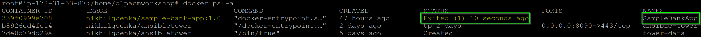  

This triggers a problem in Dynatrace and according to the problem-notification configured earlier, it would send a notification to ansible job-template and trigger the playbook automatically.  

### Initial analysis  
The remediation would perform initial analysis on the problem like the problem-type, severity, collecting logs and push these as comments on the problem.  
  

### Auto-remediation  
Further, it would start the docker that has crashed due to incorrect logging and push a deployment event on the service:  
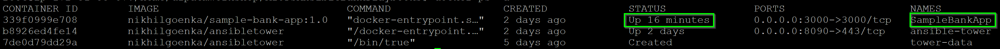  
  

### Validating the auto-remediation  
Next, the playbook will create a synthetic monitor and run the user-actions on it to validate if the application is up entirely and there are no issues.  

### Complete auto-remediation  
Once completed, it would push the information in DT indicating that the remediation has been completed succesfully.  
  

Positive  
: We won't close the problem as yet and DAVIS AI validate the auto-remediation and flag if it has any issues.  
