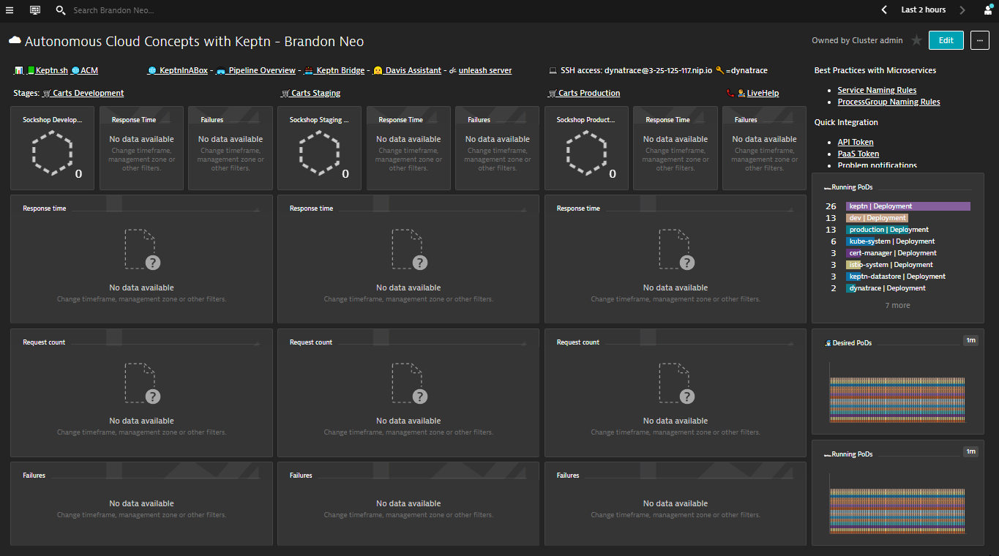
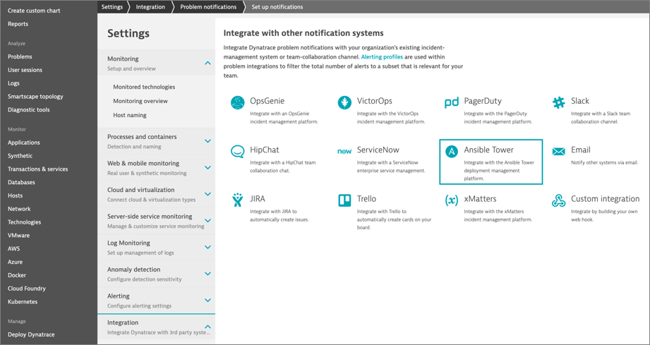

summary: Autonomous Cloud with Dynatrace
id: autonomous-cloud
categories: Workshops
tags: dynatrace
status: Published 
authors: Brandon Neo
Feedback Link: https://thebrandneo.com

# Autonomous Cloud with Dynatrace
<!-- ------------------------ -->
## Introduction 
Duration: 1

This repository contains labs for the Hands-On Autonomous Cloud Session. We will be providing the necessary details for your to access your environment.

For the purposes of the Hands-On, we will automate and make the steps seamless for the participants

You will be provided with the following:
- Dynatrace environment
- Kubernetes Server running
   - Sockshop Application (sample app) 
      - with Dev and Prod Environments
- Jenkins environment
- Ansible environment


### Prerequisites
- Chrome Browser
- Autonmous Workshop Email with credentials


### What You’ll Learn
- Deploy a pipeline (Sockshop) in Jenkins 
- Installing Keptn 
- Integrating Jenkins to Keptn and Dynatrace
- Using Jenkins + Keptn with Dynatace for
   - Automate Quality with Quality Gates evaluation
   - Automate Testing Load Testing and Performance Testing
   - Automate Operations with Self-healing with Ansible

<!-- ------------------------ -->
## Deploy a sockshop pipeline in Jenkins
Duration: 5

### Login to your Jenkins Instance

Access your Jenkins environment via a web browser with credentials from your email

<b>Jenkins Environment</b>
Jenkins URL: As provided in email
Jenkins Username: admin
Jenkins Password: password


### Build a pipeline

Once you logged in, mouseover "DeploySockShop" in the list, click on the down arrow and select "Build Now"


This process will take about 1-2 mins so we will let it run. 

Once finished, you can click on "DeploySockshop" again and see the various stages of the pipeline build. 


This is just a demonstration of a working pipeline so there's no need to wait for it to complete.

<!-- ------------------------ -->
## Setting up Keptn
Duration: 5

### Login to your Kubernetes Instance

Login to the Kubernetes server via a SSH terminal (eg. Putty, Terminal, MobaXterm)

Access your Kubernetes environment with credentials from your email

<b>Kubernetes Server</b>
Hostname: As provided in email
IP Address: As provided in email
Server Username: acm_student
Server Password: acm_workshop_secr3t

Once you logged in, you can issue the commands below to install Keptn
Part of the Keptn setup has been automated within the shell script below.

```bash
cd dtacmworkshop/Keptn
sudo ./installKeptn.sh
```


Keptn will install it's necessary components required for its setup.
Setup will take a 2-3 minutes.


Once completed, take note of the keptn API token which is required for the next step.
You can also use the Keptn Bridge and API Endpoint

Example:
```bash 
KEPTN BRIDGE: http://bridge.keptn.<YOUR-IP-ADDRESS>.nip.io 
KEPTN ENDPOINT: https://api.keptn.<YOUR-IP-ADDRESS>.nip.io/<b>swagger-ui/</b>
```


Take note of to append <b>"/swagger-ui/"</b> to the end to view the Keptn API Swagger UI 


There would be no project running at the moment on Keptn's bridge, but we will be creating at the next step.

<!-- ------------------------ -->
## Configuring Keptn within Jenkins
Duration: 5

### Setting up Keptn Plugin within Jenkins

Back within Jenkins, select Jenkins from the top left > Manage Jenkins > Configure System


Scroll down and under <b>"Global Properties"</b> enter the KEPTN API Token from the Terminal into the field
Click "Save" to save your setting.


Steps have been pre-configured prior to the labs. To find out more about the plugin, refer to the [Keptn Jenkins Shared Library](https://github.com/keptn-sandbox/keptn-jenkins-library) on Github. 

<!-- ------------------------ -->
## Keptn's SLI/SLO-based Quality Gates
Duration: 20

We will be using Jenkins Pipeline to triggers an SLI/SLO-based Quality Gate Evaluation in Keptn. 
This can also be done through the Keptn CLI or the API. 


WIthin Jenkins, mouseover "01-qualitygate-evaluation" in the list, click on the down arrow and select "Build Now"


The initial build will fail as Jenkins by default doesn't scan the pipeline for parameters and there are several that have to be specified. 


Click on <b>"01-qualitygate-evaluation"</b> and select <b>"Build with Parameters"</b> on the left menu.


As with the preconfigured from, we will be using the <b>"evalservice"</b> tag within Dynatrace to identify the appropriate service which we will validate the SLI and SLO. The name of the tag can be passed to our Jenkins Pipeline as a parameter. So we will be tagging a service within Dynatrace.

### Login to your Dynatrace Environment

Access your Jenkins environment via a web browser with credentials from your email

<b>Dynatrace Environment</b>
Dynatrace Tenant: As provided in email
When you access your Dynatrace tenant for the first time you’ll need to set a password.

Once you logged into Dynatrace, you will find a preconfigured Dashboard.

### Setup Tag within Dynatrace



This dashboard will showcase the various deployment stages of Sockshop to come. 

Select "Transactions and Services" on the left navigation bar and select "front-end" service


Drop-down "Properties and tags", Click on "Add-tag" and enter "evalservice" as tag

### Build the pipeline in Jenkins

Back in Jenkins, click on "Build" to run the pipeline


Once the pipeline is completed, you can see the changes reflected in Keptn's bridge and Dynatrace.
Within Dynatrace, you will discover a new custom info event.
The new event will contain details of the quality gate results with details such as JobURL, JobName from Jenkins as well as Keptn source and Keptn's bridge.
The links will also bring you to Jenkin's and Keptn's portals with more detailed information on each side.


To find out more about the setup of this hands-on, the full tutorial could be found [here](https://github.com/keptn-sandbox/jenkins-tutorial/blob/master/README.md#11-integrate-keptns-slislo-based-quality-gates).

<!-- ------------------------ -->
## Jenkins Simple Load Test OR Keptn's Performance As a Service
Duration: 20

### Load Testing in Pipeline

This is an extended version of the previous build where the pipeline also has a very simple load-testing capability built-into one of the stages.


Are we going with calculated service metrics? If so, should we use [createTestStepCalculatedMetrics.sh](https://github.com/keptn-sandbox/jenkins-tutorial/blob/master/scripts/createTestStepCalculatedMetrics.sh) to automate those creation?

Are we able to get a load test to test against the Sockshop? If so, what is the DeploymentURI / URLPaths in Jenkins plugin?

<!-- ------------------------ -->
## Jenkins Builds a Container and Keptn does Progressive Delivery
Duration: 20

### Load Testing in Pipeline

This is an extended version of the previous build where the pipeline also has a very simple load-testing capability built-into one of the stages.

<!-- ------------------------ -->
## Self Healing as a Service
Duration: 20

Dynatrace integrates with many runbook automation tools such as Ansible. We'll be using Ansible to showcase self-healing problems and automate operations. 

### Deploy Ansible Tower

In Terminal/Cloudshell execute the script: deployTower.sh in the directory 4-DeployTower

This will deploy and startup Ansible Tower. 
This will also configure Tower, import projects, inventories, credentials (DT API token) and playbook templates.
Take a note of the Ansible Job URL displayed by the script. You will need it for a next step.


### Login to Ansible Tower

Access your Ansible environment via a web browser with credentials from your email

<b>Ansible Environment</b>
Ansible URL: As provided in email
Ansible Username: admin
Ansible Password: dynatrace

After logging in, you'll be prompted to enter in your license key. 
Use the license provided by the instructor or you can provide your own.


### Configure Dynatrace Problem Notification

In the Dynatrace UI, navigate to Settings -> Integration -> Problem Notification -> Ansible Tower



Enter the Ansible Tower job template URL you were provided after the deployment
Enter the credentials to access Ansible
username : admin
password : Dynatrace
Click the Sent test notification button to validate your configuration
On success, a green confirmation message will be displayed
Save your configuration 


### Adjusting Anomaly Detection

Both problem and anomaly detection in Dynatrace leverage AI technology. This means that the AI learns how each and every microservice behaves and baselines them. Therefore, in a demo scenario like we have right now, we have to override the AI engine with user-defined values to allow the creation of problems due to an artificial increase of a failure rate. (Please note: if we would have the application running and simulate end-user traffic for a couple of hours/days there would be no need for this step.)

In your Dynatrace tenant, navigate to “Transaction & services” and filter by tag "[Kubernetes]stage:prod" and select ItemsController Service
Click on the ItemsController and then on the three dots ( … ) next to the service name. Click on Edit
On the next screen, edit the anomaly detection settings as seen in the following screenshot. - Global anomaly detection has to be turned off - Detect increases in failure rate using fixed thresholds - Alert if 0 % custom failure rate threshold is exceed during any 5-minute period. Set Sensitivity to High and change less than the value to 1 request/min.


### Launch remediation playbook

Navigate back to the Ansible Tower UI
From the side menu, navigate to Resources -> Templates
Click on the rocket icon to launch the start-campaign playbook
Hit Next on the prompt popup window and then Launch
As the playbook runs, the output will be displayed. Validate that the recap shows OK=2


### Observe remediation

Back in ItemsController, look at the service events. The playbook have notified Dynatrace when the promotional rate was changed to 50%.


You should see the Failure Rate increasing, eventually leading to Dynatrace detecting a Problem
You might need to refresh your browser a few times


Observe the new problem appearing. The comments section will show the remediation actions taken by Ansible Tower


Drill-down in the Problem.
You will see a new configuration change event reported by Ansible Tower
The promotional rate has been set back to 0% to remediate to the transaction failures


Jobs executed in Ansible Tower
 - start-campaign (set rate to 50%)
 - remediation
   - push comment to Dynatrace Problem
   - retrieve problem details
   - launch remediation action related to problem context
   - update Dynatrace Problem
stop-campaign (set rate to 0%)


** Problem Resolution - Problem was resolved automatically


