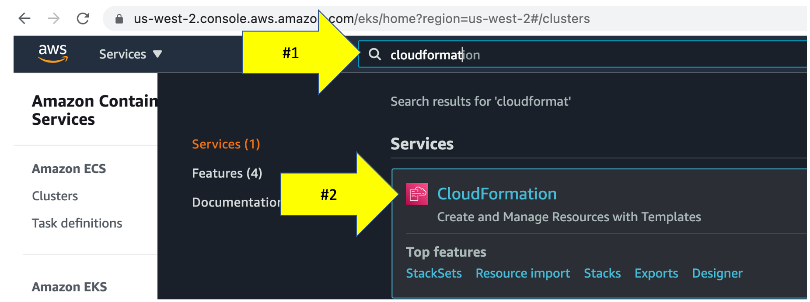
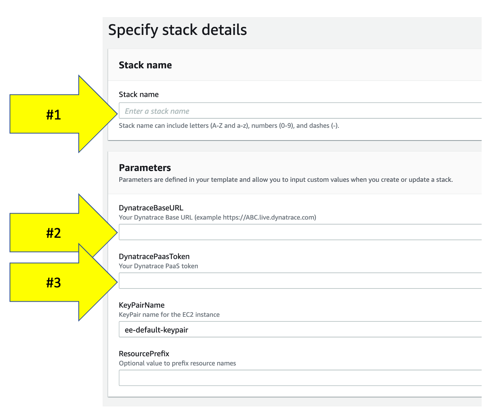
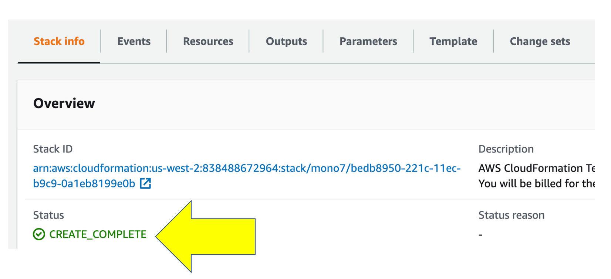

summary: Introduction to AWS Modernization Workshop
id: aws-workshop-intro
categories: aws, dt
tags: aws-workshop
status: Published 
authors: Rob Jahn
Feedback Link: mailto:alliances@dynatrace.com
Analytics Account: UA-175467274-1

# Lab setup

## Overview


Dynatrace is an AWS Advanced Technology Partner and AWS DevOps, Migration, and Containers Competency Partner.

Dynatrace has pioneered and expanded the collection of observability data in highly dynamic cloud environments with the Dynatrace OneAgent. When an organization installs the OneAgent, it automatically detects all applications, containers, services, processes, and infrastructure in real-time with zero manual configuration or code changes. System components are automatically instrumented collect not only metrics, logs and traces, but a broader view of your environment including full topological model with entity relationships, code-level detail, and user experience – all in context.

### Prerequisites
- **AWS account**: Access to an AWS account will be provided
- **Dynatrace environment**: Access to a Dynatrace environment will be provided

### We require every attendee to:

* Be able to run basic [Unix commands](http://mally.stanford.edu/~sr/computing/basic-unix.html)
* Be familiar with basic [AWS cloud concepts](https://aws.amazon.com/getting-started/fundamentals-core-concepts/)
* Be familiar with [container concepts](https://aws.amazon.com/containers/)
* Please **ASK QUESTIONS** and **INTERACT**

### Workshop structure
The workshop breaks down into three sections
- Prerequisites - Ensure your Dynatrace and AWS accounts are set-up
- Workshop Labs - Divided into modules, some labs include a step to run scripts that will provision AWS resources, deploy sample application, and configure Dynatrace.
- Cleanup Resources - Tear down workshop resources and keep on using the Free Trial!

### Workshop Learning Objectives
- Setup a Dynatrace environment and sample applications within AWS
- Jump in and fully analyze an application within Dynatrace
- Start to see and understand application usage patterns, infrastructure consumption, service dependencies, benchmarking performance and how service levels can be tightly ensured.

You are now in the drivers seat for enabling modern operations for cloud native architectures!

<!-- -->
## AWS account
You will be provided with an AWS account via the AWS Event Engine service.

1. If you are currently logged in to an AWS Account, please log out using this [link](https://console.aws.amazon.com/console/logout!doLogout)
2. Connect to the portal by clicking the button or browsing to [https://dashboard.eventengine.run](https://dashboard.eventengine.run). The following screen shows up. Enter the provided hash in the text box. The button in the bottom right corner changes to ***Accept Terms & Login***. Click on that button to continue.

3. Once on the Team dashboard page, click the ***AWS console*** button that opens a popup. 

4. On the popup, click on ***Open AWS console*** button which opens the AWS portal.

5. One the new browser tab, you should see the AWS portal.

6. Once you are in the AWS portal, please select ***ap-southeast-2 (Sydney)*** as the region. We will be creating AWS resources in the Sydney region for this hands on

<!-- -->
## Clone scripts

1. Open up Cloudshell. In this lab, we will be using AWS Cloudshell. To open the Cloudshell, click on the Cloudshell icon at the top of the AWS console. This make take a minute to complete.

2. Clone the workshop scripts. Once you have the Cloudshell open, you need to get some scripts that will automate the workshop setup. Run this command:

```bash
git clone -b add-stg-vm https://github.com/dt-alliances-workshops/aws-modernization-dt-orders-setup.git
```

<!-- -->
## Collating information

1. Open up a text editor on your PC/Mac
2. Input these in the text editior
   - Dynatrace URL: https://mou612.managed-sprint.dynalabs.io/e/**REPLACE with your environmentID**
   - Hint: It is easier to ***copy the URL from the browser***
   - Dynatrace access token: **Steps to get token shown below**
3. Capture the Dynatrace access token
   - Login into Dynatrace
   - Choose the **Access Tokens** option from bottom of the left side menu
     
   - On the create token page, click the **Generate new token** button
   - On the new token page, Enter a name like **aws-workshop**
   - Scope
     - ***Read SLO***, ***Write SLO***
	 - ***Read configuration***, ***Write configuration***
	 - ***Access problem and event feed, metrics, and topology***
	 - ***PaaS integration - Installer download***, ***PaaS integration - Support alert***
   - When completed, you should have the follow scopes defined
     

<!--  -->
## Capture Setup Inputs
The next steps of this guide will have you gather various information from your Dynatrace environment needed to configure your environment and for the lab exercises.

From your Dynatrace environment, you will capture:
- Dynatrace Base URL
- Dynatrace API token

1. Execute

   ```bash
   cd ~/aws-modernization-dt-orders-setup/provision-scripts
   ./input-credentials.sh
   ```
2. Copy the Dynatrace Base URL and API token values from your text editor
3. You will see additional inputs for the name of the AWS resources used in the labs. Accept the default values.
4. Verify Inputs

  ```bash
   Please confirm all are correct:
   --------------------------------------------------
   Dynatrace Base URL       : https://mou612.managed-sprint.dynalabs.io/e/abcd-1234-xxxx-yyyy
   Dynatrace API Token      : ggggggggggggggggggggggg
   --------------------------------------------------
   Monolith Host Name       : dt-orders-monolith
   Services Host Name       : dt-orders-services
   Cluster Name             : dynatrace-workshop-cluster
   ===================================================================
   Saved credential to: ../gen/workshop-credentials.json
   {
       "DT_BASEURL": "https://mou612.managed-sprint.dynalabs.io/e/abcd-1234-xxxx-yyyy",
       "DT_API_TOKEN": "ggggggggggggggggggggggg",
       "HOSTNAME_MONOLITH": "dt-orders-monolith",
       "HOSTNAME_SERVICES": "dt-orders-services",
       "CLUSTER_NAME": "dynatrace-workshop-cluster"
   }
   ```
5. After you confirm, the script will show the saved values in the **~/aws-modernization-dt-orders-setup/gen/workshop-credentials.json** file.
6. If you mess up, you can re-run the script again and will prompt you again for each value.

<!--  -->
## Configure Dynatrace
The script will run fast while it adds the following Dynatrace configuration:
- Set global Frequent Issue Detection settings to Off
- Adjust the Service Anomaly Detection
- Add Management Zones
- Add Auto Tagging Rules to drive management zone and SLO settings
- Add SLOs for a use in custom dashboards

1. Execute the scripts to configure Dynatrace for the **monolith** application:

   ```bash
  cd ~/aws-modernization-dt-orders-setup/workshop-config
   ./setup-workshop-config.sh monolith-vm
   ```
2. Execute the scripts to configure Dynatrace for the **micro-services** application:

   ```bash
   cd ~/aws-modernization-dt-orders-setup/workshop-config
   ./setup-workshop-config.sh services-vm
   ```

<!--  -->
## Provision AWS resources
You will now run 2 CloudFormation script that will do the following:
- Add a VPC
- Add EC2 instance with a new security group that opens up the required ports to access the sample application
- At EC2 startup, it installs Docker and Docker-Compose
- At EC2 startup, it installs the OneAgent for your Dynatrace tenant
- Starts up the sample application
- The OneAgent which was installed will automatically discover the application running in the EC2 instance and starts to provide Full Stack observability.

These CloudFormation scripts can help you to automate both **AWS resource provisioning** and **Dynatrace components** as well! This is the automated observability that Dynatrace provides out of the box

### Step 1: Add Cloudformation Stack for monolith app
1. In the AWS console, navigate to Cloudformation Stack
   
2. On the Cloudformation Stack page, click the **Create Stack** button and the **With new resources** option.
3. Download and save the CloudFormation script on your PC/Mac
TODO provide URL
4. On the Create stack page, select **Upload a template file**, browse your PC/Mac and select the workshopMonolith.yaml file

### Step 2: Enter input parameters for monolith app
On the Specify Stack Details page, enter the following values:
1. Stack Name - **monolith**
2. DynatraceBaseUrl - **Copy from the text editior**
3. DynatracePaasToken - The Dynatrace Access token you created earlier **Copy from the text editior**
4. KeyPairName - **leave the default value** of *ee-default-keypair*
5. ResourcePrefix - **leave this empty**
6. Click on the **next** button



### Step 3: Add Cloudformation Stack for micro-services app
1. Back to the Cloudformation Stack page, click the **Create Stack** button and the **With new resources** option.

2. This time we will use a CloudFormation stack stored in a public S3 bucket as the **Template source**. Copy s3 URL below in this values to the Amazon s3 URL field as shown below:

```
https://aws-modernize-workshop-stg-cloudformation.s3.us-west-2.amazonaws.com/workshopServices.yaml 
```
3. Click on the **next** button

### Step 4: Enter input parameters for micro-services app
On the Specify Stack Details page, enter the following values:
1. Stack Name - **microservice**
2. DynatraceBaseUrl - **Copy from the text editior**
3. DynatracePaasToken - The Dynatrace Access token you created earlier **Copy from the text editior**
4. KeyPairName - **leave the default value** of *ee-default-keypair*
5. ResourcePrefix - **leave this empty**
6. Click on the **next** button

### Step 5: Review CloudFormation Output
The CloudFormation may take a few minutes, but you can check the CloudFormation output to ensure that all the AWS resources were provisioned successfully.

Monitor CloudFormation stack status within the AWS console. Navigate to the CloudFormation page or just navidate to: [https://console.aws.amazon.com/cloudformation/home](https://console.aws.amazon.com/cloudformation/home)

When it is complete, it will show a **CREATE_COMPLETE** status as shown below.



Positive
: The process to provision everything will take ~5 minutes, so please be patient.

<!--  -->
## Summary
In this section, you should have completed the following:

✅ Ensure your Dynatrace account is ready

✅ Ensure your AWS Account is ready

✅ Create and gather Dynatrace URLs & Tokens needed to provision the workshop

### Next Steps
You are now ready to proceed with the labs where you provision resources and follow the lab guides.