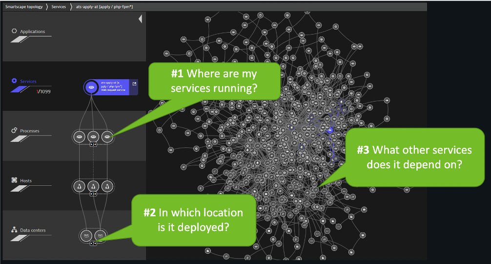

summary: This section covers the hands-on for Lab 1
id: aws-workshop-lab1
categories: dt
tags: aws-workshop
status: Published 
authors: Rob Jahn
Feedback Link: mailto:alliances@dynatrace.com
Analytics Account: UA-175467274-1

# 1. Modernize cloud workloads #1 - Plan Better

## Objectives of this Lab

🔷 Review real-time data now available for the sample application

🔷 Review how Dynatrace helps with modernization planning

<!-- -->
## Monolith application architecture

Here are the components for the monolith application

**\#1 . Sample Application**

Sample app representing a simple architecture of a frontend and backend implemented as Docker containers that we will review in this lab.

**\#2 . Dynatrace monitoring**

The Dynatrace OneAgent has been installed by the workshop provisioning scripts and is communicating to your Managed Dynatrace Tenant.

**\#3 . Load generator process**

A <a href="https://github.com/dt-orders/load-traffic" target="_blank">JMeter</a> process sends simulated user traffic to the sample app running within a Docker container. You will not need to interact with this container, it just runs in the background.

Negative
: *A real-world scenario would often start with the application components running on a physical or virtualized host on-prem and not "Dockerized". To simplify the workshop, we "Dockerized" the application into a front-end and back-end. In Dynatrace, these Docker containers all show up as "processes" on a host just like a "non-Dockerized" application will.*

<!-- -->
## Explore the Monolith application

The sample application is called Dynatrace Orders. A more detailed overview can be found <a href="https://github.com/dt-orders/overview" target="_blank">here</a>. All the source code can be found <a href="https://github.com/dt-orders" target="_blank">here</a>.

### Get the Public IP to the frontend of the Sample Application
------------------------------------------------------------

To get the Public IP, open the **EC2 instances page** in the ***AWS console***. On the newly created host **dt-orders-monolith** find the Public IP as shown below.

### View the Sample app in a Browser
--------------------------------

To view the application, paste the public IP using ***HTTP*** NOT HTTPS into a browser that will look like this:

Use the menu on the home page to navigate around the application and notice the URL for key functionality. You will see these URLs later as we analyze the application.

-   Customer List = `customer/list.html`
-   Customer Detail - Each product has a unique page = `customer/5.html`
-   Catalog List = `catalog/list.html`
-   Catalog Search Form = `catalog/searchForm.html`
-   Order List = `order/list.html`
-   Order Form = `order/form.html`

In the next few sections, you will review what the OneAgent automatically discovered for the host, services, processes, and the complete dependency mapping for the sample application.

<!-- -->
## Explore Dynatrace (Hosts)

### 👍 How this helps
----------------

As you plan your migration, each of these views will give insights into accessing the profile, consumption and dependencies to other systems and services.

### Review Hosts
------------

From the left-side menu in Dynatrace choose **hosts** then click on the host with the name **dt-orders-monolith**.

On host page, you will see basic infrastructure information for the host.

1. Now expand the **Properties** section to see data about the host:
   - Host resource metrics (CPU, memory)
   - Host availability
   - Discovered processes. The sample app is Node and Java based

<!-- -->
## Explore Dynatrace (Smartscape)

Enterprises have many hosts, services, and application that are ever changing. The ability to automatically discover and change as the environment changes is a key feature that Smartscape delivers.

### 👍 How this helps
----------------

Smartscape shows all the dependencies of a given service. Those include connections to queues, web servers, app servers, and a native process. The host view shows historical and live time-series data for usage as well as the consuming processes. This information allows us to better plan the migration, as all depending services must be considered during the migration.

Let's see how Dynatrace can visualize these processes using Smartscape.
1. Be sure you are on the **dt-orders-monolith** host page
2. Just click on the **...** box on the to the right of the host name
3. pick **Smartscape view** menu option
4. this will open Smartscape filtered to this Host Instance

Feel free to explore the Smartscape. 

<!-- -->
## Explore Dynatrace (Process)

As you plan your migration, you need more than just host level metrics. Knowing the details for each service, **BEFORE** you change it, will lower the risk of impacting the business.

### 👍 How this helps
----------------

Very quickly we have seen what processes and services are running on a host AND more importantly, what processes and services call (outbound) and are being called (inbound). Having a real-time picture is certainly more accurate that out of date documentation.

Return back to the host view for the host with the prefix of **dt-orders-monolith** and locate the **Processes and Containers** section.

Click on the **monolith-frontend** process to open the process detail view.

### Process view
------------

You should be on the process page where you will see information for this process. Follow the picture below to locate the following:

1. Click on the **Properties** line to toggle on/off to see additional data. Did you notice Docker?
2. On the info graphic, click to view the processes that call this process (Inbound)
3. On the info graphic, click to view the services that are served by this process. In this case there are multiple services.
4. On the info graphic, click to view the processes that this process calls (Outbound)

Positive
: *Dynatrace automatically recognizes many common processes like Tomcat and will capture process specific metrics such as JVM garbage collection.*

<!-- -->
## Explore Dynatrace (Service)

### 👍 How this helps
----------------

As you plan your migration, it is important to gain a complete picture of interdependency to the rest of the environment architecture at host, processes, services, application perspectives. Since time is always scarce, being able to do this in a single place can shorten assessment timelines.

Let's navigate to a specific service from the process view.

1. Click the **services** square above the host infographic to open the list of services
2. From the list of services, choose the **frontend**
   

### Service view
--------

1. Click on the `Properties` line to toggle on/off to see additional data
2. Click to view the services that call this service (Inbound)
3. Click to view the services that this service calls (Outbound)

Let's now take a look at all the services being monitored by clicking on the **Services** left side Dynatrace menu.

The filtered list should now look like this:

Choose the **frontend** service. On the **frontend** service page, find the **Dynamic Web Requests** section on the right and click the **view Dynamic Requests** button to see what it
calls.

On this page you can view the transactions as time-series charts.

On this page you can view the "top requests" and their response time consumption. You should recognize the URLs from the sample app!

### Analysis View
-------------

On the top if the page on the right is a button labeled **Create Analysis view**, click that.

Tryout the options available to view, filter and analyze data.

<!-- -->
## Technologies and processes
--------------------------

Seeing which processes make up the monolith has been an eye-opener for many teams that have done this exercise. "Oh -- we completely forgot about the dependency to this legacy process we introduced 5 years ago!"-- that's a common thing you hear!

As you plan your migration, knowing what technologies make up your eco-system is key so what you can decide whether to migrate, refactor or replace certain services.

The workshop is somewhat limited, so here is an example from another environment.

### 👍 How this helps
----------------

This is another out-of-the-box feature that helps you understand what technologies are in your environment with a heat map presentation to what degree they exist.

### Review Technologies and processes View
--------------------------------------

1. Click on the **Technologies and processes** link on the left side menu within Dynatrace to view the technologies that OneAgent was able to automatically discover and instrument.
   
2. In the filter box, type **tag**, choose **stage**, and the value of **production**. It should look like this:
   

<!-- -->
## Summary
-------

By just installing the OneAgent, we have now gained a detailed topological view of sample application from the both the infrastructure and application tiers and we are now ready to tackle our adoption to the cloud armed with the answers we need.

- **Right Priority** - We now understand the complexity and interdependency of services and components to the rest of the environment architecture
- **Right-Sizing the environment** - We now understanding which resources are required to move along with their required resource consumption patterns
- **Best Migration Strategy** - We now understand the current end-to-end transactions through architecture and can choose the best migration strategy (rehost, refactor, rearchitect, rebuild)

### Checklist

In this section, you should have completed the following:

✅ Review real-time data now available for the sample application

✅ Review how Dynatrace helps with modernization planning