summary: This section covers the hands-on for Lab 1
id: aws-workshop-lab1
categories: aws, infrastructure
tags: aws-workshop
status: Published 
authors: Rob Jahn
Feedback Link: mailto:alliances@dynatrace.com
Analytics Account: UA-175467274-1

# Lab 1 - OneAgent Observability

## OneAgent Observability

While choosing the right migration strategies, such as re-hosting or re-architecting, one must access the different risks, costs, and benefits. However, often the details of what is where and what is dependent on what within the technical stack is missing or poorly documented.  All that may exist is out of date diagrams and a mix of monitoring tool metrics that must be "stiched" together.

Not having enough details about the current environment is hindering organization's ability to make the right decisions when planning what to migrate and when.

To address this problem, Dynatrace’s OneAgent can automatically discover the application, services, processes and to build a complete dependency mapping for the entire application environment. So, let’s begin!

### Objectives of this Lab

🔷 Review Dynatrace OneAgent

🔷 Review real-time data now available for the sample application

🔷 Review how Dynatrace helps with modernization planning

## Overview
--------------

Referring to the picture below, here are the components for lab 1.

**\#1 . Sample Application**

Sample app representing a simple architecture of a frontend and backend
implemented as Docker containers that we will review in this lab.

**\#2 . Dynatrace monitoring**

The Dynatrace OneAgent has been installed by the workshop provisioning
scripts and is communicating to your Managed Dynatrace Tenant.

**\#3 . Load generator process**

A
<a href="https://github.com/dt-orders/load-traffic" target="_blank">JMeter</a>
process sends simulated user traffic to the sample app running within a
Docker container. You will not need to interact with this container, it
just runs in the background.

Negative:
*A real-world scenario would often start with the application components
running on a physical or virtualized host on-prem and not "Dockerized".
To simplify the workshop, we "Dockerized" the application into a
front-end and back-end. In Dynatrace, these Docker containers all show
up as "processes" on a host just like a "non-Dockerized" application
will.*

## Setup
-----------

This step just requires you to run a script that will provision several
AWS resources and the Dynatrace configuration needed for the workshop.

### Let's Begin
-----------

From the Cloudshell window, run these commands to start the provisioning
process:

    cd ~/aws-modernization-dt-orders-setup/provision-scripts
    ./provision-workshop.sh

The script output will look like this:

    ===================================================================
    About to Provision Workshop - k8
    ===================================================================
    Proceed? (y/n)

Select `Y` and when it completes, it will look like this:

    ...
    ...
    =============================================
    Provisioning AWS workshop resources COMPLETE
    End: Tue Jun 16 14:42:22 EDT 2020
    =============================================

The script will run fast, but it will take about 1-2 minutes for the
CloudFormation script to complete.

### What this script is doing
-------------------------

1. AWS resources - using AWS CLI

-   Add a KeyPair for the EC2 Instances called
    YOUR\_LAST\_NAME-dynatrace-modernize-workshop

2. AWS resources - using a CloudFormation stack created by the AWS CLI

-   Add a CloudFormation stack named
    `YOUR_LAST_NAME-dynatrace-modernize-workshop`
-   Add a VPC named `YOUR_LAST_NAME-dynatrace-modernize-workshop`
-   Add EC2 instance named: `YOUR_LAST_NAME-workshop-monolith` with a
    new security group named security\_group\_workshop-ez
-   At EC2 startup, it installs Docker and Docker-Compose
-   At EC2 startup, it installs the OneAgent for your Dynatrace tenant
-   Starts up the sample application

3. Dynatrace configuration

-   Set global
    <a href="https://www.dynatrace.com/support/help/how-to-use-dynatrace/problem-detection-and-analysis/problem-detection/detection-of-frequent-issues/" target="_blank">Frequent
    Issue Detection</a> settings to Off
-   Adjust the
    <a href="https://www.dynatrace.com/support/help/how-to-use-dynatrace/problem-detection-and-analysis/problem-detection/how-to-adjust-the-sensitivity-of-problem-detection/" target="_blank">Service
    Anomaly Detection</a>
-   Add
    <a href="https://www.dynatrace.com/support/help/how-to-use-dynatrace/management-zones/" target="_blank">Management
    Zones</a> for the monolith and micro services versions of the
    application
-   Add
    <a href="https://www.dynatrace.com/support/help/how-to-use-dynatrace/tags-and-metadata/" target="_blank">Auto
    Tagging Rules</a> to drive management zone and SLO settings
-   Add
    <a href="https://www.dynatrace.com/support/help/how-to-use-dynatrace/service-level-objectives/" target="_blank">SLOs</a>
    for a use in custom dashboards

Positive
: *The Dynatrace configuration scripts use a combination of
<a href="https://github.com/dynatrace-oss/dynatrace-monitoring-as-code" target="_blank">Dynatrace
Monitoring as Code</a> framework (a.k.a. monaco) and the
<a href="https://www.dynatrace.com/support/help/dynatrace-api/configuration-api/" target="_blank">Dynatrace
Configuration API</a> for those few Dynatrace configurations not yet
supported by monaco.*

### Review CloudFormation Output
----------------------------

As mentioned above, it may take a few minutes, but you can check the
CloudFormation output to ensure that all the AWS resources were
provisioned successfully.

Monitor CloudFormation stack status within the AWS console. Navigate to
the `CloudFormation` page or just navidate to: \*
<a href="https://console.aws.amazon.com/cloudformation/home" target="_blank">https://console.aws.amazon.com/cloudformation/home</a>

When it is complete, it will show a `CREATE_COMPLETE` status as shown
below, but with your unique stack name.

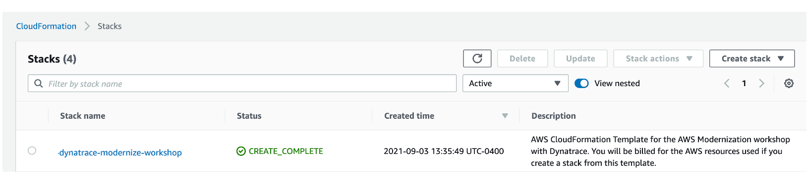

Negative
: The process to provision everything will take \~5 minutes, so please be
patient. If you using a personal or corporate account, the CloudFormation may
rollback due to VPC limits being reached. In that scenario, delete one
of the VPCs and retry the script.

## Why Dynatrace
-------------

Cloud modernization is a challenging problem and it can be extremely
costly for your business if you don't prepare properly for it. As you
modernize and move apps to the AWS cloud, there are three generally
acknowledged areas to focus on around the decision and execution
process:

**Plan better**

-   Evaluate that the app is well suited for cloud with essential early
    insights
-   Assess that the new design and cloud architecture will work well and
    be effective

**Execute faster**

-   Avoid problems that impact service delivery and cause delays by
    identifying issues quickly, in full context
-   Resolve problems faster, reducing overall project risk

**Optimize operations**

-   Feel confident that expectation is met for service delivery through
    clarity on performance before and after migration to the cloud
-   Identify areas for automation

Lets dig deeper into the ways
<a href="https://www.dynatrace.com" target="_blank">Dynatrace</a> helps
in each phase of our modernization journey.

### \#1: Understanding the Legacy Application

With Dynatrace OneAgent and Smartscape technologies, it is now fast and
easy to answer these questions about the our existing applications:

🔷 Which technologies are in use and where do they run?

🔷 How can I aggregate multiple services to have a big picture of the
legacy app?

🔷 Who is responsible and needs to be included in the discussion?

🔷 How can I make sense of all the Spaghetti codes in the legacy app?

The Dynatrace Smartscape topology map enables you to understand the
actual connection between all captured metrics, traces, logs, and user
experience data. Other than mere time-based correlation, topology
mapping reveals the actual causal dependencies between captured data.
This is the basis for Dynatrace's radically different AI engine, Davis.

### Understanding application usage patterns

Dynatrace automatically generate a blueprint of existing infrastructure,
services and the application landscape thanks to Dynatrace Smartscape
Technology. Dynatrace baselines existing on-premise applications,
automatically detects all dependencies (internal as well as external)
and calculates current resource consumption.

Dynatrace has out-the-box dashboards for each tier in the stack.

Incoming and outgoing connection to processes running monitored hosts is
another view created automatically.

Instead of gathering this data from multiple tools, all teams can look
to one source to help answer questions such as:

🔷 What will it cost to run in the cloud?

🔷 What network traffic will there be between the services we migrate and
those that have to stay in the current data center?

🔷 How can I make sense of all the Spaghetti codes in the legacy app?

### Making decision for the application migration strategy

Dynatrace provides immediate feedback on decisions & transformation. By
monitoring the progress of shifting workloads to the cloud, it helps
make better decisions on what to move when based on how tightly coupled
services are and on the automatic baseline comparison between
pre-migration and in-migration. One feature for this is the service
flow, where dependencies and usage can be analyzed.

This automatically built view along with other views such as the
Smartscape view allows for "virtual" monolith to micro service migration
planning without code changes. This enable smarter re-architecture and
re-platforming decisions based on the existing on-premise workload and
to validate other non-functional requirements such as scale, failover,
costs.

### Benchmarking performance and ensuring service levels

At high level, we know we must first establish system benchmarks and
then, during and post migration. With the AI-supported base lining on
the migrated services, Dynatrace allows for validating the success of
the migration project from a performance, resource and cost perspective.

With the build-in "hot-spot" analysis and performance analysis
capabilities, Dynatrace can help pinpoint when issues show up. Here is
one example where a problem has identified to be within the code
execution area. From there, one can drill into method level hot spots to
see what might have changed and is impacting service levels.

Migration often means moving to new technologies such as Kubernetes.
Dynatrace monitors native Kubernetes and managed Kubernetes service like
AWS EKS. Dynatrace auto-discovers any environment and provides full
observability without any configuration or code changes. No matter your
cloud platform, container runtime or service mesh layer, Dynatrace makes
monitoring applications and clusters simple.

By providing a single view into hybrid cloud environments and support
for new technologies like Kubernetes, validating business outcomes is
simplified.

### Increased complexity for operations

Adopting modern architectures and cloud services means automating
monitoring tasks, remediation tasks and ITSM tasks.

Traditional observability solutions offer little information beyond
dashboard visualizations. At the end, it remains to human experts to
analyze the data in time-consuming war rooms. Despite all efforts, too
many user complaints stay unresolved. Dynatrace is the only software
intelligence platform that reliably takes that burden off human
operators. Davis, the Dynatrace causation-based AI engine, automates
anomaly root-cause analysis and is custom built for highly dynamic micro
service environments.

Dynatrace's purpose-built AI engine, Davis, sits at the core of
Dynatrace and delivers AI-powered insights, detects problems, which are
opened when Dynatrace detects anomalies with your applications
(impacting end users), services (impacting service levels) or
infrastructure (unhealthy system components) for hybrid cloud
environments.

🔷 Built at the core of the Dynatrace platform Davis processes all
observability data across the full technology stack, independent of
origin.

🔷 Precise technical root-cause analysis. Davis pinpoints malfunctioning
components by probing billions of dependencies in milliseconds.

🔷 Identification of bad deployments. Davis knows exactly what deployment
or config change has introduced the anomaly in the first place.

🔷 Discovery of unknown unknowns. Davis does not rely on predefined
anomaly thresholds but automatically detects any unusual "change points"
in the data.

🔷 Automatic hypothesis testing by systematically working through the
complete fault tree.

🔷 No repetitive model learning or guessing. Unlike machine learning
approaches, Davis' causation-based AI relies on a topology map, which is
updated in real-time.

You gain advanced observability across cloud and hybrid environments,
from microservices to mainframe. Automatic full-stack instrumentation,
dependency mapping and AI-assisted answers detailing the precise
root-cause of anomalies, eliminating redundant manual work, and letting
you focus on what matters, delivering instant answers across the full
stack.

As a result, you gain advanced observability across cloud and hybrid
environments, from microservices to mainframe. Automatic full-stack
instrumentation, dependency mapping and AI-assisted answers detailing
the precise root-cause of anomalies, eliminating redundant manual work,
and letting you focus on what matters, delivering instant answers across
the full stack.

### Enabling modern operations

In order to do more with less and scale, Operations team must transcend
IT silos, foster collaboration and improve productivity. Automation is
key component of this, but it takes platforms that can integrate into
the enterprise eco-system and delivery pipelines. Using the Dynatrace
data, AI enabled problems, events, Smartscape and APIs use cases such
these are achievable today:

-   Eliminate the QA analysis bottleneck and deliver better software
    faster
-   Solve problems faster with AI-driven closed loop ITSM integration
-   Automate Problem Remediation

The Dynatrace Software Intelligence Platform established a smart cloud
ecosystem that enables modern operations that can:

-   Ingest more data to fill blind spots
-   Pull in data from Cloud Platforms
-   Trigger orchestration
-   Integrate with your Delivery Tools
-   Exchange data with your business systems

In summary, Dynatrace delivers extremely high-fidelity answers to each
of these key areas through its automatic and intelligent observability
for discovery and instrumentation, topology dependency mapping, full
stack context, and actionable answers to problems. You can modernize and
ensure every app is available, functional, fast, and fully optimized
across all channels. 

## Sample app

The sample application is called Dynatrace Orders. A more detailed
overview can be found
<a href="https://github.com/dt-orders/overview" target="_blank">here</a>.
All the source code can be found
<a href="https://github.com/dt-orders" target="_blank">here</a>.

### Get the Public IP to the frontend of the Sample Application.
------------------------------------------------------------

To get the Public IP, open the `EC2 instances` page in the AWS console.
On the newly created host `YOURNAME-dt-orders-monolith` find the
`Public IP` as shown below.

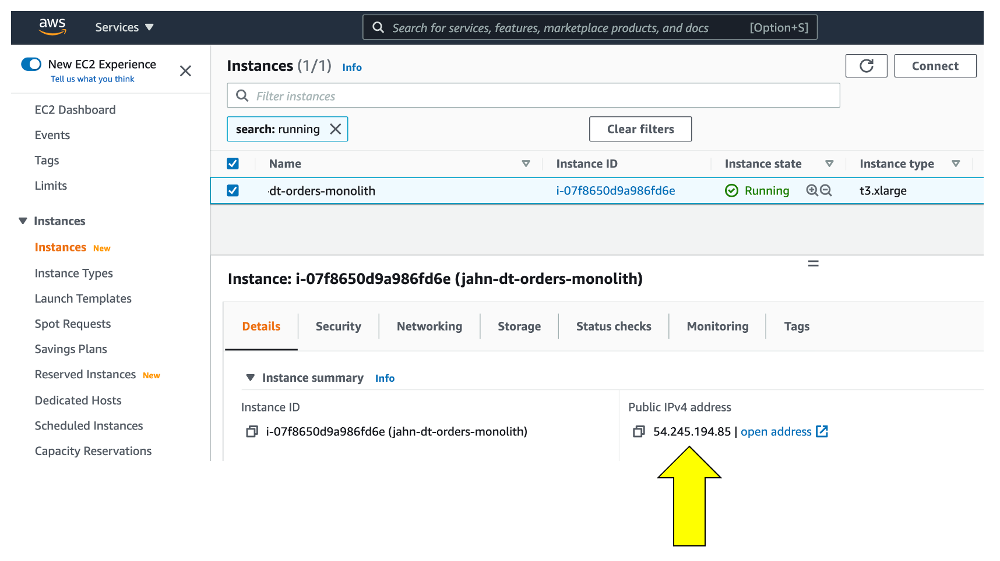

### View the Sample app in a Browser
--------------------------------

To view the application, paste the public IP using `HTTP` NOT `HTTPS`
into a browser that will look like this:

Use the menu on the home page to navigate around the application and
notice the URL for key functionality. You will see these URLs later as
we analyze the application.

-   Customer List = `customer/list.html`
-   Customer Detail - Each product has a unique page = `customer/5.html`
-   Catalog List = `catalog/list.html`
-   Catalog Search Form = `catalog/searchForm.html`
-   Order List = `order/list.html`
-   Order Form = `order/form.html`

## OneAgent
--------

The host running the sample application were all created using scripts
that installed the sample application and to install the Dynatrace
OneAgent. Since we don't have to install the OneAgent now, let's just
review its status.

1.  Login into Dynatrace

2.  Choose the `Deployment status` option from the left side menu to
    open the OneAgent deployment page.

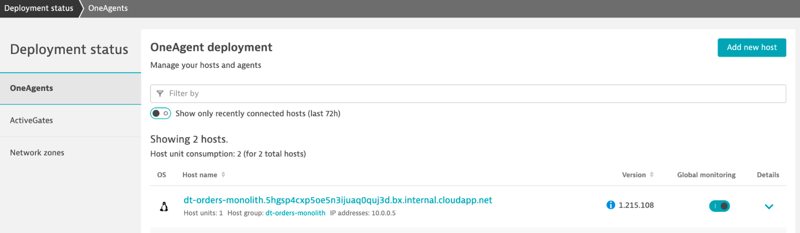

### Review another way to install the OneAgent
------------------------------------------

1.  Choose the `Deploy Dynatrace` option from the left side menu to open
    the OneAgent deployment page.

2.  Click the `Start installation` button. This will open the Download
    page.

3.  On the `Download agent` page, pick the platform `Linux` to view the
    commands will download and run the OneAgent installer.

Positive
: *The URL and Token is unique to your Dynatrace tenant. If you expand the
`Set customized options (optional).` section you can review other
options for the OneAgent installer.*

Positive
: *Setting the hostname via
`/bin/sh Dynatrace-OneAgent-Linux-1.xxx.yyy.sh --set-host-name=my-host-name`
is just
<a href="https://www.dynatrace.com/support/help/how-to-use-dynatrace/hosts/configuration/set-custom-host-names-in-dynamic-environments" target="_blank">one
of the ways</a> to customize host naming.*

1 . These are the commands used to download, verify, and install the
OneAgent. **That is it!**

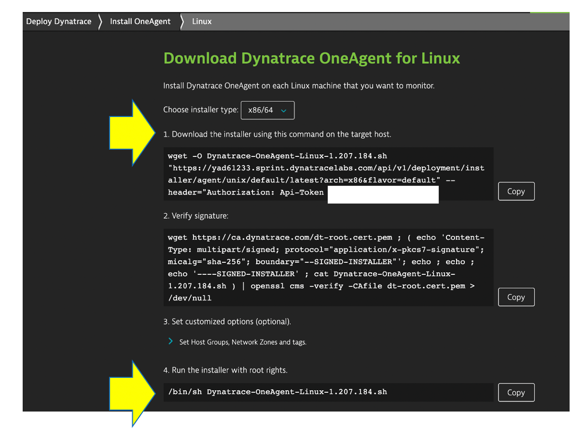

2 . Go back the `Download agent` page and review other options like
Windows or Kubernetes.

Positive
: *Learn more about the various ways the OneAgent can be installed, check
out the
<a href="https://www.dynatrace.com/support/help/setup-and-configuration/dynatrace-oneagent" target="_blank">Dynatrace
documentation</a>*

## Host view
---------

In the next few sections, you will review what the OneAgent
automatically discovered for the host, services, processes, and the
complete dependency mapping for the sample application.

### 👍 How this helps
----------------

As you plan your migration, each of these views will give insights into
accessing the profile, consumption and dependencies to other systems and
services.

### Review Hosts
------------

From the left-side menu in Dynatrace choose `hosts` then click on the
host with the name `dt-orders-monolith`.

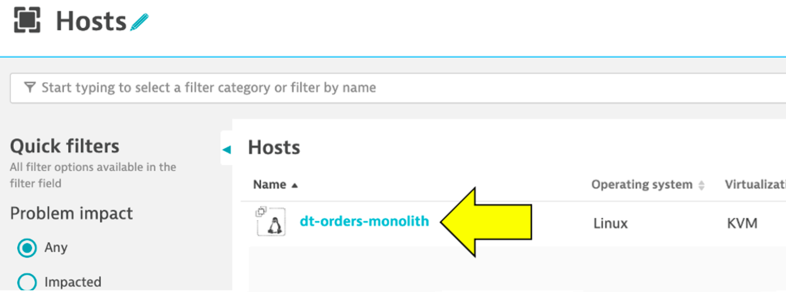

On host page, you will see basic infrastructure information for the
host.

1.  Now expand the `Properties` section to see data about the host:
2.  Host resource metrics (CPU, memory)
3.  Host availability
4.  Discovered processes. The sample app is Node and Java based

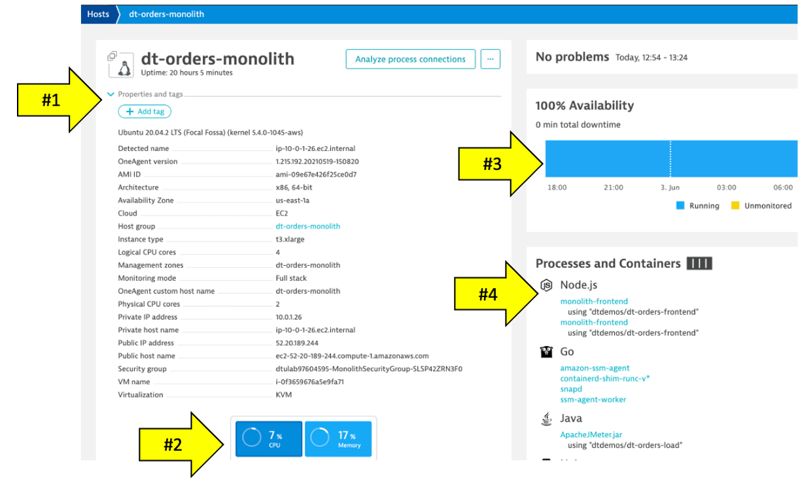

## About Smartscape

Enterprises have many hosts, services, and application that are ever
changing. The ability to automatically discover and change as the
environment changes is a key feature that Smartscape delivers.

Dynatrace's near real-time environment-topology visualization tool,
Smartscape, is where Dynatrace's auto-discovery is delivered into a
quick and efficient visualization of all the topological dependencies in
your infrastructure, processes, and services.

### 👍 How this helps
----------------

Smartscape shows all the dependencies of a given service. Those include
connections to queues, web servers, app servers, and a native process.
The host view shows historical and live time-series data for usage as
well as the consuming processes. This information allows us to better
plan the migration, as all depending services must be considered during
the migration.

Referring to the picture above:

-   On the horizontal axis, it visualizes all ingoing and outgoing call
    relationships within each tier
-   On the vertical axis, it displays full-stack dependencies across all
    tiers
    -   Data center
    -   Hosts
    -   Process
    -   Service
    -   Application

### Review Smartscape
-----------------

Let's see how Dynatrace can visualize these processes using Smartscape.

1.  Be sure you are on the `dt-orders-monolith` host page
2.  Just click on the `...` box on the to the right of the host name
3.  pick `Smartscape view` menu option
4.  this will open Smartscape filtered to this Host Instance

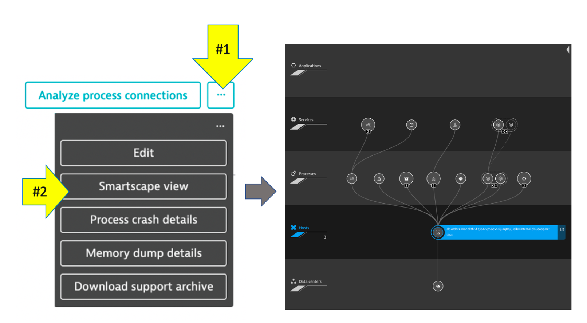

Feel free to explore the Smartscape. 

## Process

In the Smartscape view, we saw the visualizations of the relationships
in vertical stack and as well as the relationships spatially. Now let's
view the processes and services running on the host.

As you plan your migration, you need more than just host level metrics.
Knowing the details for each service, **BEFORE** you change it, will
lower the risk of impacting the business.

### 👍 How this helps
----------------

Very quickly we have seen what processes and services are running on a
host AND more importantly, what processes and services call (outbound)
and are being called (inbound). Having a real-time picture is certainly
more accurate that out of date documentation.

### Lets Review!
------------

Return back to the host view for the host with the prefix of
`dt-orders-monolith` and locate the `Processes and Containers` section.

Click on the `monolith-frontend` process to open the process detail
view.

### Process view
------------

You should be on the process page where you will see information for
this process. Follow the picture below to locate the following:

1.  Click on the `Properties` line to toggle on/off to see additional
    data. Did you notice Docker?
2.  On the info graphic, click to view the processes that call this
    process (Inbound)
3.  On the info graphic, click to view the services that are served by
    this process. In this case there are multiple
4.  On the info graphic, click to view the processes that this process
    calls (Outbound)

Positive
: *Dynatrace automatically recognizes many common processes like Tomcat
and will capture process specific metrics such as JVM garbage
collection. See a list of supported technologies, languages and
containers in the
<a href="https://www.dynatrace.com/support/help/technology-support/supported-technologies-and-versions" target="_blank">Dynatrace
documentation</a>*

### Dynatrace and containers
------------------------

In the picture above, the arrow shows the properties for Docker.

Our sample app was built as a Docker container and Dynatrace hooks into
containers and provides code for injecting OneAgent into containerized
process.

### How Dynatrace monitors containers
---------------------------------

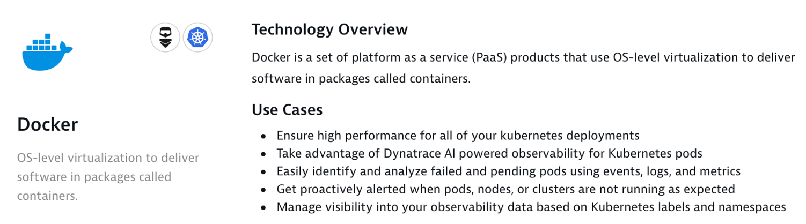

Dynatrace hooks into containers and provides code for injecting OneAgent
into containerized processes.

There's no need to modify your Docker images, modify run commands, or
create additional containers to enable Docker monitoring. Simply install
OneAgent on your hosts that serve containerized applications and
services. Dynatrace automatically detects the creation and termination
of containers and monitors the applications and services contained
within those containers.

Positive
: *You can read more about Dynatrace Docker Monitoring
<a href="https://www.dynatrace.com/support/help/technology-support/cloud-platforms/other-platforms/docker/basic-concepts/how-dynatrace-monitors-containers/" target="_blank">here</a>
and technical details
<a href="https://www.dynatrace.com/support/help/technology-support/cloud-platforms/other-platforms/docker/monitoring/monitor-docker-containers" target="_blank">here</a>*

### View a Service
--------------

Now Let's review a specific service.

1.  Click the `services` square above the host infographic to open the
    list of services
2.  From the list of services, choose the `frontend`

### Service View
------------

You should be on the service page where you will see information for
this specific service. Follow the picture below to locate the following:

1.  Click on the `Properties` line to toggle on/off to see additional
    data
2.  Click to view the services that call this service (Inbound)
3.  Click to view the services that this service calls (Outbound)

## Services
--------

Web applications consist of web pages that are served by web servers and
web application processes, for example Tomcat. Web and mobile
applications are built upon services that process requests like web
requests, web service calls, and messaging.

Such "server-side services" can take the form of web services, web
containers, database requests, custom services, and more. Services may
in turn call other services such as web services, remote services, and
databases services.

### 👍 How this helps
----------------

As you plan your migration, it is important to gain a complete picture
of interdependency to the rest of the environment architecture at host,
processes, services, application perspectives. Since time is always
scarce, being able to do this in a single place can shorten assessment
timelines.

### Services
--------

Let's now take a look at all the services being monitored by clicking on
the `Services` left side Dynatrace menu.

The filtered list should now look like this:

Choose the `frontend` service.

On the `frontend` service page, find the `Dynamic Web Requests` section
on the right and click the `view Dynamic Requests` button to see what it
calls.

On this page you can view the transactions as time-series charts.

On this page you can view the "top requests" and their response time
consumption. You should recognize the URLs from the sample app!

By clicking on one of the requests, the time-series charts are filtered
to just that one request.

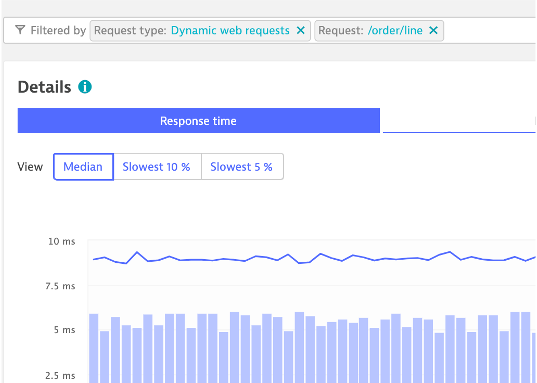

### Analysis View
-------------

On the top if the page on the right is a button labeled
`Create Analysis view`, click that.

Tryout the options available to view, filter and analyze data.

## Analyze Service Flow
--------------------

We just saw one way to review process and service communication, but
let's look at how Dynatrace understands and visualizes your
applications' transactions from end-to-end using S`Service Backtraces`
and `Service flows`

-   With `Service flow`, you see the flow of service calls **FROM** a
    service, request, or their filtered subset. Along with the specific
    services that are triggered, you can also see how each component of
    a request contributes to the overall response time.

-   With `Service backtrace`, you see the calls **TO** a service.

### 👍 How this helps
----------------

As you plan your migration, it is important to gain a complete picture
of interdependency to the rest of the environment architecture at host,
processes, services, and application perspectives. Since time is always
scarce, being able to do this in a single place can shorten assessment
timelines.

Knowing the type of access, executed statements, and amount of data
transferred during regular hours of operation allows for better planning
and prioritization of the move groups. In some cases, you may decide to
not migrate this database in favor of other services or databases that
are less complex to migrate due to fewer dependencies.

### Review Service Flow
-------------------

1.  Return to the `frontend` service. You can use the `breadcrumb` menu
    as shown below.

    

2.  On the `frontend` service page, locate the Understand
    dependencies`section on the right, and then click the`view Service
    flow\` button.

    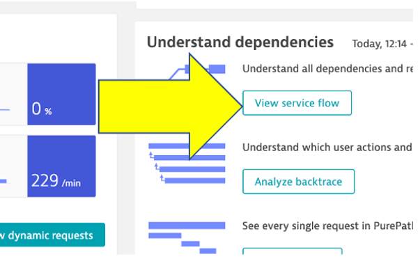

### Response time perspective
-------------------------

You should now be on the **Service flow** page.

Right away, we can see how this application is structured:

-   Frontend calls backend
-   Backend calls database

Refer to the numbers in the picture above:

1.  The timeframe defaults to whatever you have your global timeframe
    selector set to, up to a maximum of 24 hours.
2.  We are viewing the data from a **Response time perspective**.
    Shortly, we will review the **Throughput perspective**.
3.  Click on the boxes to expand the response time metrics. We can see
    that most of the response time, most of the time is spent in the
    backend service.
4.  Even though there are a few calls to the database for every backend
    service request, only a very small amount of the response time is
    spent in the database.

### Throughput perspective
----------------------

Refer to the numbers in the picture above:

1.  The timeframe defaults to 10 minutes but can be adjusted
2.  Change to the **Throughput** perspective by clicking on the box
3.  Click on the boxes to expand the metrics to see the number of
    requests and average response times going to the backend sevice
4.  We can see the number of requests to `backend` database

## Analyze service backtrace
-------------------------

Dynatrace understands your applications transactions from end to end.
This transactional insight is visualized several ways like the
backtrace.

The backtrace tree view represents the sequence of services that led to
this service call, beginning with the page load or user action in the
browser.

### 👍 How this helps
----------------

Using the service flow and service backtrace, these two tools give you a
complete picture of interdependency to the rest of the environment
architecture at host, processes, services, and application perspectives.

### Review Service backtrace
------------------------

Let's now take a look at the Services by clicking on the `Services` left
side Dynatrace menu.

Pick the `backend` service.

On the `backend` service, click on the `Analyze Backtrace` button.

You should be on the service backtrace page where you will see
information for this specific service.

This will get more interesting in the next lab, but for the monolith
backend, we can see that the backtrace is as follows:

1.  The starting point is the `backend`
2.  `backend` is called by the `frontend` service
3.  `ApacheJMeter` traffic from the load generator script
4.  You may also see browser traffic to the **frontend** from the
    `My web application`. If you don't that is OK.

***If you click on any of the rows in the backtrace, the bottom portion
of the page will expand.***

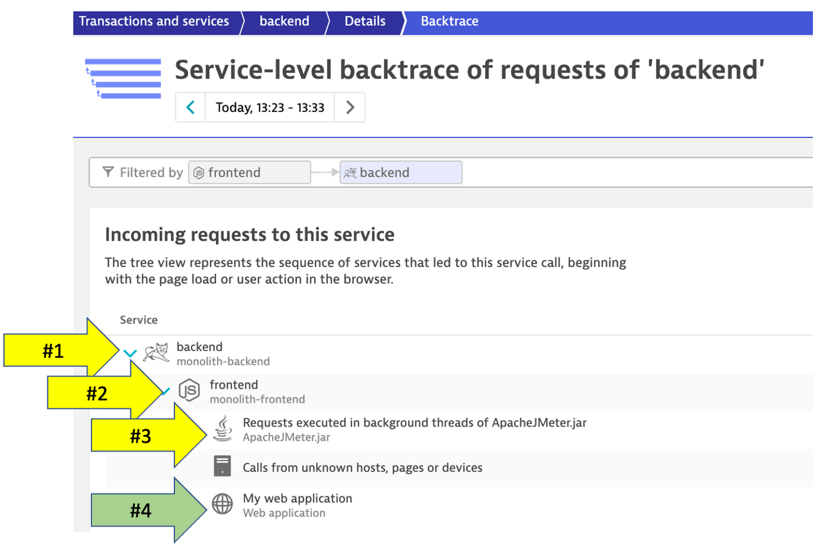

## Databases
---------

As you plan your migration, Database observability is critical to a
successful plan. Knowing the type of access, executed statements, and
amount of data transferred during regular hours of operation allows for
better migration planning and prioritization of the move groups. In some
cases, you may decide to not migrate this database in favor of other
services or databases that are less complex to migrate due to fewer
dependencies.

### 👍 How this helps
----------------

When monitoring database activity, Dynatrace shows you which database
statements are executed most often and which statements take up the most
time. You can also see which services execute the database statements
what will be direct input to migration planning and prioritization of
the move groups.

Dynatrace monitors all the popular database SQL Server, Oracle, MongoDB
to name a few. See
<a href="https://www.dynatrace.com/platform/database-monitoring/" target="_blank">Dynatrace
documentation</a> for more details on platform support.

### Navigate to the Database
------------------------

To learn some out-of-the-box features of Dynatrace. Let's do a quick
review of the database that exists for the sample application.

1.  Lets get back to the `backend` service. One way is to go back to the
    `Services` left side Dynatrace menu and then pick the `backend`
    service.

2.  On the `backend` service page, click on the `[embedded]` database to
    open the database service page.

### Database Review
---------------

The sample application uses an
<a href="http://hsqldb.org/)" target="_blank">In memory Java relational
database</a>. On this page you can explore the database process like

1.  What services call this database
2.  Database availability
3.  View individual SQL statements
4.  Custom metric analysis

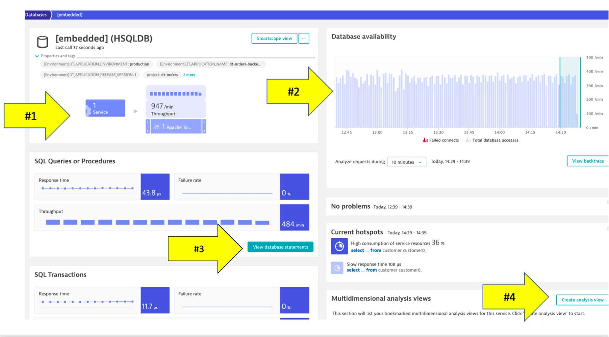

## Technologies and processes
--------------------------

By default, Dynatrace gives you FullStack horizontal (who talks to whom)
and vertical (what runs on what) dependency visibility as part of
Dynatrace Smartscape! All without a single line of code or configuration
change -- just by installing the OneAgent.

Seeing which processes make up the monolith has been an eye-opener for
many teams that have done this exercise. "Oh -- we completely forgot
about the dependency to this legacy process we introduced 5 years ago!"
-- that's a common thing you hear!

As you plan your migration, knowing what technologies make up your
eco-system is key so what you can decide whether to migrate, refactor or
replace certain services.

The workshop is somewhat limited, so here is an example from another
environment.

### 👍 How this helps
----------------

This is another out-of-the-box feature that helps you understand what
technologies are in your environment with a heat map presentation to
what degree they exist.

### Review Technologies and processes View
--------------------------------------

1.  Click on the **Technologies and processes** link on the left side
    menu within Dynatrace to view the technologies that OneAgent was
    able to automatically discover and instrument.

    

2.  In the filter box, type `tag`, choose `stage`, and the value of
    `dev`. It should look like this:

    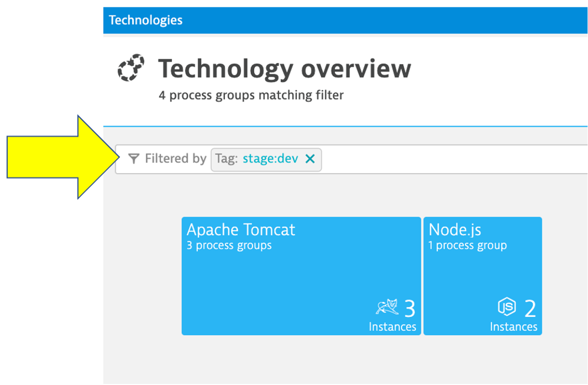

### Planning Ahead
--------------

You can always click into the `Hub` menu within Dynatrace to learn about
the many technologies that Dynatrace supports. This list is in sync and
constantly updated in conjunction with the
<a href="https://www.dynatrace.com/hub" target="_blank">Dynatrace
website hub page</a>

## Summary
-------

By just installing the OneAgent, we have now gained a detailed
topological view of sample application from the both the infrastructure
and application tiers and we are now ready to tackle our adoption to the
cloud armed with the answers we need.

-   **Right Priority** - We now understand the complexity and
    interdependency of services and components to the rest of the
    environment architecture
-   **Right-Sizing the environment** - We now understanding which
    resources are required to move along with their required resource
    consumption patterns
-   **Best Migration Strategy** - We now understand the current
    end-to-end transactions through architecture and can choose the best
    migration strategy (rehost, refactor, rearchitect, rebuild)

### One more resource to review
---------------------------

1 . Choose the `Dynatrace Hub` option from the left side menu to open
the OneAgent deployment page.

2 . Explore all the integration options of Dynatrace while you are in
the Hub

### Checklist

In this section, you should have completed the following:

✅ Review Dynatrace OneAgent

✅ Review real-time data now available for the sample application

✅ Review how Dynatrace helps with modernization planning
