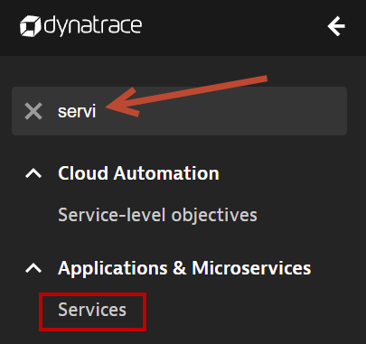
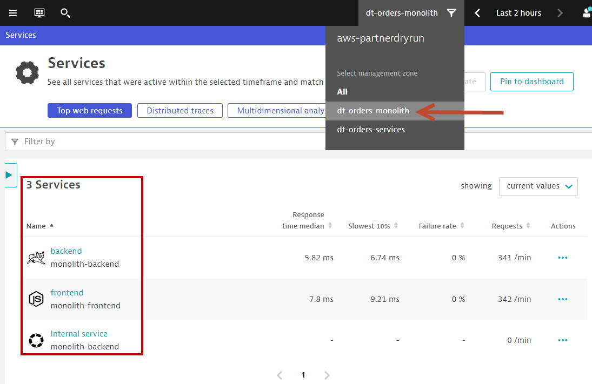
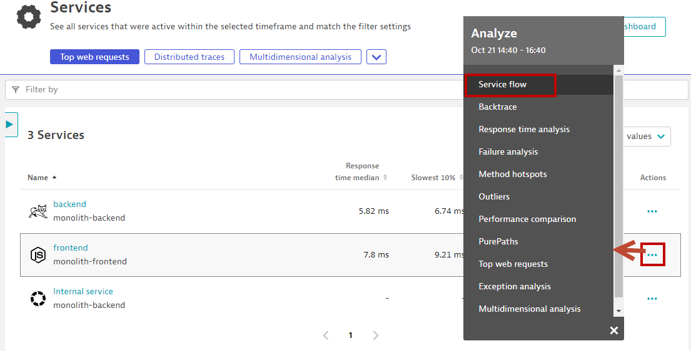
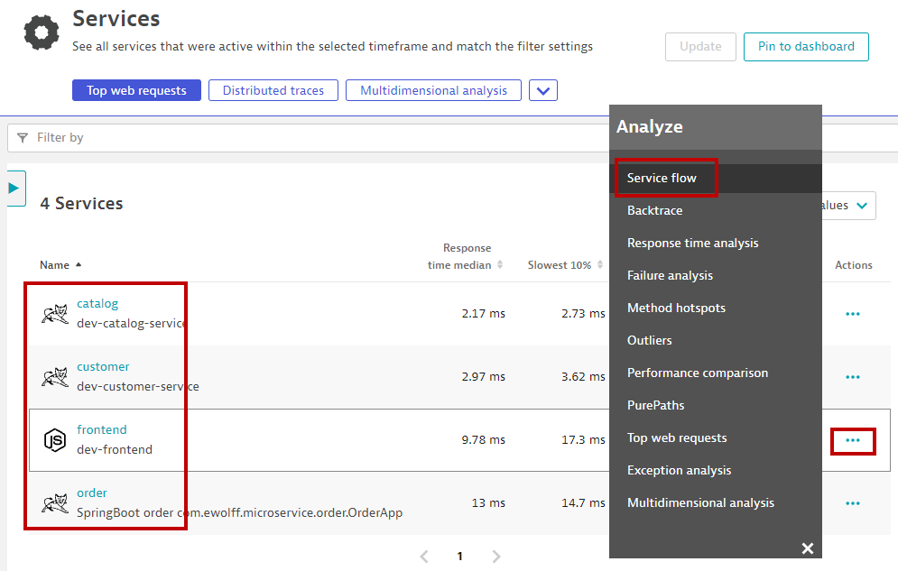
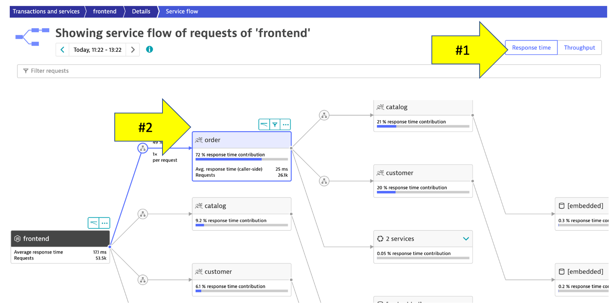
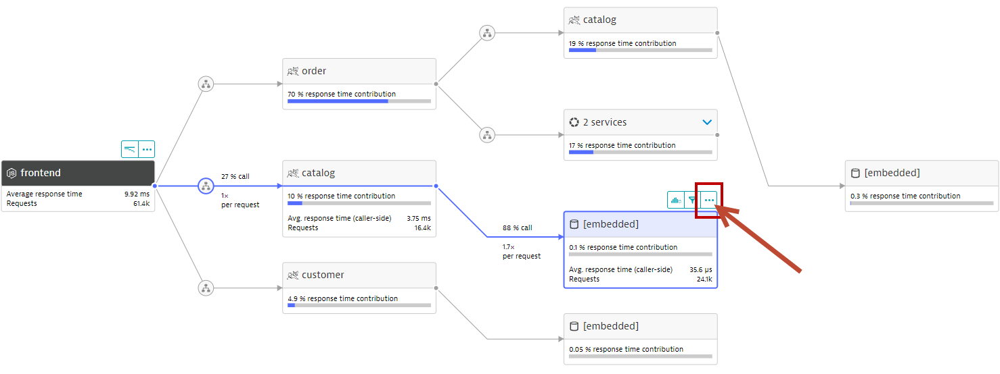
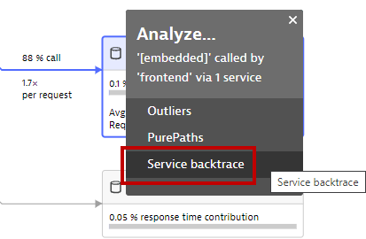
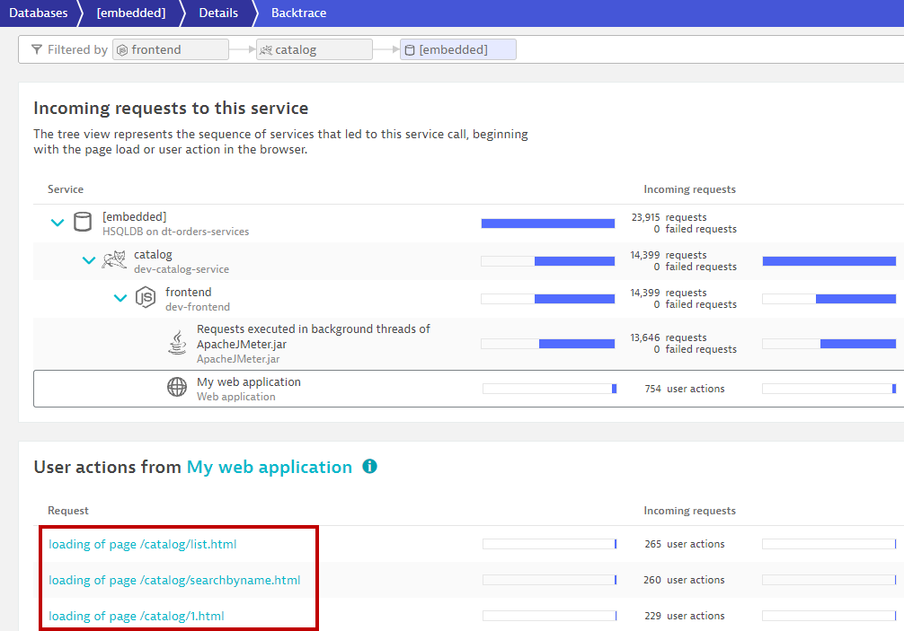

summary: This section covers the hands-on for Lab 2
id: aws-workshop-lab2
categories: dt
tags: aws-workshop
status: Published 
authors: Rob Jahn
Feedback Link: mailto:alliances@dynatrace.com
Analytics Account: UA-175467274-1

# 2. Modernize cloud workloads #2 - Move faster

## Objectives of this Lab 

🔷 Review how the sample application went from a simple architecture to multiple services 

🔷 Examine the transformed application using service flows and backtraces 

<!-- -->
## Micro-services application architecture

For this lab you are going to use an updated version of the application on a 

As we saw earlier, the sample application is a **three-tiered application** --> frontend, backend, database

Re-hosting (also referred to as lift and shift) is a common migration use case. Re-architecture and Re-platform are steps that break the traditional architectures and replace individual components with cloud services and microservices.

In our scenario, we assume that you have decided to use one of AWS's 6 R's, i.e. **re-architect** to break out each of these backend services into separate services. We deployed a second EC2 instance so that it is easy for you to see the transformation of the Sample Application in Lab 1.

By putting these services into Docker images, we gain the ability to deploy the service into modern platforms like Kubernetes and Cloud managed services such as the ones shown below.

<!-- -->
## Explore the Micro-services application

### Get the Public IP to the frontend of the Sample Application
------------------------------------------------------------

To get the Public IP to the frontend of the Sample Application, open the **EC2 instances page** in the **AWS console**. On the newly created host **dt-orders-services** find the Public IP as shown below.

### View the Sample app in a Browser
--------------------------------

To view the application, paste the public IP using ***HTTP*** NOT HTTPS into a browser that will look like this:

Use the menu on the home page to navigate around the application and notice the URL for key functionality.

Negative
: The application looks like this monolith, but notice how the home page shows the versions of the three running backend services. You will see these version updated automatically as we deploy new versions of the backend services. We will refer to this again later in the other labs.

<!-- -->
## Analyze Service Flow

Dynatrace understands and visualizes your applications' transactions from end-to-end using **Service Backtraces** and **Service flows**

### 👍 How this helps
----------------

As you plan your migration, it is important to gain a complete picture of interdependency to the rest of the environment architecture at host, processes, services, and application perspectives. Since time is always scarce, being able to do this in a single place can shorten assessment timelines.

Knowing the type of access, executed statements, and amount of data transferred during regular hours of operation allows for better planning and prioritization of the move groups. In some cases, you may decide to not migrate this database in favor of other services or databases that are less complex to migrate due to fewer dependencies.

### Review Service Flow of both Monolith and Micro-services application architecture
-------------------

Let's start with the **Monolith** app
1. Open up the Dynatrace Menu, use the ***filter*** to search for Services
   
2. Click on **Services**
3. In the **management zone** drop down, choose **dt-orders-monolith**. The filtered list should now look like this:
   
4. On the **frontend** row, to the ***far right***, click on **...**, and in the **Analyze** pop-up, click on **Service Flow**
   

You should now be on the **Service flow** page.

Right away, we can see how this application is structured:
- Frontend calls backend
- Backend calls database

Do the same for the **Micro-services** app
1. Go back to **Service** view
2. In the **management zone** drop down, choose **dt-orders-services**
3. On the **dev-frontend** row, to the ***far right***, click on **...**, and in the **Analyze** pop-up, click on **Service Flow**
   

Compare this view with the Service Flow of the Monolith application, and you can already see some apparent difference in the way the application is structured:
- Frontend calls order, customer, and catalog service
- Order service calls order and customer service

Positive
: This is something you would never know from the application web UI!

<!-- -->
## Analyze service backtrace
-------------------------

Dynatrace understands your applications transactions from end to end. This transactional insight is visualized several ways like the backtrace.

The backtrace tree view represents the sequence of services that led to this service call, beginning with the page load or user action in the browser.

And this is most useful for ***database*** services, where usually a centralized database is called by many applications.

### 👍 How this helps
----------------

Using the service flow and service backtrace, these two views give you a complete picture of interdependency to the rest of the environment architecture at host, processes, services, and application perspectives.

As you plan your migration, Database observability is critical to a successful plan. Knowing the type of access, executed statements, and amount of data transferred during regular hours of operation allows for better migration planning and prioritization of the move groups. In some cases, you may decide to not migrate this database in favor of other services or databases that are less complex to migrate due to fewer dependencies.

### Review databases and service backtrace for the Microservices app
1. Using the same Service Flow diagram as before, you will notice that there are 3 <a href="http://hsqldb.org/)" target="_blank"> in-memory Java databases </a> in the application architecture
2. Click on the one that is being called by the **catelogue** service
3. Click on the **...** above the database
   
4. Select **backtrace**
   

We can see that the backtrace is as follows:
- The database is only called by the catalog service
- catalog is called by the order service
- catalog is called by the frontend service
- And here we see the exact ***user clicks*** or user transactions that generated the calls to the database!

<!-- -->
## Summary

While migrating to the cloud, you want to evaluate if your migration goes according to the plan, whether the services are still performing well or even better than before, and whether your new architecture is as efficient as the blueprint suggested. Dynatrace helps you validate all these steps automatically, which helps speed up the migration and
validation process.

Having the ability to understand service flows enables us to make smarter re-architecture and re-platforming decisions. With support for new technologies like Kubernetes, you have confidence to modernize with a platform that spans the old and the new.

### Checklist
---------

In this section, you should have completed the following:

✅ Review how the sample application went from a simple architecture to multiple services

✅ Examine the transformed application using service flows and backtraces