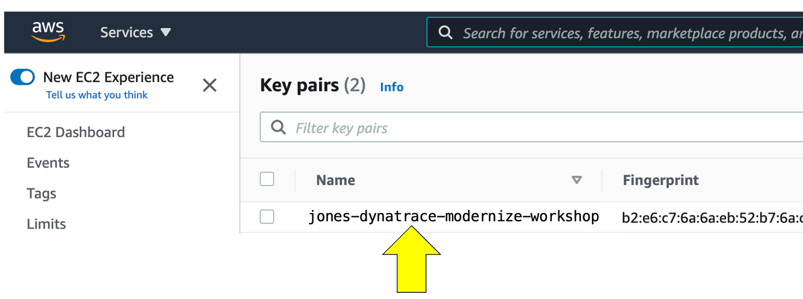
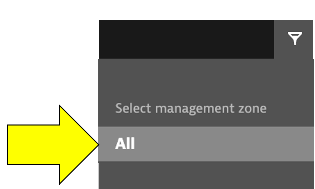
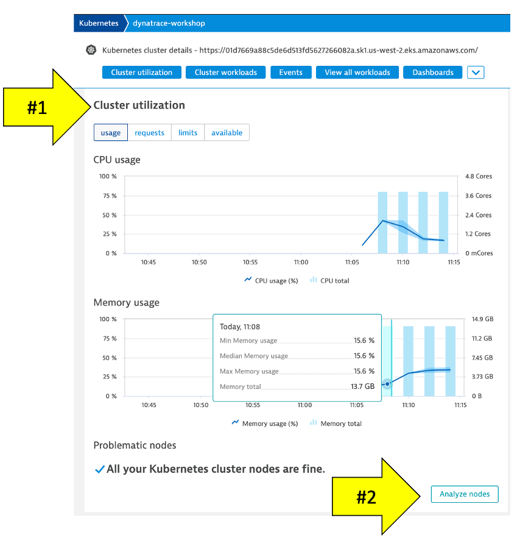
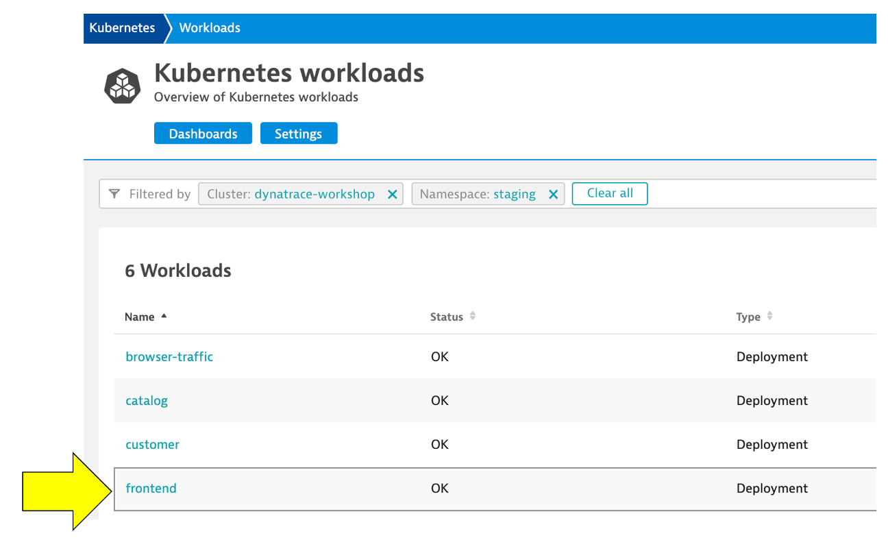
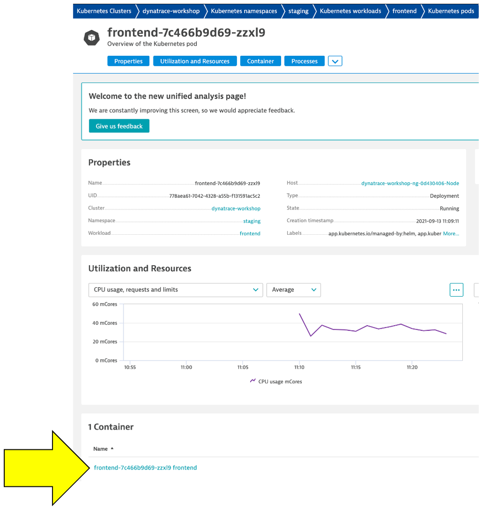
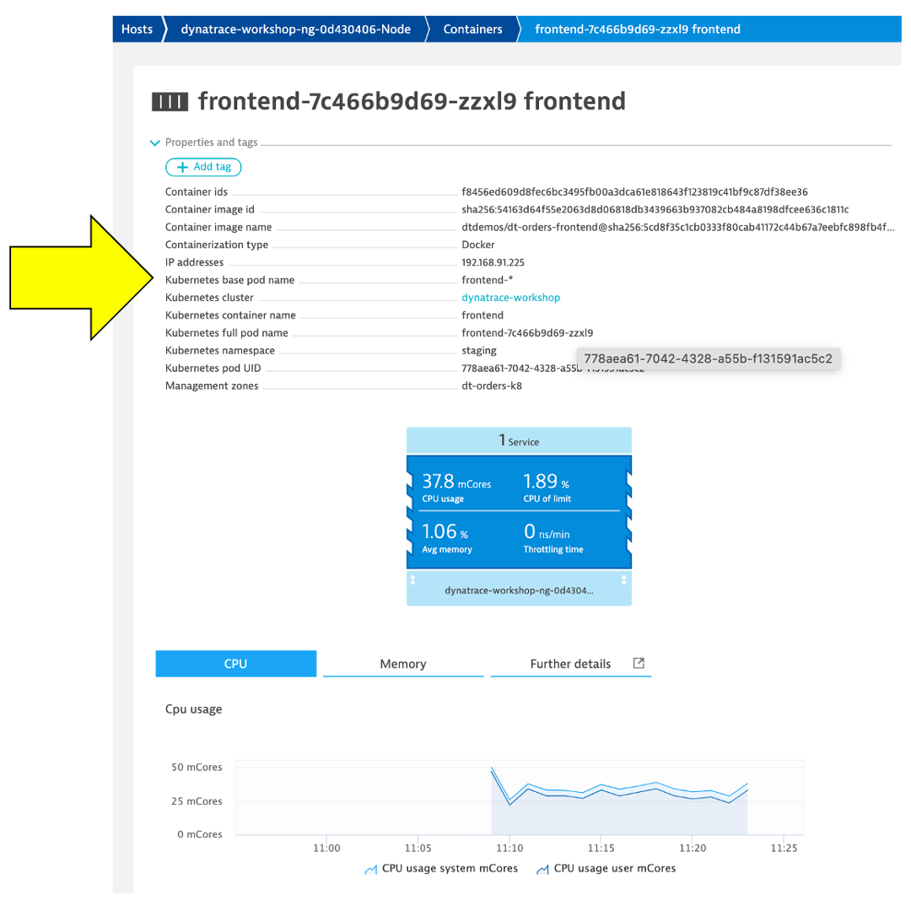

summary: This section covers the hands-on for Lab 2
id: aws-workshop-lab2
categories: aws, kubernetes
tags: aws-workshop
status: Published 
authors: Rob Jahn
Feedback Link: mailto:alliances@dynatrace.com
Analytics Account: UA-175467274-1

# Lab 2 - Kubernetes

## Lab 2 - Kubernetes

Re-hosting (also referred to as lift and shift) is a common migration use case. Re-architecture and Re-platform are steps that break the traditional architectures and replace individual components with cloud services and microservices.

We just learned how we can get great information on services, processes and user requests using Dynatrace and OneAgent. This helps us now decide what individual features or complete applications based on business benefits we need to migrate and modernize. The idea here is to focus on feature-based business benefit with functional migration. 

### Objectives of this Lab 

🔷 Install the Dynatrace Operator and sample application

🔷 Review how the sample application went from a simple architecture to multiple services 

🔷 Examine the transformed application using service flows and backtraces 

## Overview
--------------

As we saw earlier, the sample application is a three-tiered application
--\> frontend, backend, database.

For our lab, another version of the application exists that breaks out
each of these backend services into separate services. By putting these
services into Docker images, we gain the ability to deploy the service
into modern platforms like Kubernetes and AWS services such as the ones
shown below.

### Kubernetes
----------

Kubernetes is open source software that allows you to deploy and manage
containerized applications at scale.

Kubernetes manages clusters of compute instances and runs containers on
those instances with processes for deployment, maintenance, and scaling.
Using Kubernetes, you can run any type of containerized applications
using the same toolset on-premises and in the cloud.

You can read more about Kubernetes
<a href="https://aws.amazon.com/kubernetes" target="_blank">here</a>

### Amazon Elastic Kubernetes Service
---------------------------------

AWS makes it easy to run Kubernetes. You can choose to manage Kubernetes
infrastructure yourself with Amazon EC2 or get an automatically
provisioned, managed Kubernetes control plane with
<a href="https://aws.amazon.com/eks/" target="_blank">Amazon EKS</a>.
Either way, you get powerful, community-backed integrations to AWS
services like VPC, IAM, and service discovery as well as the security,
scalability, and high-availability of AWS.

Amazon EKS runs Kubernetes control plane instances across multiple
Availability Zones to ensure high availability. Amazon EKS automatically
detects and replaces unhealthy control plane instances, and it provides
automated version upgrades and patching for them.

Amazon EKS is also integrated with many AWS services to provide
scalability and security for your applications, including the following:

-   Elastic Load Balancing for load distribution
-   IAM for authentication
-   Amazon VPC for isolation
-   Amazon ECR for container images

For this workshop you are going to use Amazon EKS managed service that
makes it easy for you to run Kubernetes on AWS without needing to stand
up or maintain your own Kubernetes control plane.

### Lab Setup
---------

Refer to the picture below, here are the components for lab 2.

**\#1 . Sample Application** Sample app representing a "services"
architecture of a frontend and multiple backend services implemented as
Docker containers that we will review in this lab.

**\#2 . Kubernetes** Amazon Elastic Kubernetes Service (EKS) is hosting
the application. The Kubernetes cluster had the Dynatrace OneAgent
Operator installed. (see below for more details). Two EKS nodes make up
the Kubernetes cluster. The Dynatrace OneAgent was preinstalled by the
OneAgent operator and is sending data to your Dynatrace SaaS
environment. (see below for more details)

**\#3 . Dynatrace Operator** Dynatrace OneAgent is container-aware and
comes with built-in support for out-of-the-box monitoring of Kubernetes.
Dynatrace supports full-stack monitoring for Kubernetes, from the
application down to the infrastructure layer.

**\#4 . Dynatrace** Dynatrace tenant where monitoring data is collected
and analyzed.

**\#5 . Full-Stack Dashboard** Made possible by the Dynatrace OneAgent
that will automatically instrument each running node & pod in EKS.

**\#6 . Kubernetes Dashboard** The Kubernetes page provides an overview
of all Kubernetes clusters showing monitoring data like the clusters'
sizing and utilization.  

### Beyond the Lab
--------------

Over time, you can imagine that this sample application will be further
changed to add in other technologies like AWS Lambda functions and other
PaaS services like AWS RDS or Aurora databases and virtual networking
Application gateways as shown in the picture below.

Negative
: We will not cover this, but organizations are establishing DevOps
approaches and Continuous Integration (CI) pipelines to build and test
each service independently. They are also adding Continuous Deployment
(CD) as well to the process too that vastly increases our ability to
delivery features faster to our customers.

## Lab 2 Setup
-----------

This step extends what you did in the previous step and will provision
an Amazon Elastic Kubernetes Service (EKS) cluster and the Dynatrace
configuration needed for the workshop.

There are the following setup steps for this lab: 1. Install the
pre-requisite tools 1. Setup Dynatrace config 1. Create Cluster 1.
Verify Cluster 1. Install Dynatrace Kubernetes Operator 1. Install
sample application

NOTE: The step `Create Cluster` will take \~30 minutes to complete while
the EKS cluster is provisioning.

### Install the pre-requisite tools
-------------------------------

1. Start by installing `eksctl`, a simple command line utility for
creating and managing Kubernetes clusters on Amazon Elastic Kubernetes
Service (EKS). You can find out more by checking out the documentation.
\*
<a href="https://docs.aws.amazon.com/eks/latest/userguide/eksctl.html" target="_blank">https://docs.aws.amazon.com/eks/latest/userguide/eksctl.html</a>

First, make a new folder in your home directory

    mkdir -p $HOME/bin 

Then install `eksctl` by copying the repo from github and unzip it in
the directory you just created.

    curl --silent --location "https://github.com/weaveworks/eksctl/releases/latest/download/eksctl_$(uname -s)_amd64.tar.gz" | tar xz -C $HOME/bin 

Check that it is properly installed by checking the version number using
the command below.

    eksctl version 

2. Next, install `kubectl`. Kubernetes uses this command line utility
for communicating with the cluster API server. You can find out more by
checking out the documentation \*
<a href="https://docs.aws.amazon.com/eks/latest/userguide/install-kubectl.html" target="_blank">https://docs.aws.amazon.com/eks/latest/userguide/install-kubectl.html</a>
`curl --silent -o $HOME/bin/kubectl https://amazon-eks.s3-us-west-2.amazonaws.com/1.21.2/2021-07-05/bin/linux/amd64/kubectl`

3. Change the permissions of the new folder to make it executable

    chmod +x $HOME/bin/kubectl 

And check to make sure it installed properly by checking the version

    kubectl version --short --client 

## Setup Dynatrace config
----------------------

From the Cloudshell window, run these commands to start the provisioning
process:

    cd ~/aws-modernization-dt-orders-setup/provision-scripts
    ./provision-workshop.sh k8

The script output will look like this:

    ===================================================================
    About to Provision Workshop - k8
    ===================================================================
    Proceed? (y/n)

Select `Y` and when it completes, it will look like this:

    ...
    ...
    =============================================
    Provisioning AWS workshop resources COMPLETE
    End: Tue Jun 16 14:42:22 EDT 2020
    =============================================

The script will run fast, but it will take about 1-2 minutes for the
CloudFormation script to complete.

Positive
: This script adds the following Dynatrace configuration

-   Add
    <a href="https://www.dynatrace.com/support/help/how-to-use-dynatrace/management-zones/" target="_blank">Management
    Zones</a> for the monolith and micro services versions of the
    application
-   Add
    <a href="https://www.dynatrace.com/support/help/how-to-use-dynatrace/service-level-objectives/" target="_blank">SLOs</a>
    for a use in custom dashboards
-   Add
    <a href="https://www.dynatrace.com/support/help/how-to-use-dynatrace/process-groups/configuration/customize-the-name-of-process-groups/" target="_blank">Process
    Naming Rule</a> to have the services show as namespace-service-name

## Create Cluster
--------------

Once you run the command to create the cluster, it will take 20-30
minutes to fully provision.

1. Copy the `eksctl create cluster ...` command below and run it.

    eksctl create cluster --region us-west-2 --with-oidc --ssh-access --version=1.21 --managed --name dynatrace-workshop --tags "Purpose=dynatrace-modernization-workshop" --ssh-public-key <YOUR-Key Pair-NAME>

It is OK when you get an error like this...

    bash: syntax error near unexpected token `newline'

...because you **MUST** replace the argument value for
`--ssh-public-key` with your Key Pair name that was automatically
created in Lab 1 for the EC2 instance

2. To get you Key Pair name that was automatically created in Lab 1 for
the EC2 instance, navigate to the `Key Pairs` page in the AWS console:

-   <a href="https://us-west-2.console.aws.amazon.com/ec2/v2/home?region=us-west-2#KeyPairs" target="_blank">https://us-west-2.console.aws.amazon.com/ec2/v2/home?region=us-west-2\#KeyPairs</a>.
    The Key Pair name will be something like
    `jones-dynatrace-modernize-workshop` as shown below.

3. Copy the Key Pair name and then back in the CLoudShell, click the
`up arrow keyboard button` to get the previous command.

4. Adjust the `--ssh-public-key <YOUR-Key Pair-NAME>` argument and then
run the command again.

If you still get an error, first check that you have the correct
`--ssh-public-key` argument value.

Negative
: *Optionally, you can adjust the argument value for
`--name dynatrace-workshop` if you are sharing an AWS account with
others as to make it a unique name.*

5 . Review the output will start to look like this and may take 20-30
minutes to fully provision..

    cloudshell-user@ip-10-0-45-241 learner-scripts]$ eksctl create cluster --region us-west-2 --with-oidc --ssh-access --version=1.21 --managed --name dynatrace-workshop --tags "Purpose=dynatrace-modernization-workshop" --ssh-public-key jones-dynatrace-modernize-workshop
    2021-09-03 19:26:32 [ℹ]  eksctl version 0.64.0
    2021-09-03 19:26:32 [ℹ]  using region us-west-2
    2021-09-03 19:26:32 [ℹ]  setting availability zones to [us-west-2a us-west-2b us-west-2d]
    2021-09-03 19:26:32 [ℹ]  subnets for us-west-2a - public:192.168.0.0/19 private:192.168.96.0/19
    2021-09-03 19:26:32 [ℹ]  subnets for us-west-2b - public:192.168.32.0/19 private:192.168.128.0/19
    2021-09-03 19:26:32 [ℹ]  subnets for us-west-2d - public:192.168.64.0/19 private:192.168.160.0/19
    2021-09-03 19:26:32 [ℹ]  nodegroup "ng-eaa2eae4" will use "" [AmazonLinux2/1.21]
    2021-09-03 19:26:32 [ℹ]  using EC2 key pair %!q(*string=<nil>)
    2021-09-03 19:26:32 [ℹ]  using Kubernetes version 1.21
    2021-09-03 19:26:32 [ℹ]  creating EKS cluster "dynatrace-workshop" in "us-west-2" region with managed nodes
    ...
    ...
    2021-09-03 19:28:33 [ℹ]  waiting for CloudFormation stack "eksctl-dynatrace-workshop-cluster"
    2021-09-03 19:29:33 [ℹ]  waiting for CloudFormation stack "eksctl-dynatrace-workshop-cluster"

When this command is complete you should see:

    2021-09-03 19:51:34 [ℹ]  node "ip-192-168-89-237.us-west-2.compute.internal" is ready
    2021-09-03 19:53:35 [ℹ]  kubectl command should work with "/home/cloudshell-user/.kube/config", try 'kubectl get nodes'
    2021-09-03 19:53:35 [✔]  EKS cluster "dynatrace-workshop-cluster" in "us-west-2" region is ready

6. Also verify the CloudFormation script is also complete within the
AWS console.

You can navigate to the CloudFormation page as shown below.

Or use this link as shortcut to the CloudFormation page

-   <a href="https://us-west-2.console.aws.amazon.com/cloudformation/home" target="_blank">https://us-west-2.console.aws.amazon.com/cloudformation/home</a>

On the CloudFormation page, click on the stack shown.

Then click on `Events` to see the provisioning steps. As it processes,
the statuses will start to show `CREATE_COMPLETE`

You can monitor this as it runs for about 30 minutes. When it's
complete, all statuses will show `CREATE_COMPLETE`

## Verify Cluster
--------------

Only proceed with this next step once the CloudFormation stack shows
`CREATE_COMPLETE` status.

### 1. Verify Cluster using kubectl
-------------------------------

Using the CloudShell, you can verify the new cluster with the
<a href="https://kubernetes.io/docs/reference/kubectl/overview/" target="_blank">kubectl</a>
command line tool used to control Kubernetes clusters.

1.  Run this command to display the command line options

        kubectl

2.  Verify you are connected. You should see
    `dynatrace-workshop-cluster` as part of the output.

        kubectl config current-context

    The output should look like this:

        [user-info]@dynatrace-workshop-cluster.us-west-2.eksctl.io

3.  List the nodes in the cluster

        kubectl get nodes

    The output should look like this:

        NAME                                           STATUS   ROLES    AGE     VERSION
        ip-192-168-31-207.us-west-2.compute.internal   Ready    <none>   5d23h   v1.21.2-eks-c1718fb
        ip-192-168-86-194.us-west-2.compute.internal   Ready    <none>   5d23h   v1.21.2-eks-c1718fb

    You can see even more detail with this command.

        kubectl describe nodes

### 2. Verify Cluster within AWS Console
------------------------------------

With the AWS Console, search for the `Elastic Kubernetes Service` or
click on the link below.

-   <a href="https://us-west-2.console.aws.amazon.com/eks/home?region=us-west-2#/clusters" target="_blank">https://us-west-2.console.aws.amazon.com/eks/home?region=us-west-2\#/clusters</a>

The cluster page, click on the new workshop cluster. You should see two
nodes as shown below.

Explore the configuration and view nodes details. \#\# Kubernetes
Dynatrace Operator

One key Dynatrace advantage is ease of activation. OneAgent technology
simplifies deployment across large enterprises and relieves engineers of
the burden of instrumenting their applications by hand. As Kubernetes
adoption continues to grow, it becomes more important than ever to
simplify the activation of observability across workloads without
sacrificing the deployment automation that Kubernetes provides.
Observability should be as cloud-native as Kubernetes itself.

In our workshop, we will install the Dynatrace Operator that streamlines
lifecycle management. You can read more about it here in this
<a href="https://www.dynatrace.com/news/blog/new-dynatrace-operator-elevates-cloud-native-observability-for-kubernetes/" target="_blank">Dynatrace
blog</a>.

Organizations will often customize the Dynatrace Operator installation
and you can read more about the options in the
<a href="https://www.dynatrace.com/support/help/technology-support/container-platforms/kubernetes/monitor-kubernetes-environments/" target="_blank">Dynatrace
docs</a> but, we are going to use a single command that we can get from
the Dynatrace interface to show how easy it is to get started.

## Kubernetes Dynatrace Operator

One key Dynatrace advantage is ease of activation. OneAgent technology simplifies deployment across large enterprises and relieves engineers of the burden of instrumenting their applications by hand. As Kubernetes adoption continues to grow, it becomes more important than ever to simplify the activation of observability across workloads without sacrificing the deployment automation that Kubernetes provides. Observability should be as cloud-native as Kubernetes itself.

In our workshop, we will install the Dynatrace Operator that streamlines lifecycle management. You can read more about it here in this Dynatrace blog.

Organizations will often customize the Dynatrace Operator installation and you can read more about the options in the Dynatrace docs but, we are going to use a single command that we can get from the Dynatrace interface to show how easy it is to get started.

### Install Dynatrace Operator

1.  To navigate to Kubernetes page, follow these steps and refer to the
    picture below:

    1.  Within Dynatrace, click on the `Deploy Dynatrace` menu
    2.  Click on the `Start Installation` button
    3.  Click on the `Kubernetes` button

    

2.  To get the Dynatrace Operator installation command, refer to the
    steps and pictures below:

    1.  On the Kubernetes configuration page, enter `dynatrace-workshop`
        for the name. This is not the cluster name, it will show up as
        the Kubernetes page name in Dynatrace
    2.  Click the `Create tokens` button
    3.  Select the `Skip SSL Certificate Check` to be ON
    4.  Click the `Copy` button

    

3.  Paste the command in SSH Shell and run it. When you run the command,
    it will do the following:
    -   Create a namespace called `dynatrace` in your cluster containing
        the Dynatrace Operator supporting pods
    -   Set the OneAgent on each of the cluster nodes as to provide
        full-stack Dynatrace monitoring
    -   Create a Kubernetes dashboard that will be populated with the
        Kubernetes data pulled from the API
    -   Setup a Dynatrace Active gate that runs as a container in the
        `dynatrace` namespace that is used in the polling of Kubernetes
        API
    -   Enable preset out-of-the-box Kubernetes dashboards

### Verify Dynatrace Operator
-------------------------

Once the script is complete, then monitor the installation until you all
pods are in `Running` state with all pods as `1/1`.

    kubectl -n dynatrace get pods

Rerun the command until the output looks like this:

    NAME                                 READY   STATUS    RESTARTS   AGE
    dynakube-classic-g5n9d               1/1     Running   0          2m45s
    dynakube-classic-vr5qh               1/1     Running   0          2m45s
    dynakube-kubemon-0                   1/1     Running   0          2m43s
    dynakube-routing-0                   1/1     Running   0          2m45s
    dynatrace-operator-f946fb4c6-q5k5g   1/1     Running   0          3m59s

### Verify Dynatrace Monitoring
---------------------------

We will review more detail shortly, but quickly verify within Dynatrace
that the hosts are now monitored.

From the left-side menu in Dynatrace choose `Hosts`. Ensure the
`management zone` filter is set to all `ALL`

You should see the two hosts like the ones shown below in addition to
the host with the name `dt-orders-monolith`.

## Deploy sample application
-------------------------

Dynatrace automatically derives tags from your Kubernetes/OpenShift
labels. This enables you to automatically organize and filter all your
monitored Kubernetes/OpenShift application components.

To review what is configured for the sample application, go ahead and
open this folder and look at one such as the `frontend.yml`:

-   <a href="https://github.com/dt-alliances-workshops/aws-modernization-dt-orders-setup/tree/main/app-scripts/manifests" target="_blank">https://github.com/dt-alliances-workshops/aws-modernization-dt-orders-setup/tree/main/app-scripts/manifests</a>

Notice the labels and annotations:

    metadata:
          labels:
            app.kubernetes.io/name: frontend
            app.kubernetes.io/version: "1"
            app.kubernetes.io/component: frontend
            app.kubernetes.io/part-of: dt-orders
            app.kubernetes.io/managed-by: helm
            app.kubernetes.io/created-by: dynatrace-demos
          annotations:
            owner: Team Frontend
            chat-channel: dev-team-frontend 

Notice the defined container and version. These containers are stored in
<a href="https://hub.docker.com/u/dtdemos" target="_blank">Dockerhub</a>.

    spec:
        containers:
        - name: frontend
        image: dtdemos/dt-orders-frontend:1

Notice the `DT_CUSTOM_PROPS` environment variable:

    env:
        - name: DT_CUSTOM_PROP
            value: "project=dt-orders service=frontend"

Positive
: The `DT_CUSTOM_PROPS` is a special Dynatrace feature, that the
    OneAgent will automatically recognize and make Dynatrace tags for
    the process. You can read more details in the
    <a href="https://www.dynatrace.com/support/help/shortlink/process-group-properties#anchor_variables" target="_blank">Dynatrace
    documentation</a>

Positive
: Read more details on how Dynatrace identifies labels and tags
    Kubernetes in the
    <a href="https://www.dynatrace.com/support/help/technology-support/container-platforms/kubernetes/other-deployments-and-configurations/leverage-tags-defined-in-kubernetes-deployments" target="_blank">Dynatrace
    documentation</a>

### Run the script to deploy the sample application
-----------------------------------------------

Back in the SSH shell, run these commands to deploy the application:

    cd ~/aws-modernization-dt-orders-setup/app-scripts
    ./start-k8.sh

Positive
: The
<a href="https://github.com/dt-alliances-workshops/aws-modernization-dt-orders-setup/tree/main/app-scripts" target="_blank">start-k8.sh</a>
script automates a number of `kubectl` commands:

1.  Create a namespace called `staging` where all these resources will
    reside
2.  Grant the Kubernetes default service account a viewer role into the
    `staging` namespace
3.  Create both the `deployment` and `service` Kubernetes objects for
    each of the sample

### Verify the pods are starting up
-------------------------------

Rerun this command until all the pods are in `Running` status with all
pods as `1/1`.

    kubectl -n staging get pods

The output should look like this:

    NAME                               READY   STATUS    RESTARTS   AGE
    browser-traffic-5b9456875d-ks9vw   1/1     Running   0          30h
    catalog-7dcf64cc99-hfrpg           1/1     Running   0          2d8h
    customer-8464884799-vljdx          1/1     Running   0          2d8h
    frontend-7c466b9d69-9ql2g          1/1     Running   0          2d8h
    load-traffic-6886649ddf-76pqf      1/1     Running   0          2d8h
    order-6d4cd477cb-9bvn4             1/1     Running   0          2d8h

### Kubernetes Role Binding - Overview
----------------------------------

In Kubernetes, every pod is associated with a service account which is
used to authenticate the pod's requests to the Kubernetes API. If not
otherwise specified the pod uses the default service account of its
namespace.

-   Every namespace has its own set of service accounts and thus also
    its own namespace-scoped default service account. The labels of each
    pod for which the service account has view permissions will be
    imported into Dynatrace automatically.

-   In order for Dynatrace to read the Kubernetes properties and
    annotations, you need to grant the Kubernetes default service
    account a viewer role into the `staging` namespace to enable this.
    We only have one namespace, but you will need to repeat these steps
    for all service accounts and namespaces you want to enable for
    Dynatrace within your environments.

For the workshop, we already updated the required file with the
`staging` namespace. Next you will run the setup script that will apply
it to your cluster. Go ahead and open this folder and look at the
`dynatrace-oneagent-metadata-viewer.yaml` file. \*
<a href="https://github.com/dt-alliances-workshops/aws-modernization-dt-orders-setup/tree/main/app-scripts/manifests" target="_blank">https://github.com/dt-alliances-workshops/aws-modernization-dt-orders-setup/tree/main/app-scripts/manifests</a>

### Review Kubernetes within Dynatrace
----------------------------------

Now lets verify what happened within Dynatrace.

1.  From the Dynatrace Menu, click `Manage --> Deployment status` to
    review OneAgent Deployment status

2.  Within the `Deployment status` page, next click on the `ActiveGate`
    option to review the Active Gate.

### Review Kubernetes Architecture
------------------------------

From the left-side menu in Dynatrace choose `Kubernetes` and navigate to
the Kubernetes cluster page as shown below:

**NOTE: Be sure that your management zone is NOT filtered!**

**1 - Kubernetes cluster**

A summary the Kubernetes cluster is shown at the top of the Kubernetes
dashboard.

**2 - Nodes**

The resources for the Cluster are summarized for the one-to-many hosts
or Cluster nodes in this view. Explore specific node in the Node
Analysis section, pick the analyze nodes button.

**3 - Namespaces**

Note: Namespaces are ways to partition your cluster resources to run
multiple workloads (for example `application A` and `application B`
workloads) on same cluster 1. This workload section shows workloads over
time 2. In the Cluster workload section, pick the view all workloads
button.

In the filter, pick namespace then staging

**4 - Kubernetes workload**

Pick the `frontend` to drill into.

Review the workload overview page to look at various metrics related to
the workload.

Click on Kubernetes POD to look at POD utilization metrics.

**5 - POD**

Review the POD overview page to look at various metrics related to the
POD Click on Container next to look at container metrics

**6 - Containers**

Referring to the diagram above, expand the properties and tags section
to view: 1. Container information 2. Kubernetes information 3. In the
info graphic, pick the service to open the services list 4. In the
service list, click on k8-frontend service

Next click on 2 Services Icon to review the services running inside the
container Select the active front-end service.

**7 - Service**

This view should now look familiar. In Lab 1, we looked at the service
for the frontend and backend. Notice how the Kubernetes information is
also available in the service properties.

## Sample application Kubernetes details
-------------------------------------

Refer to this picture for a more detailed description of our setup.

**1 - Dynatrace Namespace**

This
<a href="https://kubernetes.io/docs/concepts/overview/working-with-objects/namespaces/" target="_blank">Kubernetes
Namespace</a> contains the pods and services that make up the Dynatrace
Operator.

**2 - Kubernetes nodes**

Kubernetes runs your workload by placing containers into Pods to run on
<a href="https://kubernetes.io/docs/concepts/architecture/nodes/" target="_blank">Nodes</a>.

**3 - Dynatrace**

Dynatrace tenant where monitoring data is collected and analyzed.

**4 - Cloud shell**

The shell is configured with the
<a href="https://kubernetes.io/docs/reference/kubectl/overview/" target="_blank">kubectl</a>
command line tool that lets you control Kubernetes clusters.

**5 - Sample application namespace**

This
<a href="https://kubernetes.io/docs/concepts/overview/working-with-objects/namespaces/" target="_blank">Kubernetes
Namespace</a> contains the sample application pods and services.

**6 - Sample application**

The frontend service is exposed as a public IP and is accessible in a
browser.

### Review sample app in a browser
------------------------------

To view the application, we need to get the IP to the Kubernetes service
for the sample application. To do this, we need to run a kubernetes
command.

From the SSH CLI SSH command prompt type this command

    kubectl -n staging get svc

Example output

    NAME       TYPE           CLUSTER-IP       EXTERNAL-IP
    catalog    ClusterIP      10.100.181.171   <none>                                                                  
    customer   ClusterIP      10.100.147.216   <none>
    frontend   LoadBalancer   10.100.58.2      a6ebaa4a370e0468093167462c3aeab2-115097342.us-west-2.elb.amazonaws.com
    order      ClusterIP      10.100.228.17    <none>

From the output, copy the entire value from EXTERNAL-IP and open it in a
browser. This would be
`http://1a6ebaa4a370e0468093167462c3aeab2-115097342.us-west-2.elb.amazonaws.com`
for the example above.

### Explore Sample app
------------------

Use the menu on on the home page to navigate around the application and
notice the URL for key functionality. You will see these URLs later as
we analyze the application.

-   Customer List = customer/list.html
-   Customer Detail = customer/5.html
-   Catalog List = catalog/list.html
-   Catalog Search Form = catalog/searchForm.html
-   Order List = order/list.html
-   Order Form = order/form.html

Negative
: The application looks like this monolith, but notice how the home page
shows the versions of the three running backend services. You will see
these version updated automatically as we deploy new versions of the
backend services.

## Backtrace
---------

### Open Service Page
-----------------

First filter by `dt-orders-k8 management` zone.

Pick the `order` service.

On this service, we can quickly review the inbound and outbound
dependencies.

Referring to the picture, within the services infographic, click on the
"services" square to get a list of the services that the order service
calls.

### Open Backtrace Page
-------------------

To see the backtrace page, just click on the Analyze Backtrace button.

You should be on the service backtrace page where you will see
information for this specific service.

This will get more interesting in the next lab, but for the monolith
backend, we can see that the backtrace is as follows:

1 . The starting point is the backend

2 . Backend service is called by the front-end

3 . Front-end is a where end user requests start and the user sessions
get captured

4 . My web application is the default application that Dynatrace creates

### 👍 How this helps
----------------

The service flow and service backtrace give you a complete picture of
interdependency to the rest of the environment architecture at host,
processes, services, and application perspectives. 

## Serviceflow

### Analyze the Service Flow
------------------------

Now that we are back on the frontend service, let's look at the service
flow to see what's different now. Just click on the view service flow
button to open this.

### Response time perspective
-------------------------

You should now be on the Service flow page.

Right away, we can see how this application is structured: \* Frontend
calls order, customer, and catalog service \* Order service calls order
and customer service

Something you would never know from the application web UI!

Refer to the picture above: 1. We are viewing the data from a Response
time perspective. Shortly, we will review the Throughput perspective. 2.
Click on the boxes to expand the response time metrics. Most of the
response time is spent in the order service and the least in the
customer services. And as in the simple version of the application, a
very small amount of the response time is spent in the databases.

### Throughput perspective
----------------------

Refer to the picture above: 1. Change to the Throughput perspective by
clicking on the box 2. Click on the boxes to expand the metrics to see
the number of requests and average response times going to each service

### 👍 How this helps
----------------

Reviewing the architecture before and after changes is now as easy as a
few clicks!

## Summary
-------

While migrating to the cloud, you want to evaluate if your migration
goes according to the plan, whether the services are still performing
well or even better than before, and whether your new architecture is as
efficient as the blueprint suggested. Dynatrace helps you validate all
these steps automatically, which helps speed up the migration and
validation process.

Having the ability to understand service flows enables us to make
smarter re-architecture and re-platforming decisions. With support for
new technologies like Kubernetes, you have confidence to modernize with
a platform that spans the old and the new.

### Checklist
---------

In this section, you should have completed the following:

✅ Install the Dynatrace Operator and sample application

✅ Review how the sample application went from a simple architecture to
multiple services

✅ Examine the transformed application using service flows and backtraces
