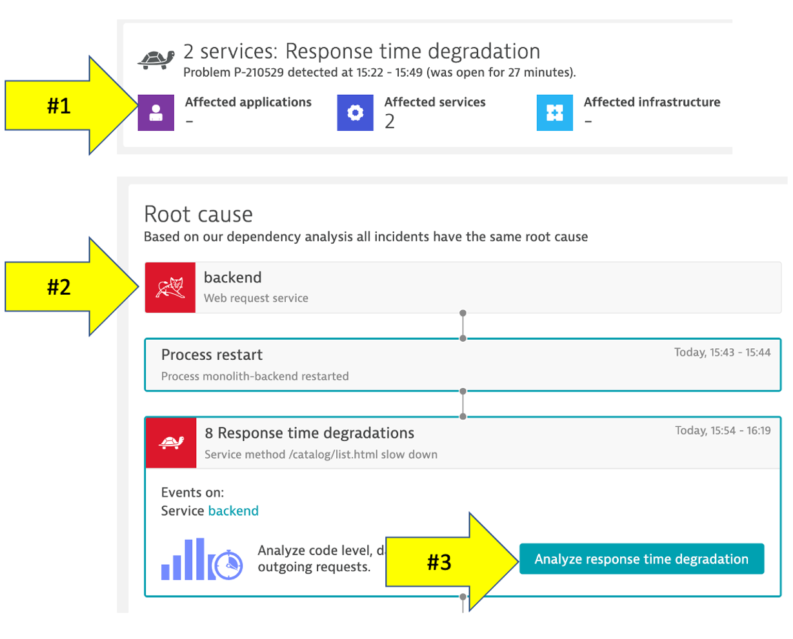

summary: This section covers the hands-on for Lab 3
id: aws-workshop-lab3
categories: dt
tags: aws-workshop
status: Published 
authors: Rob Jahn
Feedback Link: mailto:alliances@dynatrace.com
Analytics Account: UA-175467274-1

# Modernize cloud workloads #3 - Operate better

In order to do more with less and scale, organizations must transcend IT silos, foster collaboration and improve productivity. Automation and a common data model are key components of this, but it takes platforms that support operational teams and workflows.

Objectives of this Lab

🔷 Examine Dynatrace Service Level Objectives (SLOs)

🔷 Create a custom dashboard with SLOs

<!-- -->
## Service Level Objectives

Positive
: **Definition**: the level that you expect a service to achieve most of the time and against which an SLI is measured.

Example: ***"Service responses shall be faster than 400 milliseconds (ms) for 95% of all valid requests measured over 14 days."***

Dynatrace provides all the necessary real-time information that your Site-Reliability Engineering (SRE) teams need to monitor their defined objectives.

An SRE team is responsible for finding good service-level indicators (SLIs) for a given service in order to closely monitor the reliable delivery of that service. This is important when running workloads on a highly distributed and hyper-scale infrastructure like AWS.

Even more important is then to align development and operations teams around a single agreed-to objective. This helps to reduce the natural tension that exists between their objectives — creating and iterating products (development) and maintaining system integrity (operations).

In short, a well-defined SLO can help teams make data-driven operational decisions that increase development velocity without sacrificing stability.

SLIs can differ from one service to the other, as not all services are equally critical in terms of time and error constraints. Dynatrace offers more than 2000 different metrics that are ready for use as dedicated SLIs.

And using the available metrics, each SLO definition can be evaluated by following two result metrics:

* **SLO status:** The current evaluation result of the SLO, expressed as a percentage. The semantics of this percentage (for example, 99.3% of all service requests are successful, or 99.99% of all website users are “satisfied” in terms of Apdex rating) and the target defined for this percentage are up to the SRE team.

* **SLO error budget:** The remaining buffer until the defined SLO target is considered as failed. For example, if an SLO defines a 95% target and its current SLO status is evaluated as 98%, the remaining error budget is the difference between the SLO status and the SLO target.
Two SLOs were created for you, so review those.

Here is an example custom dashboard with SLO dashboard tiles.


### Review your environment

From the left menu in Dynatrace, click the `SLO` option to review the two SLOs that are already setup.  Edit one of them to review the configuration.


### 👍 How this helps

You can review the current health status, error budgets, target and warning, along with the timeframe of all your SLOs on the SLOs overview page.

Davis provides quick notifications on anomalies detected, along with actionable root causes. If your SLO has turned red, this is most likely because Davis has already raised a problem for the underlying metrics, showing you the root cause.

<!-- -->
## Create a SRE inspired dashboard

### Select pre-created Dashboard

1. From the left side menu in Dynatrace, pick the **dashboard** menu.
2. On the dashboard page, select the **Cloud Migration Success** dashboard.


### Edit Dashboard

Now you need to edit the dashboard and adjust the tiles with the SLOs and databases in your environment.

On the top right of the page, click the **edit** button and then follow these steps:

### Edit Dynamic requests tile

1. Click on the title of the Dynamic requests tile to open the Service properties window on the right side 
2. On the Service properties window, pick the monolith **frontend (monolith-frontend)** service
3. Click the **Done** button


### Edit remaining tiles

1. Repeat the same steps above for the Cloud services tile, but pick the **frontend (dev-frontend)** in the Service properties window
2. Repeat for the two SLO tiles, but pick the associated SLO from the drop down list in the SLO properties window
3. Repeat for the two database tiles. For Cloud services application there are 3 databases, so just pick one of the database of a demo.
4. Click the **Done** button to save the dashboard

<!-- -->
## Oops, I did it again!

As part of day to day mainteance, you are tasked to deploy a patch for the monolith application.

From the AWS CLoudShell, run these commands to set the backend service to version 2

```bash
cd ~/aws-modernization-dt-orders-setup/learner-scripts/
./set-version.sh backend 2
```

Review the output to ensure the change was made successfully. It should look like this with numerical values at the end for Response Data: **storedEventIds:**

```bash
    Retrieving dt-orders-monolith Public IP
    =================================================================
    Setting Service Version
    SERVICE         = backend
    NEW_VERSION     = 2
    SET_VERSION_URL = http://1.1.1.1/backend/setversion/2
    =================================================================
    Set backend to 2 was successful
    =================================================================
    Sending Dynatrace Deployment event
    DT_API_URL                 = https://xxx.live.dynatrace.com/api/v1/events
    DEPLOYMENT_NAME            = Set backend to version 2
    DEPLOYMENT_VERSION         = 2
    DEPLOYMENT_PROJECT         = dt-orders
    CI_BACK_LINK               = http://1.1.1.1
    =================================================================
    Push Event POST_DATA
    { "eventType" : "CUSTOM_DEPLOYMENT", "source" : "Custom Unix Shell Script" , "deploymentName" : "Set backend to version 2", "deploymentVersion" : "2" , "deploymentProject" :"dt-orders" , "ciBackLink" : "http://1.1.1.1", "customProperties": { "Example Custom Property 1" : "Example Custom Value 1", "Example Custom Property 2" : "Example Custom Value 2", "Example Custom Property 3" : "Example Custom Value 3" }, "attachRules" : { "tagRule" : [ { "meTypes":["PROCESS_GROUP_INSTANCE"], "tags": [ { "context": "CONTEXTLESS", "key": "service", "value": "backend" }, { "context": "CONTEXTLESS", "key": "project", "value": "dt-orders" }, { "context": "CONTEXTLESS", "key": "stage", "value": "production" } ]} ]} } }

    Response Data
    {"storedEventIds":[8663164135574257870,-5988376401319068441],"storedIds":["8663164135574257870_1628095127627","-5988376401319068441_1628095127627"],"storedCorrelationIds":[]}
```

### View app in browser
----------------------

The event has the URL back to the sample application, so just click that if you don't have the sample app up already. You should see `version 2` for the customer app now too.


<!-- -->
## DAVIS AI

Let DAVIS tell you what broke. The problem may take a minute to show up, but this is what the problem will look like once it does. Also, you may see two problems that eventually get merged into one as Dynatrace is performing the problem analysis.

1.  Impact Summary - Multiple services affected
2.  Root cause



### Analyze problem - top findings
---------------------------------

Click on the **Analyze Response Time Degradation** button to view the real issue with the request. To open the top findings page.

Here you can see how Dynatrace automatically analyzes the problem and lets you know whether the problem is related to code, waiting, or other services and queues.

Click in the **active wait time** line with the top findings to open the execution time breakdown detail.


### Analyze problem - execution time breakdown
---------------------------------------------

Dynatrace automatically show the breakdown of the execution time. To see more, click the **View method hotspots** button.


### Analyze problem - hot spots
------------------------------

Here the code call breakdown is shown and by expanding this tree, you can locate the method where the slow down is occurring.

**NOTE: You will need to expand several stack frames to get to method causing the slow down.**


### Analyze problem impact
-------------------------

From the breadcrumb menu, click on the **backend** to open the service page.


Then click on the response time box to open the service details page. You can see exactly when the problem started.


<!-- -->
## Recover the service
------------------------------

You'll need to recover the service first before more people get impacted. Run these commands to set the backend to version 1.

```bash
cd ~/aws-modernization-dt-orders-setup/learner-scripts/
./set-version.sh backend 1
```

<!-- -->
## Summary

In this section, you should have completed the following:

✅ Examine Dynatrace Service Level Objectives (SLOs)

✅ Create a custom dashboard with SLOs 

✅ Learn how DAVIS helps you operater better via AI-assisted Operations