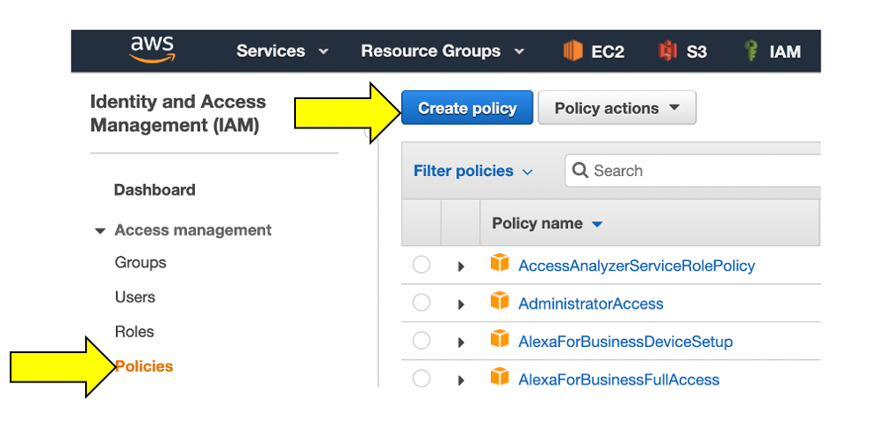
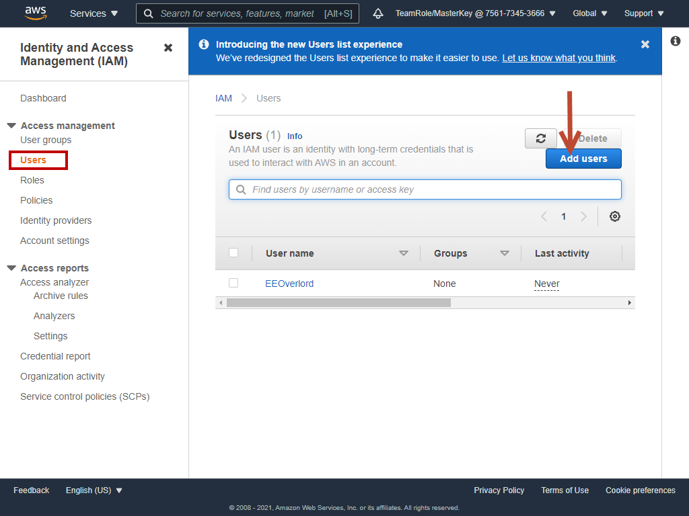
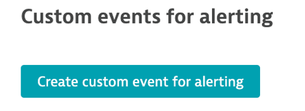

summary: This section covers the hands-on for Lab 4
id: aws-workshop-lab4
categories: automate-operations, aws
tags: aws-workshop
status: Published 
authors: Rob Jahn
Feedback Link: mailto:alliances@dynatrace.com
Analytics Account: UA-175467274-1

# 4. Supercharge AWS Cloud operations

## Objectives of this Lab

For intelligent monitoring of services running in Amazon cloud, you can integrate Dynatrace with Amazon Web Services (AWS). AWS integration helps you stay on top of the dynamics of your data center in the cloud.

🔷 Review how Dynatrace integrates with <a href="https://aws.amazon.com/cloudwatch/" target="_blank">AWS CloudWatch</a>

🔷 Review how <a href="https://www.dynatrace.com/support/help/how-to-use-dynatrace/problem-detection-and-analysis/problem-detection/metric-events-for-alerting/" target="_blank">Metric events for alerts</a>

<!-- -->
## AWS Dashboard

In addition to monitoring your AWS workloads using OneAgent, Dynatrace provides integration with AWS CloudWatch which adds infrastructure monitoring to gain insight even into serverless application scenarios.

### 👍 How this helps
----------------

Dynatrace brings value by enriching the data from AWS CloudWatch extending observability into the platform with additional metrics for cloud infrastructure, load balancers, API Management Services, and more.

These metrics are managed by Dynatrace's AI engine automatically and this extended observability improves operations, reduces MTTR and increases innovation.

Here is an example from another environment.


### Preset dashboards
-----------------

As AWS services are enabled, Dynatrace will enable preset dashboards automatically. These can be cloned and customized or hidden as required.

Here is one example:


To see more dashboards, navigate to this repository:

<a href="https://github.com/Dynatrace/snippets/tree/master/product/dashboarding/aws-supporting-services" target="_blank">https://github.com/Dynatrace/snippets/tree/master/product/dashboarding/aws-supporting-services</a>

<!-- -->
## AWS Integration setup

Positive
: Reference documentation [Set up Dynatrace on Amazon Web Services](https://www.dynatrace.com/support/help/shortlink/aws-hub#integrations)

There are several ways one can configure the Dynatrace AWS monitor, for this workshop we will use a quick solution using AWS **Key based** access following these basic steps:
1. Create AWS IAM policy for monitoring
2. Create AWS User
3. Complete the Dynatrace Connection setup by adding the AWS account

### Step 1 of 3: Create AWS IAM policy for monitoring
-------------------------------------------------

1. Go to **Identity and Access Management (IAM)** in your Amazon Console.
2. Go to **Policies** and click the **Create policy** button.

3. Select the JSON tab, and paste this predefined policy from the box below.


```
    {
        "Version": "2012-10-17",
        "Statement": [
            {
                "Sid": "VisualEditor0",
                "Effect": "Allow",
                "Action": [
                    "acm-pca:ListCertificateAuthorities", 
                    "apigateway:GET", 
                    "apprunner:ListServices", 
                    "appstream:DescribeFleets", 
                    "appsync:ListGraphqlApis", 
                    "athena:ListWorkGroups", 
                    "autoscaling:DescribeAutoScalingGroups", 
                    "cloudformation:ListStackResources", 
                    "cloudfront:ListDistributions", 
                    "cloudhsm:DescribeClusters", 
                    "cloudsearch:DescribeDomains", 
                    "cloudwatch:GetMetricData", 
                    "cloudwatch:GetMetricStatistics", 
                    "cloudwatch:ListMetrics", 
                    "codebuild:ListProjects", 
                    "datasync:ListTasks", 
                    "dax:DescribeClusters", 
                    "directconnect:DescribeConnections", 
                    "dms:DescribeReplicationInstances", 
                    "dynamodb:ListTables", 
                    "dynamodb:ListTagsOfResource", 
                    "ec2:DescribeAvailabilityZones", 
                    "ec2:DescribeInstances", 
                    "ec2:DescribeNatGateways", 
                    "ec2:DescribeSpotFleetRequests", 
                    "ec2:DescribeTransitGateways", 
                    "ec2:DescribeVolumes", 
                    "ec2:DescribeVpnConnections", 
                    "ecs:ListClusters", 
                    "eks:ListClusters", 
                    "elasticache:DescribeCacheClusters", 
                    "elasticbeanstalk:DescribeEnvironmentResources", 
                    "elasticbeanstalk:DescribeEnvironments", 
                    "elasticfilesystem:DescribeFileSystems", 
                    "elasticloadbalancing:DescribeInstanceHealth", 
                    "elasticloadbalancing:DescribeListeners", 
                    "elasticloadbalancing:DescribeLoadBalancers", 
                    "elasticloadbalancing:DescribeRules", 
                    "elasticloadbalancing:DescribeTags", 
                    "elasticloadbalancing:DescribeTargetHealth", 
                    "elasticmapreduce:ListClusters", 
                    "elastictranscoder:ListPipelines", 
                    "es:ListDomainNames", 
                    "events:ListEventBuses", 
                    "firehose:ListDeliveryStreams", 
                    "fsx:DescribeFileSystems", 
                    "gamelift:ListFleets", 
                    "glue:GetJobs", 
                    "inspector:ListAssessmentTemplates", 
                    "kafka:ListClusters", 
                    "kinesis:ListStreams", 
                    "kinesisanalytics:ListApplications", 
                    "kinesisvideo:ListStreams", 
                    "lambda:ListFunctions", 
                    "lambda:ListTags", 
                    "lex:GetBots", 
                    "logs:DescribeLogGroups", 
                    "mediaconnect:ListFlows", 
                    "mediaconvert:DescribeEndpoints", 
                    "mediapackage-vod:ListPackagingConfigurations", 
                    "mediapackage:ListChannels", 
                    "mediatailor:ListPlaybackConfigurations", 
                    "opsworks:DescribeStacks", 
                    "qldb:ListLedgers", 
                    "rds:DescribeDBClusters", 
                    "rds:DescribeDBInstances", 
                    "rds:DescribeEvents", 
                    "rds:ListTagsForResource", 
                    "redshift:DescribeClusters", 
                    "robomaker:ListSimulationJobs", 
                    "route53:ListHostedZones", 
                    "route53resolver:ListResolverEndpoints", 
                    "s3:ListAllMyBuckets", 
                    "sagemaker:ListEndpoints", 
                    "sns:ListTopics", 
                    "sqs:ListQueues", 
                    "storagegateway:ListGateways", 
                    "sts:GetCallerIdentity", 
                    "swf:ListDomains", 
                    "tag:GetResources", 
                    "tag:GetTagKeys", 
                    "transfer:ListServers", 
                    "workmail:ListOrganizations", 
                    "workspaces:DescribeWorkspaces"
                ],
                "Resource": "*"
            }
        ]
    }
```
4. You can skip over the **Add tags** page
5. One the **Review policy** page, use the policy name of **dynatrace_monitoring_policy**

6. Click **Create policy** button.

### Step 2 of 3: Create AWS User
----------------------------------------------------------------

1. Go to **Identity and Access Management (IAM)** in your Amazon Console.
2. Go to **Users** and click the **Add User** button.

3. Enter a name for the key you want to create (for example, **Dynatrace_monitoring_user**).
4. In Select AWS access type, select **Programmatic access**, and click **Next:Permissions**.

5. Click **Attach existing policies directly** and choose the monitoring policy you defined, for example **dynatrace_monitoring_policy**. Click **Next: Review**.

6. Review the user details and click **Create user**.
7. Store the **Access Key ID name (AKID)** and **Secret access key values**. You can either download the user credentials or copy the credentials displayed online (click Show).

TODO: Insert screen shot

### Step 3 of 3: Complete the Dynatrace Connection setup by adding the AWS account
------------------------------------------------------------------------------

1. In the Dynatrace menu, go to **Settings** > **Cloud and virtualization** > **AWS** and click **Connect new instance**.
2. Select **Key-based authentication** method.
   - Create a name for this connection. This is mandatory. Dynatrace needs this name to identify and display the connection.
   - In the Access key ID field, paste the identifier of the key you created in Amazon for Dynatrace access.
   - In the Secret access key field, paste the value of the key you created in Amazon for Dynatrace access.
3. Click Connect to verify and save the connection.

Once the connection is successfully verified and saved, your AWS account will be listed in the Cloud and virtualization settings page. You should soon begin to see AWS cloud monitoring data.


<!-- -->
## Custom Alerting

Dynatrace Davis automatically analyzes abnormal situations within your IT infrastructure and attempts to identify any relevant impact and root cause. Davis relies on a wide spectrum of information sources, such as a transactional view of your services and applications, as well as all on events raised on individual nodes within your Smartscape topology.

There are two main sources for single events in Dynatrace:
- Metric-based events (events that are triggered by a series of measurements)
- Events that are independent of any metric (for example, process crashes, deployment changes, and VM motion events)

Custom metric events are configured in the global settings of your environment and are visible to all Dynatrace users in your environment.

### 1. Setup Custom metric alerting for AWS
---------------------------------------

1. To add custom alerts, navigate to **Settings --> Anomaly Detection --> Custom Events for Alerting** menu.
2. Click the **Create custom event for alerting** button.

3. In the **Metric** dropdown list, type **EC2 CPU usage %** and pick the **Cloud platforms > AWS > EC2 > CPU > usage** option and Pick **Average**

4. Click **Add rule-base** button and update as shown below

5. Choose **Static threshold** and update as shown below

6. Add the **Event Description** to have the **title** and **severity = CUSTOM ALERT** as shown below.

7. Notice the **Alert preview** chart that helps you in reviewing these settings

8. Save your changes

### 2. SSH to monolith host
-----------------------

To connect to the host, simply use **EC2 Instance Connect**. To this, navigate to the **EC2 instances** page in the AWS console.

From the list, pick the **dt-orders-monolith** and then the **connect** button.


Then on the next page, choose the **EC2 Instance Connect** option and then the **connect** button.


Once you connected, you will see the terminal prompt like the below.

```bash
Welcome to Ubuntu 20.04.2 LTS (GNU/Linux 5.4.0-1045-aws x86_64)
...
...
To run a command as administrator (user "root"), use "sudo <command>".
See "man sudo_root" for details.
ubuntu@ip-10-0-0-118:~$ 
```

### 3. Trigger a CPU problem
------------------------

In the shell, copy all these lines and run them:

```bash
yes > /dev/null &
yes > /dev/null &
yes > /dev/null &
```

To verify, run this command:

```bash
ps -ef | grep yes
```

The output should look like this:

```bash
ubuntu    5802  5438 99 20:48 pts/0    00:00:05 yes
ubuntu    5805  5438 89 20:48 pts/0    00:00:04 yes
ubuntu    5806  5438 97 20:48 pts/0    00:00:03 yes
ubuntu    5818  5438  0 20:48 pts/0    00:00:00 grep --color=auto yes
```

It will take a few mins for the problem card to appear. In the meantime, move on to the next section **Explore the AWS dashboard**.

<!-- -->
## Explore the AWS dashboard

On the far left Dynatrace menu, navigate to the **Infrastructure -> AWS** menu.


You may see no data initially as seen here. This is because Dynatrace makes Amazon API requests every 5 minutes, so it might take a few minutes for data to show until we are done with application setup on AWS.


Once data is coming in, the dashboard pages will look similar to what is shown below.


### Review collected metrics
------------------------

Once data starts to be collected, click in the blue availability zone section located under the grey header labeled EC2 and you should see the list of availability zones below. Click on any one and the EC2 instances will be listed.


Click on an EC2 instance, and you will see how this host still is represented in the same Host view that we saw earlier with the host running the OneAgent. The basic CPU and memory metrics from CloudWatch are graphed for you. What is GREAT, is that this host is being monitored automatically by the Dynatrace AI engine and can raise a problem when there are anomalies.


### 👍 How this helps
----------------

The AWS monitor is a central way to get a picture and metrics for the AWS resources running against your accounts as you migrate.

Read more about how to scale your enterprise cloud environment with enhanced AI-powered observability of all AWS services in <a href="https://www.dynatrace.com/news/blog/monitor-any-aws-service/" target="_blank">this Dynatrace blog</a>


<!-- -->
## AWS resources alert!
Back in Dynatrace within the **host** view, the CPU should now be high as shown below


A problem card will be generated once the static threshold has been breahed.


### Stop the CPU problem
-----------------------

To stop the problem, you need to **kill** the processes. To do this:

1\. Back in the CloudShell, run this command to get the process IDs

```bash
ps -ef | grep yes
```

2\. For each process, copy the process ID and run **kill <PID>**, for example:

```bash
ubuntu@ip-10-0-0-118:~$ ps -ef | grep yes
ubuntu    5802  5438 99 20:48 pts/0    00:00:05 yes
ubuntu    5805  5438 89 20:48 pts/0    00:00:04 yes
ubuntu    5806  5438 97 20:48 pts/0    00:00:03 yes
ubuntu@ip-10-0-0-118:~$ kill 5802
ubuntu@ip-10-0-0-118:~$ kill 5805
ubuntu@ip-10-0-0-118:~$ kill 5806
```

3\. Verify they are gone by running this again

```bash
ps -ef | grep yes
```

4\. Verify that CPU in Dynatrace goes to normal and the problems will eventually automatically close

<!-- -->
## Summary

In this section, you should have completed the following:

✅ Review how Dynatrace integrates with <a href="https://aws.amazon.com/cloudwatch/" target="_blank">AWS CloudWatch</a>

✅ Review how <a href="https://aws.amazon.com/cloudwatch/" target="_blank">AWS CloudWatch</a> metrics can be configured as <a href="https://www.dynatrace.com/support/help/how-to-use-dynatrace/problem-detection-and-analysis/problem-detection/metric-events-for-alerting/" target="_blank">Metric events for alerts</a>