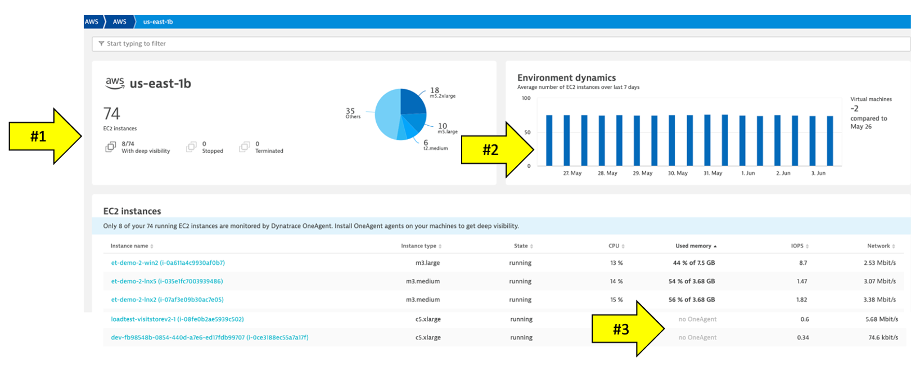
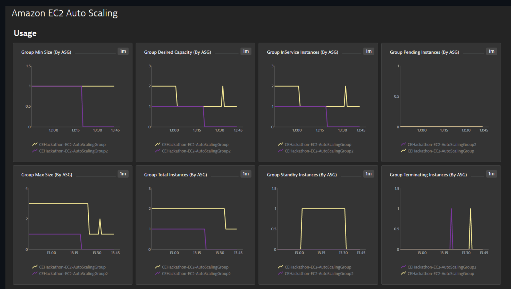
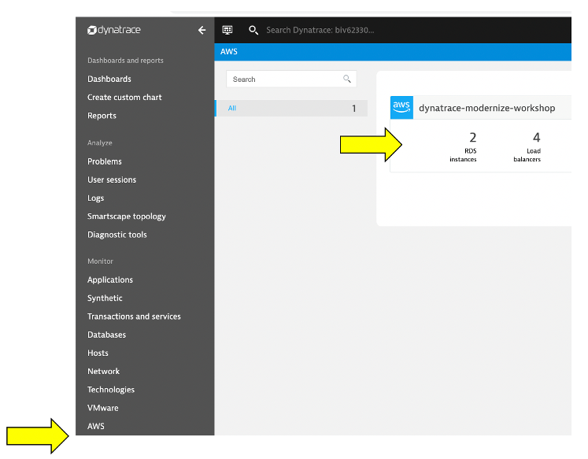
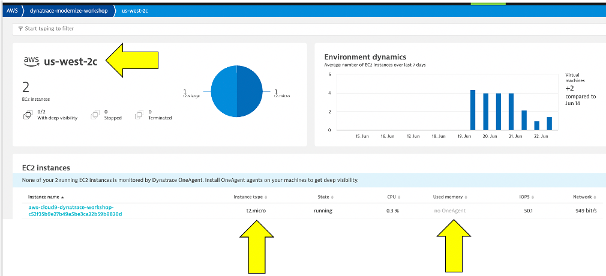
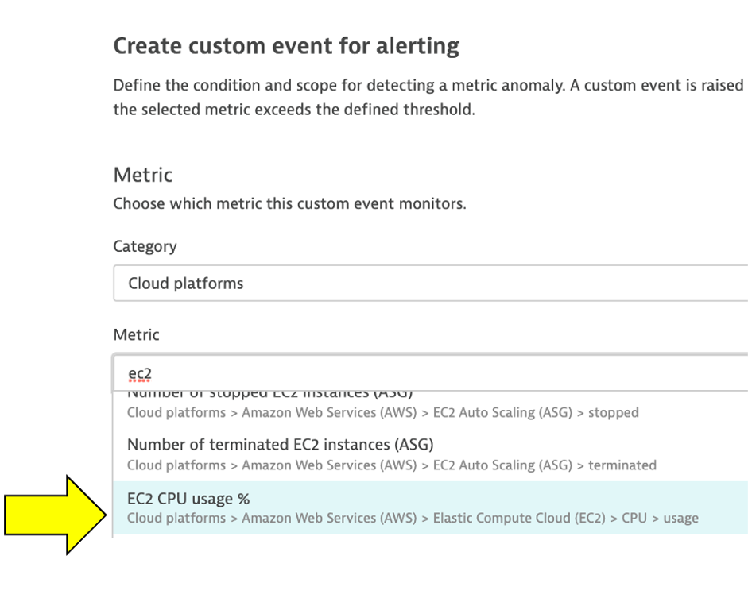
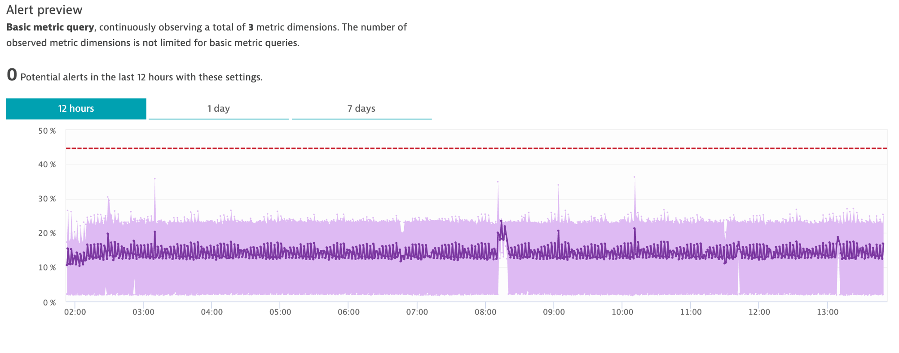

summary: This section covers the hands-on for Lab 5
id: aws-workshop-lab5
categories: aws, automate-operations
tags: aws-workshop
status: Published 
authors: Rob Jahn
Feedback Link: mailto:alliances@dynatrace.com
Analytics Account: UA-175467274-1

# Lab 5 - AWS Monitor

## Lab 5 - AWS Monitor

For intelligent monitoring of services running in Amazon cloud, you can integrate Dynatrace with Amazon Web Services (AWS). AWS integration helps you stay on top of the dynamics of your data center in the cloud.

### Objectives of this Lab

🔷 Review how Dynatrace integrates with <a href="https://aws.amazon.com/cloudwatch/" target="_blank">AWS CloudWatch</a>

🔷 Review how <a href="https://www.dynatrace.com/support/help/how-to-use-dynatrace/problem-detection-and-analysis/problem-detection/metric-events-for-alerting/" target="_blank">Metric events for alerts</a>

## AWS Dashboard
-------------

In addition to monitoring your AWS workloads using OneAgent, Dynatrace
provides integration with AWS CloudWatch which adds infrastructure
monitoring to gain insight even into serverless application scenarios.

### 👍 How this helps
----------------

Dynatrace brings value by enriching the data from AWS CloudWatch
extending observability into the platform with additional metrics for
cloud infrastructure, load balancers, API Management Services, and more.

These metrics are managed by Dynatrace's AI engine automatically and
this extended observability improves operations, reduces MTTR and
increases innovation.

Here is an example from another environment.

### Hosts regional page

Notice the following details: 1. A summary of type and status is shown
1. A running average for virtual machines 1. A table of host with AWS
monitor metrics summarized. Notice that both hosts with and without an
OneAgent are both shown

### EC2 example

Here is an example of a host with no OneAgent.

Notice the following details: 1. Expand the properties to see more
details 1. All the AWS CloudWatch metrics are viewable as time-series
data

### Lambda example

Here is a list of the Lambda functions. Notice tags and time-series
data.

### Preset dashboards
-----------------

As AWS services are enabled, Dynatrace will enable preset dashboards
automatically. These can be cloned and customized or hidden as required.
Here is one example:

To see more dashboards, navigate to this repository: \*
<a href="https://github.com/Dynatrace/snippets/tree/master/product/dashboarding/aws-supporting-services" target="_blank">https://github.com/Dynatrace/snippets/tree/master/product/dashboarding/aws-supporting-services</a>

## Lab 5 Setup
-----------

There are several ways one can configure the Dynatrace AWS monitor, but
for this workshop we will use a quick solution using AWS Role based
access following these basic steps:

1.  Create AWS IAM policy for monitoring
2.  Start the creation of a new AWS role for monitoring
3.  Start the creation of a Dynatrace AWS connection and generate
    connection token
4.  Complete AWS policy role setup by adding the Dynatrace token and
    attaching AWS policy
5.  Complete the Dynatrace Connection setup by adding the AWS account

### Step 1 of 5: Create AWS IAM policy for monitoring
-------------------------------------------------

The AWS monitoring policy defines the minimum scope of permissions you
need to give to Dynatrace to monitor the services running in your AWS
account. Create it once and use anytime when enabling Dynatrace access
to your AWS account.

1. Go to `Identity and Access Management (IAM)` in your Amazon Console.

2. Go to `Policies` and click the `Create policy` button.

3. Select the JSON tab, and paste this predefined policy from the box
below.

    {
        "Version": "2012-10-17",
        "Statement": [
            {
                "Sid": "VisualEditor0",
                "Effect": "Allow",
                "Action": [
                    "acm-pca:ListCertificateAuthorities", 
                    "apigateway:GET", 
                    "apprunner:ListServices", 
                    "appstream:DescribeFleets", 
                    "appsync:ListGraphqlApis", 
                    "athena:ListWorkGroups", 
                    "autoscaling:DescribeAutoScalingGroups", 
                    "cloudformation:ListStackResources", 
                    "cloudfront:ListDistributions", 
                    "cloudhsm:DescribeClusters", 
                    "cloudsearch:DescribeDomains", 
                    "cloudwatch:GetMetricData", 
                    "cloudwatch:GetMetricStatistics", 
                    "cloudwatch:ListMetrics", 
                    "codebuild:ListProjects", 
                    "datasync:ListTasks", 
                    "dax:DescribeClusters", 
                    "directconnect:DescribeConnections", 
                    "dms:DescribeReplicationInstances", 
                    "dynamodb:ListTables", 
                    "dynamodb:ListTagsOfResource", 
                    "ec2:DescribeAvailabilityZones", 
                    "ec2:DescribeInstances", 
                    "ec2:DescribeNatGateways", 
                    "ec2:DescribeSpotFleetRequests", 
                    "ec2:DescribeTransitGateways", 
                    "ec2:DescribeVolumes", 
                    "ec2:DescribeVpnConnections", 
                    "ecs:ListClusters", 
                    "eks:ListClusters", 
                    "elasticache:DescribeCacheClusters", 
                    "elasticbeanstalk:DescribeEnvironmentResources", 
                    "elasticbeanstalk:DescribeEnvironments", 
                    "elasticfilesystem:DescribeFileSystems", 
                    "elasticloadbalancing:DescribeInstanceHealth", 
                    "elasticloadbalancing:DescribeListeners", 
                    "elasticloadbalancing:DescribeLoadBalancers", 
                    "elasticloadbalancing:DescribeRules", 
                    "elasticloadbalancing:DescribeTags", 
                    "elasticloadbalancing:DescribeTargetHealth", 
                    "elasticmapreduce:ListClusters", 
                    "elastictranscoder:ListPipelines", 
                    "es:ListDomainNames", 
                    "events:ListEventBuses", 
                    "firehose:ListDeliveryStreams", 
                    "fsx:DescribeFileSystems", 
                    "gamelift:ListFleets", 
                    "glue:GetJobs", 
                    "inspector:ListAssessmentTemplates", 
                    "kafka:ListClusters", 
                    "kinesis:ListStreams", 
                    "kinesisanalytics:ListApplications", 
                    "kinesisvideo:ListStreams", 
                    "lambda:ListFunctions", 
                    "lambda:ListTags", 
                    "lex:GetBots", 
                    "logs:DescribeLogGroups", 
                    "mediaconnect:ListFlows", 
                    "mediaconvert:DescribeEndpoints", 
                    "mediapackage-vod:ListPackagingConfigurations", 
                    "mediapackage:ListChannels", 
                    "mediatailor:ListPlaybackConfigurations", 
                    "opsworks:DescribeStacks", 
                    "qldb:ListLedgers", 
                    "rds:DescribeDBClusters", 
                    "rds:DescribeDBInstances", 
                    "rds:DescribeEvents", 
                    "rds:ListTagsForResource", 
                    "redshift:DescribeClusters", 
                    "robomaker:ListSimulationJobs", 
                    "route53:ListHostedZones", 
                    "route53resolver:ListResolverEndpoints", 
                    "s3:ListAllMyBuckets", 
                    "sagemaker:ListEndpoints", 
                    "sns:ListTopics", 
                    "sqs:ListQueues", 
                    "storagegateway:ListGateways", 
                    "sts:GetCallerIdentity", 
                    "swf:ListDomains", 
                    "tag:GetResources", 
                    "tag:GetTagKeys", 
                    "transfer:ListServers", 
                    "workmail:ListOrganizations", 
                    "workspaces:DescribeWorkspaces"
                ],
                "Resource": "*"
            }
        ]
    }

4. You can skip over the `Add tags` page

5. One the `Review policy` page, use the policy name of
`dynatrace_monitoring_policy`

6. Click `Create policy` button.

### Step 2 of 5: Start the creation of a new AWS role for monitoring
----------------------------------------------------------------

To give Dynatrace SaaS the role-based monitoring access to your AWS
account, you need to create a dedicated monitoring role for Dynatrace in
your AWS account. Dynatrace will use this role to authenticate in your
AWS environment with the scope of permissions as defined by the
monitoring policy.

1. Go to `Identity and Access Management (IAM)` in your Amazon Console.

2. Go to `Roles` and click the `create role` button.

3. Paste `509560245411` into the `Account ID` field

4. Select the `Another AWS account` tile as to establish trust with the
Dynatrace account.

5. Select the `Require external ID` checkbox

6. Keep this page open and move to next section

Positive
: *The AWS Account ID for Dynatrace SaaS
(e.g. https://YOUR\_TENANT.live.dynatrace.com/) is `509560245411`. This
AWS Account ID is the account that the role within the AWS account you
are using for the workshop will use. If you were using your own
Dynatrace managed cluster, this AWS Account ID value would be
different.*

### Step 3 of 5: Start the creation of a Dynatrace AWS connection and generate connection token
-------------------------------------------------------------------------------------------

In you don't have it already, open another browser tab and sign in to
Dynatrace

1 . Once logged in, go to `Settings -> Cloud and virtualization -> AWS`

2 . Click `Connect new instance` button

3 . Enter the name for this connection as `dynatrace-modernize-workshop`

4 . Select Role based authentication method.

5 . click the `Generate token` button

6 . Leave IAM role and AWS Account blank for now and click the `Copy`
button next to the generated token.

Keep this browser window open. We will come back to it shortly to copy
the Token and test the connection.

Positive
: The Token generated on the Dynatrace AWS connection page is used in the
`external ID` field for the AWS role to add another level of security so
that the AWS role can only access the data for your specific Dynatrace
tenant and Dynatrace connection.

### Step 4 of 5: Complete AWS policy role setup by adding the Dynatrace token and attaching AWS policy
--------------------------------------------------------------------------------------------------

Now back in the AWS console tab `Create Role` page you already have
open, enter these values:

Paste the `Token` value that you just copied from your Dynatrace AWS
connection page to the `External ID` field

Your page should look like this:

7. Now click the `Next: Permissions` button on the bottom

8. On the `Attach permissions` policies page, choose the monitoring
policy you created earlier. Search for: `dynatrace_monitoring_policy`.
Choose then checkbox next to it and then click the Next: Review button.

9. Now click the `Next: Tags` button on the bottom

10. On the `Add Tags` page, leave the defaults and click the
`Next: Review` button on the bottom

11. On the `Review page`, provide the role name of:
`dynatrace_monitoring_role`.

The role name, trusted entities and policy should have values as shown
here.

9. Click the `Create Role` button.

### Step 5 of 5: Complete the Dynatrace Connection setup by adding the AWS account
------------------------------------------------------------------------------

Now that we have the AWS role, it's time to connect Dynatrace to your
Amazon AWS account using that role.

1. Go back on the Dynatrace connection page you still have open

2. In the Role field, use the name of the role you created easier:
`dynatrace_monitoring_role`

4. The `Account ID` is the AWS account you want us to pull metrics
from. To get your Account ID, go to your AWS Cloudshell and type in this
command and copy the `Account` value from the JSON output as shown here.

    aws sts get-caller-identity

The output will look like and the `Account = 999111222333`

    {
        "UserId": "AKDA4GOORJDPOW3CNKDSKD7:tom.jones@mycompany.com",
        "Account": "999111222333",
        "Arn": "arn:aws:sts::838488672964:assumed-role/dtRoleAccountAdmin/tom.jones@mycompany.com"
    }

4. Your `Connection page` should now look like this:

5. Click the `Connect` button to verify and once verified, click the
`Save` button.

If successful, your should see the configuration now on the AWS
connections page:

## Review AWS monitor
------------------

On the far left Dynatrace menu, navigate to the `Infrastructure -> AWS`
menu.

You may see `no data` initially as seen here. This is because Dynatrace
makes Amazon API requests every 5 minutes, so it might take a few
minutes for data to show until we are done with application setup on
AWS.

Once data is coming in, the dashboard pages will look similar to what is
shown below.

### Review collected metrics
------------------------

Once data starts to be collected, click in the blue availability zone
section located under the grey header labeled EC2 and you should see the
list of availability zones below. Click on `us-west-2c` and the EC2
instances will be listed.

Click on an EC2 instance, and you will see how this host still is
represented in the same Host view that we saw earlier with the host
running the OneAgent. The basic CPU and memory metrics from CloudWatch
are graphed for you. What is GREAT, is that this host is being monitored
automatically by the Dynatrace AI engine and can raise a problem when
there are anomalies.

### 👍 How this helps
----------------

The AWS monitor is a central way to get a picture and metrics for the
AWS resources running against your accounts as you migrate.

Read more about how to scale your enterprise cloud environment with
enhanced AI-powered observability of all AWS services in
<a href="https://www.dynatrace.com/news/blog/monitor-any-aws-service/" target="_blank">this
Dynatrace blog</a>

Positive
: See the
<a href="https://www.dynatrace.com/support/help/technology-support/cloud-platforms/amazon-web-services/aws-monitoring-with-dynatrace-saas/" target="_blank">Dynatrace
Docs</a> for more details on the setup options.

## Custom Alerting
---------------

Dynatrace Davis automatically analyzes abnormal situations within your
IT infrastructure and attempts to identify any relevant impact and root
cause. Davis relies on a wide spectrum of information sources, such as a
transactional view of your services and applications, as well as all on
events raised on individual nodes within your Smartscape topology.

There are two main sources for single events in Dynatrace:

-   Metric-based events (events that are triggered by a series of
    measurements)
-   Events that are independent of any metric (for example, process
    crashes, deployment changes, and VM motion events)

Custom metric events are configured in the global settings of your
environment and are visible to all Dynatrace users in your environment.

### 1. Setup Custom metric alerting for AWS
---------------------------------------

1. To add custom alerts, navigate to
`Settings --> Anomaly Detection --> Custom Events for Alerting` menu.

2. Click the `Create custom event for alerting` button.

3. In the `Metric` dropdown list, type `EC2 CPU usage %` and pick the
`Cloud platforms > AWS > EC2 > CPU > usage` option and Pick `Average`

4. Click `Add rule-base` button and update as shown below

5. Choose `Static threshold` and update as shown below

6. Add the `Event Description` to have the `title` and
`severity = CUSTOM ALERT` as shown below.

Notice the `Alert preview` chart that helps you in reviewing these
settings

7. Save your changes

8. Add another rule, with everything the same, except for the
`Event Description` to have the `title` and `severity = RESOURCE` as
shown below.

9. Save your changes and the list should look as shown below.

### 2. SSH to monolith host
-----------------------

Run this command to get the command to SSH into the monolith host.

    cd ~/aws-modernization-dt-orders-setup/learner-scripts/
    ./show-app-urls.sh

From the output you should see a command like
`ssh -i "~/aws-modernization-dt-orders-setup/gen/<YOUR-LASTNAME>-dynatrace-modernize-workshop.pem" ubuntu@11.22.33.44`

Copy and paste that command to SSH to the monolith VM. You should see
output like this and b e presented another command prompt.

    Welcome to Ubuntu 18.04.4 LTS (GNU/Linux 4.15.0-1065-aws x86_64)
    ...
    ...
    To run a command as administrator (user "root"), use "sudo <command>".
    See "man sudo_root" for details.
    ubuntu@ip-10-0-0-118:~$ 

3. Trigger a CPU problem
------------------------

In the shell, copy all these lines and run them:

    yes > /dev/null &
    yes > /dev/null &
    yes > /dev/null &

To verify, run this command:

    ps -ef | grep yes

The output should look like this:

    ubuntu    5802  5438 99 20:48 pts/0    00:00:05 yes
    ubuntu    5805  5438 89 20:48 pts/0    00:00:04 yes
    ubuntu    5806  5438 97 20:48 pts/0    00:00:03 yes
    ubuntu    5818  5438  0 20:48 pts/0    00:00:00 grep --color=auto yes

3 . Back in Dynatrace within the `host` view, the CPU should now be high
as shown below

4 . It may take a minute or so, but you will get two problem cards as
shown below. \#1 is the alert from the `severity = RESOURCE` where Davis
was invoked, and \#2 is the alert from `severity = CUSTOM ALERT`.

### 4. Review Problem Notifications
-------------------------------

1 . Navigate to `Settings --> Integrations --> Problem Notifications`

2 . Read the overview and then click the `Add Notification` button

3 . Click various `Notification types` from the drop down to review the
configurations inputs.

4 . For the `Custom integration` type, review the option to customize
the payload.

5 . Notice how you can choose the `Alert profile`, but you only have
default

5. Review Alerting Profiles
---------------------------

1 . Navigate to `Settings --> Alerting --> Alerting profiles`

2 . Read the overview and then expand the `default` rule.

3 . Now add one, by clicking on the `Add alerting profile` button

4 . Review the options to choose severity rules and filters

### 6. Stop the CPU problem
-----------------------

To stop the problem, you need to `kill` the processes. To do this:

1 . Back in the CloudShell, run this command to get the process IDs
`ps -ef | grep yes`

2 . For each process, copy the process ID and run `kill <PID>`

For example:

    # If output is this...

    ubuntu@ip-10-0-0-118:~$ ps -ef | grep yes
    ubuntu    5802  5438 99 20:48 pts/0    00:00:05 yes
    ubuntu    5805  5438 89 20:48 pts/0    00:00:04 yes
    ubuntu    5806  5438 97 20:48 pts/0    00:00:03 yes

    # Then run...

    kill 5802
    kill 5805
    kill 5806

3 . Verify they are gone by running this again `ps -ef | grep yes`

4 . Verify that CPU in Dynatrace goes to normal and the problems will
eventually automatically close

### 7. Exit the SSH
---------------

Simply type `exit` to exit the VM and return the CloudShell.

Positive
: See the
    <a href="https://www.dynatrace.com/support/help/how-to-use-dynatrace/problem-detection-and-analysis/problem-detection/metric-events-for-alerting/" target="_blank">Dynatrace
    Docs</a> for more details on the setup.

Positive
: Alert configuration is available through the
    <a href="https://www.dynatrace.com/support/help/dynatrace-api/configuration-api/anomaly-detection-api/anomaly-detection-api-metric-events/" target="_blank">Anomaly
    detection---metric events API</a>. Using the API, you can list,
    update, create, and delete configurations.

### Summary
-------

In this section, you should have completed the following:

✅ Review how Dynatrace integrates with
<a href="https://aws.amazon.com/cloudwatch/" target="_blank">AWS
CloudWatch</a>

✅ Review how
<a href="https://aws.amazon.com/cloudwatch/" target="_blank">AWS
CloudWatch</a> metrics can be configured as
<a href="https://www.dynatrace.com/support/help/how-to-use-dynatrace/problem-detection-and-analysis/problem-detection/metric-events-for-alerting/" target="_blank">Metric
events for alerts</a>
