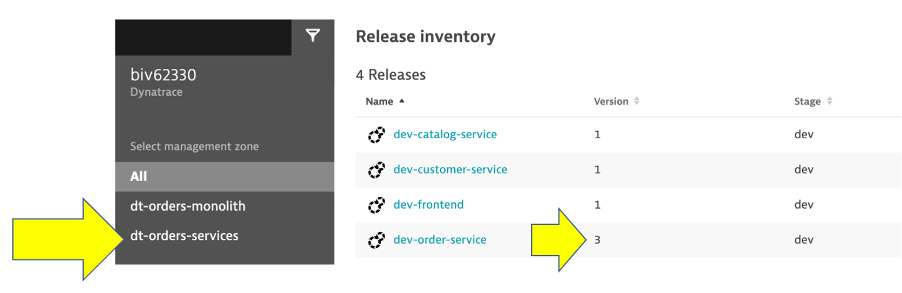

summary: This section covers the hands-on for Lab 5
id: aws-workshop-lab5
categories: aws, automate-delivery
tags: aws-workshop
status: Published 
authors: Rob Jahn
Feedback Link: mailto:alliances@dynatrace.com
Analytics Account: UA-175467274-1

## Speed up software delivery

A micro-services architecture provides the best environment for agile development, but also giving rise to a complex ecosystem of microservices.

There are more possibilities for failures and more hiding spots for problems to sneak into the environment when software driving more than just the application.

Often the monitoring tools organizations use simply don’t work for such complexity and scale as finding the root cause of problems is harder than ever before and the effort required goes beyond what is humanly possible when the application spans to the cloud providers and data centers and the explosion of interconnected services. 

### What if...

🔷 You can spot problems even before they reach production?

🔷 Release evaluations in your pipeline can be automated such that there are faster feedback loops?

🔷 You can then delivery more reliable software, much faster than before because of these automation?

An example is the following using **AWS Code Deploy**:

However, in this lab, we will not have time to build out the entire AWS Code Deploy.

Instead, we will manually trigger a deployment in a micro-service and see how troubleshooting time is significantly reduced by letting AI automatically detect problems and pinpoints the root cause, explaining business impact with no manual configurations.

In this way, you can see how DAVIS and Dynatrace helps to automate release validations and provide faster feedback loos

<!-- -->
## Order service problem
---------------------

Now we are going to set the **order** service version that will cause failures on the all requests.

To automate the version change, a unix script is provided that will do the following: \* Call the **order/setversion** URL set the order-service version \* Send a Dynatrace **CUSTOM_DEPLOYMENT** event indicating the change

After a minute or so, you should expect to see exceptions for all order related requests.

### 1. Enable the problem pattern
-----------------------------

Then from the `Services` host shell, run these commands to set the order
service to version 3.

    cd ~/aws-modernization-dt-orders-setup/learner-scripts/
    ./set-version.sh k8-order 3

Ensure there are numerical values at the end for Response Data:
`storedEventIds` like:

    Response Data
    {"storedEventIds":[8663164135574257870,-5988376401319068441],"storedIds":["8663164135574257870_1628095127627","-5988376401319068441_1628095127627"],"storedCorrelationIds":[]}

### 2. View change in Dynatrace
---------------------------

From the left side menu, navigate to the `Releases` page. Here you will
see the how Dynatrace detected the versions of monitored processes. It
may take a minute, but you will see the version change in the
`Real-time inventory` section and a new event in the `Release events`
section.

**NOTE** Be sure to adjust the management zone to `dt-orders-services`

If you expand the event, you should see something like this

### 3. View app in browser
----------------------

The event has the URL back to the sample application, so just click that
if you don't have the sample app up already. You should see `version 3`
for the order app now too.

### 4. Review problem in Dynatrace
------------------------------

The problem may take a minute to show up, but this is what the problem
will look like once it does. Also, you may see two problems that
eventually get merged into one as Dynatrace is performing the problem
analysis.

1.  Problem card windows and impact summary
2.  Root cause
3.  Deployment event as additional context

### 5. Analyze problem
------------------

Referring to \#4 in the picture above, click on the
`Analyze failure rate degradation` button.

Right away we can see that there were exceptions in the code and the
`details` button can be clicked to see the code stack trace.

### 6. Analyze problem impact
-------------------------

From the breadcrumb menu, click on the `order` to open the service page.

On this page, notice the failure rate.

Then click on the failure rate box to open the service details page. You
can see exactly when the problem started.

### 7. Disable the problem pattern
------------------------------

From the from the `Services` host shell, run these commands to set the
version back to version 1

    cd ~/aws-modernization-dt-orders-setup/learner-scripts/
    ./set-version.sh k8-order 1

Dynatrace will automatically close the problem once it detects things
are back to normal. 

## Summary

In this section, you should have completed the following:

✅ Enable a problem in the application and walk through what Davis found
