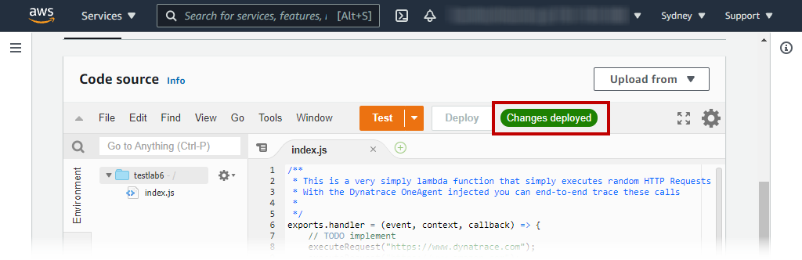

summary: The fun stuff that were not covered!
id: aws-workshop-lab6
categories: aws, logmon-2, dt
tags: aws-workshop
status: Published
authors: Myrvin Yap
Feedback Link: mailto:APAC-SE-Central@dynatrace.com
Analytics Account: UA-175467274-1

# 6. Bonus!

## Optional labs
These additional labs were not covered in the hands on. However, you are free to try them on your own. 

🔷 AWS Log forwarder

🔷 AWS Lambda code level instrumentation

<!-- -->
## Before you begin

Dynatrace leverages the Active Gate to ingest logs streamed from cloud providers. Follow the documentation [instructions]((https://www.dynatrace.com/support/help/setup-and-configuration/dynatrace-activegate/installation/linux/linux-install-an-environment-activegate/) to install the Active Gate software in any Linux/Windows OS based instance if you don't already have one.

In this lab, we have pre-installed an Active Gate in the **dt-orders-monolith** Ubuntu EC2 instace and by default, the Active Gate reads the IP address assigned to the vNIC, which is an internal AWS IP address. The Active Gate configuration files allow us to change it to use a public facing IP address.

### Setting up Active Gate

Extract the Public IP of the Active Gate
- As a metadata within **Host View** in Dynatrace, or
- execute this command

```bash
curl https://ifconfig.me;echo
```

Login to the command shell of your OS (assume Ubuntu bash shell here)

Edit the **custom.properties** file

```bash
sudo nano /var/lib/dynatrace/gateway/config/custom.properties
```

Add the following at the end of the file:

```bash
[connectivity]
dnsEntryPoint = https://PUBLIC_DOMAIN_NAME:9999
```

Remember to ***SAVE*** the config.properties file
Restart Active Gate with the command

```bash
sudo systemctl restart dynatracegateway
```

### Validate setting in Dynatrace

Open Dynatrace UI -> **Deployment status** -> **Active Gates**


<!-- -->
## AWS Log Forwarder

We will use the AWS Log Forwarder from [here](https://github.com/dynatrace-oss/dynatrace-aws-log-forwarder)


### Deploying the Infrastructure
We will need to setup the AWS Infrastructure setup via running a Cloudformation script.

Positive
: Full online doucmentation [AWS Log Forwarder](https://www.dynatrace.com/support/help/how-to-use-dynatrace/infrastructure-monitoring/cloud-platform-monitoring/amazon-web-services-monitoring/aws-log-forwarder/)

Open AWS CloudShell if it is already not started

Set the following environment variables in CloudShell. We recommend that you copy the text below to a text editor and amend the **Placeholder** values such as **PUBLIC_DOMAIN_NAME** and **Managed_Environment_ID** and **TOKEN_NAME**

```bash
TARGET_URL=https://<PUBLIC_DOMAIN_NAME>:9999/e/<Managed_Environment_ID>
TARGET_API_TOKEN=<your_API_token>
REQUIRE_VALID_CERTIFICATE=false
```

Download the script and deploy the infrastructure.

```bash
wget -O dynatrace-aws-log-forwarder.zip https://github.com/dynatrace-oss/dynatrace-aws-log-forwarder/releases/latest/download/dynatrace-aws-log-forwarder.zip \
 && unzip -qo dynatrace-aws-log-forwarder.zip \
 && ./dynatrace-aws-logs.sh deploy --target-url $TARGET_URL --target-api-token $TARGET_API_TOKEN --use-existing-active-gate true --require-valid-certificate $REQUIRE_VALID_CERTIFICATE
```


### Create a Lambda function to test log ingest
For the purpose of sending logs, we will create a new Lambda function.

1\. In the AWS portal, search for Lambda within the AWS Search Bar and go to **Lambda**

2\. Click on **Create Function**


3\. Use default option of **Author from scratch**

4\. Give a Function name **testlab6**

5\. We will create a nodejs function, leave everything else as default

6\. Click on **Create Function**


7\. Copy the following code and paste it in the **index.js** tab

```nodejs
/**
 * This is a very simply lambda function that simply executes random HTTP Requests to a randomly selected group of URLs
 * With the Dynatrace OneAgent injected you can end-to-end trace these calls
 * 
 */ 
exports.handler = (event, context, callback) => {
    // TODO implement
    executeRequest("https://www.dynatrace.com");
    executeRequest("https://www.amazon.com");
    executeRequest("https://www.google.com");
};

var executeRequest = function(url, callback) {
    var https = require("https");
    var fullUrl = require("url").parse(url);

    var request_options = {
      host: fullUrl.host,
      path: fullUrl.path,
      method: 'GET',
    };

    // Set up the request
    var get_req = https.request(request_options, function(res) {
        var responseBody = "";
        res.setEncoding('utf8');
        res.on('data', function (chunk) {
            responseBody += chunk;
        });
        res.on('end', function() {
            console.log(url + ": StatusCode = " + res.statusCode + " ContentLength: " + responseBody.length);
            //callback(null, null);
        });
    });

    // post the data
    get_req.end();    
    
}
```


8\. Click on **deploy** to deploy the Lambda function and you will see a note ***Changes deployed***



9\. Click on **test** button (next to the deploy) to configure a "test" request the funciton.

10\. Give any name you like for this test script

11\. Click on **create**


12\. Click on the orange **test** button again.

Once done, this Lambda function will create a log group. You can proceed to subscribe to the log group below.

### Subscribe to log groups

1.  Back within the AWS Cloudshell, run the following command

    ```
    ./dynatrace-aws-logs.sh discover-log-groups > LOG_GROUPS_FILE
    ```
2.  You see the discovered log groups with **more LOG_GROUPS_FILE**
3.  To subscribe, use the command below:

    ```
    ./dynatrace-aws-logs.sh subscribe --log-groups-from-file LOG_GROUPS_FILE
    ```

### View Cloudwatch logs in Dynatrace

Back in Dynatrace, go to the new Log Viewer to see the new Log events from Cloudwatch logs


<!-- -->
## AWS Lambda code-level instrumentation

We can also instrument this function with Dynatrace as a [Lambda extension](https://www.dynatrace.com/support/help/technology-support/cloud-platforms/amazon-web-services/integrations/deploy-oneagent-as-lambda-extension/)

Positive
: Benefit of instrumentation: "Full stack" observability, i.e. metrics + traces + logs!! :-)

### Instrumenting the Lambda function with Dynatrace

1. In the Dynatrace menu, go to **Hub**, search for **lambda**, click on **activate AWS lambda** button at the bottom left part of the screen.
2. Using **Configure with environment variables**, configure the function wtih Dynatrace instrumentation
   - Select **ap-southeast-2** region
3. Copy and add environment variable to the function
   - Go to the **AWS portal**, in the testlab6 lambda function screen, click on **Configuration** -> **Environment variable**
   - Click on edit and copy the environment variables from Dynatrace
4. Add Lambda layer ARN
   - In the testlab6 lambda function screen, click on **Code** tab
   - Scroll down to the section called **Layers** and click on **Add a layer**
   - Choose **Specify an ARN**
   - Copy the ARN value from Dynatrace
5. Once configured, click on **Test**

<!-- -->
## Creating log metrics

* Filter on your aws.account.id
* Apply a filter for content with `REPORT RequestId:`
  - This would reduce your search to only log events with RequestId
* Click on **create metric**
* Give a key `log.lambda`
* Click on **Add dimension** with the following:
  - aws.region
  - aws.resource.id
  - aws.log_stream​
* Click on **Metrics** on the left navigation panel
* Search for `Text:Log` to locate the log metric
* Click on **create chart**
* You can spilt Log metrics with various dimensions attached to it