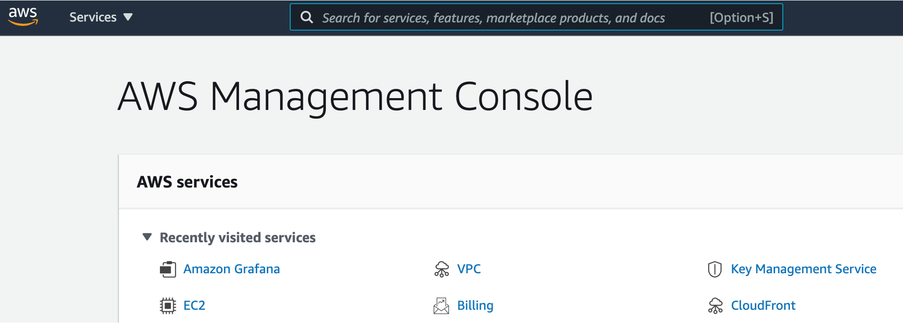
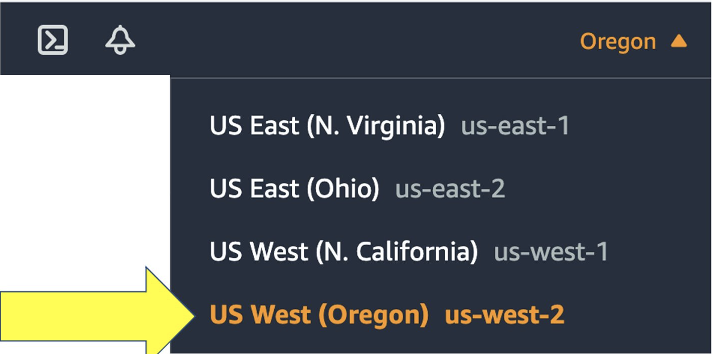
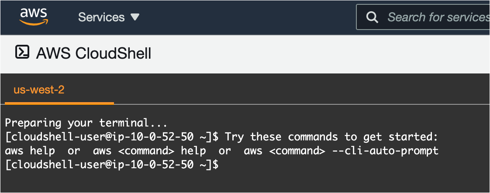
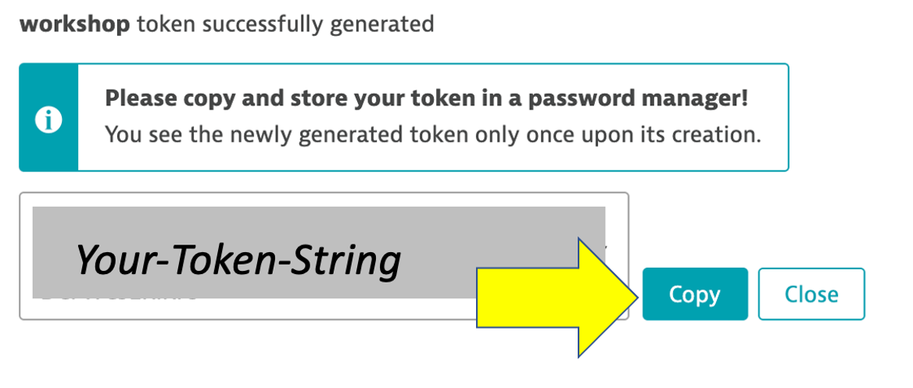
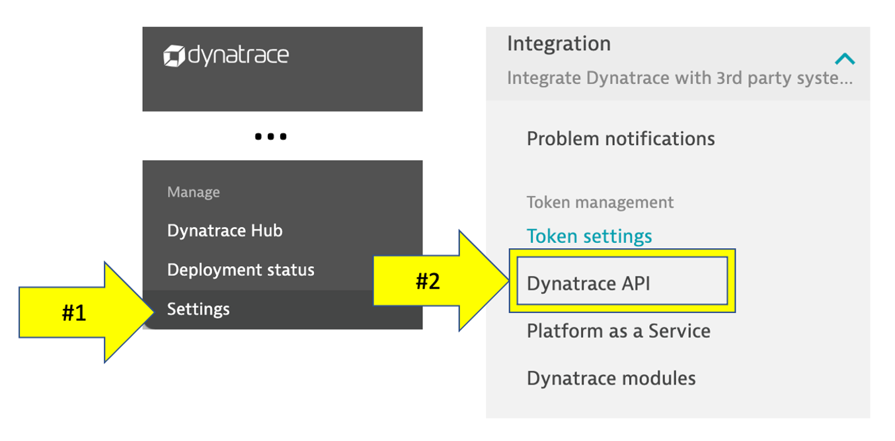
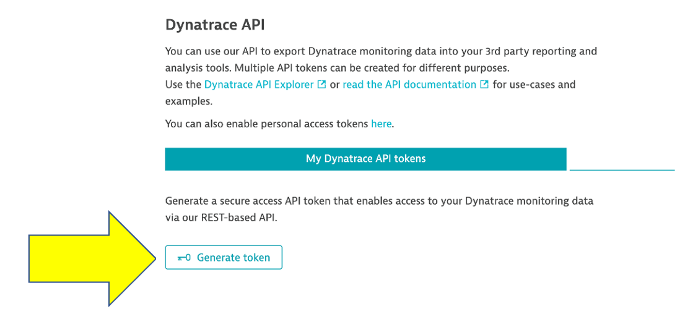

summary: This section covers the prerequisites to workshop
id: aws-workshop-prereqs
categories: pre-reqs
tags: aws-workshop
status: Published 
authors: Rob Jahn
Feedback Link: mailto:alliances@dynatrace.com
Analytics Account: UA-175467274-1

# Prerequisites

## Prerequisites

We will now setup Dynatrace, AWS, and the workshop environment. You need all of these in place before you are presented with the lab exercises.

### Objectives of this section

🔷 Ensure your Dynatrace account is ready

🔷 Ensure your AWS Account is ready

🔷 Create and gather Dynatrace URLs & Tokens needed to provision the workshop

### Dynatrace Tenant

For this workshop you will use a 15-day free Dynatrace evaluation of the
full feature set of our all-in-one performance monitoring platform to
monitor AWS resources and complete the workshop exercises and to use
once the workshop is complete.

To sign up for a 15-day trial, navigate to this URL:

-   <a href="https://www.dynatrace.com/trial/?utm_medium=alliance&utm_source=aws&utm_campaign=website&utm_content=none&utm_term=none" target="_blank">https://www.dynatrace.com/trial</a>
-   You can use your work email even if you are an existing Dynatrace
    customer
-   If you have any issues email `alliances-help@dynatrace.com`

Once you sign up:

-   it will then take about 5 minutes to provision your Dynatrace tenant
-   you will be sent an email to set your password and y

## AWS Account

To complete the workshop, you will also need an AWS account to complete
the workshop exercises. Please review the following options and proceed
to the appropriate section below.

### OPTION 1: I have an AWS event engine code
-----------------------------------------

To complete this workshop, you will be provided with an AWS account via
the AWS Event Engine service. A team hash will be provided to you by
event staff.

1 . If you are currently logged in to an AWS Account, you can log out
using this
<a href="https://console.aws.amazon.com/console/logout!doLogout" target="_blank">link</a>

2 . Connect to the portal by clicking the button or browsing to
<a href="https://dashboard.eventengine.run" target="_blank">https://dashboard.eventengine.run</a>.
The following screen shows up. Enter the provided hash in the text box.
The button in the bottom right corner changes to **Accept Terms &
Login**. Click on that button to continue.

3 . Once on the `Team dashboard` page, click the `AWS console` button
that opens a popup.

4 . On the popup, click on `Open AWS console` button which opens the AWS
portal.

5 . One the new browser tab, you should see the AWS portal.

6 . Once you are in the AWS portal, you can now move to the next
section.

Negative
: *Once the free credits for this account expire, all the resources
created will be automatically de-provisioned and you will not be able to
access the account.*

### OPTION 2: I am running the workshop in my own AWS account
---------------------------------------------------------

This workshop requires an AWS account where there is IAM user/identity
that has proper permissions to set up the necessary AWS components to
work through the workshop.

Negative:
-   You are responsible for the cost of the AWS services used while
    running this workshop in your AWS account.

-   You will need permission to add/delete:
    VPCs/subnets/Routes/IGWs/Route tables, CloudFormation Stacks, and
    EC2s/security groups/keypairs.
    -   If you are using an AWS trial account, you should have
        `AdministratorAccess` policy, so this is all you need.
    -   If you are using an account owned by your organization, please
        ensure you have the right permissions and authority.

If you already have an account, you can skip the
`setting up your AWS account` section below

### Setting up your AWS account
---------------------------

1 . If you don't already have an AWS account with Administrator access:
<a href="https://aws.amazon.com/getting-started/" target="_blank">create
one now by clicking here</a>

2 . Once you have an AWS account, ensure you are following the remaining
workshop steps as an IAM user with administrator access to the AWS
account:
<a href="https://console.aws.amazon.com/iam/home?#/users$new" target="_blank">Create
a new IAM user to use for the workshop</a>

3 . Enter the user details: 

4 . Attach the AdministratorAccess IAM Policy: 

5 . Click to create the new user: 

6 . Take note of the login URL and save: 

7 . Once you are in the AWS portal, you can now move to the next
section.

## AWS Prep
--------

### 1. Make sure you are in the correct region

Click the region button in the top right corner of your AWS console and
make sure you are in `Oregon us-west-2` for consistency in this lab.

### 2. Open up Cloudshell

In this lab, we will be using AWS Cloudshell. Cloudshell is a
browser-based shell that makes it easy to securely manage, explore, and
interact with your AWS resources.

To open the Cloudshell, click on the Cloudshell icon at the top of the
AWS console. This make take a minute to complete.

This may open up a slash page.

After closing the pop-up, wait a minute for the Cloudshell to
initialize. When this is done, you will see the command prompt as shown
below.

### 3. Clone the workshop scripts

Once you have the Cloudshell open, you need to get some scripts that
will automate the workshop setup. Run this command:

    git clone https://github.com/dt-alliances-workshops/aws-modernization-dt-orders-setup.git

It should look like this:

    [cloudshell-user@ip-10-0-52-50 ~]$ git clone https://github.com/dt-alliances-workshops/aws-modernization-dt-orders-setup.git

    Cloning into 'aws-modernization-dt-orders-setup'...

    remote: Enumerating objects: 161, done.
    remote: Counting objects: 100% (161/161), done.
    remote: Compressing objects: 100% (96/96), done.
    remote: Total 161 (delta 72), reused 143 (delta 60), pack-reused 0
    Receiving objects: 100% (161/161), 19.82 MiB | 22.21 MiB/s, done.
    Resolving deltas: 100% (72/72), done.

## Capture Setup Inputs
--------------------

The next steps of this guide will have you gather various information
from your environment needed to provision and setup your environment and
for exercises later in the workshop.

From your Dynatrace environment, you will capture:

-   Base URL
-   Environment ID
-   API token
-   PaaS token

Positive
: *The next set of steps assume that your Dynatrace tenant is fully
provisioned, you have your AWS account, and you are logged in to both.*

### Capture Inputs Script

In the code repo you cloned, there is a simple UNIX shell script for
this workshop that prompts for these values and writes them to a file
called `workshop-credentials.json`. Later in the workshop steps, there
are a few other simple UNIX shell scripts that will automate the step
that reads this file so that you don't need to type or copy-paste these
values over and over again during the workshop.

So start by running this script that will provide prompts. Follow the
sections below to get these values and paste them against the prompt. If
you mess up, you can re-run the script.

1 . Run inputs script

    cd ~/aws-modernization-dt-orders-setup/provision-scripts
    ./input-credentials.sh

2 . Login into Dynatrace.

Positive
: *The URL will be in the Dynatrace tenant creation email such as:
https://\[ENVIRONMENT ID\].live.dynatrace.com. You can also get there by
by using the the SaaS login link on the top right of the
<a href="https://www.dyntrace.com" target="_blank">Dynatrace home
page</a>.*

###  Input 1 of 4: Your last name
----------------------------

In the UNIX terminal, enter your last name at the prompt.

Positive:
*This will be added as a prefix for the provisioned resources.*

### Input 2 of 4: Dynatrace Base URL
--------------------------------

1 . Copy the Dynatrace base URL from your browser, for example:
**https://\[ENVIRONMENT ID\].live.dynatrace.com**

Positive
: *Only include the base URL up to the **...dynatrace.com***

2 . Back in the UNIX terminal, paste the value for the
`Dynatrace Base URL` prompt.

### Input 3 of 4: Dynatrace PaaS Token
----------------------------------

1 . From the Dynatrace left side menu, select `Settings`. Under the
`Integrations` sub-menu, click the `Platform as a Service` option

2 . Click the `Generate Token` button, Enter a name for your token
(e.g. workshop), then click the `Generate` button

3 . Use the `Copy` button

4 . Back in the UNIX terminal, paste the value for the
`Dynatrace PaaS Token` prompt

### Input 4 of 4: Dynatrace API Token
---------------------------------

1 . From the Dynatrace left side menu, select `Settings`. Under the
`Integrations` sub-menu, click the `Dynatrace API` option

2 . Click the `Generate Token` button, Enter a name for your token
(e.g. workshop), then click the `Generate` button

3 . Expand both the `API V2` and `API V1` section and enable permissions
as shown below

4 . Use the `Copy` button

5 . Back in the UNIX terminal, paste the value for the
`Dynatrace API Token` prompt

### Verify

Your completed data entry should look like this:

    Please confirm all are correct:
    --------------------------------------------------
    Your last name           : jones
    Dynatrace Base URL       : https://ABC.live.dynatrace.com
    Dynatrace PaaS Token     : zzzzzzzzzzzzzzzzzzzzzzz
    Dynatrace API Token      : ggggggggggggggggggggggg
    --------------------------------------------------
    derived values
    --------------------------------------------------
    Dynatrace Environment ID : ABC
    ===================================================================
    Is this all correct? (y/n) : y

    ===================================================================
    Saved credential to: ../gen/workshop-credentials.json
    {
        "RESOURCE_PREFIX": "jones",
        "DT_BASEURL": "https://ABC.live.dynatrace.com",
        "DT_ENVIRONMENT_ID": "ABC",
        "DT_PAAS_TOKEN": "zzzzzzzzzzzzzzzzzzzzzzz",
        "DT_API_TOKEN": "ggggggggggggggggggggggg",
        "AWS_REGION": "us-west-2"
    }

After you confirm, the script will show the saved values in the
`~/aws-modernization-dt-orders-setup/gen/workshop-credentials.json`
file.

### Fixing Inputs

If you mess up, you can re-run the script again and will prompt you
again for each value.

    cd ~/aws-modernization-dt-orders-setup/provision-scripts
    ./input-credentials.sh

## Summary
-------

In this section, you should have completed the following:

✅ Ensure your Dynatrace account is ready

✅ Ensure your AWS Account is ready

✅ Create and gather Dynatrace URLs & Tokens needed to provision the
workshop

### Next Steps
----------

You are now ready to proceed with the labs where you provision resources
and follow the lab guides.
