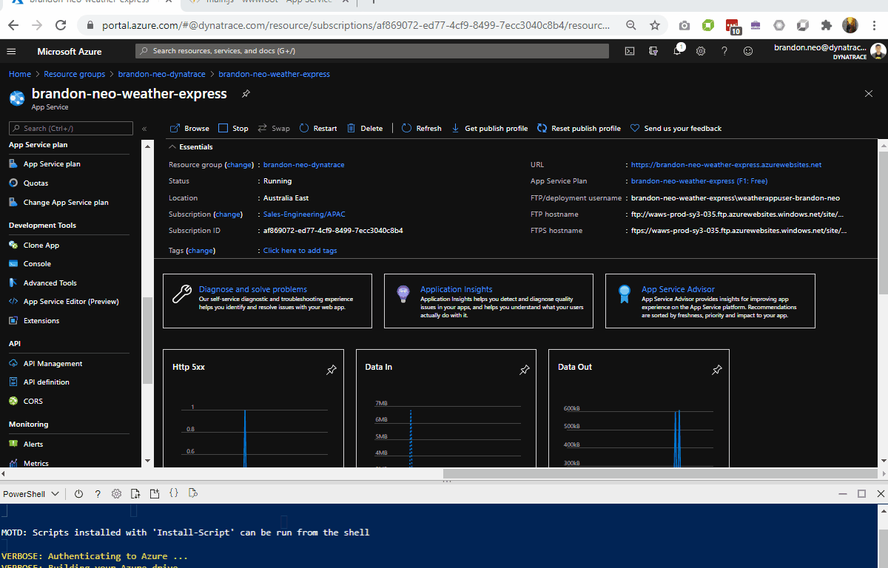
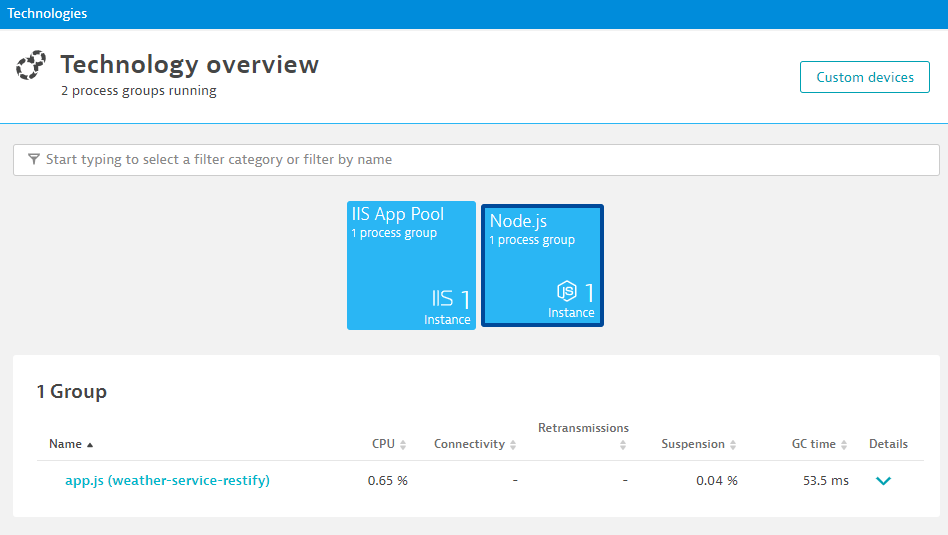
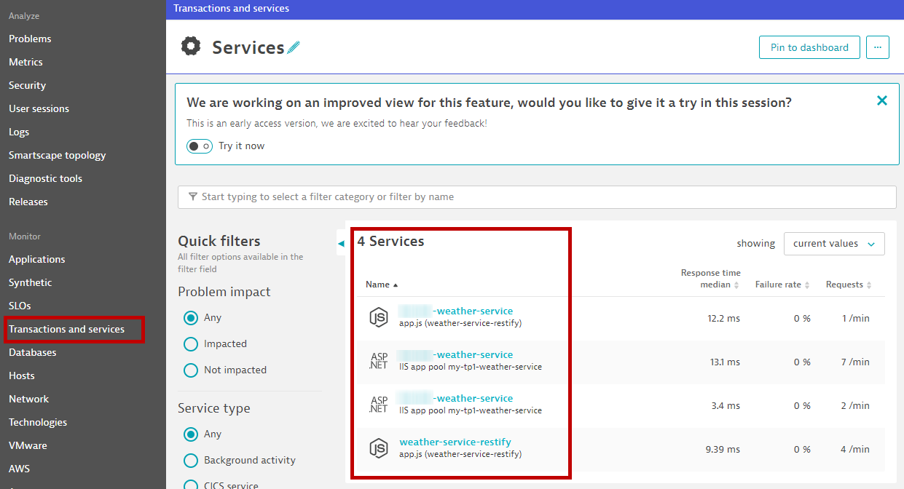
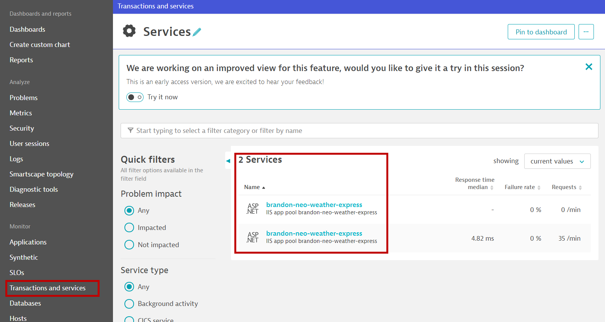
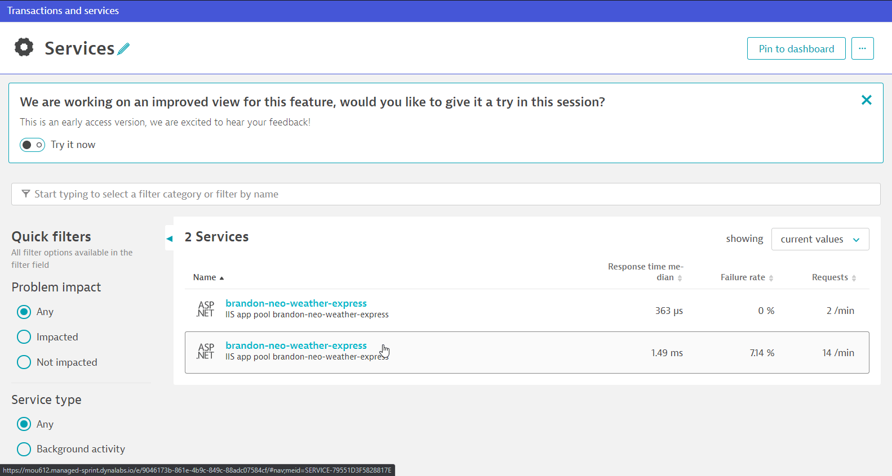
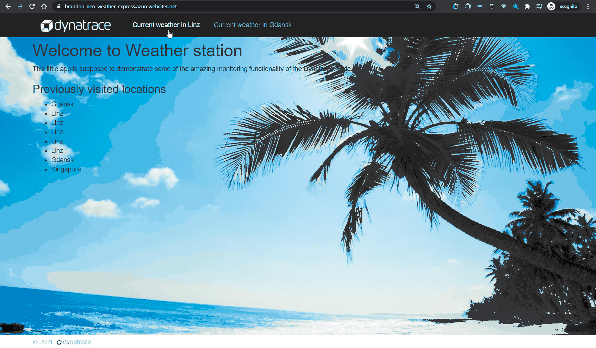
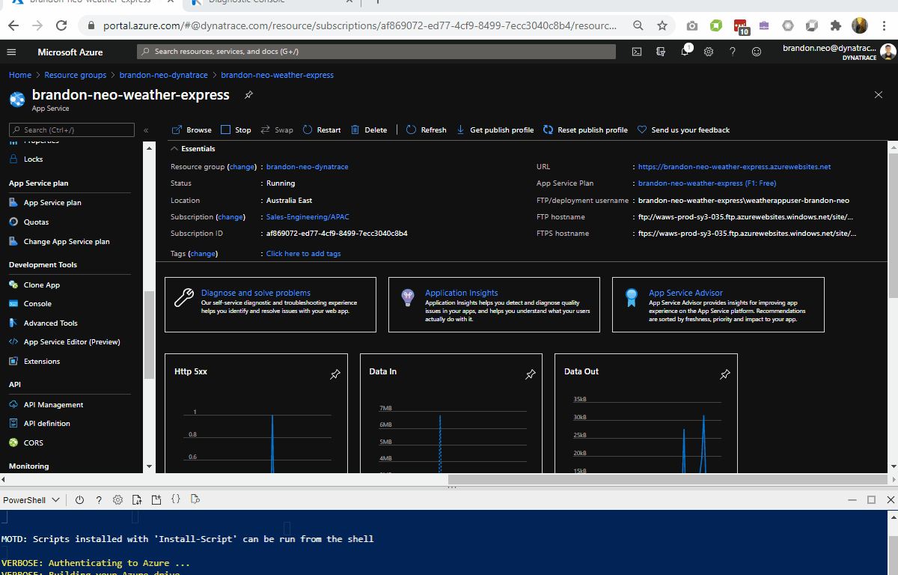

summary: Azure Hands-On
id: azure-partner
categories: azure
tags: partner
status: Published 
authors: Brandon Neo
Feedback Link: mailto:jason.nail@dynatrace.com
Analytics Account: UA-175467274-1

# Dynatrace with Azure
<!-- ------------------------ -->
## Introduction 
Duration: 1

This repository contains labs for the Azure Hands-On Session. 

### Prerequisites
- Azure Portal Account access:
  - Bring Your Own Subscription, e.g. Microsoft Visual Studio Subscription
  - Access from [Free Trial](https://azure.microsoft.com/en-gb/offers/ms-azr-0044p/) 

### What You’ll Learn 
- How to deploy Web App on Azure
- Learn how to use deploy Dynatrace with Azure with **Site Extensions**
- Using Dynatrace to validate and diagnose issues
- How to deploy Azure Function

<!-- ------------------------ -->
## Preparing the environment
Duration: 1

### Clone Repo to Azure Cloud shell

Login to [Azure Portal](https://portal.azure.com/) with your designated email.

Click on **Cloud Shell icon** on the top navigation bar.


Make sure that you have selected **PowerShell** in the left drop-down within Cloud shell.


Within the Cloudshell terminal, type in the below.

```bash
git clone https://github.com/Dynatrace-APAC/partner-azure.git
cd partner-azure/weather-service
```

The above command will download the git from the repo into your Cloud bastion host. This is setup based on your **Storage Account** location.

<!-- ------------------------ -->
## Deploy Weather Service WebApp
Duration: 10

In this exercise, you will deploy a Azure WebApp web service API that collects weather information of various cities/countries in a JSON format

Technology stack used
- NodeJS
- .NET
- Radis Cache (hosted in a central location, outside of your Azure subscription)

> Note: **publish.ps1** is a PowerShell script written to automate the creation of the AppServicePlan, AppService and also to upload the source codes of our application. Depending on your cloud shell location, you may change the **$location** value within the **publish.ps1** to fit your region. **By default**, it is set to **Souteast Asia**. Full list of regions are [here](https://azure.microsoft.com/en-au/global-infrastructure/geographies/#geographies)

Example
```bash
$location="Southeast Asia"
```
```bash  
$location="Australia East"
```
### Execute script publish.ps1 to deploy WebApp

Replace the **firstname-lastname** from the below command and adapt that to your own.

`./publish.ps1 firstname-lastname-dynatrace firstname-lastname-weather-service`

**Example**

**./publish.ps1 brandon-neo-dynatrace brandon-neo-weather-service**

Enter **Y** when prompted to deploy the content of the Weather Service app (**partner-azure/weather-service/weather-service-app.zip**)


### Verify Resource Group creation

Now that your app has been deployed, verify that the resource group has been deployed as well. 


Append `/weather/current/Linz` to your URL from your **firstname-lastname-weather-service** App Service

**Example**

**https://brandon-neo-weather-service.azurewebsites.net/weather/current/Linz**

You should get a page reflecting JSON results.


<!-- ------------------------ -->
## Instrumenting Weather-Service
Duration: 5

### Copy out relevant information via Dynatrace UI
- Create a **PaaS token**, copy it and store is somewhere safe
- As this is a Managed environment, you will need both environment ID and server URL
  - Environment ID (in bold)
    Example: `https://mou612.managed-sprint.dynalabs.io/e/`**cd783e4f-f498-4cfc-bc8b-1201bde4726a**
  - Server URL for Dynatrace Managed
    Example `https://{your-domain}/e/{your-environment-id}/api`
    Negative
    : Don't forget to add **/api**!

### Install Dynatrace OneAgent site extension via Azure Portal
- In Azure Portal, go to the Weather-**Service** ***App Service***
- In the left menu, scroll down to **Development Tools** > **Extensions**
- Select Add, Select Choose extension
- Select Dynatrace OneAgent
- Select Accept legal terms and then select OK to accept the legal terms
- Select OK to add the extension
- Select Dynatrace OneAgent
- Select Browse
- On the Start monitoring your App Service instance page, enter your environment ID, your API token, and your server URL
- Select Install OneAgent
- After installation is complete, go to Azure Portal and **restart** or **stop followed by start** the App Service application to recycle the application's worker process
- Access the webapp's URL again and fire a few transactions



Positive
: Full Documentation [here](https://www.dynatrace.com/support/help/technology-support/cloud-platforms/microsoft-azure-services/oneagent-integration/integrate-oneagent-on-azure-app-service/)

<!-- ------------------------ -->
## Automated observability for APIs
Duration: 5

### Validating technology stacks
- Access Dynatrace UI, left hand menu > **Technology**
- As you can see, Dynatrace automatically detects both ASP.NET and the NodeJS components
  
- Go to **Transactions and Services**, you should see 4 services, 2 are of the .NET technology and another 2, the NodeJS technology 
  
  
Positive
: Can you tell the relationship between the .NET and NodeJS services?
: How do you see graphically which service calls which service?

### Investigate the PurePaths
- Deep dive into some of the PurePaths
  

> What do you notice of the response times of some of the transactions?
> What other components were called?
> Did you have to do any instrumentation to get this visibility?

<!-- ------------------------ -->
## Deploy Weather Express Web App - A Web UI over the weather-restify api
Duration: 5

### Deploy Weather Express WebApp

In this exercise, you will deploy a Azure WebApp web service that renders a Web UI and provides an interactive interface to display weather information.

Technology stack used
- NodeJS
- .NET
- CosmosDB (hosted in a central location, outside of your Azure subscription)

Change folder to **weather-express** folder with `cd ../weather-express` command

> Note: Similar to the previous step, you may change the **$location** value within the **publish.ps1** to fit your region. **By default**, it is set to **Souteast Asia**. Full list of regions are [here](https://azure.microsoft.com/en-au/global-infrastructure/geographies/#geographies)

### Execute script publish.ps1 to deploy WebApp

Replace the **firstname-lastname** from the below command and adapt that to your own.

`./publish.ps1 firstname-lastname-dynatrace firstname-lastname-weather-express`

**Example**

**./publish.ps1 brandon-neo-dynatrace brandon-neo-weather-express**

Enter **Y** when prompted to deploy the content of the Weather Service app (**partner-azure/weather-service/weather-express-app.zip**)

### Verify Resource Group creation

Similar to the **Weather Service App** verfication, check on the **Weather Express App** App Service URL.

Negative
: What is the error that you observed?

<!-- ------------------------ -->
## Instrumenting Weather-Express to diagnose the error
Duration: 5

Similar to instrumenting the Weather-Service WebApp, use the Azure site extensions

### Install Dynatrace OneAgent site extension via Azure Portal
- In Azure Portal, go to the Weather-**Express** ***App Service***
- In the left menu, scroll down to **Development Tools** > **Extensions**
- Select Add, Select Choose extension
- Select Dynatrace OneAgent
- Select Accept legal terms and then select OK to accept the legal terms
- Select OK to add the extension
- Select Dynatrace OneAgent
- Select Browse
- On the Start monitoring your App Service instance page, enter your environment ID, your API token, and your server URL
- Select Install OneAgent
- After installation is complete, go to Azure Portal and **restart** or **stop followed by start** the App Service application to recycle the application's worker process
- Access the webapp's URL again and fire a few transactions


Positive
: Full Documentation [here](https://www.dynatrace.com/support/help/technology-support/cloud-platforms/microsoft-azure-services/oneagent-integration/integrate-oneagent-on-azure-app-service/)

<!-- ------------------------ -->
## Automated observability for Weather-Express
Duration: 5

### Validating technology stacks
- Go to **Transactions and Services**, investigate the **weather-express** services 
  
  
Positive
: How many services are detected for weather-**express**

### Investigate the PurePaths
- Deep dive into some of the PurePaths
  

> Do you notice that some purepaths have errors?
> What is displayed when drilling down into the purepaths?
> Is there enough visibility to diagnose the error?

<!-- ------------------------ -->
## Solving the mystery of the missing NodeJS services
Duration: 5

The OneAgents have a specific requirement when it comes to supportability of NodeJS versions and bitness. In the [documentation](https://www.dynatrace.com/support/help/shortlink/supported-technologies#nodejs), it is mentioned that only ***64-bit*** NodeJS versions are supported.

However, when creating the Azure WebApp, it defaults to 32-bits, as seen in this configuration screen:
- In Azure Portal, go to the Weather-**Express** ***App Service***
- In the left menu, scroll down to **Configuration** > **General Settings**
- Let's change this to 64-bits
  
- Another configuration is required: `NODEVERSION = ~10`
  
- Click on **SAVE** and **stop followed by start** the App Service application to recycle the application's worker process
- Access the webapp's URL again and fire a few transactions
- You should now be able to see that the NodeJS service has been detected and instrumented

<!-- ------------------------ -->
## Investigating the Weather-Express issue with Dynatrace
Duration: 5

Access the **/current** purepaths again and this time, you should have a pretty good idea on where the error is coming from 


### Resolution and Verification

Go to **App Service Editor (Preview)** and under `WWWROOT/config/main.js`, resolve the following based on the GIF

- Renaming your Uri to your **firstname-lastname**-weather-service.azurewebsites.net/weather



Once you have resolved the issue, you should be able to access your **Weather Express Portal** 

<!-- ------------------------ -->
## Function setup
Duration: 15

### Creating Function App

Create a Azure App based on the following:

- Create a resource
- Search for **Function App**
- Click on **Create**
- Chooce your Resource Group - **Firstname-Lastname-dynatrace** (eg. Brandon-Neo-dynatrace )
- Name your Function App - **Firstname-Lastname-dynatrace-function** (eg. Brandon-Neo-dynatrace-function )
- Runtime Stack - **.NET Core**
- Version - **3.1**
- Region - **Your Choosen Region** (eg. Australia East)
- **Next**
- Operating Systems - **Windows**
- Plan type - **App service plan**
- Windows Plan - **Firstname-Lastname-weather-express** (eg. Brandon-Neo-weather-express )
- **Next**
- **No** to AppInsights
- **Create**
- Once created, **Go to Resource**


### Adding A Function

Create a Azure Function based on the following:

- Select **Function** on the left Nav, Click on **+ Add**
- Choose **HTTP trigger**
- Authorization type - Anonymous
- Code + Test
- Test/Run, Run 


### Instrumenting Azure Functions via Site Extensions

Deploy and instrument the Function App with Site Extension


<!-- ------------------------ -->

## Feedback
Duration: 3

We hope you enjoyed this lab and found it useful. We would love your feedback!
<form>
  <name>How was your overall experience with this lab?</name>
  <input value="Excellent" />
  <input value="Good" />
  <input value="Average" />
  <input value="Fair" />
  <input value="Poor" />
</form>

<form>
  <name>What did you benefit most from this lab?</name>
  <input value="How to deploy Azure Web Apps" />
  <input value="How to instrument Web Apps" />
  <input value="How to Debug instrumenting Web Apps" />
  <input value="How to deploy and instrument Azure Function" />
</form>

Positive
: 💡 For other ideas and suggestions, please **[reach out via email](mailto:APAC-SE-Central@dynatrace.com?subject=Kubernetes Workshop - Ideas and Suggestions")**.
