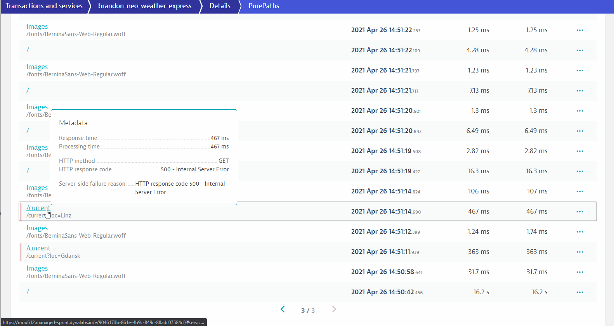

summary: Azure Hands-On
id: azure-partner
categories: azure
tags: partner
status: Published 
authors: Jason Nai
Feedback Link: mailto:jason.nai@dynatrace.com
Analytics Account: UA-175467274-1

# Dynatrace with Azure
<!-- ------------------------ -->
## Introduction 
Duration: 1

This repository contains labs for the Azure Hands-On Session. 

### Prerequisites
- Azure Portal Account access:
  - Bring Your Own Subscription, e.g. Microsoft Visual Studio Subscription
  - Access from [Free Trial](https://azure.microsoft.com/en-gb/offers/ms-azr-0044p/) 

### What You’ll Learn 
- How to deploy Web App on Azure
- Learn how to use deploy Dynatrace with Azure with **Site Extensions**
- Using Dynatrace to validate and diagnose issues
- How to deploy Azure Function

<!-- ------------------------ -->
## Preparing the environment
Duration: 1

### (a) Launch Azure Cloud shell

Login to [Azure Portal](https://portal.azure.com/) with your designated email.

Click on **Cloud Shell icon** on the top navigation bar.


Make sure that you have selected **PowerShell** in the left drop-down within Cloud shell.


### (b) Clone github repo

Within the Cloudshell terminal, type in the below.

```powershell
git clone https://github.com/Dynatrace-APAC/partner-azure.git
cd partner-azure/weather-service
```

The above command will download the git from the repo into your Cloud bastion host. This is setup based on your **Storage Account** location.

<!-- ------------------------ -->
## Connecting Azure Monitor to Dynatrace (Optional)
Duration: 10

### (a) Prerequisites

In addition to monitoring your Azure workloads using OneAgent, Dynatrace provides integration with Azure Monitor which adds infrastructure monitoring to gain insight even into serverless application scenarios.

You will need to have
- Sufficient permissions to register an application with your Azure AD tenant, and assign the application to a role in your Azure Subscription
- An Azure service principal to access Azure APIs
- See [Documentation](https://www.dynatrace.com/support/help/shortlink/azure-monitor-integration#prerequisites) for full pre-requistes

### (b) Create an Azure service principal
- Go to the Azure Management Portal and select Azure Active Directory.
- Select App registrations in the navigation pane of the selected Active Directory.
- Select New application registration at the top of the App registrations blade, and type the name of your application.
- Select Register.
- Copy the Application (client) ID, and save it for future retrieval. This ID is required to configure Dynatrace to connect to your Azure account.
- Select Certificates & secrets > New client secret to create a new security key.
- Type a key description and select a key duration in the Expires list.
- Select Add to save the new key, which displays the key value in the Value field. Copy the value and save it for future retrieval (along with your Client ID).

### (c) Grant access permissions for your service principal
- You need at least **reader** permissions for Dynatrace to monitor your services.

### (d) Grant access to an Azure subscription
- On Azure Portal, select All services > General > Subscriptions.
- In the Subscriptions blade, enter your subscription.
- Select Access control (IAM) in the subscription navigation pane.
- Select Add and enter the Reader role.
- In the Select field, paste the description name or application (client) ID obtained when creating the Azure service principal.
- Select the application and Save to grant the service principal access to your subscription.

### (e) Configure Dynatrace to connect to your Azure environment
- In the desired Dynatrace environment, click Settings > Cloud and virtualization > Azure.
- Type a descriptive name for the connection.
- Enter the Client ID and Tenant ID obtained when creating the Azure service principal.
- Enter the Secret Key obtained when creating the Azure service principal.

Positive
: Full [documentation here](https://www.dynatrace.com/support/help/technology-support/cloud-platforms/microsoft-azure-services/set-up-integration-with-azure-monitor/)

<!-- ------------------------ -->
## Deploy Weather Service WebApp
Duration: 10

In this exercise, you will deploy a Azure WebApp web service API that collects weather information of various cities/countries in a JSON format

Technology stack used
- NodeJS
- .NET
- Microsoft managed CosmosDB (hosted in a central location, outside of your Azure subscription)

> Note: **publish.ps1** is a PowerShell script written to automate the creation of the AppServicePlan, AppService and also to upload the source codes of our application. Depending on your cloud shell location, you may change the **$location** value within the **publish.ps1** to fit your region. **By default**, it is set to **Southeast Asia**. Full list of regions are [here](https://azure.microsoft.com/en-au/global-infrastructure/geographies/#geographies)
> 
> Example
> ```powershell
> $location="Southeast Asia"
> ```
> ```powershell
> $location="Australia East"
> ```

### (a) Execute script publish.ps1 to deploy WebApp

Replace the **firstname-lastname** from the below command and adapt that to your own.

`./publish.ps1 firstname-lastname-dynatrace firstname-lastname-weather-service`

**Example**
```powershell
./publish.ps1 brandon-neo-dynatrace brandon-neo-weather-service
```

Enter **Y** when prompted to deploy the content of the Weather Service app (**partner-azure/weather-service/weather-service-app.zip**)


### (b) Verify Resource Group creation

Now that your app has been deployed, verify that the resource group has been deployed as well.
- Go to the Azure Portal > Resource Groups > **firstname-lastname-weather-service** (select the ***App Service*** one)
- Click on the link under the section Overview > Essentials > URL
  

- Append `/weather/current/Linz` to your URL from your **firstname-lastname-weather-service** App Service

**Example**

**https://brandon-neo-weather-service.azurewebsites.net/weather/current/Linz**

You should get a page reflecting JSON results.


<!-- ------------------------ -->
## Instrumenting Weather-Service
Duration: 5

### (a) Information required - EnvID, PaaS token, Server URL 
We will now deploy Dynatrace OneAgent via Azure site-extensions, before we do so, please extract out the following information and paste them in a textpad/Notepad/text editor etc.

#### (i) PaaS Token
- Create a **PaaS token**, copy it and store is somewhere safe

#### (ii) Environment ID
- As this is a Managed environment, you will need both environment ID and server URL
- Environment ID (in bold)

  Example: `https://mou612.managed-sprint.dynalabs.io/e/`**cd783e4f-f498-4cfc-bc8b-1201bde4726a**

#### (iii) Server URL
- Server URL for Dynatrace Managed

  Example `https://{your-domain}/e/{your-environment-id}/api`

  Negative
  : Don't forget to add **/api**!

### (b) Install Dynatrace OneAgent site extensions via Azure Portal
- In Azure Portal, go to the Weather-**Service** ***App Service***
- In the left menu, scroll down to **Development Tools** > **Extensions**
- Select Add, Select Choose extension
- Select Dynatrace OneAgent
- Select Accept legal terms and then select OK to accept the legal terms
- Select OK to add the extension
- Select Dynatrace OneAgent
- Select Browse
- On the Start monitoring your App Service instance page, enter your environment ID, your API token, and your server URL
- Select Install OneAgent
- You will see this message once installation is complete in that page
  ```
  The OneAgent is installed and up-to-date
  Enjoy monitoring from Dynatrace.
  ```


- Go back to the Weather-Service App Service and **restart** the App Service application to recycle the application's worker process
  
- Access the webapp's URL again and fire a few transactions

Positive
: Full Documentation [here](https://www.dynatrace.com/support/help/technology-support/cloud-platforms/microsoft-azure-services/oneagent-integration/integrate-oneagent-on-azure-app-service/)

<!-- ------------------------ -->
## Automated observability with Dynatrace
Duration: 5

### (a) Validating technology stacks
Once Dynatrace has been deployed, the OneAgent will start collecting data. It is advisible to validate if the data collected accurately represents the environment. It is not suffucent to simply check for services or purepaths. 
- Access Dynatrace UI, left hand menu > **Technology**
- As you can see, Dynatrace automatically detects both ASP.NET and the NodeJS components
  
- Go to **Transactions and Services**, you should see 4 services, 2 are of the .NET technology and another 2, the NodeJS technology 
  
  
Negative
: Can you tell the relationship between the .NET and NodeJS services?
 
Negative
: How do you see graphically which service calls which service?

### (b) Investigate the PurePaths
- Deep dive into some of the PurePaths
  

Negative
: What do you notice of the response times of some of the transactions?
 
Negative
: What other components were called?
 
Negative
: Did you have to do manually instrument the app or do any coding to get this visibility?

<!-- ------------------------ -->
## Deploy Weather Express Web App - A Web UI over the weather-restify api
Duration: 5

### (a) Deploy Weather Express WebApp

In this exercise, you will deploy a Azure WebApp web service that renders a Web UI and provides an interactive interface to display weather information.

Technology stack used
- NodeJS
- .NET
- Redis cache (hosted in a central location, outside of your Azure subscription)

Change folder to **weather-express** folder with `cd ../weather-express` command

> Note: Similar to the previous step, you may change the **$location** value within the **publish.ps1** to fit your region. **By default**, it is set to **Southeast Asia**. Full list of regions are [here](https://azure.microsoft.com/en-au/global-infrastructure/geographies/#geographies)

### (b) Execute script publish.ps1 to deploy WebApp

Replace the **firstname-lastname** from the below command and adapt that to your own.

`./publish.ps1 firstname-lastname-dynatrace firstname-lastname-weather-express`

Negative
: Do note that the naming is weather-**express**

**Example**
```powershell
./publish.ps1 brandon-neo-dynatrace brandon-neo-weather-express
```

Enter **Y** when prompted to deploy the content of the Weather Service app (**partner-azure/weather-service/weather-express-app.zip**)

### (c) Verify Resource Group creation

Similar to the **Weather Service App** verfication, check on the **Weather Express App** App Service URL.
- Go to the Azure Portal > Resource Groups > **firstname-lastname-weather-express** (select the ***App Service*** one)
- Click on the link under the section Overview > Essentials > URL
  
- In the Weather Express web UI, click on **"Current weather in Linz"** and after which **"Current weather in Gdansk"**
  

Negative
: What is the error that you observed?

<!-- ------------------------ -->
## Instrumenting Weather-Express to diagnose the error
Duration: 5

Similar to instrumenting the Weather-Service WebApp, use the Azure site extensions with the previously copied PaaS token, environment ID and Server URL

### Install Dynatrace OneAgent site extension via Azure Portal


- After installation is complete, go to Azure Portal and **restart** the App Service application to recycle the application's worker process
  
- Access the webapp's URL again and fire a few transactions

Positive
: Full Documentation [here](https://www.dynatrace.com/support/help/technology-support/cloud-platforms/microsoft-azure-services/oneagent-integration/integrate-oneagent-on-azure-app-service/)

<!-- ------------------------ -->
## Automated observability for Weather-Express
Duration: 5

### (a) Validating technology stacks
- Go to **Transactions and Services**, investigate the **weather-express** services 
  
  
Negative
: What services were detected for weather-**express**? Do you think there are any missing services?

### (b) Investigate the PurePaths
- Deep dive into some of the PurePaths, especially those purepaths with the URL **/current**
  

Negative
: Do you notice that some purepaths have errors?
 
Negative
: What is displayed when drilling down into the purepaths?
 
Negative
: Is there enough visibility to diagnose the error?

<!-- ------------------------ -->
## Solving the mystery of the missing services
Duration: 5

The OneAgents have a specific requirement when it comes to supportability of NodeJS versions and bitness. In the [documentation](https://www.dynatrace.com/support/help/shortlink/supported-technologies#nodejs), it is mentioned that only ***64-bit*** NodeJS versions are supported.

However, when creating the Azure WebApp, it defaults to 32-bits, as seen in this configuration screen:


### Enabling 64-bits NodeJS for Azure WebApps via Azure Portal
- In Azure Portal, go to the Weather-**Express** ***App Service***
- In the left menu, scroll down to **Settings** > **Configuration** > **General Settings**
- Let's change this to 64-bits
  
- Another configuration is required, under **Application settings** tab (next to General Settings), look for `WEBSITE_NODE_DEFAULT_VERSION`
- Edit that line and set the value to `~10`
  > `WEBSITE_NODE_DEFAULT_VERSION = ~10`
  
  
- Click on **SAVE** and **restart** the App Service application to recycle the application's worker process
  
- Access the webapp's URL again and fire a few transactions
- You should now be able to see that the NodeJS service has been detected and instrumented
- Click on the **"Current weather in Gdansk"** and change the location in the URL to `/current?loc=Singapore` or `/current?loc=Malaysia`
  

<!-- ------------------------ -->
## Investigating the Weather-Express issue with Dynatrace
Duration: 5

Access the **/current** purepaths again. Investigate the `/current?loc=Singapore` and/or `/current?loc=Malaysia` and this time, Dynatrace should give you a pretty good idea where the error is coming from


Negative
: What do you think is causing this error?

### (a) Resolution and Verification

In order to resolve this issue, we have to change the code. For Azure WebApps, a built-in Code editor can be used to modify codes.

To access to built-in code editor
- In Azure Portal, go to the Weather-**Express** ***App Service***
- In the left menu, scroll down to **Development Tools** > **App Service Editor (Preview)**
- Click on **Go** and the browser-based editor will open in another tab
  

- Under `WWWROOT/config/main.js`, resolve the following based on the GIF
- Renaming your Uri to your **firstname-lastname**-weather-service.azurewebsites.net/weather

  

- Recycle the App Service again
  

Once you have resolved the issue, the **Weather Express Portal** should be displaying the weather in Linz and any location that you enter.


> Use Dynatrace to explore "Applications", "Transactions and Service", "PurePaths" etc.
> 
> Can you tell how Weather Express and Weather Service are related? Who calls who, and how is it called? Did you have to do complex configuration steps to reach this level of visibility?
> 
> What can you tell about the data collected and how do you think it will help various teams like CloudOps, App Dev teams, Business teams etc.?

Positive
: Screen shot the entire Service Flow starting from User, and some comments on the above question and send it to mailto: jason.nai@dynatrace.com. A surprise awaits you!

<!-- ------------------------ -->
## Function setup
Duration: 15

### (a) Creating Function App

Create a Azure App based on the following:

- Create a resource
- Search for **Function App**
- Click on **Create**
- Chooce your Resource Group - **Firstname-Lastname-dynatrace** (eg. Brandon-Neo-dynatrace )
- Name your Function App - **Firstname-Lastname-dynatrace-function** (eg. Brandon-Neo-dynatrace-function )
- Runtime Stack - **.NET Core**
- Version - **3.1**
- Region - **Your Choosen Region** (eg. Australia East)
- **Next**
- Operating Systems - **Windows**
- Plan type - **App service plan**
- Windows Plan - **Firstname-Lastname-weather-express** (eg. Brandon-Neo-weather-express )
- **Next**
- **No** to AppInsights
- **Create**
- Once created, **Go to Resource**


### (b) Adding A Function

Create a Azure Function based on the following:

- Select **Function** on the left Nav, Click on **+ Add**
- Choose **HTTP trigger**
- Authorization type - Anonymous
- Code + Test
- Test/Run, Run 


### (c) Instrumenting Azure Functions via Site Extensions

Deploy and instrument the Function App with Site Extension


<!-- ------------------------ -->

## Feedback
Duration: 3

We hope you enjoyed this lab and found it useful. We would love your feedback!
<form>
  <name>How was your overall experience with this lab?</name>
  <input value="Excellent" />
  <input value="Good" />
  <input value="Average" />
  <input value="Fair" />
  <input value="Poor" />
</form>

<form>
  <name>What did you benefit most from this lab?</name>
  <input value="How to deploy Azure Web Apps" />
  <input value="How to instrument Web Apps" />
  <input value="How to Debug instrumenting Web Apps" />
  <input value="How to deploy and instrument Azure Function" />
</form>

Positive
: 💡 For other ideas and suggestions, please **[reach out via email](mailto:jason.nai@dynatrace.com?subject=Azure - Ideas and Suggestions")**.
