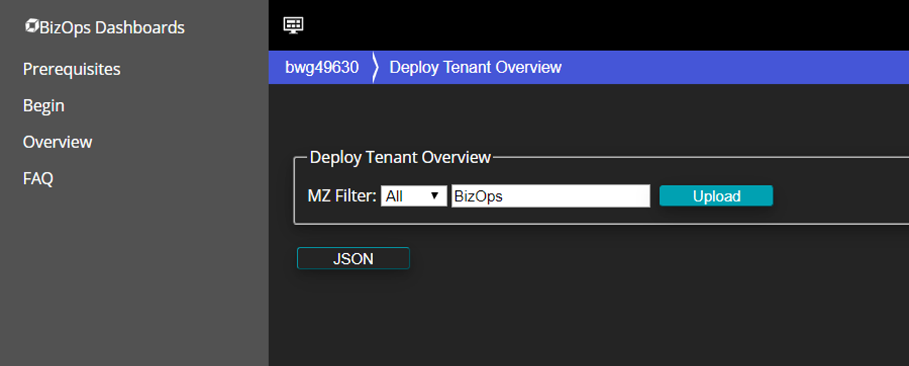
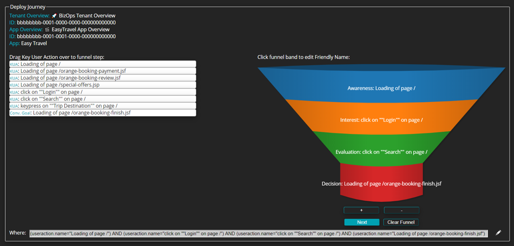

id: bizops
summary: Understanding Digital Business Analytics with PowerBI
categories: bizops, powerBI
tags: bizops, Advanced
status: Published 
authors: Brandon Neo
Feedback Link: mailto:APAC-SE-Central@dynatrace.com
Analytics Account: UA-175467274-1

# Digital Business Analytics with Dynatrace
<!-- ------------------------ -->
## Bridging the Gap to the Business
Duration: 1

This Repo contains the labs we are going to work though as part of the BizOps – Bridging the Gap to the Business Hands On Workshop.

For the purposes of the Hands-On, we will automate and make the steps seamless for the participants

### Prerequisites
- Dynatrace SaaS/Managed Account. Get your free SaaS trial [here](https://www.dynatrace.com/trial/).

### Lab Setup
The following steps are used for this lab:
- AWS account (used to create an EC2 instance from a public AMI)
    * Signup to a free trial [here](https://aws.amazon.com/free/)
- Sample Application 
    * Sample App is based on [easyTravel Docker](https://github.com/Dynatrace/easyTravel-Docker)
    * Follow the [Prerequisite Actions](https://github.com/Dynatrace-APAC/Workshop-BizOps/tree/master/Prerequisite%20Actions) to create the application that will be used throughout this workshop.

### What You’ll Learn
- Understand Real User Monitoring setup with easyTravel App 
- Learn Digital Business Analytics
- Learn Dynatrace Capabilities such as
    * User Action Naming
    * Key User Actions
    * User Session Properties
    * User Session Query Language (USQL)
    * Dynatrace Dashboards
- BizOps Configurator
- Exporting into Excel and Power BI

<!-- ------------------------ -->
## Dynatrace RUM Setup
Duration: 2

In this lab, we will be doing basic setup within Dynatrace. 

Some of these tuning tips has already been done for you.

* Enable JavaScript framework support​
* Configure User Tagging​
* Configure User Action Naming​
* Add Key User Actions​
* Usability analytics​

### Marking Key User Actions 

- Access the **easyTravel Website** application
- Under **Top 3 user actions** click **View full details**
- Scroll down to **Top 100 user actions** and filter a user action e.g. **orange-booking-finish.jsf**


- Click on the user action e.g **Loading of page /orange-booking-finish.jsf** then click on **Mark as key user action**


Repeat the above to add the following as key user actions:

- loading of page /
- loading of page /orange.jsf
- loading of page /orange-booking-finish.jsf
- loading of page /orange-booking-review.jsf
- loading of page /orange-booking-payment.jsf
- click on "login" on page /orange.jsf
- click on "login" on page /
- click on "search" on page /orange.jsf
- click on "search" on page /
- loading of page /special-offers.jsp

<!-- ------------------------ -->
## Creating a Basic Dashboard
Duration: 5

In this lab, we will create the following dashboard:


### Dashboard Components

The above dashboard has the following components:

Out of the Box Tiles:

- **Application Health**
- **Top web applications**
- **Web Application** > easyTravel Website

Custom Chart Tiles:

- Action count (by Apdex category)
	- Category: Applications
	- Metric: Action count (by Apdex category) (Sum)
	- View Results as: Timeseries
	- Dimensions to split by: 
		- Web Application: true, Filtered by **easyTravel Website**
		- Apdex category: true
		

- Action count (by Apdex category)
	- Category: Applications
	- Metric: Action count (by Apdex category) (Sum)
	- View Results as: Pie
	- Dimensions to split by: 
		- Web Application: true, Filtered by **easyTravel Website**
		- Apdex category: true

- Real User Errors
	- Category: Applications
	- Metric: Count of errors (by user type, error type and error origin) (Sum)
	- View Results as: Pie
	- Dimensions to split by: 
		- Web Application: true, Filtered by **easyTravel Website**
		- User type: true, Filtered by: **Real Users**
		- Error origin: true
	
- Active Sessions
	- Category: Applications
	- Metric: Active Sessions
	- View Results as: Top List
	- Dimensions to split by: 
		- Web Application: true, Filtered by **easyTravel Website**
		- Users: true
		- User type: true
		
	
- Session Duration
	- Category: Applications
	- Metric: Session Duration
	- View Results as: Top List
		- Dimensions to split by: 
		- Web Application: true, Filtered by **easyTravel Website**
		- Users: true
		- User type: true

<!-- ------------------------ -->
## Creating Conversion Rates
Duration: 5

In this lab, we will create conversion goals for the easyTravel application

### Conversion Goal

Access the easyTravel Website application monitoring settings
  **Applications > easyTravel Website > (...) > Edit**

Select **Conversion Goals** and click **Add goal** and enter the following:

  * Name: **Successful Bookings**  
  * Type of goal: **User Action**  
  * Rule applies to: **Load actions**  
  * Rule: Action Name > contains > **loading of page /orange-booking-finish.jsf** 
 


Check results aginst the application: **easyTravel** > **User behavior**  


<!-- ------------------------ -->
## Sessions Properties - Part 1
Duration: 15

In this lab, we will create a session properties to expose business data to Dynatrace

### Membership Status

1) Access the easyTravel Website application monitoring settings

**Applications > easyTravel Website > (...) Edit**

2) Select **Session and User action properties**, and click **Custom defined property** and enter the following:

   * Expression Type: **CSS Selector**  
   * Data Type: **String**  
   * Display Name:  **Membership Status**  
   * Key:  **membershipstatus**  
   * CSS Selector:  `#loginForm\:j_idt43`   
   * Store as user action property: **false**  
   * Store as session property: **true**  
   * Apply cleanup rule: **true**  
   * Cleanup Rule Regex: `(.*?) status!`  


3) Click **Save Property**

It may take 5-10 mins to see results in Dynatrace because session properties are only available when the user session is completed.

You can view the user sessions that have the membershipstatus set  by running the following USQL: 

    SELECT * FROM usersession WHERE stringProperties.membershipstatus IS NOT NULL ORDER BY startTime DESC

<!-- ------------------------ -->
## Creating Sessions Properties - Part 2
Duration: 15

In this lab, we will create a session properties to expose business data Booking Total and Destination to Dynatrace

### Booking Total

First get the **CSS selector** for the Booking Total field.

1) Assess the easyTravel homepage (the URL provied to you)
2) Seach for a destination e.g. Gold Coast and click **Book Now**


3) Login with username: **janet** and password: **janet** and click **Next**


4) Right click on the Round-trip ticket price $ value and click **inspect**


5) Right click on the td element and select **Copy** > **Copy Selector**


Second create the session property in Dynatrace.


1) Access the easyTravel application monitoring settings
  **Applications > easyTravel > (...) Edit**

2) Select **Session and User action properties** and click **Custom defined property** and enter the following:

   * Expression Type: **CSS Selector**  
   * Data Type: **Double**  
   
   * CSS Selector:  **The CSS Selector you copied above**  e.g `#iceform\:j_idt77-11-1 > span`
   
   * Display Name:  **Booking Total**  
   * Key:  **bookingtotal**  
   
   * Display Name: **Booking Total**  
   * Store as user action property: **false**  
   * Store as session property: **true**  
   * Apply cleanup rule: **true**  
   * Cleanup Rule Regex: `\$(.*+)`
   
You can view the user sessions that have the booking total value by running the following USQL: 

    SELECT * FROM usersession WHERE doubleProperties.bookingtotal IS NOT NULL ORDER BY startTime DESC
   
### Trip Journey

For the trip Journey, back in easyTravel:

1) Right click on the **Journey** value and click **inspect**


2) Right click on the span element and select **Copy** > **Copy Selector**


Create the session property in Dynatrace.

1) Select **Session and User action properties** and click **Custom defined property** and enter the following:

   * Expression Type: **CSS Selector**  
   * Data Type: **String**  
   
   * CSS Selector:  **The CSS Selector you copied above** e.g. `#iceform\:popupDetailsLink`
   
   * Display Name: **Journey**
   * Key:  **journey**  
   
   * Store as user action property: **false**  
   * Store as session property: **true**  
   * Apply cleanup rule: **false**  

You can view the user sessions that have the destination value by running the following USQL: 

    SELECT * FROM usersession WHERE stringProperties.journey IS NOT NULL ORDER BY startTime DESC
    
    
It may take 5-10 mins to see results in Dynatrace because session properties are only available when the user session is completed.

<!-- ------------------------ -->
##  User Session Query Language (USQL)
Duration: 15

### Creating a Basic USQL Dashboard

In this lab, we will create the following dashboard:


### Dashboard Components

The above dashboard has the following components:

Out of the Box Tiles:

- **Live user activity**
- **Top web applications**
- **Application health** 

USQL Tiles:

### Single Value Tiles

- Satisfied Users
	- USQL Category: **select count(usersessionid) as "Satisfied Users" from usersession where userExperienceScore="SATISFIED"**
	- Compare with previous timeframe: **true**
	- Dynamic time-frame shift: **true**
	- Visualization types: **Single value**

- Tolerated Users
	- USQL Category: **select count(usersessionid) as "Tolerated Users" from usersession where userExperienceScore="TOLERATED"**
	- Compare with previous timeframe: **true**
	- Dynamic time-frame shift: **true**
	- Visualization types: **Single value**

- Frustrated Users
	- USQL Category: **select count(usersessionid) as "Frustrated Users" from usersession where userExperienceScore="FRUSTRATED"**
	- Compare with previous timeframe: **true**
	- Dynamic time-frame shift: **true**
	- Visualization types: **Single value**
	
- Duration 90th Percentile
	- USQL Category: **select PERCENTILE(duration,90) as "Duration 90th Percentile" from useraction**
	- Compare with previous timeframe: **true**
	- Dynamic time-frame shift: **true**
	- Visualization types: **Single value**

- Visually Complete 90th Percentile
	- USQL Category: **select PERCENTILE(visuallyCompleteTime,90) as "Visually Complete 90th Percentile" from useraction**
	- Compare with previous timeframe: **true**
	- Dynamic time-frame shift: **true**
	- Visualization types: **Single value**

- Speed Index 90th Percentile
	- USQL Category: **select PERCENTILE(speedIndex,90) as "Speed Index 90th Percentile" from useraction**
	- Compare with previous timeframe: **true**
	- Dynamic time-frame shift: **true**
	- Visualization types: **Single value**

### Charts
	
- Duration
	- USQL Category: **select DISTINCT DATETIME(starttime, "HH:mm", "10m") as "Time", avg(useraction.duration) as "Duration" from useraction**
	- Compare with previous timeframe: **false**
	- Visualization types: **Bar chart**

- Visually Complete
	- USQL Category: **select DISTINCT DATETIME(starttime, "HH:mm", "10m") as "Time", AVG(visuallyCompleteTime) as "Visually Complete" from useraction**
	- Compare with previous timeframe: **false**
	- Visualization types: **Bar chart**

- Speed Index
	- USQL Category: **select DISTINCT DATETIME(starttime, "HH:mm", "10m") as "Time", AVG(speedIndex) as "Speed Index" from useraction**
	- Compare with previous timeframe: **false**
	- Visualization types: **Bar chart**

<!-- ------------------------ -->
##  Creating a Business Dashboard
Duration: 15

In this lab, we will create the following dashboard:


### Dashboard Components

The above dashboard has the following components:

1) **User Behavior** > **easyTravel Website**

2) **Top conversion goals** > **easyTravel Website**

3) **Conversion goal** > **easyTravel Website** > **Sucessful Bookings**

4) **Bounce Rate** > **easyTravel Website**

5) **Key user actions** > **easyTravel Website**

6) **User Session Query** - Revenue

        SELECT SUM(doubleProperties.bookingtotal) AS "Revenue (USD)" FROM usersession WHERE useraction.application="easyTravel Website" and (useraction.name="loading of page /orange-booking-finish.jsf") 
   
7) **User Session Query** - Total Revenue by Hour  

       SELECT DISTINCT DATETIME(starttime, "HH:mm", "30m") as "Time",AVG(usersession.doubleProperties.bookingtotal) AS "Revenue (USD)" FROM usersession WHERE useraction.application="easyTravel Website" and (useraction.name="loading of page /orange-booking-finish.jsf") 

8) **User Session Query** - Revenue by Loyalty Status - Chart

       SELECT usersession.stringProperties.membershipstatus, SUM(usersession.doubleProperties.bookingtotal) AS "Revenue" FROM usersession WHERE useraction.application="easyTravel Website" and (useraction.name="loading of page /orange-booking-finish.jsf") and usersession.stringProperties.membershipstatus IS NOT NULL GROUP BY usersession.stringProperties.membershipstatus
       
9) **User Session Query** - Revenue by Loyalty Status - Table

       SELECT usersession.stringProperties.membershipstatus AS "Loyalty Status", SUM(usersession.doubleProperties.bookingtotal) AS "Revenue" FROM usersession WHERE useraction.application="easyTravel Website" and (useraction.name="loading of page /orange-booking-finish.jsf") and usersession.stringProperties.membershipstatus IS NOT NULL GROUP BY usersession.stringProperties.membershipstatus
       
10) **User Session Query** - Bookings by Trip Destination

        SELECT usersession.stringProperties.journey, SUM(usersession.doubleProperties.bookingtotal) FROM usersession WHERE useraction.application="easyTravel Website" and (useraction.name="loading of page /orange-booking-finish.jsf") and usersession.stringProperties.journey IS NOT NULL GROUP BY usersession.stringProperties.journey    

11) **User Session Query** - Revenue by Loyalty Users

        SELECT userId AS "Customer", country AS "Origin Country", stringProperties.membershipstatus AS "Loyalty Status", SUM(doubleProperties.bookingtotal) AS "Revenue", AVG(doubleProperties.bookingtotal) AS "Average Trip Spend" FROM usersession WHERE useraction.application="easyTravel Website" and (useraction.name="loading of page /orange-booking-finish.jsf") and doubleProperties.bookingtotal IS NOT NULL AND CITY IS NOT NULL AND userId IS NOT NULL AND stringProperties.membershipstatus  IN ("Gold", "Platinum", "Silver") GROUP BY userId, country, stringProperties.membershipstatus ORDER BY sum(doubleProperties.bookingtotal) DESC
       
12) **User Session Query** - Revenue by Purchasing City

        SELECT city AS "Origin City", country AS "Origin Country", SUM(doubleProperties.bookingtotal) AS "Revenue", AVG(doubleProperties.bookingtotal) AS "Average Trip Spend" FROM usersession WHERE useraction.application="easyTravel Website" and (useraction.name="loading of page /orange-booking-finish.jsf") and doubleProperties.bookingtotal IS NOT NULL AND CITY IS NOT NULL GROUP BY city, country ORDER BY sum(doubleProperties.bookingtotal) DESC

<!-- ------------------------ -->
##  Basic Funnel Dashboard
Duration: 10

In this lab, we will create a dashboard to display a basic sales funnel.

In the Dynatrace UI, create a new dashboard named "Sales Funnel" (**Dashboards** > **Create Dashboard**)  

1. Add the User Sessions Query to the dashboard and configure the tile


2. Enter the UQSL as follows

**select count(*) as "Homepage Requests" from usersession where useraction.name = "loading of page /orange.jsf"**


3. Click on "Save Changes to dashboard"

4. Repeat the above steps to create dashboard tiles for:

  Review Page:
  
    select count(*) as "Review Page Requests" from usersession where useraction.name="loading of page /orange.jsf" and useraction.name="loading of page /orange-booking-review.jsf"

  Payment Page:
  
    select count(*) as "Payment Page Requests" from usersession where useraction.name="loading of page /orange.jsf" and useraction.name="loading of page /orange-booking-review.jsf" and useraction.name="loading of page /orange-booking-payment.jsf"

  Finish Page:
  
    select count(*) as "Finish Page Requests" from usersession where useraction.name="loading of page /orange.jsf" and useraction.name="loading of page /orange-booking-review.jsf" and useraction.name="loading of page /orange-booking-payment.jsf" and useraction.name="loading of page /orange-booking-finish.jsf"

When you are finished your dashboard should look something like this:


<!-- ------------------------ -->
##  Creating a Dashboard using API
Duration: 10

In this lab, we will create a dashsboard using the Dashboard API.

You will need an API token with the **Read configuration** and **Write Configuration** permissions for this session.


### Step-by-step Guide - Access API Explorer

In the Dynatrace dashboard, navigate to the Configuration API: **Settings -> Integration -> Dynatrace API > Dynatrace API Explorer**

Select **Configuration API** from the top right drop down menu.

Authorise **ReadConfigToken (apiKey)** and **WriteConfigToken (apiKey)** for this session.

### Step-by-step Guide - Create Dashboard using API

1. In the API list select **Dashboards** 

2. Select **POST /dashboards**


3. Select **Try it Out**

4. The following json will create a dashboard. Copy the JSON into the Example Value field

```json
{
  "dashboardMetadata": {
    "name": "Executive Overview Dashboard",
    "shared": false,
    "sharingDetails": {
      "linkShared": true,
      "published": false
    },
    "dashboardFilter": {
      "timeframe": "l_2_HOURS",
      "managementZone": null
    }
  },
  "tiles": [
    {
      "name": "Top web applications",
      "tileType": "APPLICATIONS_MOST_ACTIVE",
      "configured": true,
      "bounds": {
        "top": 494,
        "left": 0,
        "width": 304,
        "height": 304
      },
      "tileFilter": {
        "managementZone": null
      }
    },
    {
      "name": "Overview",
      "tileType": "HEADER",
      "configured": true,
      "bounds": {
        "top": 0,
        "left": 0,
        "width": 304,
        "height": 38
      },
      "tileFilter": {
        "managementZone": null
      }
    },
    {
      "name": "Problems",
      "tileType": "OPEN_PROBLEMS",
      "configured": true,
      "bounds": {
        "top": 38,
        "left": 0,
        "width": 152,
        "height": 152
      },
      "tileFilter": {
        "managementZone": null
      }
    },
    {
      "name": "Service health",
      "tileType": "SERVICES",
      "configured": true,
      "bounds": {
        "top": 798,
        "left": 152,
        "width": 152,
        "height": 152
      },
      "tileFilter": {
        "managementZone": null
      },
      "filterConfig": null,
      "chartVisible": true
    },
    {
      "name": "Host health",
      "tileType": "HOSTS",
      "configured": true,
      "bounds": {
        "top": 798,
        "left": 0,
        "width": 152,
        "height": 152
      },
      "tileFilter": {
        "managementZone": null
      },
      "filterConfig": null,
      "chartVisible": true
    },
    {
      "name": "Application health",
      "tileType": "APPLICATIONS",
      "configured": true,
      "bounds": {
        "top": 38,
        "left": 152,
        "width": 152,
        "height": 152
      },
      "tileFilter": {
        "managementZone": null
      },
      "filterConfig": null,
      "chartVisible": true
    },
    {
      "name": "World map",
      "tileType": "APPLICATION_WORLDMAP",
      "configured": true,
      "bounds": {
        "top": 38,
        "left": 380,
        "width": 304,
        "height": 304
      },
      "tileFilter": {
        "managementZone": null
      },
      "assignedEntities": [
        "APPLICATION-534A6A58D004195A"
      ],
      "metric": "APDEX"
    },
    {
      "name": "User behavior",
      "tileType": "SESSION_METRICS",
      "configured": true,
      "bounds": {
        "top": 342,
        "left": 380,
        "width": 304,
        "height": 304
      },
      "tileFilter": {
        "managementZone": null
      },
      "assignedEntities": [
        "APPLICATION-534A6A58D004195A"
      ]
    },
    {
      "name": "User breakdown",
      "tileType": "USERS",
      "configured": true,
      "bounds": {
        "top": 342,
        "left": 684,
        "width": 304,
        "height": 304
      },
      "tileFilter": {
        "managementZone": null
      },
      "assignedEntities": [
        "APPLICATION-534A6A58D004195A"
      ]
    },
    {
      "name": "Bounce rate",
      "tileType": "BOUNCE_RATE",
      "configured": true,
      "bounds": {
        "top": 342,
        "left": 988,
        "width": 304,
        "height": 304
      },
      "tileFilter": {
        "managementZone": null
      },
      "assignedEntities": [
        "APPLICATION-534A6A58D004195A"
      ]
    },
    {
      "name": "JavaScript errors",
      "tileType": "UEM_JSERRORS_OVERALL",
      "configured": true,
      "bounds": {
        "top": 646,
        "left": 380,
        "width": 304,
        "height": 304
      },
      "tileFilter": {
        "managementZone": null
      },
      "assignedEntities": [
        "APPLICATION-534A6A58D004195A"
      ]
    },
    {
      "name": "Resources",
      "tileType": "RESOURCES",
      "configured": true,
      "bounds": {
        "top": 646,
        "left": 988,
        "width": 304,
        "height": 304
      },
      "tileFilter": {
        "managementZone": null
      },
      "assignedEntities": [
        "APPLICATION-534A6A58D004195A"
      ],
      "metric": "ACTION_COUNT"
    },
    {
      "name": "Most used 3rd parties",
      "tileType": "THIRD_PARTY_MOST_ACTIVE",
      "configured": true,
      "bounds": {
        "top": 646,
        "left": 684,
        "width": 304,
        "height": 304
      },
      "tileFilter": {
        "managementZone": null
      },
      "assignedEntities": [
        "APPLICATION-534A6A58D004195A"
      ],
      "metric": "ACTION_COUNT"
    },
    {
      "name": "Live user activity",
      "tileType": "UEM_ACTIVE_SESSIONS",
      "configured": true,
      "bounds": {
        "top": 190,
        "left": 0,
        "width": 304,
        "height": 304
      },
      "tileFilter": {
        "managementZone": null
      }
    },
    {
      "name": "Web application",
      "tileType": "APPLICATION",
      "configured": true,
      "bounds": {
        "top": 38,
        "left": 988,
        "width": 304,
        "height": 304
      },
      "tileFilter": {
        "managementZone": null
      },
      "assignedEntities": [
        "APPLICATION-534A6A58D004195A"
      ]
    },
    {
      "name": "World map",
      "tileType": "APPLICATION_WORLDMAP",
      "configured": true,
      "bounds": {
        "top": 38,
        "left": 684,
        "width": 304,
        "height": 304
      },
      "tileFilter": {
        "managementZone": null
      },
      "assignedEntities": [
        "APPLICATION-534A6A58D004195A"
      ],
      "metric": "SESSION_USERS"
    },
    {
      "name": "Markdown",
      "tileType": "MARKDOWN",
      "configured": true,
      "bounds": {
        "top": 0,
        "left": 380,
        "width": 1254,
        "height": 38
      },
      "tileFilter": {
        "managementZone": null
      },
      "markdown": "##[easyTravel Production Overview](#uemapplications/uemappmetrics;uemapplicationId=APPLICATION-534A6A58D004195A)"
    },
    {
      "name": "Markdown",
      "tileType": "MARKDOWN",
      "configured": true,
      "bounds": {
        "top": 266,
        "left": 1330,
        "width": 304,
        "height": 38
      },
      "tileFilter": {
        "managementZone": null
      },
      "markdown": "### [Hosts Overview](#newhosts)\n\n"
    },
    {
      "name": "Markdown",
      "tileType": "MARKDOWN",
      "configured": true,
      "bounds": {
        "top": 38,
        "left": 1330,
        "width": 304,
        "height": 38
      },
      "tileFilter": {
        "managementZone": null
      },
      "markdown": "###[Services Overview](#newservices)"
    },
    {
      "name": "Markdown",
      "tileType": "MARKDOWN",
      "configured": true,
      "bounds": {
        "top": 494,
        "left": 1330,
        "width": 304,
        "height": 38
      },
      "tileFilter": {
        "managementZone": null
      },
      "markdown": "### [Database Overview](#databases)"
    },
    {
      "name": "",
      "tileType": "SERVICES",
      "configured": true,
      "bounds": {
        "top": 76,
        "left": 1330,
        "width": 152,
        "height": 190
      },
      "tileFilter": {
        "managementZone": null
      },
      "filterConfig": {
        "type": "SERVICE",
        "customName": "Java",
        "defaultName": "Java",
        "chartConfig": {
          "type": "TIMESERIES",
          "series": [],
          "resultMetadata": {}
        },
        "filtersPerEntityType": {
          "SERVICE": {
            "SERVICE_SOFTWARE_TECH": [
              "JAVA"
            ]
          }
        }
      },
      "chartVisible": true
    },
    {
      "name": "Markdown",
      "tileType": "MARKDOWN",
      "configured": true,
      "bounds": {
        "top": 722,
        "left": 1330,
        "width": 152,
        "height": 228
      },
      "tileFilter": {
        "managementZone": null
      },
      "markdown": "## Links\n---\n[Docker Overview](#docker)  \n[AWS Overview](#awses)  \n[Azure Overview](#azures)  \n[VMWare Overview](#vcenters)  \n[Network Overview](#networkoverview)"
    },
    {
      "name": "Markdown",
      "tileType": "MARKDOWN",
      "configured": true,
      "bounds": {
        "top": 722,
        "left": 1482,
        "width": 152,
        "height": 228
      },
      "tileFilter": {
        "managementZone": null
      },
      "markdown": "## Help\n---\n[Dynatrace Help](https://www.dynatrace.com/support/help/)  \n[Contact Support](https://www.dynatrace.com/support/contact-support/)  \n[What is Dynatrace?](https://www.dynatrace.com/support/help/get-started/what-is-dynatrace/)  \n[Dynatrace University](https://university.dynatrace.com/)  \n[Dynatrace Youtube](https://www.youtube.com/channel/UCcYJ-5q_AfmjQ4XTjTS0o3g)"
    },
    {
      "name": "",
      "tileType": "SERVICES",
      "configured": true,
      "bounds": {
        "top": 76,
        "left": 1482,
        "width": 152,
        "height": 190
      },
      "tileFilter": {
        "managementZone": null
      },
      "filterConfig": {
        "type": "SERVICE",
        "customName": "Nginx Services",
        "defaultName": "Nginx Services",
        "chartConfig": {
          "type": "TIMESERIES",
          "series": [],
          "resultMetadata": {}
        },
        "filtersPerEntityType": {
          "SERVICE": {
            "SERVICE_SOFTWARE_TECH": [
              "NGINX"
            ]
          }
        }
      },
      "chartVisible": true
    },
    {
      "name": "",
      "tileType": "HOSTS",
      "configured": true,
      "bounds": {
        "top": 304,
        "left": 1330,
        "width": 304,
        "height": 190
      },
      "tileFilter": {
        "managementZone": null
      },
      "filterConfig": {
        "type": "HOST",
        "customName": "AWS Hosts",
        "defaultName": "AWS Hosts",
        "chartConfig": {
          "type": "TIMESERIES",
          "series": [],
          "resultMetadata": {}
        },
        "filtersPerEntityType": {
          "HOST": {
            "HOST_VIRTUALIZATION": [
              "1"
            ]
          }
        }
      },
      "chartVisible": true
    },
    {
      "name": "",
      "tileType": "DATABASES_OVERVIEW",
      "configured": true,
      "bounds": {
        "top": 532,
        "left": 1330,
        "width": 304,
        "height": 190
      },
      "tileFilter": {
        "managementZone": null
      },
      "filterConfig": {
        "type": "DATABASE",
        "customName": "Databases",
        "defaultName": "Databases",
        "chartConfig": {
          "type": "TIMESERIES",
          "series": [],
          "resultMetadata": {}
        },
        "filtersPerEntityType": {}
      },
      "chartVisible": true
    }
  ]
}
```

5. Select **Execute**, to create your browser test. 

The server response should be response code **201** with a response body like the following:

```json
{
  "id": "8f721746-8e2b-40fe-bd3b-61c1657d59df",
  "name": "Executive Overview Dashboard"
}
```

Navigate back to the Dynatrace dashboards. The dashboard should look something like this:


<!-- ------------------------ -->
##  BizOps Configurator
Duration: 20

Go to the [BizOps Configurator](https://dynatrace.github.io/BizOpsConfigurator/) URL.<br>

Follow the **Step 2** instructions on the [BizOps Prereqs](https://dynatrace.github.io/BizOpsConfigurator/#prerequisites) page to setup your API Token. 

Click on **Begin** and provide your tenant URL and API token. <br>
Please clone the [repository](https://github.com/Dynatrace/BizOpsConfigurator) or create a **Personal Access Token** if you plan to use the BizOps Configurator to avoid hitting GitHub API limits


Click on **Deploy Tenant Overview** and select the **BizOps Template**



Click on **Deploy App Overview** and select **Easytravel** for the dropdown for both App Overview and Release overview. Click **Upload**


Click on **Deploy Journey**, use "**Book Travel**" under Journey Name and select **cartamount** for KPI with **Revenue** as name. 


Drag the Key User Actions to the funnel to build out the funnel steps. 



Check back in Dynatrace to see the Book Travel Overview funnel dashboard.


<!-- ------------------------ -->
## Exporting into Excel and Power BI
Duration: 20

In this lab is split into two sections, the first section generates an API token request URL we can use the fetch data from Dynatrace. The second section uses this URL to import data into Excel.
If you already have an API token and URL then jump stright to the part of this lab


### Section 1 - Create API Token & Timeseries API Call

#### Create API Token

First we need to create a API token.

In the Dynatrace dashboard, navigate to the Configuration API: **Settings -> Integration -> Dynatrace API**

1. Click **Generate token**


2. Enter a name for your token and select the appropriate access switches for the token, then click **Generate**.

In this lab we will only need **Access problem and event feed, metrics and topology**


3. Click the down arrow (under the edit column) to display your token. **Take note of the token for later use.**


#### Access API Explorer

In the Dynatrace dashboard, navigate to the Configuration API: **Settings -> Integration -> Dynatrace API**

1. Click **Dynatrace API Explorer**

Ensure you are using **Environment API v2** (top right corner of the screen)

2. Click **Authorize**

3. Enter your API token under the **DataExport** (apiKey) and click **Authorise**


4. Click **Close**


#### Timeseries API Call 

1. In the API list select **Metrics**

2. Select **GET /metrics/query**

3. Click **Try it out**


4. Enter the following parameters: 

	* metricSelector: **builtin:apps.web.apdex.userType:filter(eq(User type,Real users)):names**
	* resolution: **5m**
	* from: **now-4h**

5. Change Response content type to **text/csv; header=present; charset=utf-8**


6. Click **Execute**. If successful the result should be shown looking something like this:


Copy the **Request URL** for use in the next section.

### Section 2 - Create API Token & Timeseries API Call

 1. Open Excel and create a new workbook.

 2. Select: **Data > From Web**

 3. Select **Advanced**
 
 4. Enter your **Request URL** in **URL Parts** 

5. Add the following **HTTP request header parameter** then click **OK** and **Connect**

     Accept text/csv; header=present; charset=utf-8
	 Authorization Api-Token <your-API-token>


6. Click Load


7. You data sould be imported


<!-- ------------------------ -->

## Feedback
Duration: 3

We hope you enjoyed this lab and found it useful. We would love your feedback!
<form>
  <name>How was your overall experience with this lab?</name>
  <input value="Excellent" />
  <input value="Good" />
  <input value="Average" />
  <input value="Fair" />
  <input value="Poor" />
</form>

<form>
  <name>What did you benefit most from this lab?</name>
  <input value="Learning Digital Business Analytics" />
  <input value="User Session Properties setup" />
  <input value="Understanding BizOps Configurator" />
  <input value="Advanced Dashboard Configurator Setup" />
</form>

<form>
  <name>How likely are you to recommend this lab to a friend or colleague?</name>
  <input value="Very Likely" />
  <input value="Moderately Likely" />
  <input value="Neither Likely nor unlikely" />
  <input value="Moderately Unlikely" />
  <input value="Very Unlikely" />
</form>

Positive
: 💡 For other ideas and suggestions, please **[reach out via email](mailto:APAC-SE-Central@dynatrace.com?subject=Kubernetes Workshop - Ideas and Suggestions")**.