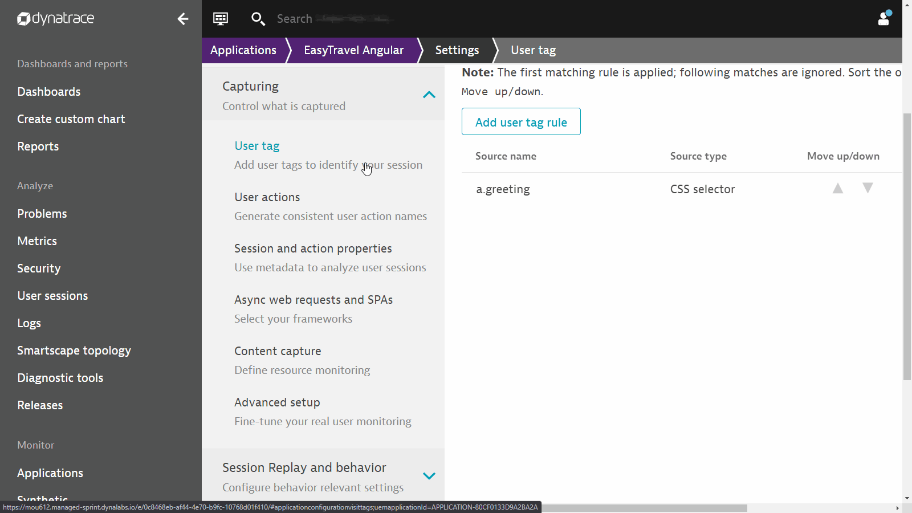
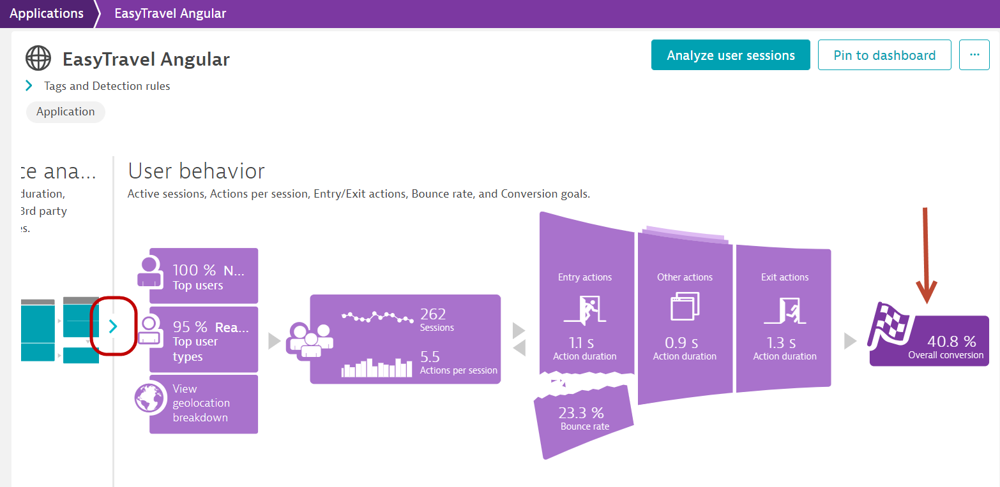
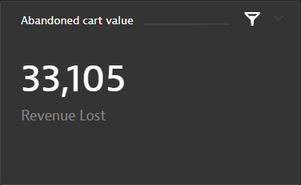
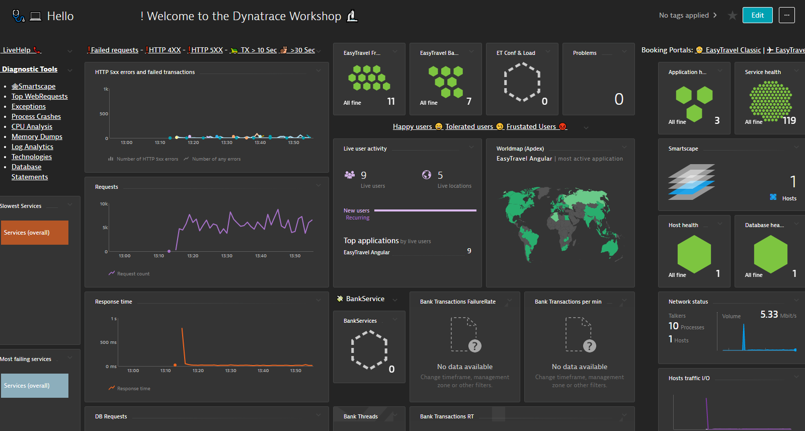

summary: BizOps with Dynatrace
id: biz-ops
categories: biz-ops
tags: biz-ops
status: Published 
Feedback Link: mailto:APAC-SE-Central@dynatrace.com
Analytics Account: UA-175467274-1

# BizOps with Dynatrace
<!-- ------------------------ -->
## Overview

This Repo contains the labs we are going to work though as part of the BizOps – Bridging the Gap to the Business Hands On Workshop.

For the purposes of the Hands-On, we will automate and make the steps seamless for the participants

### Prerequisites
- Access to a Dynatrace tenant/environment

### Lab Setup
The following steps are used for this lab:
- Sample Application 
    * Sample App is based on [Easy Travel](https://confluence.dynatrace.com/community/display/DL/easyTravel)
	* There are 2 interfaces running for Easy Travel - Classic UI and Angular UI

### What You’ll Learn
- Bring business context to IT metrics
  - Identify individual users for session analysis
  - Conversion goals
  - Session Replay
- Visualize the data and enhance collaboration between Ops and Line-of-business teams
- Action on the data
- Learn Dynatrace Capabilities such as
  * Session Replay
  * User Session Properties
  * User Session Query Language (USQL)
  * Dynatrace Dashboards

<!-- ------------------------ -->
## Task-1 - Bring business context to IT metrics

The goal of this exercise is to enhance the basic Real User Monitoring configuration in Dynatrace to bring business context to IT metrics. As such, we will not be going through the basic configuration of Dynatrace and have pre-setup the environment with the configuration:
* Organizing applications
* Enable JavaScript framework support​
* Logical grouping of user actions (configure User Action Naming​)

If you are interested in the basic setup, the following lab reference will be a good guide [Digital Experience Management with Dynatrace](https://dynatrace-apac.github.io/workshops/dem/index.html?index=..%2F..index#0)

## Task-1a - Identify individual users for session analysis

One of the key features of Dynatrace Real User Monitoring is the ability to uniquely identify individual users across different browsers, devices, and user sessions.

By default, Dynatrace assigns a unique, random ID to each new user. You can however assign more meaningful custom user tags that are comprised of, for example, user names or email addresses.

In this exercise, we will use the approach of tagging users based on ***page source***. This approach to user tagging works by capturing available data in your application’s page source.

The Easy Travel Angular app displays the user name at the top right hand corner. This is done via the text of a DOM element or a JavaScript variable. 

To configure this in Dynatrace,

1. Select Applications from the left navigation menu
2. Select the **EasyTravel Angular** application
3. Click the Browse button **(...)** and select **Edit**
4. Under the **Capturing** header, look for **User tag**
   
5. Click **Add user tag rule**
   - Source type: **CSS Selector**
   - CSS Selector field:
   ```
   a.greeting
   ```
   - Toggle Apply cleanup rule **on**
   - In the Regex box, copy the following
   ```
   Hi, (.*+)
   ```
6. Click on **Add user tag rule** button
7. Remember to click on **Save changes** button

Once the configuration is complete, this is how it should look like:


<details>
  <summary>How to get CSS selectors?</summary>
  
  ### How to get CSS selectors?
  1. Assess the EasyTravel Angular homepage
  2. Click on the **signin**
  3. Login with username: **alex** and password: **alex** and click **Next**
  4. Right click on the name **Alex Elliot** and click **inspect**
  5. Right click on the td element and select **Copy** > **Copy Selector**
  6. list
     * With some
     * Sub bullets
</details>

Positive
: Reference document: [Identify Individual Users for Session Analysis](https://www.dynatrace.com/support/help/how-to-use-dynatrace/real-user-monitoring/how-to-use-real-user-monitoring/cross-application-user-session-analytics/identify-individual-users-for-session-analysis/)


<!-- ------------------------ -->
## Task-1b - Creating Conversion Rates

Conversion goals are useful for understanding if users are meeting critical milestones in a user journey, for example, successful checkouts, newsletter signups, or demo signups

In this exercise, we will create conversion goals for the Easy Travel Angular application.

1. In the same screen as the previous task, scroll down to **Session Replay and behavior** heading, and select **Conversion Goals**
   
2. Click **Add goal** button and enter the following:
   - Name:
   ```
   Credit card validated
   ```
   - Type of goal: **User Action**  
   - Rule applies to: **XHR actions**  
   - Rule
     - **Page URL**
	 - **contains**
     ```
     easytravel/rest/validate-creditcard
     ```
   - The completed configuration look like this
     

<details>
  <summary>Validating conversion goal setting</summary>

  Check results aginst the application: **EasyTravel Angular** > **User behavior**  

  
</details>

<!-- ------------------------ -->
## Task-1c - Session and User action Properties

In this exercise, we will create session and user action properties to expose additional data to Dynatrace. This is useful for bringing additonal context regarding the users (e.g. campaign source, various items selected by users etc.) for analytics purposes.

Dynatrace has pre-defined a list of popular software that uses tags to give context to the sessions. Some of them are
- Google Analytics
- Adobe Analytics
- Tealeaf 
- Etc.

These are under the **Property pack** tab.

For additional data sources that can be extracted from your application, use **custom defined properties** to define string, numeric, and date properties for your monitored user actions and user sessions.

Property values are then captured as part of each of your users’ journeys. Property values can be leveraged for unrivaled visibility into all the details of your users’ interactions with your application.

1. In the same screen as the previous task, go to the **Capturing** heading, and select **Session and action properties**
   
2. Click on the button **Add properties**

### Property packs - Google Analytics/Adobe/UTM codes etc.
Since these are pre-defined, all we need to do is to select from the list. In this section, we will select the following:
- Click on the drop down, select **web properties**
- Under **Configure properties**, select the corresponding **Add** button for the following:
  - UTM Source
  - UTM campaign
  - UTM term
  
- Click on **Next**
- Expand each of the items and toggle the **store as user action property**
  
- Click on **Create properties**

### Custom properties - Transaction amount of each user
- Select the **Custom defined property** tab
- Select the Expression type: **Server side request attribute**
- Request attribute name: **Revenue**
- Display name:
  ```
  Booking
  ```
- (auto fill) Key: **booking**
- Storage type:
  - Store as **session** property
- Click **"Save property"**

Here is how the completed configuration will look like:


### Custom properties - Browsed travel package amount
Following the above configuration, continue to add a CSS Selector type of custom properties
- Expression type: **CSS Selector**
- Data type: **Double**
- CSS Selector
  ```
  #summary > div:nth-child(5) > p
  ```
- Display name:
  ```
  Trip Cost
  ```
- (auto fill) Key: **tripcost**
- Storage type:
  - Store as **session** property
- Click **"Save property"**

Here is how the completed configuration will look like:


### Custom properties - Travel destination browsed/booked
- Expression type: **Server side request attribute**
- Request attribute name: **Destination**
- Display name:
  ```
  Destination
  ```
- (auto fill) Key: **destination**
- Storage type:
  - Store as **session** property
  - Store as **user action** property
- Click **"Save property"**

Here is how the completed configuration will look like:


### Completed configuration screen
Once everything is configured, you should have this list of session/useraction properties:


<aside class="positive">
Reference documents
- [Session Properties Help page](https://www.dynatrace.com/support/help/shortlink/user-session-properties)
- [Request Attribute Help page](https://www.dynatrace.com/support/help/shortlink/request-attributes)
</aside>

<!-- ------------------------ -->
## Task-1d - Session Replay
In this exercise, we will cover configuring Session Replay in Dynatrace.

Follow the steps below to enable session Replay:

1. In the same screen as the previous task, scroll down to **Session Replay and behavior** heading, and select **Session Replay**
2. Toggle ON **Enable Session Replay**
   
3. Scroll down to **Recoding mask settings** tab, select **Mask user input**
   
4. Click on the **Playback masking settings** tab, select **Mask user input**
   
5. Finally, scroll all the way down down and Click on **Save**
   

Positive
: Reference document: [Session Replay](https://www.dynatrace.com/support/help/how-to-use-dynatrace/real-user-monitoring/basic-concepts/session-replay/)

<!-- ------------------------ -->
## Task-2 - Visualize the data

We are now ready to visualize the data collected in Dynatrace. In this exercise, you can see how **conversion goals**, **session/action properties** can provide much more insights and context to the IT metrics for analysis.

This is the dashboard that we will aim to create.


<!-- ------------------------ -->
## Task-2a - Visualize Payment funnel

Positive
: Goal: to visulize a user journey when user is making a payament on your site


1. Navigate to **Dashboards** on the left hand naviation menu
2. Click on the buton **Create Dashboard** and enter a name and click on **Create**
3. Drag a **User Sessions Query** tile and click on **Configure tile**
   
4. Enter the following query:
   ```SQL
   SELECT FUNNEL(useraction.name like "*journeys*" AS "Journey Search", useraction.name = "click on book now (xhr: /easytravel/rest/journeys/)" AS "Click on Book Now", useraction.name = "click on sign in (xhr: /easytravel/rest/login)" AS "Login", useraction.name="click on book journey  (xhr: /easytravel/rest/validate-creditcard)" AS "Submit Payment") FROM usersession
   ```
5. Click on the **run query** button
6. Rename this to
   ```
   Payment funnel
   ```
7. Click on the **save changes to dashboard** button


<!-- ------------------------ -->
## Task-2b - Visualize Business KPI metrics

Positive
: Goal - to visulize some critical metrics to indicate health of business

### Conversion over time

Positive
: Purpose - Conversions over time help to track the trend in meeting conversion goals. Very low conversion rates indicate that your customers are facing friction in completing the customer journey.


1. While having the Dashboard in **Edit** mode, click on the previously created tile and click on the **clone** button, then click on the **configure tile** button
   
2. Enter the following query:
   ```SQL
   select datetime(starttime, "E HH:mm", "10m"), count(*) as "Conversions" from usersession where useraction.matchingConversionGoals="Credit card validated" group by datetime(starttime,"E HH:mm","10m")
   ```
3. Click on the **run query** button
4. Select **Line chart**
5. Rename this to
   ```
   Conversions over time
   ```
6. Click on the **save changes to dashboard** button


### Booking Revenue

Positive
: Purpose - Since Easy Travel is a travel booking site, the main business KPI is to ensure a steady stream of booking revenue. Depending on your "business" drivers, these KPIs can range be a wide range.


1. Clone the tile from above and click on **configure tile**
2. Modify the query:
   ```SQL
   select sum (doubleProperties.booking) as Revenue from usersession
   ```
3. Click on the **run query** button
4. It will automatically select a **Single value**
5. Rename this to
   ```
   Booking revenue
   ```
6. Click on the **save changes to dashboard** button


### Abandoned cart totals

Positive
: Purpose - Often, the "basket value" of a virtual "shopping cart" are potentially the amount that your visitors to your site will transact. However, for whatever reason, like a payment failure or an invalid promo code, will cause your visitors to abandon the entire transaction or change the items in the "shopping cart". Tracking this value and also the list of users affected will give you an indication if your visitors are dropping out before "checkout" or "purchase" and arrest the problem before it impacts the business.



1. Clone the tile from above and click on **configure tile**
2. Modify the query:
   ```SQL
   SELECT sum (doubleProperties.tripcost) as "Revenue Lost" from usersession where useraction.matchingConversionGoals IS NULL AND doubleProperties.tripcost > 0
   ```
3. Click on the **run query** button
4. It will automatically select **Single value**
5. Rename this to
   ```
   Abandoned cart value
   ```
6. Click on the **save changes to dashboard** button


### Users affected by an abandoned cart


1. Clone the tile from above and click on **configure tile**
2. Modify the query:
   ```SQL
   SELECT userid from usersession where useraction.name = "click on book journey  (xhr: /easytravel/rest/validate-creditcard)" and doubleProperties.booking is null
   ```
3. Click on the **run query** button
4. Select **Table only**
5. Rename this to
   ```
   Users affected by abandoned cart
   ```
6. Click on the **save changes to dashboard** button


<!-- ------------------------ -->
## Task-3 - Action on the data

Let's challange DAVIS :tm:!

Access the EasyTravel Angular actual booking application
- Open Dashboards
- Click on the **...Welcome to the Dynatrace Workshop 🔬** Dashboard
- Click on the **Booking Portals:✈ EasyTravel Angular** link
  
- Book a travel package
- You can use userid **alex** or **peter**
- What do you notice?
- Try clicking on **(3) Payment** multiple times
- Before you close your browser, do the following:
  - Open your browser's **developer tools**
    
  - Go to **Console tab**
  - Type the following:
    ```console
	dtrum.endSession()
	```
    

### Scenario #1
**Conversions** are dropping! And so is **Revenue**!


However, the monitoring dashboards of IT Operations team show all systems are **green**!


Even if it is not an IT issue, something must be causing vistors to be **frustrated** and not completing the transactions. 

Negative
: Use Dynatrace to determine what is causing friction to your visitors.

> ***Hint:***
>
> Some dashboards in the **Sample BizDevOps Dashboard** might give a clue to what is happening.
>
> 
>
> Also, investigating some user sessions together with **Session Replay** might uncover some facts about your application that cannot be detected by logs or investigating application code.

### Scenario #2
DAVIS has detected an Anomaly! You also have observed that there are users who are affected and have abandoned their booking process!


Negative
: Will you be faster than DAVIS in determining the root cause?

> ***Hint:***
>
> The dashboard that you created just now would have contain all the information for you to understand what is causing errors.
>
> You can start with the **Problem** tile and drill down from there.
>
> You can also investigate each individual user session.

<!-- ------------------------ -->

## Feedback

We hope you enjoyed this lab and found it useful. We would love your feedback!
<form>
  <name>How was your overall experience with this lab?</name>
  <input value="Excellent" />
  <input value="Good" />
  <input value="Average" />
  <input value="Fair" />
  <input value="Poor" />
</form>

<form>
  <name>What did you benefit most from this lab?</name>
  <input value="Learning Digital Business Analytics" />
  <input value="User Session Properties setup" />
  <input value="How to use Dynatrace to improve BizDevOps colloabration" />
  <input value="Advanced Dashboard Configurator Setup" />
</form>

<form>
  <name>How likely are you to recommend this lab to a friend or colleague?</name>
  <input value="Very Likely" />
  <input value="Moderately Likely" />
  <input value="Neither Likely nor unlikely" />
  <input value="Moderately Unlikely" />
  <input value="Very Unlikely" />
</form>

Positive
: 💡 For other ideas and suggestions, please **[reach out via email](mailto:APAC-SE-Central@dynatrace.com?subject=BizOps - Ideas and Suggestions")**.