id: biz-ops-jp
summary: Davis AIによるBizDevOpsの実現
categories: biz-ops, business-analytics
tags: biz-ops, Intermediate
status: Published
authors: Katsuyoshi Sumida
Feedback Link: mailto:DT-TYO-SE@dynatrace.com
new: 1
Analytics Account: UA-175467274-1

# DynatraceによるBizDevOps
<!-- ------------------------ -->
## はじめに
Duration: 5

このリポジトリには、BizDevOpsのためのハンズオンで実施する内容が含まれています。

### 事前準備
* DynatraceのAccount：[フリートライアルの申し込み](https://www.dynatrace.com/ja/trial/)
* Chrome ブラウザ

**Dynatrace主催のハンズオンワークショップへ参加されている方にはDynatraceの環境が自動で払い出されるため
フリートライアルから申し込んでいただく必要はありません。**

### 学習内容
- Real User Monitoringの強化：メトリクスとビジネスコンテキストの紐付け
  - セッション分析のための個別ユーザーの識別：ユーザータグの設定
  - コンバージョンゴールの設定・確認
  - セッションとユーザーアクションのプロパティ
  - セッションリプレイの設定
- ダッシュボードによるビジネスKPIの可視化
- Dynatraceによるフロントエンドエラーの確認
- Core Web Vitalsによるフロントエンドパフォーマンスの確認
- CSSセレクターの取得方法
- リクエストアトリビュートによるサーバーサイドとフロントエンドの紐付け

### サンプルアプリケーション
このラボでは、サンプルアプリケーションとして[easyTravel](https://community.dynatrace.com/t5/Getting-started/easyTravel-Documentation-and-Download/td-p/181271)を使用します。
easyTravelには2つのインターフェースがあります。

- Classic
	
- Angular
	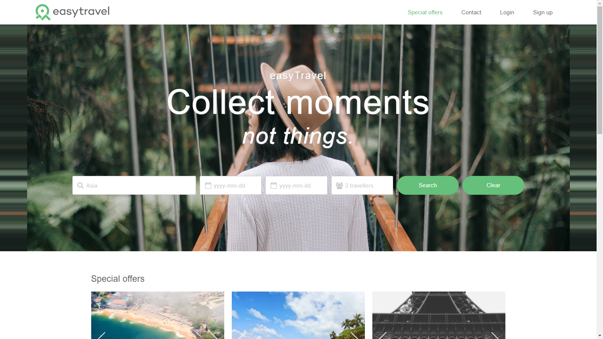

## Real User Monitoringの強化：メトリクスとビジネスコンテキストの紐付け
Duration: 5

この演習ではDynatraceの基本的なReal User Monitoringの構成を強化し、メトリクスとビジネスコンテキストを紐付ける方法について学びます。そのため、以下の基本的な設定についてはあらかじめ設定済みとなります。
- アプリケーション検出ルールの作成
- JavaScriptフレームワークの有効化
- ユーザーアクションネーミングの設定

基本的な設定に興味のある方は[Dynatraceによるデジタル・エクスペリエンス・マネジメント](https://learn.dynatracelabs.com/workshops/dem-jp/index.html)を参考にしてください。

## セッション分析のための個別ユーザーの識別：ユーザータグの設定
Duration: 10

Real User Monitoringの重要な機能の一つに、異なるブラウザ、デバイス、ユーザーセッション間で個々のユーザーを一意に識別する機能があります。

デフォルトでは、Dynatraceは各新規ユーザーにユニークでランダムなIDを割り当てます。しかし、ユーザー名や電子メールアドレスなどで構成される、より意味のあるカスタムユーザータグを割り当てることができます。
この演習では、**ページソース**に基づいてユーザーをタグ付けします。ユーザーのタグ付けの方法は、アプリケーションのページソースから利用可能なデータを取り込むことで機能します。

Easy Travel Angularアプリでは、ユーザー名は右上に表示されています。
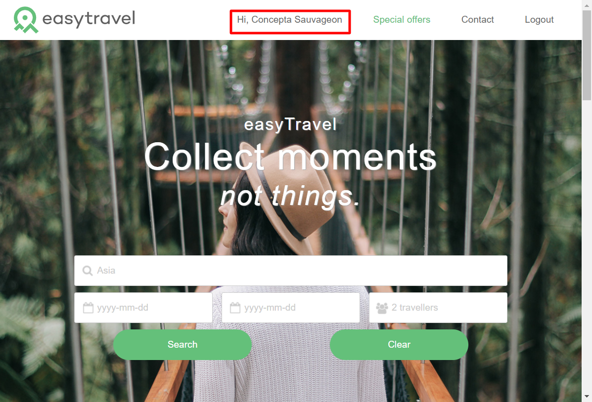

### Dynatraceによるユーザーのタグ付け設定

ブラウザを開き、DynatraceのGUIにアクセスしてください。

以下の手順で進めてください。

- 左側のメニューから**アプリケーションとマイクロサービス > フロントエンド** を開きます。
- **EasyTravel Angular**を開きます。

Negative
: 設定をする前に**ユーザー セッションの分析**を開いて、全てのユーザー名が**匿名**となっていることを確認します。

- **メニューボタン（…）**をクリックし、**編集**をクリックして、設定画面を開きます。
- **Capturing > User tag**を開きます。
  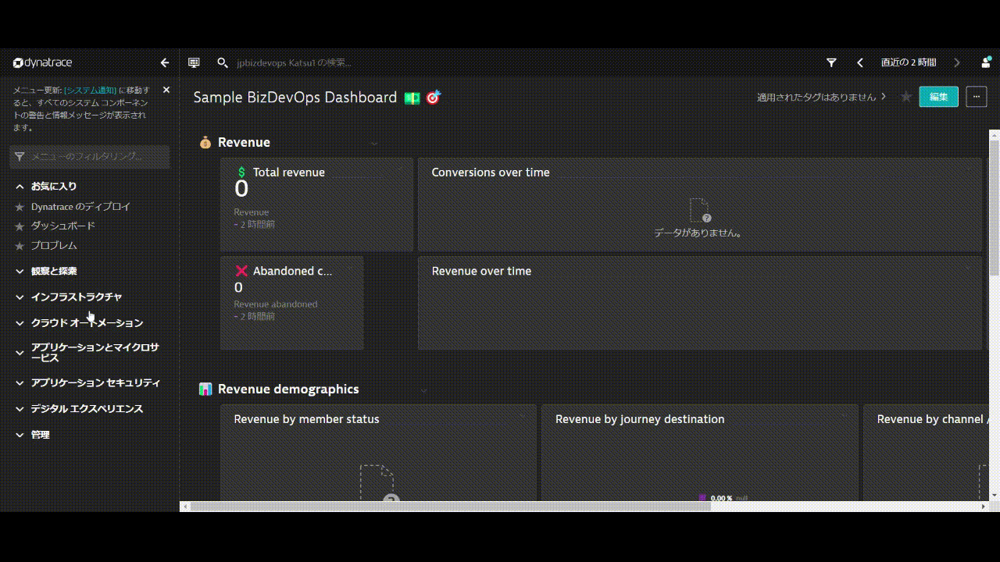
- **Add user tag rule**ボタンをクリックし、以下のように入力します。
  - **Source type:** `CSS selector`
  - **CSS selector** `a.greeting`
  - **Apply cleanup rule**を有効にします。
  - **Regex** `Hi, (.*+)`
    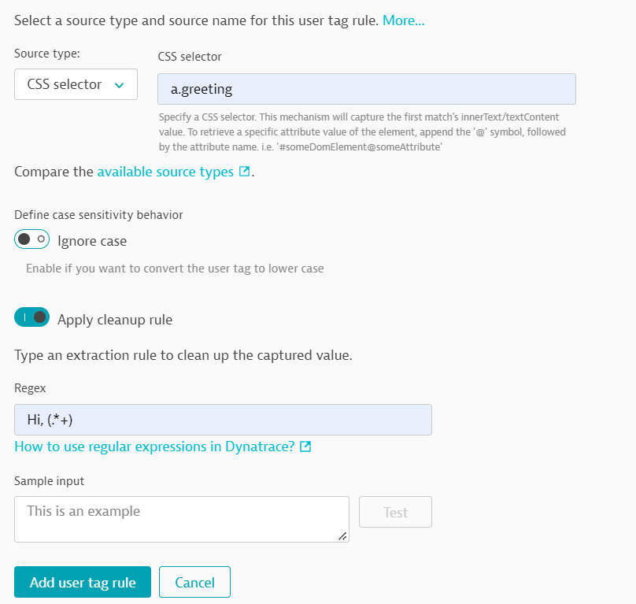
- **Add user tag rule**ボタンをクリックします。
- **変更の保存**ボタンをクリックします。

Positive
: 詳しいドキュメントは[こちら](https://www.dynatrace.com/support/help/shortlink/user-tagging)を参照ください。

## コンバージョンゴールの設定・確認
Duration: 10

この演習では、easyTravel Angularにコンバージョンゴールを設定し、コンバージョン結果を確認します。コンバージョンゴールとは、サイトを訪れたユーザーが行う会員登録や資料請求、購入といった重要なアクションのことであり、その割合はマーケティング指標として重要な指標となります。

### コンバージョンゴールの設定

- ユーザーのタグ付け時と同様に**EasyTravel Angular**の設定画面を開きます。
- **Behavior analytics > Conversion goals**を開きます。
  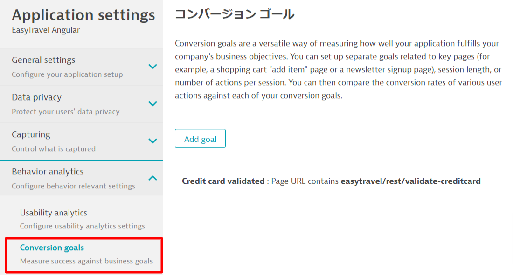
- **Add goal**ボタンをクリックし、以下のように入力します。
  - **Name:** `Credit card validated`
  - **Type of goal:** `User Action`
  - **Rule applies to:** `XHR actions`
  - **Rule:**
    - `Page URL`
    - `contains`
    - `easytravel/rest/validate-creditcard`
- **Add goal**ボタンをクリックします。
  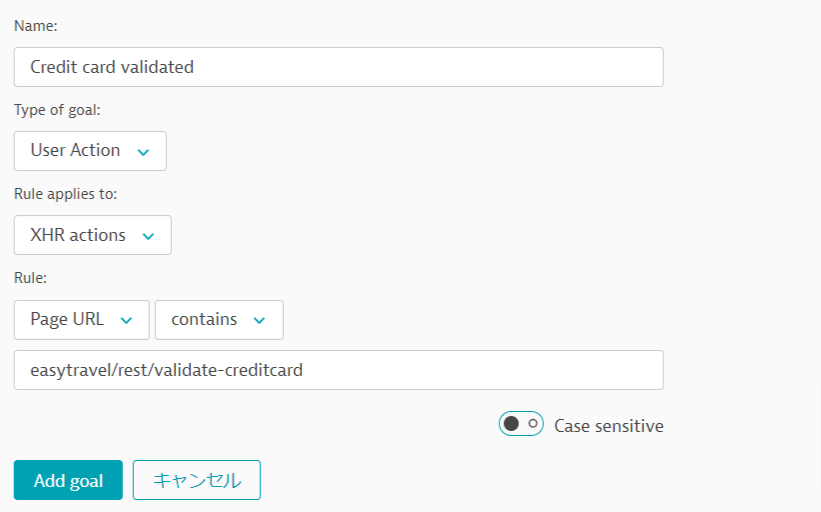

### コンバージョンゴールの確認

どの程度の割合でコンバージョンに至ったか結果を確認します。

- **アプリケーションとマイクロサービス > フロントエンド**を開き、**EasyTravel Angular**をクリックします。
- **ユーザー行動**を開くことでコンバージョンレートを確認できます。
- **全体的なコンバージョン**をクリックすることで、**コンバージョンの傾向**を確認することができます。
- **上位コンバージョン ゴール**ではコンバージョンゴールを複数設定した場合に、各コンバージョンゴールの割合を確認できます。
  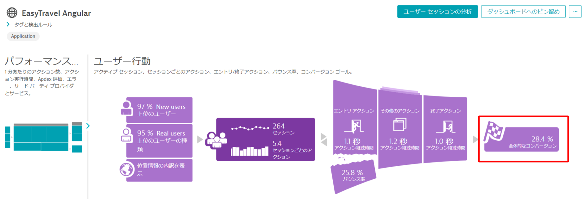
  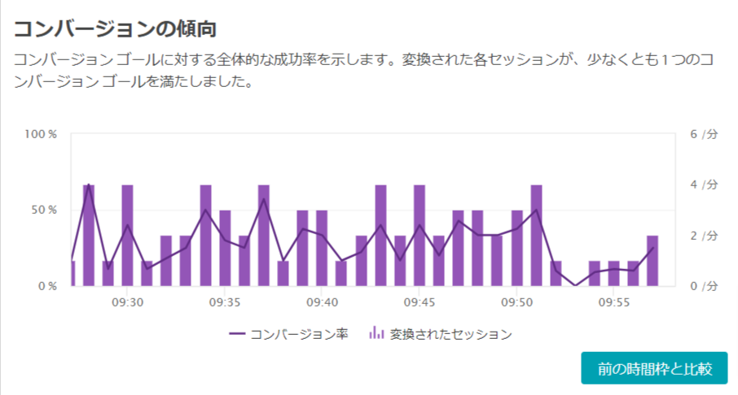
  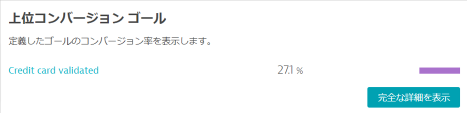

Negative
: トラフィックをある程度発生させる必要があるため、しばらく時間をおいてから試す必要があります。

Positive
: 詳しいドキュメントは[こちら](https://www.dynatrace.com/support/help/shortlink/conversion-goals)を参照ください。

## セッションとユーザーアクションのプロパティ
Duration: 15

この演習では、セッションプロパティとユーザーアクションプロパティを作成して、ユーザーに関する追加のコンテキスト情報（キャンペーンのソースやユーザーが選択した情報やユーザーの属性など）をDynatraceで確認します。ビジネスKPIに関する情報を追加することでよりビジネスの可視性を向上させることが可能となります。

Dynatraceでは、一般的なソフトウェアのリストを**Property packs**として予め定義しています。以下のリストはその一部となります。
- Google Analytics
- Adobe Analytics
- Web properties
また、**Custom defined property**を使用して、セッションやユーザーアクションに文字列、数値および日付のプロパティを定義することが可能です。プロパティの値は、ユーザー毎に取得されます。プロパティ値を活用することで、ユーザーの動向の詳細を把握することができます。

### セッションとアクションプロパティの設定

- ユーザーのタグ付け時と同様に**EasyTravel Angular**の設定画面を開きます。
- **Capturing > Session and action properties**を開きます。
- **Add property**ボタンをクリックします。
  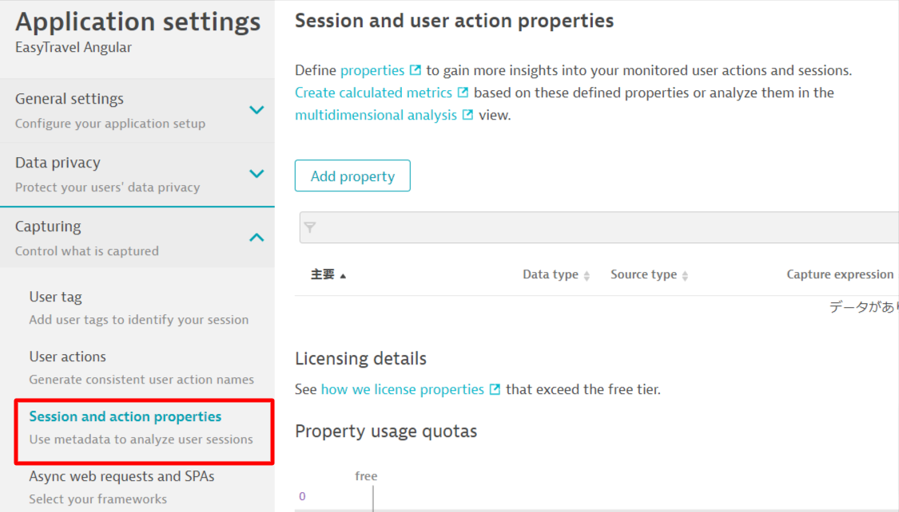

### Property packsの利用
デフォルトで定義されているプロパティについてはリストから選択するだけで簡単に登録することができます。

- ドロップダウンリストから**Web properties**を選択します。
- 以下の項目に対して、**追加**ボタンをクリックし、**次へ**をクリックします。
  - UTM source
  - UTM campaign
  - UTM term
    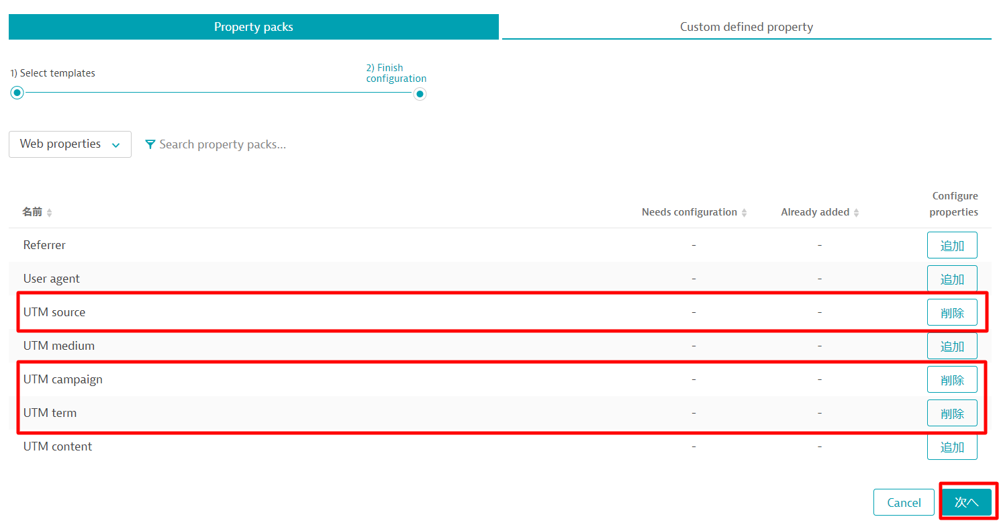
- 各項目を展開して、**Store as user action property**を有効にします。
- 3項目全て、有効にしたら**Create properties**ボタンをクリックします。
  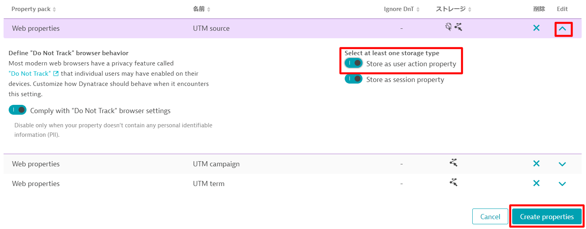

### Custom defined propertyの設定 - ユーザーの売り上げ額
ここでは、カスタム定義プロパティとして、サーバーサイドのリクエスト属性から売り上げ額を取得し、その情報をセッションと紐付けます。
Dynatraceではサーバーサイドで取得した情報をフロントエンド側へ簡単に紐付けることができるのも特徴の１つです。

- **Add property**ボタンをクリックします。
- **Custom defined property**タブを選択し、以下の通りに入力します。
  - **Expression type** `Server side request attribute`
  - **Request attribute name** `Revenue`
  - **Display name** `Booking`
  - `Store as session property`を有効
    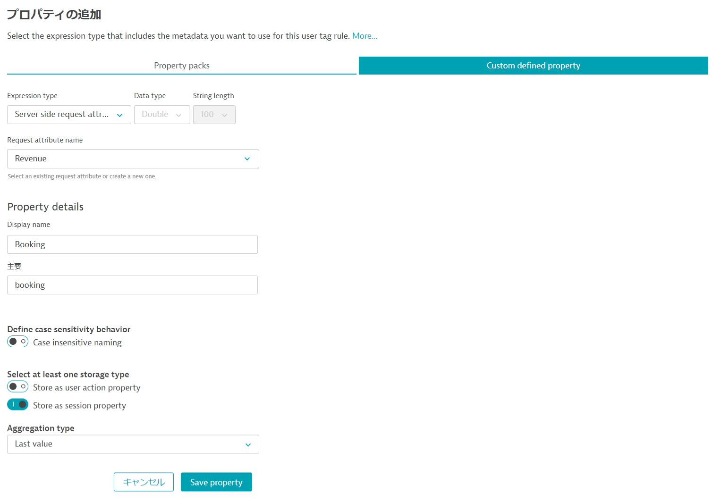
- **Save property**ボタンをクリックします。

### Custom defined propertyの設定 - 閲覧した旅行パッケージの金額
上記の設定に続いて、CSSセレクターによるカスタムプロパティを追加します。CSSセレクターによるカスタムプロパティはページ上に表示されている情報をプロパティとして取り込むことが可能です。

- **Add property**ボタンをクリックします。
- **Custom defined property**タブを選択し、以下の通りに入力します。
  - **Expression type** `CSS selector`
  - **Data type** `Double`
  - **CSS selector** `#summary > div:nth-child(5) > p`
  - **Display name** `Trip Cost`
  - `Store as session property`を有効
    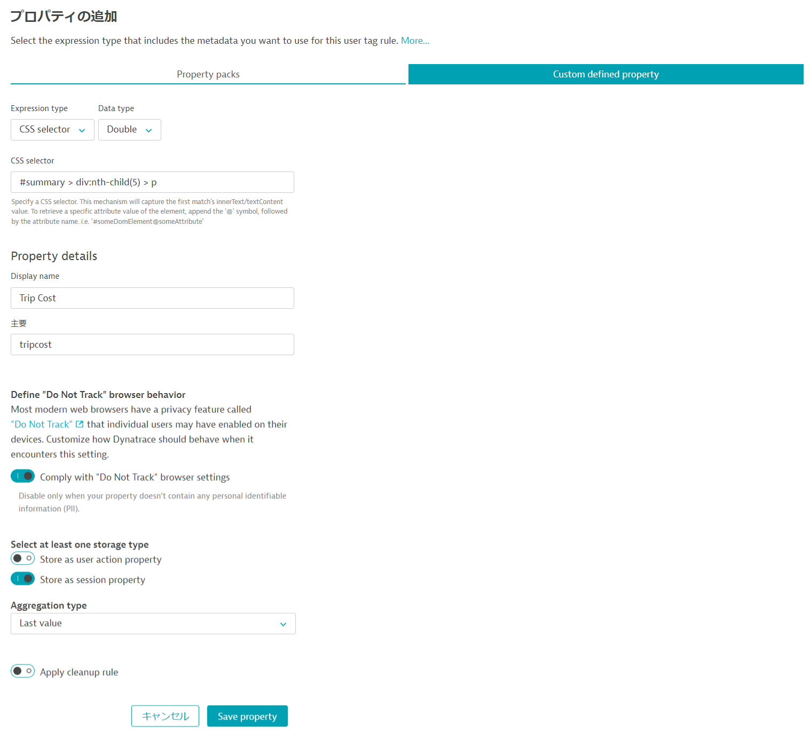
- **Save property**ボタンをクリックします。

### Custom defined propertyの設定 - 閲覧・予約した旅行先
リクエスト属性から旅行先を取得し、カスタムプロパティとして取り込みます。

- **Add property**ボタンをクリックします。
- **Custom defined property**タブを選択し、以下の通りに入力します。
  - **Expression type** `Server side request attribute`
  - **Request attribute name** `Destination`
  - **Display name** `Destination`
  - `Store as user action property`と`Store as session property`の両方を有効
    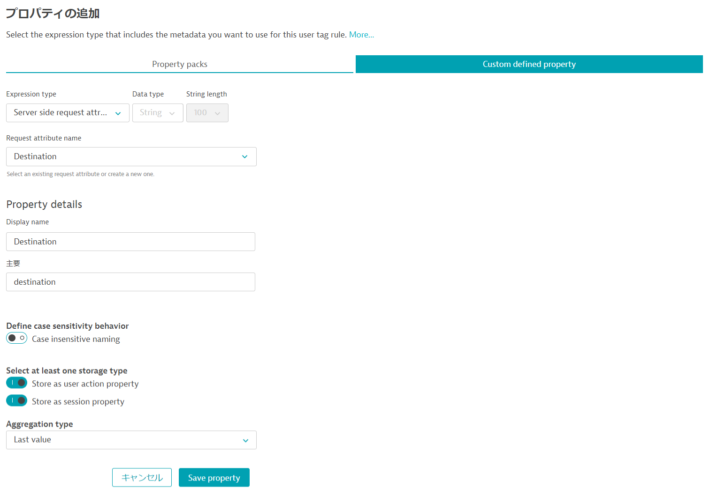
- **Save property**ボタンをクリックします。

### 設定完了画面
すべての設定が完了すると、次のようなセッション/ユーザーアクションプロパティのリストとなります。
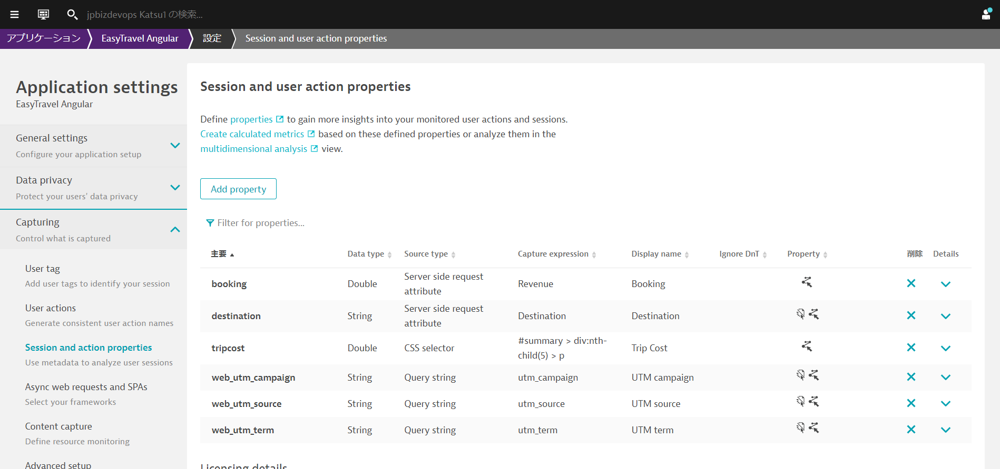

Negative
: トラフィックをある程度発生させる必要があるため、しばらく時間をおいてから試す必要があります。

Positive
: 詳しいドキュメントは[こちら](https://www.dynatrace.com/support/help/shortlink/user-session-properties)を参照ください。

## Session Replay
Duration: 10

この演習では、Session Replayの設定について説明します。Session Replayを使用することで、ユーザー体験や実際の操作内容をムービーライクに確認することができるためトラブルシューティングなどにより効果的です。

### Session Replayの設定

- ユーザーのタグ付け時と同様に**EasyTravel Angular**の設定画面を開きます。
- **General settings > Enablement and cost control**を開きます。
- **Enable Session Replay**を有効にし、**Cost and traffic control**を適切な値に設定します。ハンズオンでは`100`%のままにします。
- **変更の保存**ボタンをクリックします。
  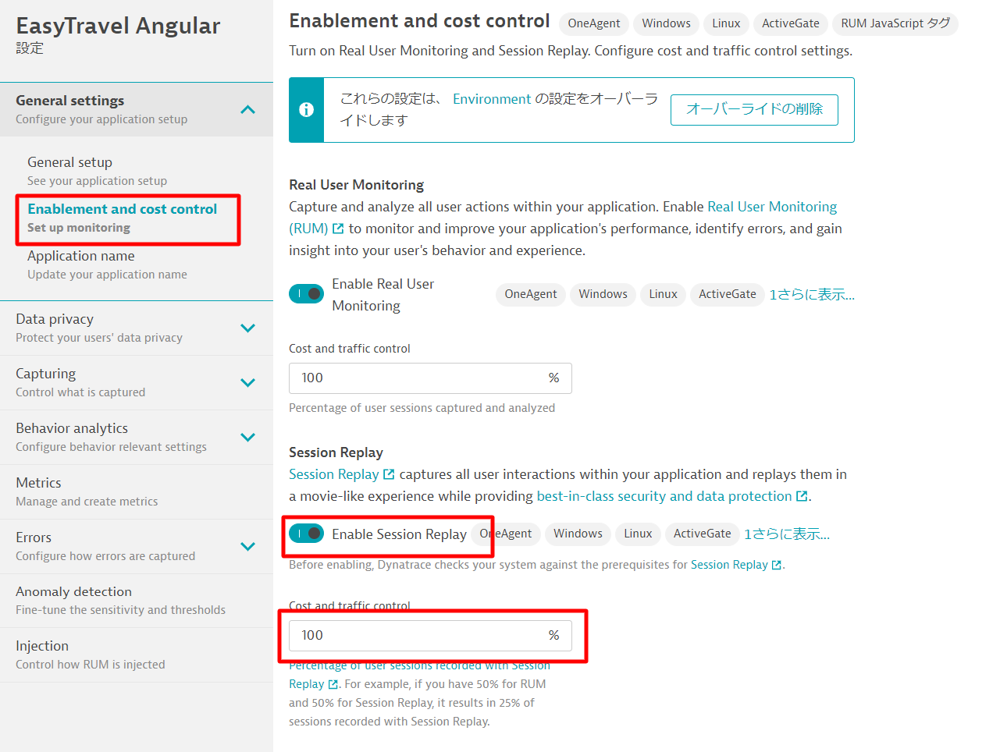

続いてマスキングの設定を行います。マスキングについてはレコーディング時にマスキングする内容と再生時にマスキングする項目を選ぶことができます。レコーディング時にマスキングすると設定した内容については、データが保存されないため秘匿性は高くなりますが、実際の表示内容を確認することができません。

- **Data privacy > Session Replay**を開きます。
- **Recoding masking settings**へスクロールダウン、**Mask user input**を選択します。
- **Playback masking settings**へスクロールダウン、**Mask user input**を選択します。
- **変更の保存**ボタンをクリックします。
  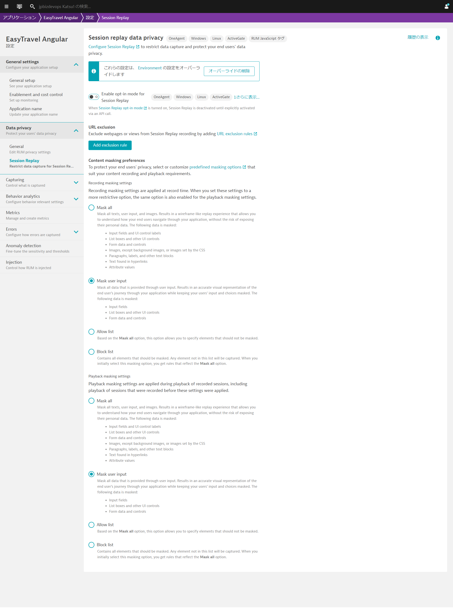

### Session Replayの確認

- **アプリケーションとマイクロサービス > フロントエンド**を開き、**EasyTravel Angular**をクリックします。
- **ユーザーセッションの分析**ボタンをクリックします。
- Replay欄にアイコンが表示されているセッションがSession Replayを保存しているセッションになります。
  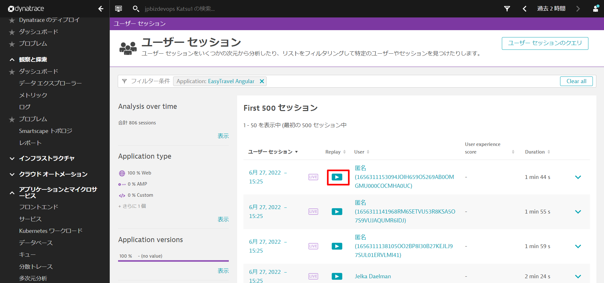
- ユーザーセッションの下の**日時**をクリックし、画面を下にスクロールして分析ビューで**セッションリプレイ**を選びます。
- Chrome拡張をインストールします。
- インストールが終わったら、ブラウザを更新するとSession Replayを再生することができます。
  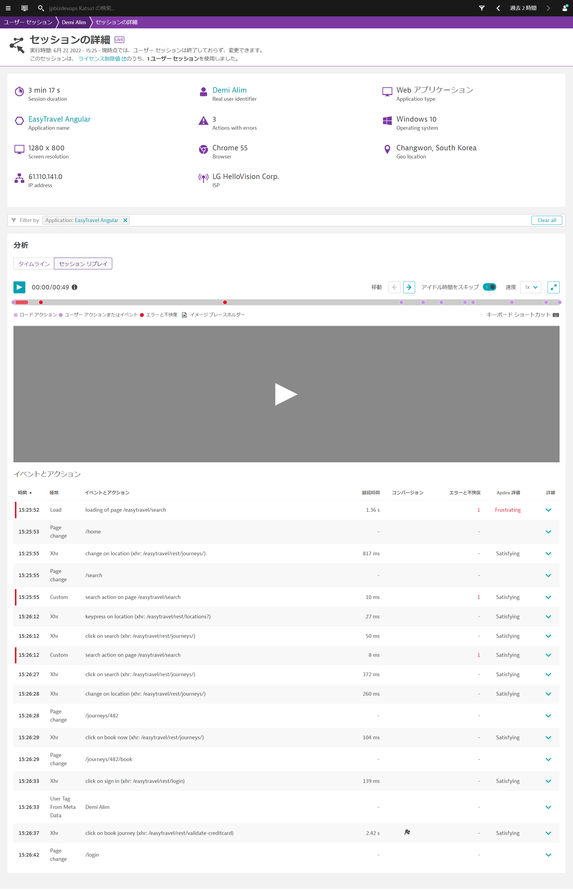

Positive
: 詳しいドキュメントは[こちら](https://www.dynatrace.com/support/help/shortlink/session-replay-personal-data)を参照ください。

## ダッシュボードによるビジネスKPIの可視化
Duration: 25

Dynatraceで収集したデータを可視化する準備が整いました。この演習では、設定した**コンバージョン目標**、**session/action properties**などの情報を基にビジネスKPIを確認するためのダッシュボード作成を行います。

これが、これから作成するダッシュボードの完成イメージになります。
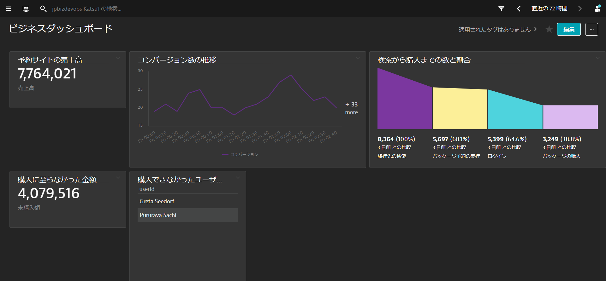

### ダッシュボードの作成

まずはじめにベースとなる空のダッシュボードの作成を行います。

- 左側のメニューの**お気に入り**もしくは**観察と探索**から**ダッシュボード**を開きます。
- **ダッシュボードの作成**ボタンをクリックします。
  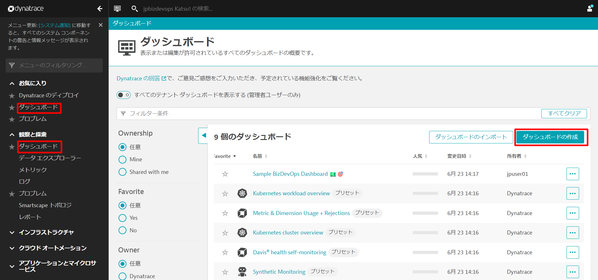

- ダッシュボード名に任意の名前を入力します（例：`ビジネスダッシュボード`）
  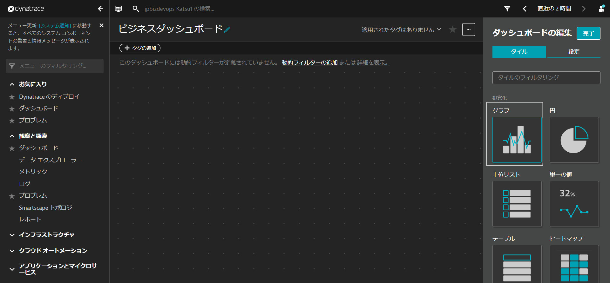

### 収益額

Positive
: Easy Travelは旅行予約サイトなので、主なビジネスKPIとして売り上げ金額は最重要な指標となります。

- ダッシュボードが編集モードでない場合は、**編集**ボタンをクリックして編集モードにします。
  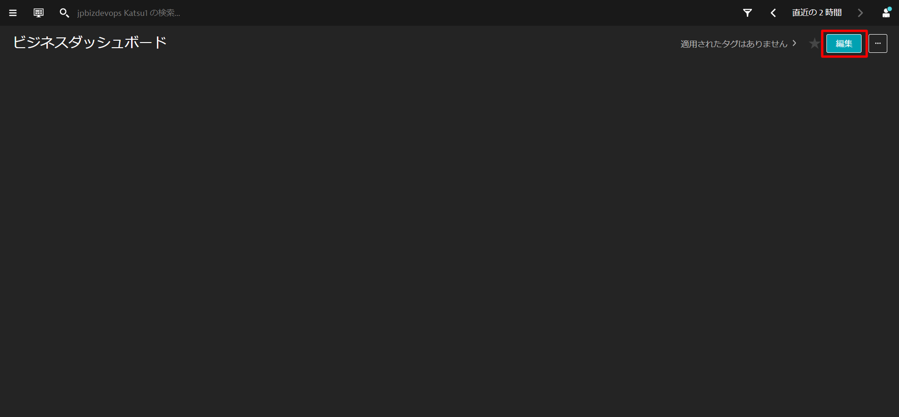
- **タイルのフィルタリング**欄に`クエリ`と入力し、**ユーザーセッションのクエリ**タイルをダッシュボードの任意の部分にドラッグアンドドロップします。
  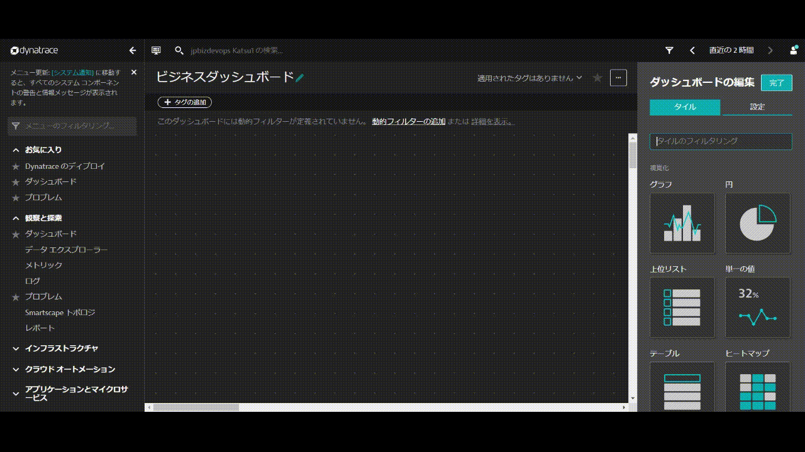
- **タイルの設定**をクリックします。ユーザー セッションのクエリ画面に遷移します。
- クエリ入力欄に以下を入力し、**クエリの実行**ボタンをクリックします。

  ```SQL
  SELECT SUM(doubleProperties.booking) as "売上高" FROM usersession
  ```

- **単一の値**が自動的に選択されていることを確認します。
- 名前（User sessions query results）の横のペンシルマークをクリックして、名前をわかりやすいものに変更します（例：`予約サイトの売上高`）。
  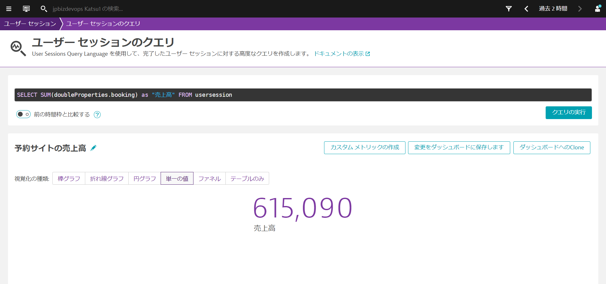
- **変更をダッシュボードに保存します**ボタンをクリックします。自動でダッシュボードの画面に戻ります。

### コンバージョン数の時間軸グラフの作成

時間帯によってコンバージョン数がどのように変化するかを確認するためのグラフを作成します。

- ダッシュボードが編集モードでない場合は、**編集**ボタンをクリックして編集モードにします。
- **タイルのフィルタリング**欄に`クエリ`と入力し、**ユーザーセッションのクエリ**タイルをダッシュボードの任意の部分にドラッグアンドドロップします。
- **タイルの設定**をクリックします。ユーザー セッションのクエリ画面に遷移します。
- クエリ入力欄に以下を入力し、**クエリの実行**ボタンをクリックします。

  ```SQL
  SELECT DATETIME(startTime, "E HH:mm", "10m"), COUNT(*) AS "コンバージョン" FROM usersession WHERE useraction.matchingConversionGoals="Credit card validated" GROUP BY DATETIME(startTime,"E HH:mm","10m")
  ```

- 視覚化の種類は**折れ線グラフ**を選びます。
- 名前をわかりやすいものに変更します（例：`コンバージョン数の推移`）
  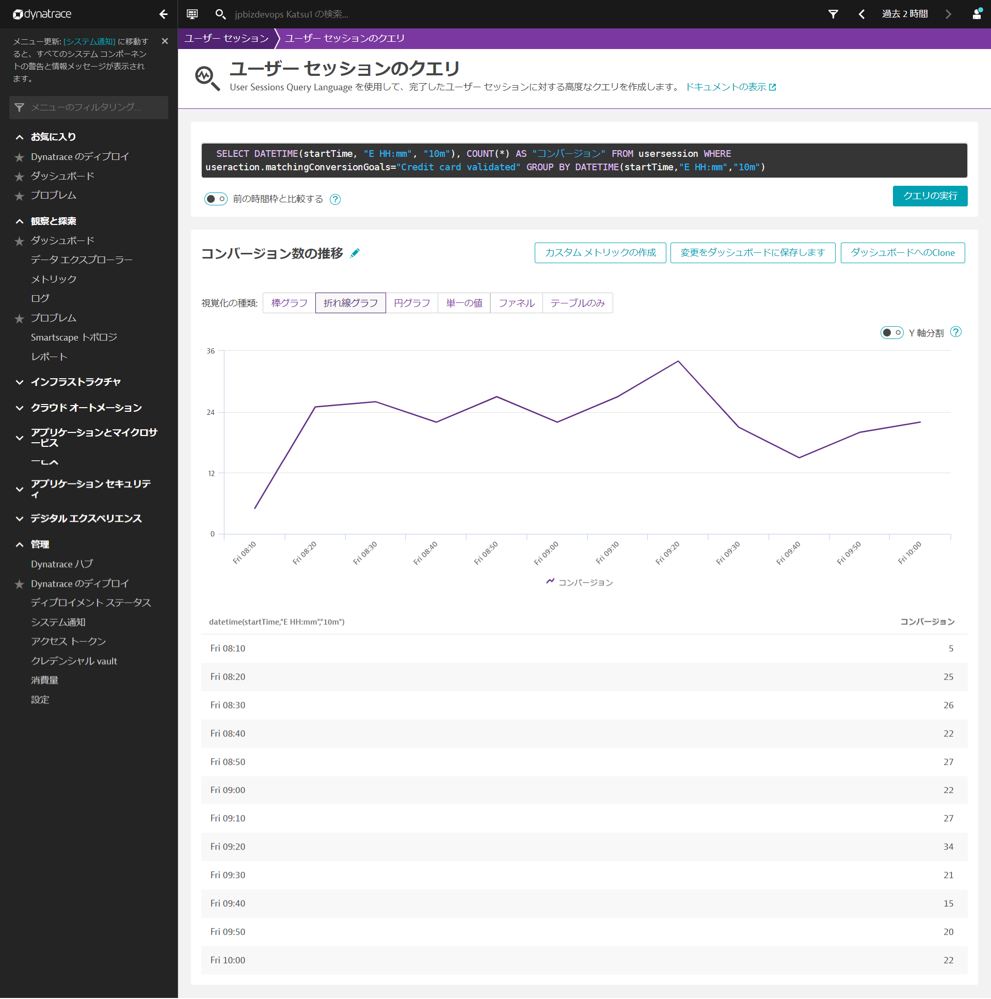
- **変更をダッシュボードに保存します**ボタンをクリックします。自動でダッシュボードの画面に戻ります。
- 作成したタイルの右下の●の部分をドラッグして任意の大きさに広げたり、必要に応じてドラッグすることでタイルの場所を移動させます。

### ファンネルチャートの作成

ステップ毎の割合を表示するファンネルチャートを作成します。ファンネルチャートは各ステップでどの程度のユーザーが次のステップに進んでいるのか確認するのに役立ち、どこの段階に問題があるのかを視覚的に把握することができます。

- ダッシュボードが編集モードでない場合は、**編集**ボタンをクリックして編集モードにします。
- **タイルのフィルタリング**欄に`クエリ`と入力し、**ユーザーセッションのクエリ**タイルをダッシュボードの任意の部分にドラッグアンドドロップします。
- **タイルの設定**をクリックします。ユーザー セッションのクエリ画面に遷移します。
- クエリ入力欄に以下を入力し、**前の時間枠と比較する**を有効にします。これにより以前の時間枠との比較が容易に行うことができます。また、ここでは**動的時間枠シフト**のままにしておきます。
- **クエリの実行**ボタンをクリックします。

  ```SQL
  SELECT FUNNEL(useraction.name like "*journeys*" AS "旅行先の検索", useraction.name = "click on book now (xhr: /easytravel/rest/journeys/)" AS "パッケージ予約の実行", useraction.name = "click on sign in (xhr: /easytravel/rest/login)" AS "ログイン", useraction.name="click on book journey  (xhr: /easytravel/rest/validate-creditcard)" AS "パッケージの購入") FROM usersession
  ```

- 名前をわかりやすいものに変更します（例：`検索から購入までの数と割合`）。
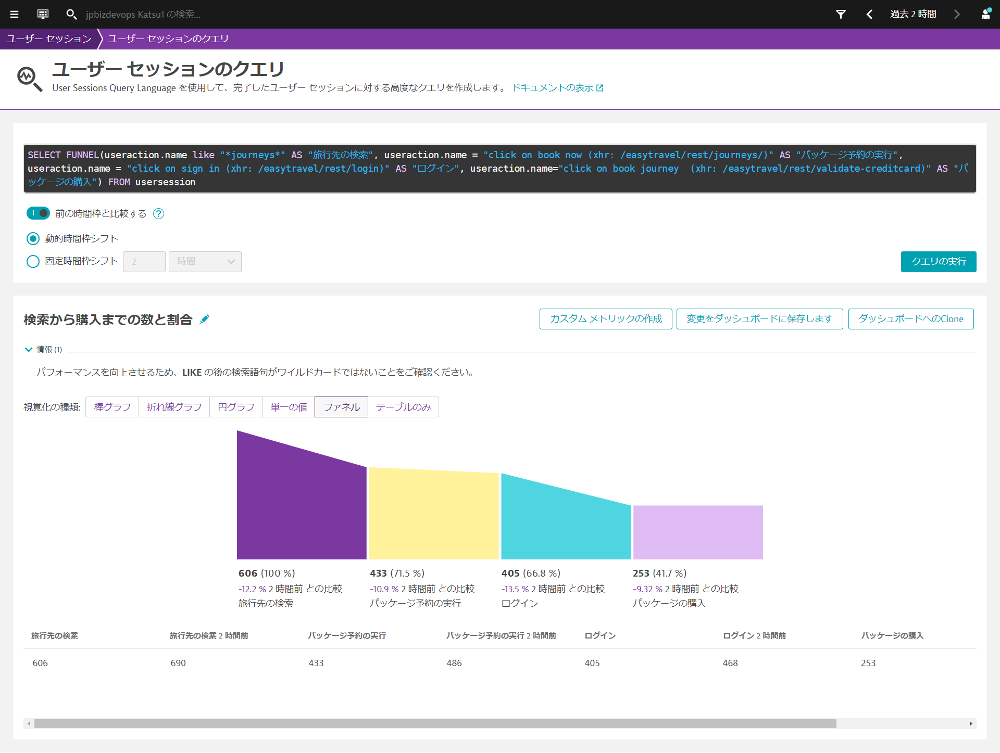
- **変更をダッシュボードに保存します**ボタンをクリックします。自動でダッシュボードの画面に戻ります。
- 作成したタイルの右下の●の部分をドラッグして任意の大きさに広げたり、必要に応じてドラッグすることでタイルの場所を移動させます。

### 購入に至らなかったカートの金額

多くの場合、「カート」に入れられた商品・パッケージはユーザーが潜在的に取引を行う金額です。しかし、支払いの失敗や無効なプロモーションコードなど何らかの理由で取引を放棄したり、「カート」内のアイテムを変更する場合があります。サイト訪問者が「購入」の前にどれぐらいドロップアウトしているかどうかがわかり、ビジネスに影響を与える前に問題解決に繋げることができるようになります。

- ダッシュボードが編集モードでない場合は、**編集**ボタンをクリックして編集モードにします。
- **タイルのフィルタリング**欄に`クエリ`と入力し、**ユーザーセッションのクエリ**タイルをダッシュボードの任意の部分にドラッグアンドドロップします。
- **タイルの設定**をクリックします。ユーザー セッションのクエリ画面に遷移します。
- クエリ入力欄に以下を入力し、**クエリの実行**ボタンをクリックします。

  ```SQL
  SELECT SUM(doubleProperties.tripcost) AS "未購入額" FROM usersession WHERE useraction.matchingConversionGoals IS NULL AND doubleProperties.tripcost > 0
  ```

- 名前をわかりやすいものに変更します（例：`購入に至らなかった金額`）。
  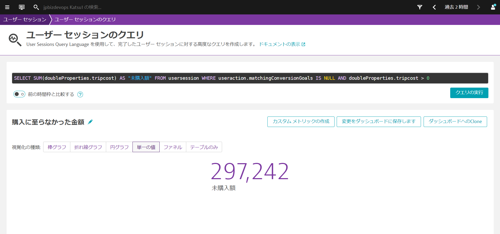
- **変更をダッシュボードに保存します**ボタンをクリックします。自動でダッシュボードの画面に戻ります。
- 作成したタイルの右下の●の部分をドラッグして任意の大きさに広げたり、必要に応じてドラッグすることでタイルの場所を移動させます。

### 商品の購入ができなかったユーザーの特定

商品の購入を実施しようとしたが、何らかの理由により購入に至らなかったユーザーを確認するためのリストを作成します。

- ダッシュボードが編集モードでない場合は、**編集**ボタンをクリックして編集モードにします。
- **タイルのフィルタリング**欄に`クエリ`と入力し、**ユーザーセッションのクエリ**タイルをダッシュボードの任意の部分にドラッグアンドドロップします。
- **タイルの設定**をクリックします。ユーザー セッションのクエリ画面に遷移します。
- クエリ入力欄に以下を入力し、**クエリの実行**ボタンをクリックします。

  ```SQL
  SELECT userId FROM usersession WHERE useraction.name = "click on book journey  (xhr: /easytravel/rest/validate-creditcard)" AND doubleProperties.booking IS NULL AND userId IS NOT NULL
  ```
- 名前をわかりやすいものに変更します（例：`購入できなかったユーザー一覧`）。
  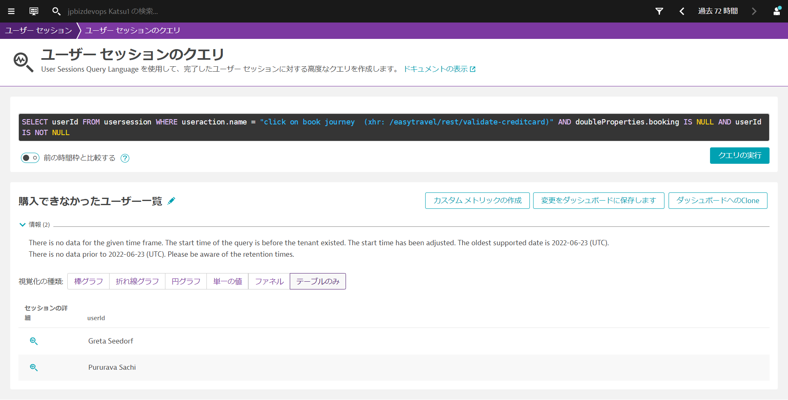
- **変更をダッシュボードに保存します**ボタンをクリックします。自動でダッシュボードの画面に戻ります。
- 作成したタイルの右下の●の部分をドラッグして任意の大きさに広げたり、必要に応じてドラッグすることでタイルの場所を移動させます。

Negative
: 該当ユーザーが存在しない場合は、右上のタイムフレームの設定を長めに変更することで確認できるようになります。

### その他

**Sample BizDevOps Dashboard**には今作成したダッシュボード以外にもいくつかのサンプルが作られています。これらを参考にダッシュボードに情報を表示させてみましょう。

## Dynatraceによるフロントエンドエラーの確認
Duration: 10

ユーザーが商品の購入を諦めたり、不満を持つ原因の1つはエラーの発生です。エラーの原因はさまざまで、例えば以下のようなものが考えられます。
- サーバーサイド: ビジネスロジック、コーディングエラーなど
- クライアントサイド（ブラウザ/モバイルアプリ）: JavaScriptエラー、AJAXコール、ポップアップ画面など
- サードパーティー: CDNサービスの障害、FacebookやTwitterなどの外部のコンテンツプロバイダーなど

エラーには多くの種類があり、1つ1つ分析していては効率が悪いため、何を修正すべきか優先順位をつけるのは通常困難な作業です。また、[コンテンツセキュリティポリシー](https://developer.mozilla.org/ja/docs/Web/HTTP/CSP)を適切に扱うことでXSS攻撃を軽減することが可能となります。

このセクションでは、DynatraceがeasyTravelアプリケーション上で検知したエラーについて確認をします。エラーの確認については、大別すると以下の2つの視点から確認することが可能です。

* ユーザーアクションの視点 - アプリケーションの観点からどのアクションでどのエラーがどれぐらい発生しているのか追っていきます。
* ユーザーセッションの視点 - エラーを受けたユーザーがどれぐらいいるのかを追っていきます。

### ユーザーアクションの視点

- **アプリケーションとマイクロサービス > フロントエンド**を開き、**EasyTravel Angular**をクリックします。
- **エラー**をクリックします。下の表示が**種類別のエラー数、ユーザー アクション時のエラー数、発生元別のエラー数、上位のエラー**に切り替わります。
  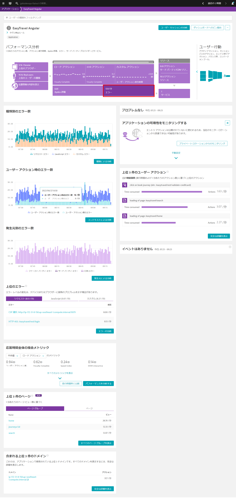
- 上位のエラーの下にある**エラーの分析**をクリックします。
- CSP違反が多く発生していることが確認できるので、**CSP違反**行をクリックします。
  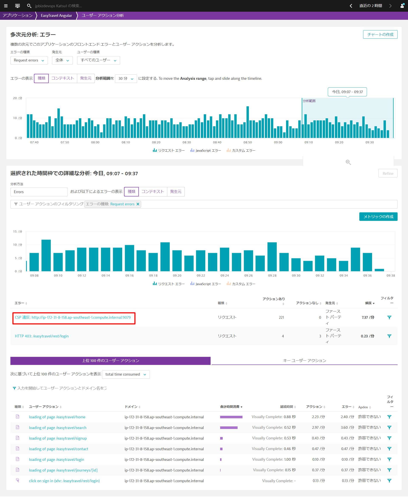
- CSP違反エラーに関する様々な情報からエラーの改善に役立てることが可能です。
  

### ユーザーセッションの視点

- **EasyTravel Angular**のトップ画面に戻り、**ユーザー セッションの分析**ボタンをクリックします。
  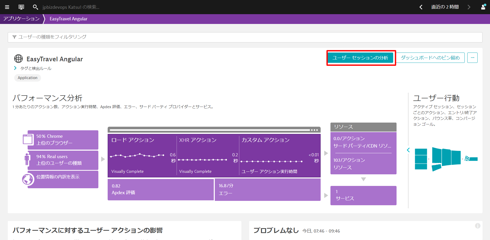
- フィルター条件に**Application: EasyTravel Angular**（入力済み）、**Has error* Yes, User experience score: Frustrating**を選び、適当なユーザーセッションを1つ開きます。
  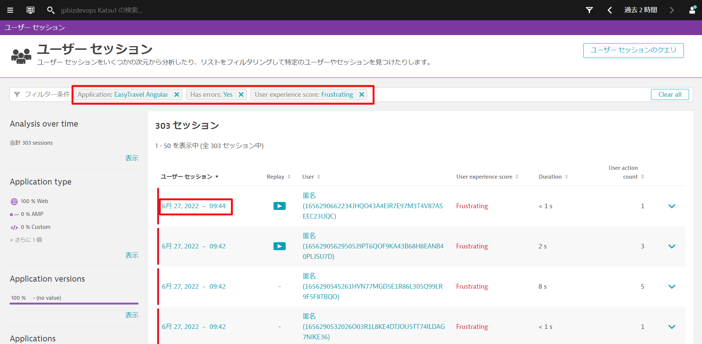
- エラーが発生しているイベントの詳細を開き、**ウォーターフォール分析を実行**ボタンをクリックします。
  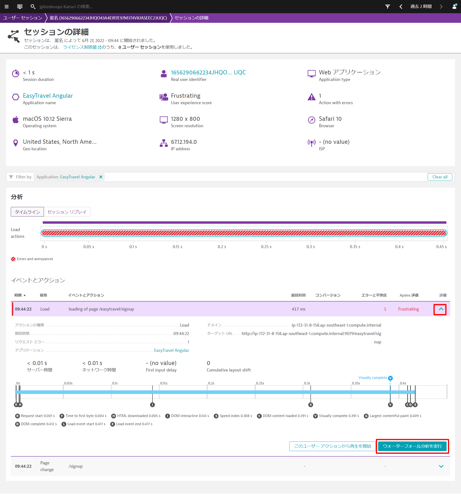
- ウォーターフォール分析からどのリクエストでエラーが発生していたのか特定することができます。
  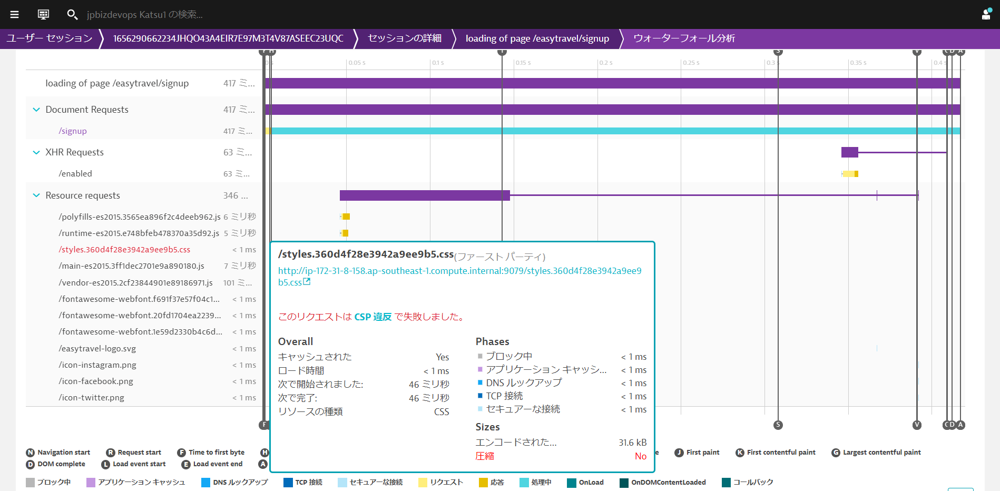

## Core Web Vitalsによるパフォーマンス分析
Duration: 10

Googleが発表した[Core Web Vitals](https://web.dev/vitals)は「ウェブ上で優れたユーザー体験を提供するための指標」であり**業界の標準**として利用することができます。
Dynatraceは、Core Web Vitalsを自動で測定し、数回のクリックで詳細を確認することができます。

### Core Web Vitalsの3つの指標

Core Web Vitalsは以下の3つの指標が含まれています。

- Largest Contentful Paint (最大視覚コンテンツの表示時間、LCP): 読み込みのパフォーマンスを測定するための指標です。優れたユーザー エクスペリエンスを提供するためには、ページの読み込みが開始されてからの LCP を 2.5 秒以内にする必要があります。
- First Input Delay (初回入力までの遅延時間、FID): インタラクティブ性を測定するための指標です。優れたユーザー エクスペリエンスを提供するためには、ページの FID を 100 ミリ秒以下にする必要があります。
- Cumulative Layout Shift (累積レイアウト シフト数、CLS): 視覚的な安定性を測定するための指標です。優れたユーザー エクスペリエンスを提供するためには、ページの CLS を 0.1 以下に維持する必要があります。

Core Web Vitalsでは、上記の指標をモバイル デバイスとデスクトップ デバイスに分けた上で、総ページロード数の 75 パーセンタイルをしきい値として設定しています。

### ページとページグループの視点での解析

- **EasyTravel Angular**のトップ画面に戻り、画面を下にスクロールさせ、**すべてのページグループを表示**ボタンをクリックします。
  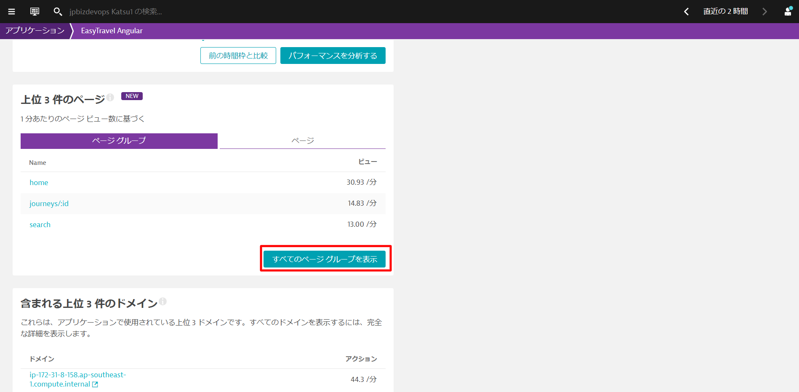
- **パフォーマンス メトリック**ドロップダウンメニューから**Largest contenful paint**を選択し、**集計**ドロップダウンメニューから**75th percentile**を選択します。
- 同様に**パフォーマンス メトリック**ドロップダウンメニューから**First Input Delay**や**Cumulative Layout Shift**を選択することでページグループごとの値を確認することができます。
  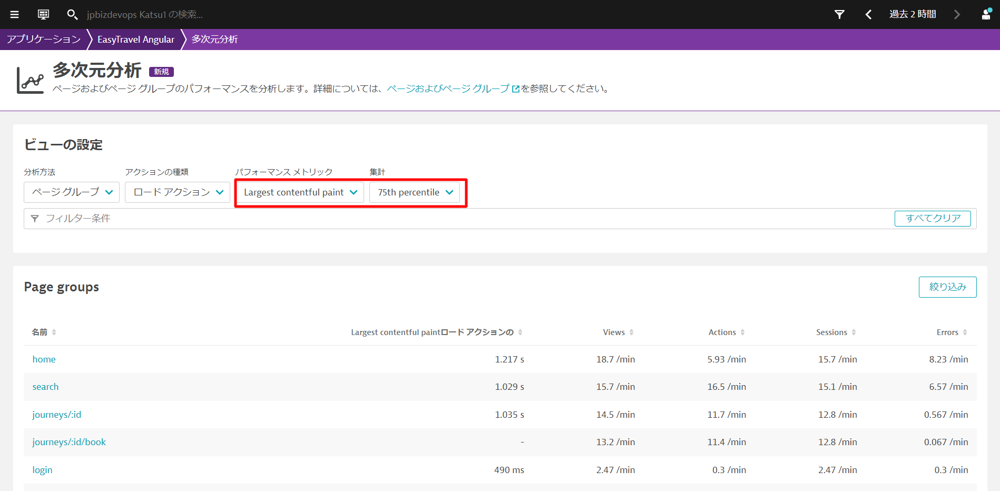
- また、気になるページの名前をクリックすることで、該当ページの詳細を確認することができます。ここでは試しに**home**をクリックします。
- パフォーマンスビューの下の**すべてのメトリックを表示**を開くことで、上記の指標を含めて該当ページの様々なメトリクスを確認することができます。
  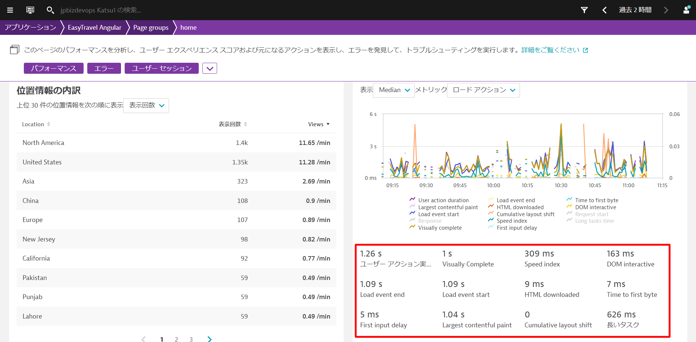

## 参考：CSSセレクターの取得方法
Duration: 5

ユーザーのタグ付けやセッションとユーザーアクションのプロパティで指定する**CSSセレクター**についてGoogle Chromeで取得する方法について、説明します。

- **EasyTravel Angular**サイトにアクセスし、画面右上の**Login**からログインページに移動します。
  
- email、passwordともに`alex`と入力して、**Sign In**ボタンをクリックします。
- 画面右上に表示された**Alex Elliott**を右クリックし、**検証**を選びます。
- ハイライトされた行を右クリックし、**Copy > Copy Selector**を選択します。

上記、操作は任意のDOM要素に対して行うことができます。

## 参考：リクエスト属性の設定
Duration: 15

ハンズオン環境では、デフォルトで**revenue**と**destination**という2つのリクエスト属性が設定されています。

### 新しいリクエスト属性の定義

ここでは新しくユーザーのステータス（**loyalty**）をリクエスト属性として取得する方法について説明します。

- 左側のメニューから**管理 > 設定**を開き、**Server-side service monitoring > Request attributes**を開きます。
  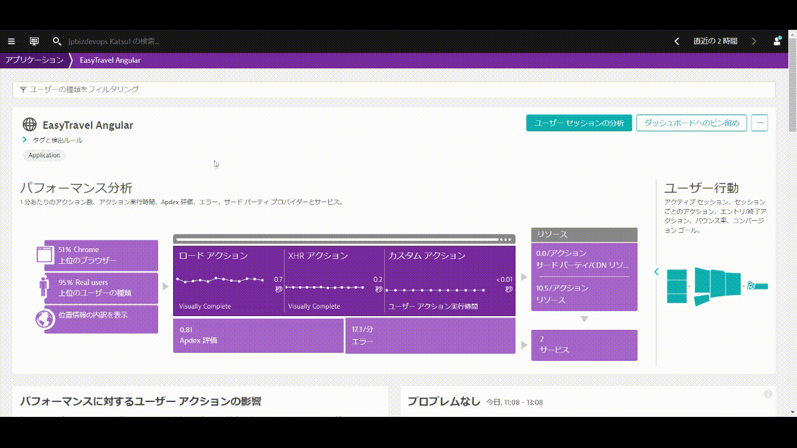
- **Define a new request attribute**ボタンをクリックします。
- **Request attribute name**に`Loyalty status`と入力します。
  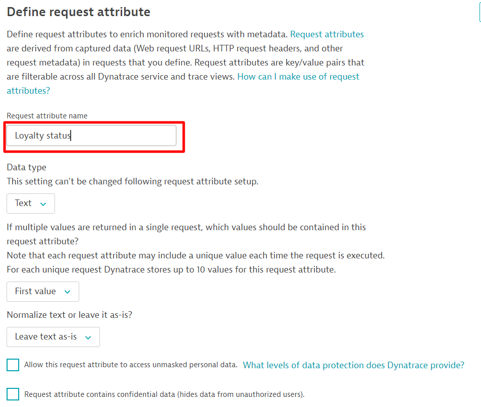
- 他の設定についてはデフォルトのままとします。
- **Add new data source**ボタンをクリックし、1つ目のソースとして以下を入力します。
  - **Request attribute source**ドロップダウンメニュー `Web request URL query parameter`
  - **Parameter name** `loyalty`
  - **Save**ボタンをクリックします。
  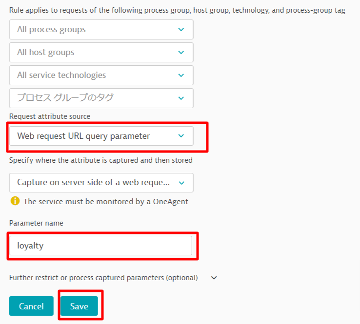
- **Add new data source**ボタンをクリックし、2つ目のソースとして以下を入力します。
  - **Request attribute source**ドロップダウンメニュー `Java method parameter(s)`
  - **Select method sources**ボタンをクリック
  - Process Groupフィールドに`com.dynatrace.easytravel.business.backend.jar easytravel-*-x*`と入力し、**Continue**ボタンをクリックします。
  - 検索フィールドに`bookingservice`と入力し、**Search**ボタンをクリックします。
  - **com.dynatrace.easytravel.business.webservice.BookingService**が表示されたら、それを選択して**Continue**ボタンをクリックします。
  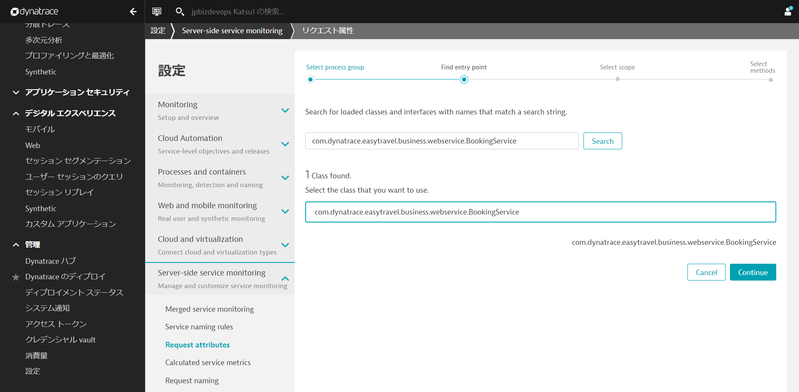
  - **Use the selected class**を選択し、**Continue**をクリックします。
  - **プライベート void checkLoyaltyStatus**を選択し、**Finish**ボタンをクリックします。
  - **Capture**ドロップダウンメニューから`2: java.lang.String`を選択し、**Save**をクリックします。
- **Add new data source**ボタンをクリックし、3つ目のソースとして以下を入力します。
  - **Request attribute source**ドロップダウンメニュー `Java method parameter(s)`
  - **Select method sources**ボタンをクリック
  - Process Groupフィールドに`com.dynatrace.easytravel.business.backend.jar easytravel-*-x*`と入力し、**Continue**ボタンをクリックします。
  - 検索フィールドに`authentication`と入力し、**Search**ボタンをクリックします。
  - **com.dynatrace.easytravel.business.webservice.AuthenticationService**が表示されたら、それを選択して**Continue**ボタンをクリックします。
  - **Use the selected class**を選択し、**Continue**をクリックします。
  - **パブリック java.lang.String getLoyaltyStatus**を選択し、**Finish**ボタンをクリックします。
  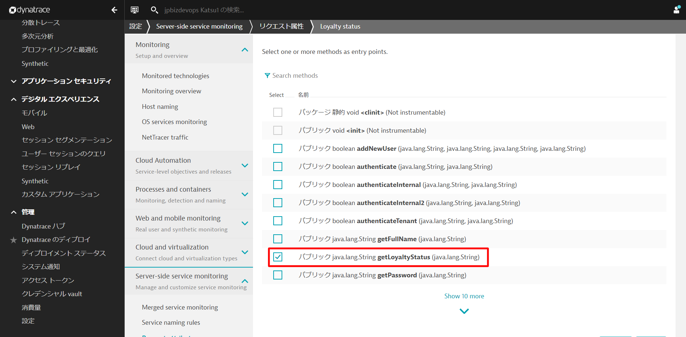
  - **Capture**ドロップダウンメニューから`Return value`を選択し、**Save**をクリックします。
- **Data sources**として、以下の画面のように表示されます。
  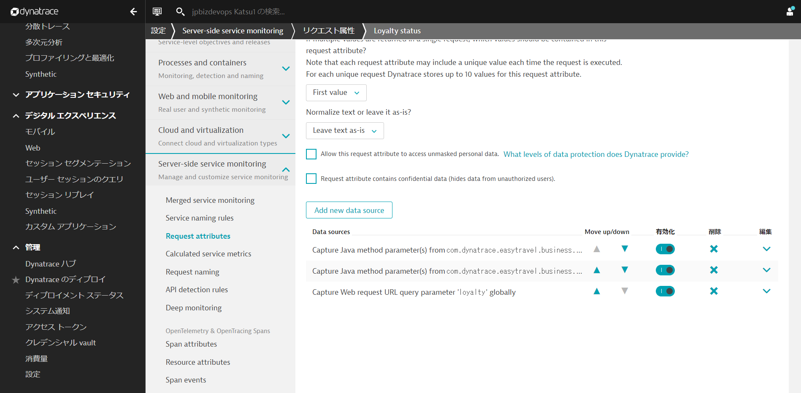
- 右上の**Save**ボタンを忘れずにクリックします。

### easyTravelアプリの再起動

リクエスト属性をメソッドパラメーターから取得する場合、該当プロセスを再起動する必要があるため、easyTravelアプリを再起動させます。

- easyTravelのコンフィグレーションUIにページにアクセスします（コンフィグレーションUIについてはメールを参照ください）。
- **Stop**ボタンをクリックし、easyTravelアプリが止まるのを待ちます。
- easyTravelアプリが停止したら、**Standard with REST Service and Angular2 frontend**をクリックします。数分で再開するはずです。

### セッションプロパティでのリクエスト属性の追加

RevenueとDestinationを設定したときと同様の手順で、Loyalty statusをセッションプロパティに設定します。

- **アプリケーションとマイクロサービス > フロントエンド**を開き、**EasyTravel Angular**をクリックします。
- **メニューボタン（…）**をクリックし、**編集**をクリックして、設定画面を開きます。
- **Capturing > Session and action properties**を開きます。
- **Add property**ボタンをクリックします。
- **Custom defined property**タブを選択し、以下の通りに入力します。
  - **Expression type** `Server side request attribute`
  - **Request attribute name** `Loyalty status`
  - **Display name** `Member status`
  - `Store as session property`を有効
    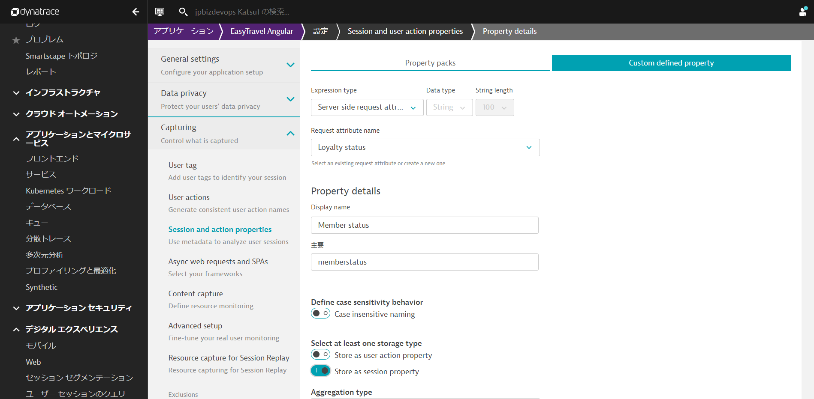
  - **Save property**ボタンをクリックします。

### メンバーステータス毎の売上高の可視化

先ほど作成したダッシュボードにメンバーステータス毎の売上高を表示するタイルを追加します。

- **観察と探索 > ダッシュボード**から先ほど作成したダッシュボード（`ビジネスダッシュボード`）を開きます。
- ダッシュボードが編集モードでない場合は、**編集**ボタンをクリックして編集モードにします。
- **タイルのフィルタリング**欄に`クエリ`と入力し、**ユーザーセッションのクエリ**タイルをダッシュボードの任意の部分にドラッグアンドドロップします。
- **タイルの設定**をクリックします。ユーザー セッションのクエリ画面に遷移します。
- クエリ入力欄に以下を入力し、**クエリの実行**ボタンをクリックします。クエリに一致するデータがありません。と表示される場合は少し時間をおいてから確認します。

  ```SQL
  SELECT stringProperties.memberstatus AS "メンバーステータス", SUM(doubleProperties.booking) AS "売上高" FROM usersession WHERE stringProperties.memberstatus IS NOT NULL GROUP BY stringProperties.memberstatus ORDER BY sum(doubleProperties.booking) DESC
  ```

- 名前を`メンバーステータス毎の売上割合`などに変更し、**円グラフ**を選択します。
  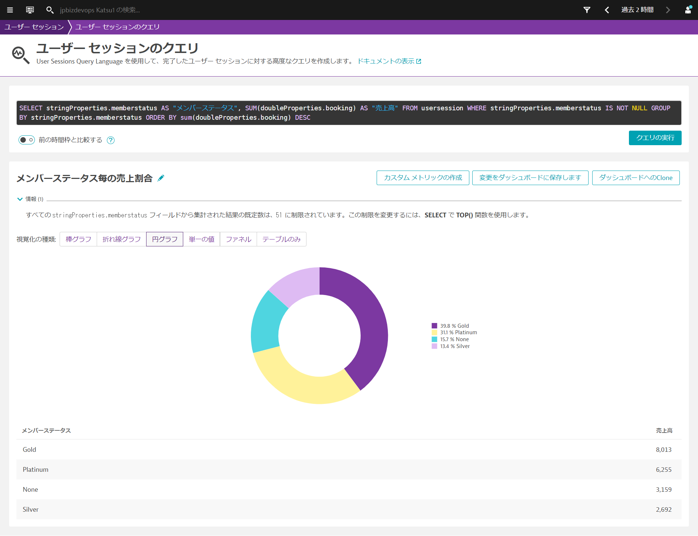
- **変更をダッシュボードに保存します**ボタンをクリックします。自動でダッシュボードの画面に戻ります。
- 作成したタイルの右下の●の部分をドラッグして任意の大きさに広げたり、必要に応じてドラッグすることでタイルの場所を移動させます。

<form>
  <name>このラボで最も役立ったことは何ですか？</name>
  <input value="デジタルビジネスアナリティクスの学習" />
  <input value="User Session Propertiesの設定" />
  <input value="BizDevOpsのコロケーションを向上させるDynatraceの使い方" />
  <input value="USQLの使い方" />
</form>

<form>
  <name>このラボを友人や同僚に勧める可能性はどの程度ありますか？</name>
  <input value="強く勧めたい" />
  <input value="勧めたい" />
  <input value="わからない" />
  <input value="勧めない" />
  <input value="全く勧めない" />
</form>

Positive
: 💡 その他のアイデアや提案については、[メールでのお問い合わせ](mailto:DT-TYO-SE@dynatrace.com?subject=DynatraceによるBizDevOps - アイデア、提案)をお願いします。