id: cloud-automation-rel-val
summary: Cloud Automation - Releasee validation (aka Quality Gates)
categories: cloudautomation, cloud-automation
tags: cloud-Obs, Intermediate
status: Published 
authors: Ram Vasu
Feedback Link: mailto:APAC-SE-Central@dynatrace.com
new: 1
Analytics Account: UA-54510554-1


# Cloud Automation - Quality Gates with Dynatrace
<!-- ------------------------ -->
## Introduction
Duration: 1

This repository contains the hands on for the Day 2 Operations - Cloud Native Observability Workshop.

### Prerequisites

* Dynatrace SaaS/Managed Account. Get your free SaaS trial [here](https://www.dynatrace.com/trial/).
* Dynatrace Cloud Automation Account
* Chrome Browser
* SSH client such as [mobaxterm](https://mobaxterm.mobatek.net/).

### Lab Setup
The following steps are used for this lab:
https://github.com/keptn-sandbox/keptn-on-k3s/tree/master/cloudautomation


<!-- ------------------------ -->
## Install CLI and Authenticate

Login to the bastion host using the username / password provided.

### Install CLI

Download and install the CLI:

```bash
curl -sL https://get.keptn.sh | bash
```

### Authenticate with Dynatrace Cloud Automation

Copy the **keptn auth command** from the Cloud Automation UI (top right of screen)

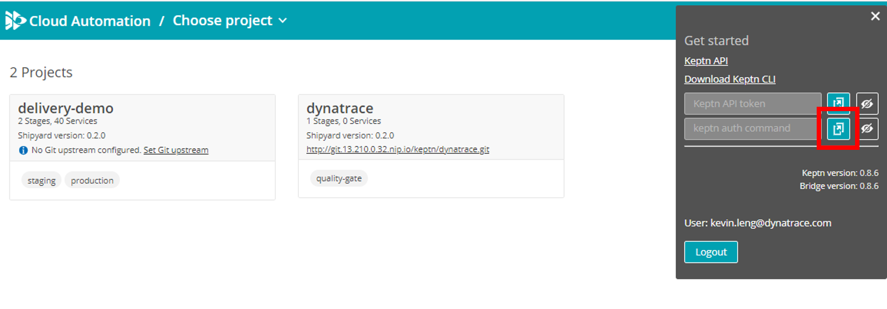


```bash
[xxx@ip-172-31-28-139 ~]$ keptn auth --endpoint=https://mvl77343.cloudautomation.live.dynatrace.com/api --api-token=<token>
Warning: could not parse KUBECONFIG file: Cannot find file /home/harhiy/.kube/config
Hint: If you don't have a 'kubeconfig' file, you can disable this check via 'keptn set config KubeContextCheck false'
* Warning: Your Keptn CLI version (0.8.7) and Keptn cluster version (0.8.6) don't match. This can lead to problems. Please make sure to use the same versions.
Starting to authenticate
Successfully authenticated against the Keptn cluster https://mvl77343.cloudautomation.live.dynatrace.com/api
Using a file-based storage for the key because the password-store seems to be not set up.
```


Test it is working by calling **keptn get projects**


```bash
[xx@ip-172-31-28-139 ~]$ keptn get projects
Warning: could not parse KUBECONFIG file: Cannot find file /home/harhiy/.kube/config
Hint: If you don't have a 'kubeconfig' file, you can disable this check via 'keptn set config KubeContextCheck false'
* Warning: Your Keptn CLI version (0.8.7) and Keptn cluster version (0.8.6) don't match. This can lead to problems. Please make sure to use the same versions.
NAME            CREATION DATE           SHIPYARD VERSION
delivery-demo   2021-08-05T07:31:03Z    spec.keptn.sh/0.2.0
dynatrace       2021-08-05T06:09:24Z    spec.keptn.sh/0.2.0
```

### Optional

Disable kubeContextCheck and AutomaticVersionCheck


```bash
keptn set config kubeContextCheck false
```


```bash
keptn set config AutomaticVersionCheck false
```

<!-- ------------------------ -->
## Release validation (aka Quality Gate) in 5 mins
Duration: 5

In this exercise, we'll create a service for a basic quality gate.

### Add Tags

Pick your **tnt-XXXXXX-svc-*.delivery-demo-production** service (production)

* Tag 1: **keptn_managed**. Either add via „Add tag“ or via Dynatrace Tagging API

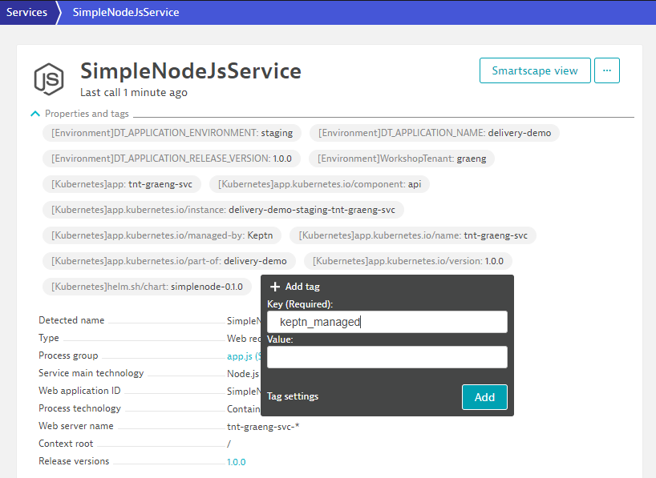

* Tag 2: **keptn_service**:**YOUR_SERVICE_NAME**: This is best done via a Tagging Rule or also via „Add tag“. In this example use your **firstname-lastname**

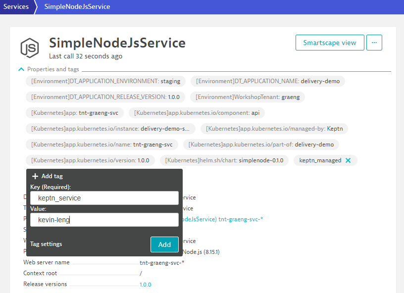

Wait 1 min for your service to appear in the Dynatrace project

* Automatic Synchronization happens every minute
* Every service with the tags keptn_managed and keptn_service:<YOUR_SERVICE_NAME> will show as a service

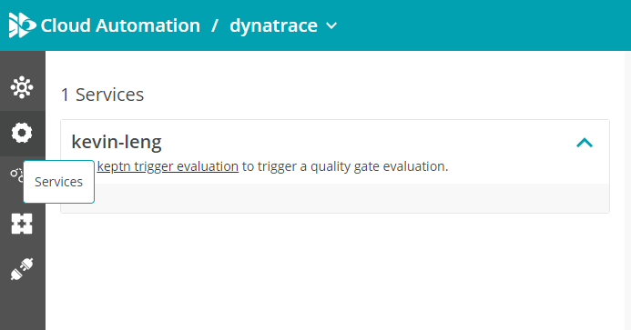

### Trigger evaluation via command line

```bash
keptn trigger evaluation --project=dynatrace --stage=quality-gate --service=YOUR_SERVICE_NAME --timeframe=30m --labels=buildId=1,executedBy=manual
```


Example:
```bash
[ec2-user@ip-172-31-18-234 keptn-on-k3s]$ keptn trigger evaluation --project=dynatrace --stage=quality-gate --service=kevin-leng --timeframe=30m --labels=buildId=1,executedBy=manual
Warning: could not parse KUBECONFIG file: Cannot find file /home/ec2-user/.kube/config
Hint: If you don't have a 'kubeconfig' file, you can disable this check via 'keptn set config KubeContextCheck false'
* Warning: Your Keptn CLI version (0.8.7) and Keptn cluster version (0.8.6) don't match. This can lead to problems. Please make sure to use the same versions.
Starting to trigger evaluation of the service kevin-leng in project dynatrace
ID of Keptn context: 2e7e14d1-f8b5-436c-9638-c51a77dd41ff
```

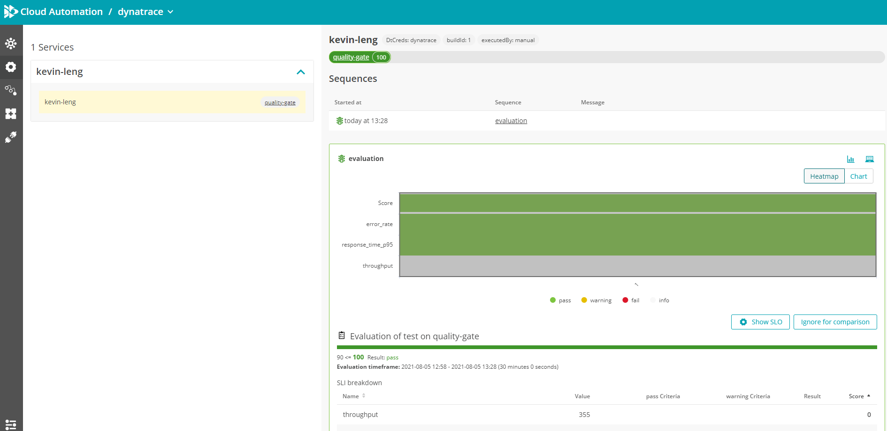


Trigger evaluation again but this time use buildId=2

```bash
keptn trigger evaluation --project=dynatrace --stage=quality-gate --service=YOUR_SERVICE_NAME --timeframe=30m --labels=buildId=2,executedBy=manual
```


### Trigger evaluation via API

* Access the Swagger API's (top right-hand corner > Keptn API)
* Change API definition to **controlPlane**
* Authorize the API's using the keptn API token (top right-hand corner > Keptn API token)
* Select API: Evaluation > Post /project​/{project}​/stage​/{stage}​/service​/{service}​/evaluation

Set:

* project: **dynatrace**
* stage: **quality-gate**
* service: **YOUR_SERVICE_NAME**
* evaluation=
  
  ```json
  {
    "labels": {
      "executedBy": "api",
      "buildId": "3"
    },
    "timeframe": "30m"
  }
  ```
Then click **Execute**

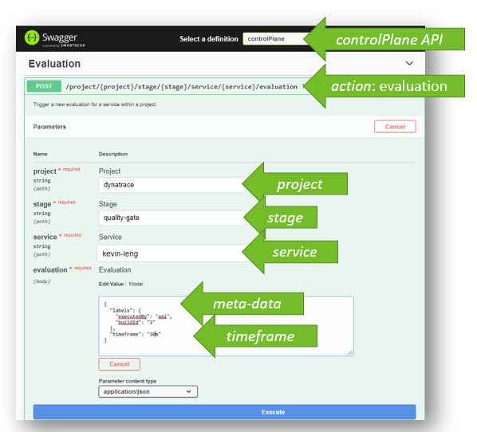


### Automation Events also available in Dynatrace

Events sent to the Dynatrace monitored service based on the two tags

View the events against your service in Dynatrace.

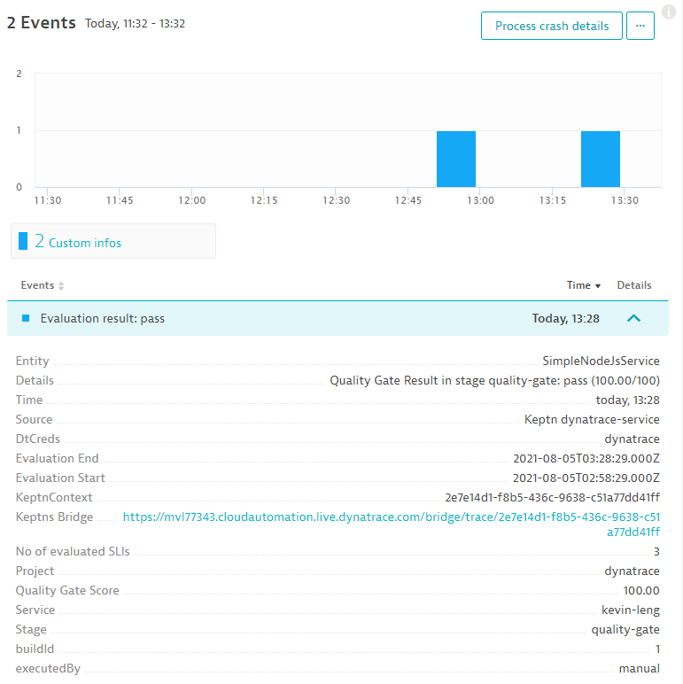


<!-- ------------------------ -->
## Gitops - Codify Quality Gates
Duration: 15

### First explore upstream git repo


### Modify SLO

Find your service (tenant) under the quality-gates branch and modify the default SLO.yaml

Git User:        keptn

Git Password:    keptn#R0cks

Modify the SLO are per the following image:

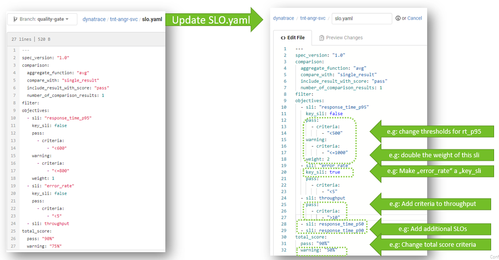


If you need the full completed yaml:

```yaml
---
spec_version: "1.0"
comparison:
  aggregate_function: "avg"
  compare_with: "single_result"
  include_result_with_score: "pass"
  number_of_comparison_results: 1
filter:
objectives:
  - sli: "response_time_p95"
    key_sli: false
    pass:             
      - criteria:
          - "<500"    
    warning:        
      - criteria:
          - "<=1000"
    weight: 1
  - sli: "error_rate"
    key_sli: true
    pass:
      - criteria:
          - "<5"
  - sli: throughput
    pass:
      - criteria:
          - ">10"
  - sli: "response_time_p50"
  - sli: "response_time_p90"
total_score:
  pass: "90%"
  warning: "50%"
```

### Modify SLI

Find your service (tenant) under the quality-gates branch and view the default SLI.yaml
No changes are required for this exercise. 

### Trigger evaluation

Use the API or command line to trigger an evaluation - use buildId 4

e.g.
```bash
keptn trigger evaluation --project=dynatrace --stage=quality-gate --service=tnt-xxxx-svc --timeframe=30m --labels=buildId=4,executedBy=manual
```

View the resulting evaluation in the Cloud Automation UI:

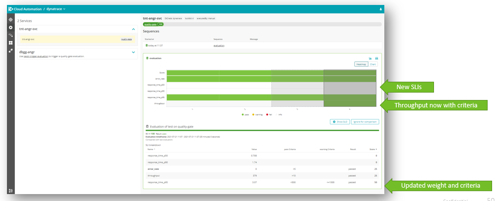


<!-- ------------------------ -->
## Gitops - Dashboard based Automation - Part 1
Duration: 15

### Create new project
Let‘s create a new **dbqg-xxx** (short for dashboard quality gate for xxxx) service in our dynatrace project with the CLI

where xxx is your "tenant"

```bash
keptn create service dbqg-xxxx --project=dynatrace
```

### Create a dashboard for that service

CLONE the existing dashboard **KQG;project=dynatrace;service=dbqg-xxxx;stage=quality-gate**

Change the name format to reflect your service name

### Trigger evaluation

```bash
keptn trigger evaluation --project=dynatrace --stage=quality-gate --service=dbqg-xxx --timeframe=30m
```


<!-- ------------------------ -->
## Gitops - Dashboard based Automation - Part 2
Duration: 15

Now we'll add new metrics to our dashboard and hand them reflected in the Quality Gate

### Add a new Chart Tile

Add a new chart tile to the dashboard:

* Metric: **builtin:service.cpu.perRequest**
* Chart Title: **Service CPU;sli=service_cpu;pass=<20;warning=<50;key=false**

Then trigger an evaluation again...
```bash
keptn trigger evaluation --project=dynatrace --stage=quality-gate --service=dbqg-xxx --timeframe=30m
```

You should see a new metric (service_cpu) being evaluated in the SLO


### Add a new Top List tile

Add a new Top List tile to your dashboard

* Metric: **builtin:service.response.server**
* Split by: **Service**
* Chart Title: **Service Response;sli=service_rt;pass=<200;warning=<500;key=false**

Then trigger an evaluation again...
```bash
keptn trigger evaluation --project=dynatrace --stage=quality-gate --service=dbqg-xxx --timeframe=30m
```

You should see a new metrics (service_rt_) being evaluated in the SLO


<!-- ------------------------ -->
## Cloud Native
Duration: 15

Trigger each release in turn for your service

### Release 2

```bash
keptn trigger delivery --project=delivery-demo --service=tnt-xxxxxx-svc --image=grabnerandi/simplenodeservice:2.0.0
```

Release 2 should fail and won't be promoted to production!


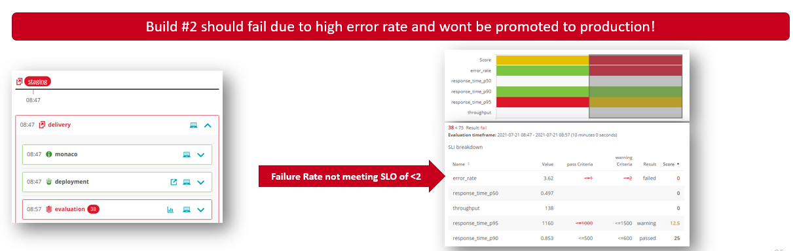


### Release 3

```bash
keptn trigger delivery --project=delivery-demo --service=tnt-xxxxxx-svc --image=grabnerandi/simplenodeservice:3.0.0
```

Release 3 should be accepted by the quality gate and make it into production!


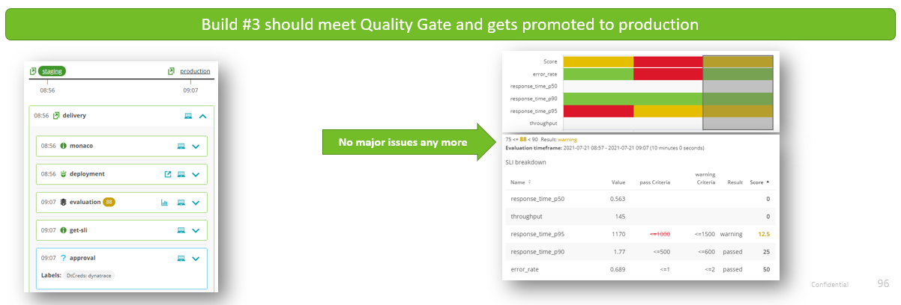


### Release 4

Trigger direct deployment to production


```bash
keptn trigger delivery --project=delivery-demo --stage=production --service=tnt-xxxxxx-svc --image=grabnerandi/simplenodeservice:4.0.0

```


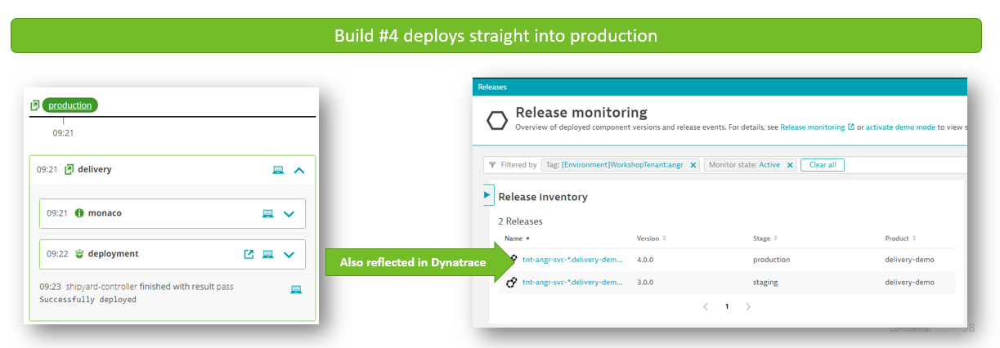


## Feedback
Duration: 3

We hope you enjoyed this lab and found it useful. We would love your feedback!
<form>
  <name>How was your overall experience with this lab?</name>
  <input value="Excellent" />
  <input value="Good" />
  <input value="Average" />
  <input value="Fair" />
  <input value="Poor" />
</form>

<form>
  <name>What did you benefit most from this lab?</name>
  <input value="Deploy OneAgent to a Kubernetes" />
  <input value="GitOps / Monitoring as code approach" />
  <input value="Service Level Objectives" />
  <input value="Releases" />
</form>

<form>
  <name>How likely are you to recommend this lab to a friend or colleague?</name>
  <input value="Very Likely" />
  <input value="Moderately Likely" />
  <input value="Neither Likely nor unlikely" />
  <input value="Moderately Unlikely" />
  <input value="Very Unlikely" />
</form>

Positive
: 💡 For other ideas and suggestions, please **[reach out via email](mailto:APAC-SE-Central@dynatrace.com?subject=Kubernetes Workshop - Ideas and Suggestions")**.