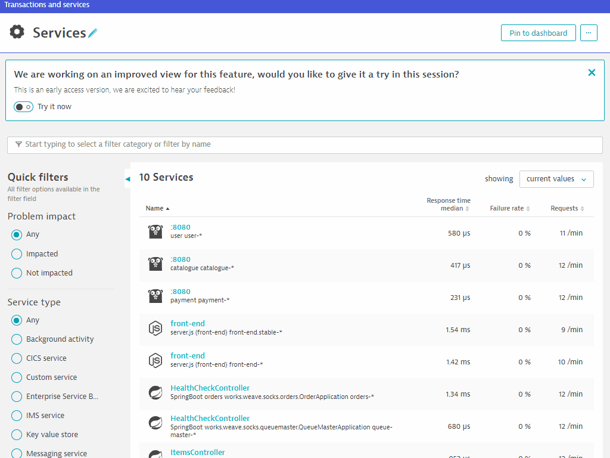

id: cloud-native-observability-dst
summary: DAY 1, July 21st 1330-1530 – Cloud Native Observability - Part 1 (K8s and Monitoring-as-code)
categories: cloud-obs, cloud-automation
tags: dst, cloud-Obs, Intermediate
status: Published 
authors: Brandon Neo
Feedback Link: mailto:APAC-SE-Central@dynatrace.com
Analytics Account: UA-175467274-1

# Cloud-Native Observability with Dynatrace
<!-- ------------------------ -->
## Introduction
Duration: 1

This repository contains the hands on for the Day 2 Operations - Cloud Native Observability Workshop.

### Prerequisites

* Dynatrace SaaS/Managed Account. Get your free SaaS trial [here](https://www.dynatrace.com/trial/).
* AWS account, with the ability to create an EC2 instance from a public AMI. Signup to a free trial [here](https://aws.amazon.com/free/).
* Chrome Browser
* SSH client such as [mobaxterm](https://mobaxterm.mobatek.net/).

### Lab Setup
The following steps are used for this lab:
- Sample Application 
    * Sample App is based on [Sockshop](https://github.com/dynatrace-sockshop)

### What You’ll Learn
- Deploy OneAgent to a Kubernetes / Microservice Environment
- GitOps / Monitoring as code approach to push application config
- Learn Metric Ingestion for automated baselines across all entities
- Site Reliability Engineering - Service Level Objectives
- Site Reliability Engineering - Releases

<!-- ------------------------ -->
## Deploy OneAgent Operator
Duration: 15

In this exercise, we will deploy the OneAgent to a Linux instance running Kubernetes(Microk8s) and let the OneAgent discover what is running in that instance.

### Using Terminal via Web Browser

To faciliate the labs, we will access the Linux instance **via terminal through a web browser**.

Use the **URL** was provided in your email to access the SSH terminal. Make sure the URL looks like `Public IP Address:8080/wetty`

Use the **login name** and **password** as provided in your email.


### Download the OneAgent

Open your browser and access the Dynatrace URL.

Follow these steps below:

* Select **Dynatrace Hub** from the navigation menu.
* Select **Kubernetes**
* Select **Monitor Kubernetes** button from the bottom right.  


Within the **Monitor Kubernetes / Openshift** page, follow these steps below:

* Enter a **Name** for the connection Eg. `k8s`
* Click on **Create tokens** to create PaaS and API tokens with appropriate permissions
* **Toggle ON** Skip SSL Certificate Check
* Click **Copy** button to copy the commands. 
* **Paste** the command into your terminal window and execute it.


Example:

```bash
Connecting to github-releases.githubusercontent.com (github-releases.githubusercontent.com)|185.199.108.154|:443... connected.
HTTP request sent, awaiting response... 200 OK
Length: 7310 (7.1K) [application/octet-stream]
Saving to: ‘install.sh’

install.sh                      100%[=====================================================>]   7.14K  --.-KB/s    in 0s      

2021-06-01 05:46:36 (40.7 MB/s) - ‘install.sh’ saved [7310/7310]


Check for token scopes...

Check if cluster already exists...

Creating Dynatrace namespace...

Applying Dynatrace Operator...
Warning: apiextensions.k8s.io/v1beta1 CustomResourceDefinition is deprecated in v1.16+, unavailable in v1.22+; use apiextensions.k8s.io/v1 CustomResourceDefinition
customresourcedefinition.apiextensions.k8s.io/dynakubes.dynatrace.com created
serviceaccount/dynatrace-dynakube-oneagent created
serviceaccount/dynatrace-dynakube-oneagent-unprivileged created
serviceaccount/dynatrace-kubernetes-monitoring created
serviceaccount/dynatrace-operator created
serviceaccount/dynatrace-routing created
podsecuritypolicy.policy/dynatrace-dynakube-oneagent created
podsecuritypolicy.policy/dynatrace-dynakube-oneagent-unprivileged created
podsecuritypolicy.policy/dynatrace-kubernetes-monitoring created
podsecuritypolicy.policy/dynatrace-operator created
podsecuritypolicy.policy/dynatrace-routing created
role.rbac.authorization.k8s.io/dynatrace-dynakube-oneagent created
role.rbac.authorization.k8s.io/dynatrace-dynakube-oneagent-unprivileged created
role.rbac.authorization.k8s.io/dynatrace-kubernetes-monitoring created
role.rbac.authorization.k8s.io/dynatrace-operator created
role.rbac.authorization.k8s.io/dynatrace-routing created
clusterrole.rbac.authorization.k8s.io/dynatrace-kubernetes-monitoring created
clusterrole.rbac.authorization.k8s.io/dynatrace-operator created
rolebinding.rbac.authorization.k8s.io/dynatrace-dynakube-oneagent created
rolebinding.rbac.authorization.k8s.io/dynatrace-dynakube-oneagent-unprivileged created
rolebinding.rbac.authorization.k8s.io/dynatrace-kubernetes-monitoring created
rolebinding.rbac.authorization.k8s.io/dynatrace-operator created
rolebinding.rbac.authorization.k8s.io/dynatrace-routing created
clusterrolebinding.rbac.authorization.k8s.io/dynatrace-kubernetes-monitoring created
clusterrolebinding.rbac.authorization.k8s.io/dynatrace-operator created
deployment.apps/dynatrace-operator created
W0601 05:46:39.025776   29593 helpers.go:553] --dry-run is deprecated and can be replaced with --dry-run=client.
secret/dynakube configured

Applying DynaKube CustomResource...
dynakube.dynatrace.com/dynakube created

Adding cluster to Dynatrace...
Kubernetes monitoring successfully setup.
$

```

Negative
: Note that it will take about 5 mins for data to appear within Dynatrace

Positive
: Dynatrace handles automatic deployment of OneAgents as well as automatic k8s integration. 

### Validate the installation in Deployment status

Click on **Show deployment status** to check the status of the connected host. 

You should be able to see a connected host as per the image below.


Positive
: Dynatrace Documentation is referenced [here](https://www.dynatrace.com/support/help/technology-support/operating-systems/linux/)

### Restart Sockshop application

To restart the sample app Sockshop execute the following command:

```bash
kubectl delete po --all -n dev
kubectl delete po --all -n production
```

### Explore the Sockshop Application

Within Dynatrace, follow the steps below to get Sockshop URL:

* Click on the **hostname** in the OneAgent deployment screen.
* Expand **Properties and tag** in Host view
* **Select and Copy** Public Host name from the metadata
* **Amend the Public Host name** to match the following format:
  - Sockshop Production `http://production.front-end.PUBLIC-IP.nip.io/`
  - Sockshop Dev `http://dev.front-end.PUBLIC-IP.nip.io`

Positive
: Note that if you're attending a workshop, these links will be included as part of your workshop email

### Explore the Smartscape

While waiting for Easy Travel to start, you can explore Dynatrace and using the Smartscape, Dynatrace will automatically discover the processes and dependencies that comprises the Easy Travel application! 

[4 things](https://www.dynatrace.com/support/help/get-started/4-things-youll-absolutely-love-about-dynatrace/) that you will love about Dynatrace!


<!-- ------------------------ -->

## Kubernetes Labels and Annotations
Duration: 5

With the Sockshop app restarted, you should be able to see services in Dynatrace.

Referring to `~/sockshop/manifests/sockshop-app/production/front-end.yml`, we will want to setup Dynatrace to automatically pick up the annotations and labels

```bash
apiVersion: extensions/v1beta1
kind: Deployment
metadata:
  name: front-end.stable
  namespace: production
spec:
  replicas: 1
  template:
    metadata:
      annotations:
        sidecar.istio.io/inject: "false"
        dynatrace/instrument: "true"
        pipeline.stage: prod-stable
        pipeline.build: 1.4.0.7424
        pipeline.project: sockshop
        support.contact: "jane.smith@sockshop.com"
        support.channel: "#support-sockshop-frontend"
      labels:
        app: front-end.stable
        stage: prod
        release: stable
        version: "1.4"
        tier: "frontend"
        product: "sockshop"
```

### Validate

Once working, you can validate the change in Dynatrace


Positive
: The above steps are taken from [our official documentation page](https://www.dynatrace.com/support/help/technology-support/cloud-platforms/kubernetes/other-deployments-and-configurations/leverage-tags-defined-in-kubernetes-deployments/)

<!-- ------------------------ -->
## Container Environment Variables
Duration: 5

### Adding Environment variables

In shell terminal, add some Environment Variables with the following command

`nano ~/sockshop/manifests/sockshop-app/production/front-end.yml`

**Make sure that the indentation is correct and that they aren't any error promptings**

```bash
        env:
        - name: DT_TAGS
          value: "product=sockshop"
        - name: DT_CUSTOM_PROP
          value: "SERVICE_TYPE=FRONTEND"
```


Save the amended file with **Ctrl-X**, followed by **Y** and **Enter** and run the below command to re-apply the change.

```bash
kubectl apply -f ~/sockshop/manifests/sockshop-app/production/front-end.yml
kubectl delete pods -n production
```

### Validate

Once working, you can validate the change in Dynatrace


<!-- ------------------------ -->

## (Optional) Process Detection for Canary Deployment 
Duration: 15

### Deploy the Canary Release 

Run the command below to trigger the canary release
```bash
kubectl apply -f https://raw.githubusercontent.com/Dynatrace-APAC/Workshop-Kubernetes/master/manifests/sockshop-app/canary/front-end-canary.yml
```

Execute `kubectl get pods -n production -o wide` and you will see you now have both **stable and canary releases running for the front-end service**


Wait 1-2 minutes then look the Services in Dynatrace. You have **2 services in production**, one for **stable** and one for **canary** release.
For monitoring purposes, it should be the same service


### Process Detection Rule Config

In the Dynatrace console, go in **Settings -> Processes and containers -> Process group detection**.

Expand the **Cloud application and workload detection** section. 

As per our [documentation](https://www.dynatrace.com/support/help/how-to-use-dynatrace/process-groups/configuration/adapt-the-composition-of-default-process-groups/#cloud-applications-and-workload-detection), you will need to use the **disable Cloud application and workload detection** while **enabling the rule based tag feature** with `DT-ContainerBoundariesAffected` to select the process groups. 


Expand the **Process group detection rules** section. 

Click **Add detection** rule.

Select Use a **process property** to seperate processes


We want to apply this rule for pods running in **production only (namespace=production)**

Also, extract the identifier after the **"."** in the pod name. 
Remember the pod names have **".stable "or ".canary"** in their name to distinguish them


Run the below command to **recycle both stable and canary frontend pods**. The process detection rules are applied on process startup.

```bash
wget -O- https://raw.githubusercontent.com/Dynatrace-APAC/Workshop-Kubernetes/master/recycle-sockshop-frontend.sh | bash
```

Within Dynatrace, you can see that the Process Groups have been merged.


The services are still detected as individual services and can be merged as well.

Go to **Settings -> Merge Service monitoring -> Create merged service**


### Validate


With the services merged as one, you can now view monitor Stable vs Canary response

Create Multi-dimensional Analysis view by selecting **Create Chart**


Choose **Response Time - Server** and select **Service Instance** as Dimension Splitting


<!-- ------------------------ -->
## Exploring Kubernetes Views
Duration: 10

Explore the various functionalities within the Kubernetes View such as Cluster Utilization, Cluster Workloads, K8S Events


### Analyze the Kubernetes Cluster utilization
   -  Mouseover and note the CPU and Memory usage with the Min / Max
   -  Click on Analyze Nodes to drill deeper into each node
   


### Analyze the Kubernetes Cluster Workloads 
   -  Notice the Workloads and Pods running spilt between Kubernetes controllers


### Analyze the Kubernetes Events
   -  Notice the different types of events BackOff, Unhealthy


### Analyze the Kubernetes Namespace
   -  Click on **hipster-shop** and drill down into various kubernetes services (Cloud applications)


### Explore Cloud Applications by clicking onto them
   - Click onto each of them and discover their supporting technologies
   


### Kubernetes Overview


### Cluster Overview
_____________________
See the Kubernetes cluster utilization. CPU and Memory Request and limits over time for all nodes and splitted by namespaces.


### Namespace Resource Quotas
_____________________
Get an overview and understanding of the Kubernetes resource quotas (Memory and CPU) assigned to your namespaces and its usage. 


### Workload Overview
_____________________
Understand the health and phases of your Pods in your clusters. Their memory and cpu usage, which pods are throttled, have failed or are pending to be scheduled. Also check if you have Out-of-memory killed containers.


### User Experience
_____________________
Are your endusers satisfied? how is the engagement, experience and user behaviour of your applications? Get the insights of all your applications and users in an instance.


<!-- ------------------------ -->

## Monitoring-as-Code
Duration: 15

In this exercise, we will automate configuration of Dynatrace environment.

Using [Dynatrace Monitoring as Code (Monaco)](https://github.com/dynatrace-oss/dynatrace-monitoring-as-code), you can automate the configuration of all global Dynatrace environments without human intervention. Various use cases include:

* Having the ability to templatize our configuration for reusability across multiple environments
* Interdependencies between configurations should be handled without keeping track of unique identifiers
* Introducing the capability to easily apply – and update – the same configuration to hundreds of Dynatrace environments as well as being able to roll out to specific environments
* Identify an easy way to promote application specific configurations from one environment to another – following their deployments from development, to hardening to production.
* Support all the mechanisms and best-practices of git-based workflows such as pull requests, merging and approvals
* Configurations should be easily promoted from one environment to another following their deployment from development to hardening to production

To faciliate the session, you can run the monaco code with the below:

```bash
cd sockshop
./deploy-monaco.sh
```

After setting it up, configure the **DT_TENANT** and **DT_API_TOKEN** and **DT_DASHBOARD_OWNER** variables.
These can be found within the lab registration email.

```bash
export DT_TENANT= https://mou612.managed-sprint.dynalabs.io/e/<ENV>
export DT_API_TOKEN=dt0c01.IH6********************************************
export DT_DASHBOARD_OWNER=<your email address>
```

### Part 1) Push config from command line using Monaco CLI

Set environment variable: `APPNAME=DST-workshop`
Modify application.yaml to define Dynatrace web application name using new env variable, $APPNAME.


### Part 2) Push config from Jenkins pipeline

Before starting, set Kubernetes Ingress class to "nginx" and deploy Jenkins:

```
export INGRESSCLASS=nginx
./deploy-jenkins.sh
```

Login to Jenkins at `http://jenkins.<PUBLIC-IP>.nip.io` using the following credentials:
username = admin
password = (see install log)

Go to Manage Jenkins > Configure System and define the Dynatrace API token and Tenant token (issued via email) as environment variables .


After setting up, go into the 'sockshop-monaco' pipeline and click 'Build Now' to push config into Dynatrace: 

Below are the configurations done:

* Synthetic monitoring
* Service naming rules
* Carts SLO
* Application definitions
* Dashboards
* Process naming rules
* Management zones

<!-- ------------------------ -->
## Basic SLO
Duration: 10

In this exercise, we will cover the setting up basic Service Level Objectives (SLO). These objectives are based on a target of our measured Service Level Indicators (SLI) to fulfill the business's Service Level Agreement (SLA). 

### Creating SLO

On the left nav, go to **Service level objectives > Add new SLO**

We will be creating a SLO for **Sockshop Frontend**. Use the following:

* Name this SLO: `Sockshop Frontend Error SLO`
* Select tab **Calculate success rate using two metrics**
* Under **numerator** dropdown, use `builtin:service.errors.server.successCount`
* Click on the selected field - **number of calls without server side errors**
* Under **denominator** dropdown, use `builtin:service.requestCount.server`
* Click on the selected field - **Request count - server**
* Click on **Next**
* Under **Entity selector**, use `type("SERVICE"),tag("[Kubernetes]tier:frontend"),tag("[Kubernetes]stage:prod")`
* Click on **Preview**
* You should have selected **1 entityID** with Display Name **front-end.production**
* Click on **Next**
* Use default thresholds for **Failure, Warning and Good**
* Use `-1h` under Timeframe
* Click on **Save**


<!-- ------------------------ -->
## Advance SLO
Duration: 10

In this exercise, we will cover the setting up an advance Service Level Objectives (SLO). These objectives would require creating a custom metric first, followed by targeting the measured Service Level Indicators (SLI) to fulfill the business's Service Level Agreement (SLA). 

### Creating metrics for Catalogue page

Next, we will be creating a custom metric for successful requests count to Catalogue page

* On the left nav, go to `Transactions and services`
* Click on `front-end` service
* Click on **View dynamic requests**
* Scroll down and with **/catalogue** request, select the **graph icon (Create analysis view)**
* Under **Metric** downdrop, select **Successful request count**
* Click on **Create metric**
* Under Metric name, use `cataloguesuccesscount`
* Click on **Create metric**



* Under **Metric** downdrop, change and select **request count**
* Click on **Create metric**
* Under Metric name, use `cataloguecount`
* Click on **Create metric**


### Creating SLO for Catalogue Availability

* Name this SLO: `Catalogue Availability SLO`
* Select tab **Calculate success rate using two metrics**
* Under **numerator** dropdown, use `calc:service.cataloguesuccesscount`
* Click on the selected field - **Catalogue Success Count**
* Under **denominator** dropdown, use `calc:service.cataloguecount`
* Click on the selected field - **Catalogue Count**
* Click on **Next**
* Click on **Next**
* Use `85` for **Failure**
* Use `90` for **Warning**
* Use `-15m` under Timeframe
* Click on **Save**


<!-- ------------------------ -->
## Dashboards
Duration: 15

Refer to the left navigation bar and go to **Dashboards**. Dynatrace has now prebuilt dashboard templates such as **Kubernetes Dashboards** and **Real User Monitoring** dashboards.

As part of the Monaco rollout, you should also see dashboards created such as 
**Environment Overview Dashboard** and **Prometheus - Environment Overview Dashboard**


Drill down into each of these dashboards and explore the various dashboard widgets for App Owners and Business Users.


### Adding a SLO widget

We will now add a new SLO widget based on the new SLO we've created.

On the left nav, go to **Service level objectives**

You can use the **pin icon** to pin the dashboard to **Environment Overview Dashboard** 


### Adding a custom metric widget

Within the **Environment Overview Dashboard** dashboard, click on **Edit**

Drag the **Custom Chart** widget onto the dashboard and click on **configure custom chart**

* Use `Number of calls without server side errors` metric
* With **Filter by**, use `Service: Tag: [Kubernetes]app: catalogue`
* Click on **Run Query**
* You can use other visualization methods such as **Single Value**
* Click on **Pin to dashboard** and select **Environment Overview Dashboard**


### Adding a custom metric widget with CODE

Back at the dashboard view, click on the newly created widget to **clone another custom chart**

On the new widget, click on **configure custom chart**

Back in the Data Explorer view, following the below:

* click on **Code** tab
* You can view the **code equivalent** of the earlier custom metric widget
* Amend the text to `((calc:service.cataloguesuccesscount) / (calc:service.cataloguecount)) * (100)`
- This will get a **percentage of the successful catalogue counts**
* On the left **Settings**, change the **threshold** on the below:
 - 🟩 - `15`
 - 🟨 - `10`
 - 🟥 - `5`
* Click on **Run query**
* Click on **Pin to dashboard** and select **Environment Overview Dashboard**


<!-- ------------------------ -->

## Feedback
Duration: 3

We hope you enjoyed this lab and found it useful. We would love your feedback!
<form>
  <name>How was your overall experience with this lab?</name>
  <input value="Excellent" />
  <input value="Good" />
  <input value="Average" />
  <input value="Fair" />
  <input value="Poor" />
</form>

<form>
  <name>What did you benefit most from this lab?</name>
  <input value="Deploy OneAgent to a Kubernetes" />
  <input value="GitOps / Monitoring as code approach" />
  <input value="Service Level Objectives" />
  <input value="Releases" />
</form>

<form>
  <name>How likely are you to recommend this lab to a friend or colleague?</name>
  <input value="Very Likely" />
  <input value="Moderately Likely" />
  <input value="Neither Likely nor unlikely" />
  <input value="Moderately Unlikely" />
  <input value="Very Unlikely" />
</form>

Positive
: 💡 For other ideas and suggestions, please **[reach out via email](mailto:APAC-SE-Central@dynatrace.com?subject=Kubernetes Workshop - Ideas and Suggestions")**.