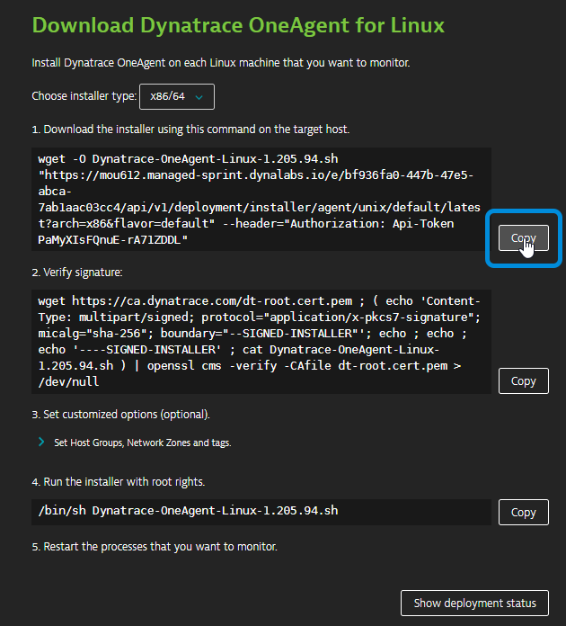
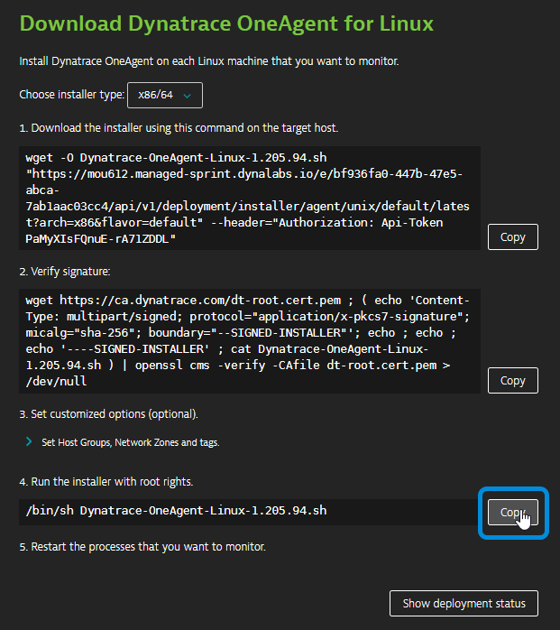
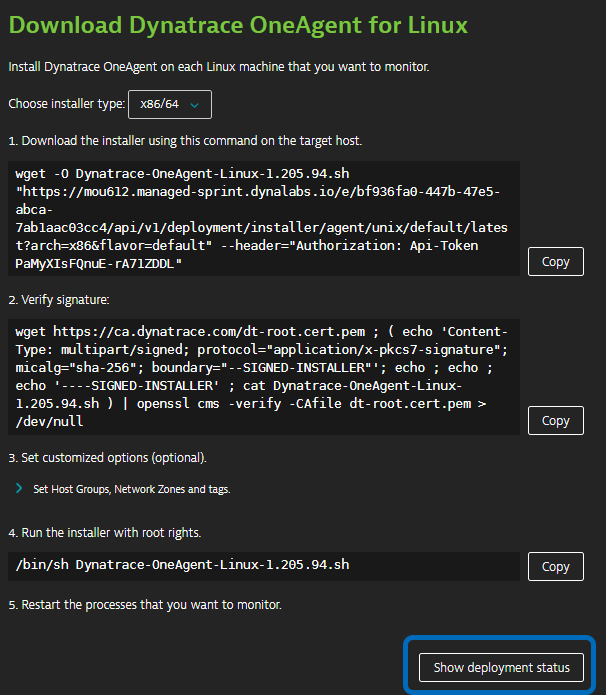
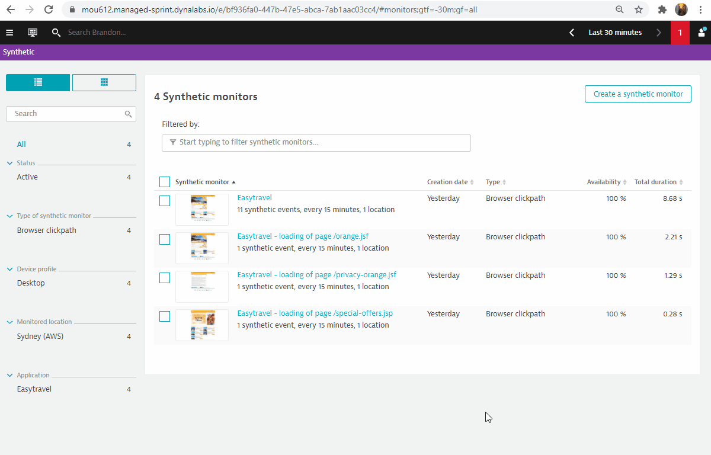

id: dem-jp
summary: Dynatraceによるリアルユーザーの自動監視
categories: dem, digital-experience
tags: dem, Beginner
status: Published 
authors: Brandon Neo
Feedback Link: mailto:APAC-SE-Central@dynatrace.com
Analytics Account: UA-175467274-1

# Dynatraceによるデジタルエクスペリエンスマネジメント
<!-- ------------------------ -->
## はじめに
Duration: 1

このリポジトリには、Dynatrace Digital Experience Management (DEM)ワークショップのハンズオンが含まれています。

### 事前準備
* DynatraceのAccount. フリートライアルの申し込み [here](https://www.dynatrace.com/trial/)
* Chrome ブラウザ

### セットアップ
このラボでは、以下のサンプルアプリケーションを使用します。
- サンプルアプリケーション 
    * [easyTravel](https://community.dynatrace.com/community/display/DL/easyTravel)

Negative
: このワークショップで使用するEasytravelアプリケーションを作成するには、[Prerequisite Actions](https://github.com/Dynatrace-APAC/Workshop-DEM/tree/master/Prerequisite%20Actions)に従ってください。なお、**Dynatrace**と**AWS**へのアクセスが必要です。

### 学習内容
- easyTravelアプリを使ったリアルユーザーモニタリングの設定を理解する 
- Dynatraceでの合成について
- Dynatraceのセッションリプレイについて
- ユーザーセッション問い合わせ言語（USQL）について

<!-- ------------------------ -->
## 基本設定
Duration: 15

この演習では、OneAgentをLinuxインスタンスにデプロイし、OneAgentにそのインスタンスで実行されているものを検出させます。

### Webブラウザでターミナルを使う

実験を円滑に進めるために、Linuxインスタンスに**Webブラウザを介したターミナル**でアクセスします。

メールに記載されている**URL**を使って、SSHターミナルにアクセスします。URLが `Public IP Address/wetty` のようになっていることを確認してください。

メールに記載されている**ログイン名**と**パスワード**を使用してください。


### OneAgentのダウンロード

ブラウザを開き、DynatraceのURLにアクセスします。

以下の手順に従ってください。

* ナビゲーションメニューから **Dynatrace Hub** を選択します。
* **OneAgent** を選択します。
* 右下の **Download OneAgent** ボタンを選択します。 
* **Linux** をクリックしてください。


Dynatrace OneAgent for Linuxのページ内で、以下の手順を行います。

* 「Download the installer」テキストフィールドの横にある **Copy** ボタンをクリックしてください。
* ターミナルウィンドウにコマンドを**Paste**して実行してください。



例: 

```bash
$  wget  -O Dynatrace-OneAgent-Linux-1.171.252.sh <follow screen shot above>
--2019-08-07 10:17:45--  https://<URL>
Resolving <URL>... <IP>
Connecting to <URL> | <IP>|:443... connected.
HTTP request sent, awaiting response... 200 OK
Length: 139134801 (133M) [application/octet-stream]
Saving to: ‘Dynatrace-OneAgent-Linux-1.171.252.sh’

100%[======================================>] 139,134,801 84.3MB/s   in 1.6s

2019-08-07 10:17:47 (84.3 MB/s) - ‘Dynatrace-OneAgent-Linux-1.171.252.sh’ saved [139134801/139134801]
```

### インストールスクリプトの実行

Negative
: 署名の検証（ステップ2）は、オプションのステップです。これを実行するには、システムが最新の状態になっていること、特にSSLと関連する証明書ライブラリが最新の状態になっていることを確認してください。

* Run the installer "テキストフィールドの横にある **Copy**ボタンをクリックします。



* Append the copy with `sudo` command to make the script executable before you can run it.
* **Paste** the command into your terminal window and execute it. 
* **Use** the password provided in your email

* コピーに `sudo` コマンドを付加して、スクリプトを実行可能な状態にしてから実行してください。
* コマンドをターミナルウィンドウに**貼り付けて**実行してください。
* メールに記載されている**パスワードを使用**してください。


```bash
$ sudo /bin/sh Dynatrace-OneAgent-Linux-1.171.252.sh
10:21:42 Checking root privileges...
10:21:42 OK
10:21:42 Installation started ...
...
10:22:14 Starting agents...
10:22:14 oneagent service started
10:22:14 Checking if agent is connected to the server...
10:22:16 Dynatrace OneAgent has successfully connected to Dynatrace Cluster Node. After completing Dynatrace OneAgent installation on this machine, please return to your browser to complete the remainder of the installation.
$

```

### Deployment status でインストールを検証する

Show deployment status**をクリックすると、接続されているホストの状態が確認できます。



下の画像のように、接続されたホストが表示されているはずです。


Positive
: Dynatraceのドキュメントは[こちら](https://www.dynatrace.com/support/help/technology-support/operating-systems/linux/)を参照しています。

### Easytravelアプリケーションの再起動

Easy Travelを再起動するには、以下のコマンドを実行してください。

`/restart_easyTravel.sh`

```bash
$ ./restart_easyTravel.sh
Restarting easyTravel ....
Stopping easyTravel ....
OKeasyTravel scenario stopped
Please wait...
Starting easyTravel ....
OKeasyTravel scenario started
Done.
```

### Easytravelアプリケーションを見る

Dynatrace内で、以下の手順でEasytravelのURLを取得します。

* OneAgentのデプロイメント画面で**hostname**をクリックします。
* **Properties and tag** を Host view で展開します。
* メタデータからパブリックホスト名を**選択してコピー**します。
* ブラウザの新しいタブを開きます。
* アドレスバーに**貼り付け** パブリック・ホスト名の最後に `:8080` を **追加** します。
* Easytravelアプリへのアクセス


### Smartscapeを探る

Easy Travelが起動するのを待っている間、Dynatraceを探索し、Smartscapeを使って、DynatraceがEasy Travelアプリケーションを構成するプロセスと依存関係を自動的に発見することができます。

[4 things](https://www.dynatrace.com/support/help/get-started/4-things-youll-absolutely-love-about-dynatrace/) Dynatraceの魅力をご紹介します。


<!-- ------------------------ -->
## リアルユーザーモニタリングの設定
Duration: 15

このラボでは、Real User Monitoring の設定の基本を説明します。これらは、自動注入であれ手動注入であれ、DynatraceのJavaScriptエージェントが展開されるたびに従うべきベストプラクティスの一部です。

Positive
: Dynatraceのドキュメントは[こちら](https://www.dynatrace.com/support/help/how-to-use-dynatrace/real-user-monitoring/setup-and-configuration/web-applications/)を参照しています。


### 学ぶべきこと

- **タスク1: アプリケーションの定義**。
- **タスク2：適切なJavaScriptフレームワークの選択**
- **タスク3：ユーザーセッションのタグ付け**

### その他のDEM設定

- ユーザーアクションのネーミング
- セッションプロパティ
- コンバージョンゴール
- 主なユーザーアクション
- エラー
- カスタムメトリクス

上記のいくつかは、APIを介して自動化され、お客様の環境に設定されています。

### タスク1: アプリケーションの定義

以下の手順でアプリケーションを定義します。

* 左側のナビゲーションメニューから **Applications** を選択します。
* **My web application** プレースホルダーアプリケーションをクリックします。
* **スクロールダウン**して、「Top 3 included domains」パネルを見つけます。
* **View full details**をクリックします。
* 1つ目のドメイン（例：ip-address.ap-southeast-2.compute.internal**）の**arrow**をクリックしてドロップダウンさせます。
* **+ Create new application** をクリックしてください。
   - アプリケーションが作成され、Applicationsページに表示されます。
   - このドメインで監視されているすべてのユーザーアクションは、新しく作成されたアプリケーションにマッピングされます。
* **Create** をクリックします。


これで内部ドメインのマッピングが完了したので、外部ドメインについても同様の作業を行います。

* 2つ目のドメイン（例：**external-ip.ap-southeast-2.compute.amazonaws.com**）の**arrow**をクリックしてドロップダウンさせます。
* **Transfer**をクリックします。


新しく作成したアプリケーションの名前を変更するには

* ナビゲーションメニューから **Applications** を選択します。
* **<ip.address>.ap-southeast-2.compute.internal** アプリケーションをクリックします。
* **Browse button (...)**をクリックし、**Edit**を選択します。
* このワークショップでは、アプリケーション名に **Easytravel** を使用してください。


Positive
: Dynatraceのドキュメントは[こちら](https://www.dynatrace.com/support/help/how-to-use-dynatrace/real-user-monitoring/setup-and-configuration/web-applications/initial-configuration/define-your-applications-via-the-my-web-application-placeholder)を参照しています。

### タスク2：適切なJavaScriptフレームワークの選択

Javascriptのフレームワークを選択するには

* **Framework settings** をクリックします。
* 検出されたフレームワークを確認する
* 検出されたフレームワークをトグルオンする（例：**Icefaces, jQuery, Prototype**）。
* **Capture XmlHttpRequest (XHR)** をトグルオンする。
* **Save** をクリック


Positive
: Dynatraceのドキュメントは[こちら](https://www.dynatrace.com/support/help/how-to-use-dynatrace/real-user-monitoring/setup-and-configuration/web-applications/initial-configuration/configure-dynatrace-real-user-monitoring-to-capture-xhr-actions/)を参照しています。

### タスク3：ユーザーセッションのタグ付け

次は、ページのメタデータに基づいてユーザーをタグ付けする方法です。このユーザータグ付けのアプローチは、アプリケーションのページソースで利用可能なデータを取り込むことで機能します。ユーザー名は、DOM要素のテキスト、metaタグ、JavaScript変数、あるいはcookie属性に含まれているかもしれません。例えば、DynatraceのデモアプリケーションであるeasyTravelでは、ホームページの右上にあるウェルカムメッセージにユーザー名が含まれています（下の画像参照）。ほとんどのブラウザに搭載されている開発ツールを使って、この特定の要素のために固有のCSSセレクタを生成することができます。


ページソースのどこにユーザー名があるかを確認したら、そのユーザー名に基づいてユーザータグを作成することができます。これを行うには、Dynatraceに戻り、以下の手順を実行します。

* **Capturing**の**User tag**を選択します。
* **Add tag (identifier) rule** をクリックします。
* ドロップダウンの **CSS Selector** を選択します。
* **ブラウザの開発者ツールからコピーしたCSSセレクタをコピー＆ペースト**してください。
   - CSSセレクタを使用する `#loginForm\:j_idt39` 。
   - CSSセレクタは、追加のテキストも拾ってしまうので、クリーンアップルールを適用します。
* Toggle ON **Apply cleanup rule**.
* Regex Text Fieldで`Hello ([^!]*+)`を使用します。
* **Add tag (identifier) rule** をクリックします。
* **Save** をクリック


Positive
: Dynatraceのドキュメントは[こちら](https://www.dynatrace.com/support/help/how-to-use-dynatrace/real-user-monitoring/how-to-use-real-user-monitoring/cross-application-user-session-analytics/identify-individual-users-for-session-analysis/)を参照しています。

<!-- ------------------------ -->
## Synthetic Testの設定
Duration: 15

この演習では、Dynatraceで単一のURLの合成テストを作成することを取り上げます。
Dynatraceには、3種類の合成モニタリングがあります。

- **シングルURLのブラウザモニター**
- **ブラウザのクリックパスの監視**
- **HTTPモニター**

Positive
: Dynatraceのドキュメントは[こちら](https://www.dynatrace.com/support/help/how-to-use-dynatrace/synthetic-monitoring)を参照しています。

### 1. Easytravelのブラウザモニターをワンクリックで作成する。

* Easytravel Applicationの右欄にある**Monitor from private locations**をクリックしてください。
   - エントリーアクションの選択は、上位3つのエントリーアクションに基づいて行われます。
   - オプション）必要に応じてトップ3エントリーアクションを編集することができます。

これで**3つのブラウザクリックパス合成モニター**を作成しました。


### 2. Easytravelのブラウザクリックパス合成モニターの作成

以下の手順に従ってください。
* **Create a synthetic monitor**をクリック
* **Create a browser monitor**をクリック
* **EasytravelのURL**をコピーして、URLブラウザモニタに**ペースト**してください。
* モニターに名前を付けてください - **Easytravel**。
* スクロールダウンして、**Record clickpath**をクリックしてください。
* **Pop-up Browser** が表示されます。クリックパスを以下のように記録します。
   - **Login** (top right)をクリック
   - **小さい錠前アイコン**をクリックし、**いずれかの名前を選ぶ**
   - **Book Now**をクリック
   - **Next**をクリック
   - **小さい錠前アイコン**をクリック
   - **Next**をクリック
   - **Finish**をクリック
   - **ポップアップされたブラウザウィンドウを閉じる**
* 記録されたクリックパスがDynatraceに記録されるようになりました。
* **Next**をクリック
* **場所としてシドニー（AWS）**を選択してください。
   - シドニーノードは、実際にはクラスターのエンドポイントであることに注意してください。
* **Next**をクリック
* **Create browser monitor**をクリック


Negative
: 初めてご利用になる方は、Chromeプラグインのインストールを求められます。ページ下部の「Install Dynatrace Synthetic Recorder」をクリックします。

Positive
: Dynatraceのドキュメントは[こちら](https://www.dynatrace.com/support/help/how-to-use-dynatrace/synthetic-monitoring/browser-monitors/record-a-browser-clickpath/)を参照しています。

### 3. HTTPモニター

以下の手順に従ってください。
* **Create a synthetic monitor**をクリックします。
* **Create an HTTP monitor** をクリックします。
* HTTPモニターの名前 - **Easytravel**.
* **Add HTTP request** をクリックしてください。
* **EasytravelのURL**をコピーして、HTTPリクエストのURLテキストフィールドに**ペースト**してください。
* **名前のテキストフィールドに**を貼り付けます。
* **HTTPリクエストの追加**をクリック
* スクロールダウンして **次へ** をクリック
* Scroll down and **Select Sydney (AWS)** as location.
   - Sydneyノードは実際にはクラスタのエンドポイントであることに注意してください。
* **Next** をクリックします。
* **Create HTTP monitor** をクリックします。



Positive
: Dynatraceのドキュメントは[こちら](https://www.dynatrace.com/support/help/how-to-use-dynatrace/synthetic-monitoring/http-monitors/create-an-http-monitor/)を参照しています。

<!-- ------------------------ -->
## セッションリプレイの設定
Duration: 15

この演習では、Dynatraceの**セッションリプレイ**の設定を取り上げます。

### セッションリプレイの有効化

以下の手順でセッションリプレイを有効にしてください。

* 左のナビゲーションメニューから**Applications**を選択します。
* **Easytravel**アプリケーションをクリックします。
* **Browse button (...)**をクリックし、**Edit**を選択します。
* **Session Replay and behavior**と**Session Replay**をクリックします。
* **Enable Session Replay**をオンにします。
* スクロールダウンして **Save** をクリックします。


Positive
: Dynatraceのドキュメントは[こちら](https://www.dynatrace.com/support/help/how-to-use-dynatrace/real-user-monitoring/basic-concepts/session-replay/)を参照しています。

### セッションリプレイを撮影するための負荷をシミュレート

Positive
: セッションリプレイを有効にして、Webブラウザ上の**Easytravelアプリ**に戻し、**ロードをシミュレート**します。
合成クリックパスと同じユーザージャーニーをたどることができます。

### セッション・リプレイの確認

数分後、Dynatraceの左ナビゲーションバーにある**User Sessions**の下で、自分のセッションを見つけることができます。

* Replayを有効にしているセッションのフィルタリング 

   

* セッションの再生


### 個人情報保護のための追加設定


Positive
: Dynatraceのドキュメントは[こちら](https://www.dynatrace.com/support/help/how-to-use-dynatrace/real-user-monitoring/setup-and-configuration/web-applications/additional-configuration/configure-session-replay-for-personal-data-protection/)を参照しています。

<!-- ------------------------ -->
## USQLの紹介
Duration: 15

Dynatraceは、ユーザーが監視対象のアプリケーションにアクセスするたびに、詳細なユーザーセッションデータを取得します。このデータには、すべてのユーザーアクションとハイレベルなパフォーマンスデータが含まれます。Dynatrace APIまたは**Dynatrace User Sessions Query Language (USQL)**を使用すると、キャプチャしたデータに対して**強力なクエリ、セグメンテーション、アグリゲーション**を簡単に実行できます。 User Sessions Query Languageは**Dynatrace専用のクエリ言語**ですが、いくつかのSQLの概念に基づいており、構文も似ているため、簡単に使い始めることができます。

USQLを使用する典型的なユースケースは、ビジネス指標を視覚化するダッシュボードを構築することです。


Positive
: Dynatraceのドキュメントは[こちら](https://www.dynatrace.com/support/help/how-to-use-dynatrace/real-user-monitoring/how-to-use-real-user-monitoring/cross-application-user-session-analytics/custom-queries-segmentation-and-aggregation-of-session-data/)を参照しています。

### 1. USQLを知る

以下の手順でご確認ください。
* ナビゲーションメニューから **ユーザーセッション** を選択します。
* トップバーの**フィルター**を使用し、**アプリケーション**として**Easytravel**を選択します。
* **ユーザーセッションクエリ** をクリックします。


**サンプルクエリ**

**ユーザージャーニーのためのファネルの作成**
```sql
SELECT FUNNEL(useraction.name="loading of page /special-offers.jsp" AS "Special Offers landing page", useraction.name = "loading of page /orange-booking-review.jsf" AS "Review package", useraction.name = "loading of page /orange-booking-payment.jsf" AS "Payment") FROM usersession
```

**特定の場所からのページパフォーマンスの把握**
```sql
SELECT DATETIME(starttime, 'MM/dd/yyyy hh:mm', '30m'),AVG(useraction.visuallyCompleteTime)
FROM usersession
WHERE country IS "United States" GROUP BY DATETIME(starttime, 'MM/dd/yyyy hh:mm', '30m')
```

**どのユーザーにエラーが発生しているかを把握する**
```sql
SELECT userId, SUM(totalErrorCount) FROM usersession
WHERE totalErrorCount IS NOT NULL
GROUP BY userId ORDER BY SUM(totalErrorCount) DESC
```

**統計・分析の収集**
```sql
SELECT COUNT(*) FROM usersession WHERE useraction.name = "loading of page /orange.jsf"
```
<!-- ------------------------ -->

## アンケート
Duration: 3

このラボを楽しんでいただき、お役に立てれば幸いです。ご意見、ご感想をお待ちしております。
<form>
  <name>このラボでの全体的な経験はどうでしたか？</name>
  <input value="とても良い" />
  <input value="良い" />
  <input value="普通" />
  <input value="悪い" />
  <input value="とても悪い" />
</form>

<form>
  <name>このラボで最も役立ったことは何ですか？</name>
  <input value="Real User Monitoringの設定について" />
  <input value="Syntheticの学習" />
  <input value="Session Replayの学習" />
  <input value="User Session Query Languageの学習" />
</form>

<form>
  <name>このラボを友人や同僚に勧める可能性はどの程度ありますか？</name>
  <input value="強く勧めたい" />
  <input value="勧めたい" />
  <input value="わからない" />
  <input value="勧めない" />
  <input value="全く勧めない" />
</form>

Positive
: 💡 その他のアイデアや提案については、[メールでのお問い合わせ](mailto:APAC-SE-Central@dynatrace.com?subject=DEM Workshop - Ideas and Suggestions") をお願いします。