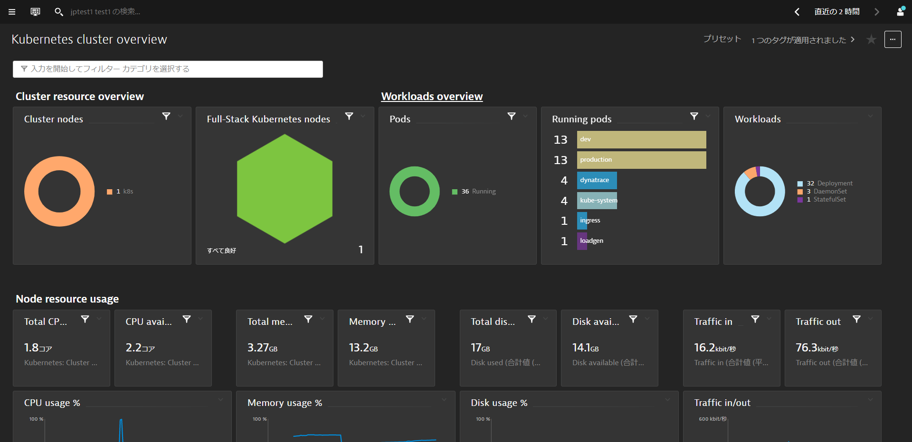

<!-- Code for k8s dashboards -->

DynatraceのUIから**観察と探索 > ダッシュボード**を開きます。もしくはお気に入りに登録されている場合は**お気に入り > ダッシュボード**でも開くことができます。

### Kubernetes Cluster Overview
Kubernetesクラスタに関する情報を確認することができます。複数のクラスタを監視している環境では**filter bar**を使うことで特定のクラスタのみにフィルタリングすることもできます。

### Kubernetes Workload Overview
ネームスペースに割り当てられたKubernetesのワークロードとその使用状況の概要を確認することができます。
また、**filter bar**を使ってダッシュボードをフィルタリングすることもできます。

