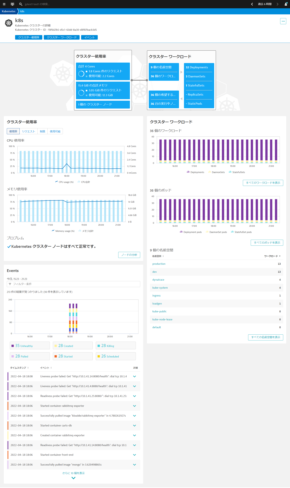
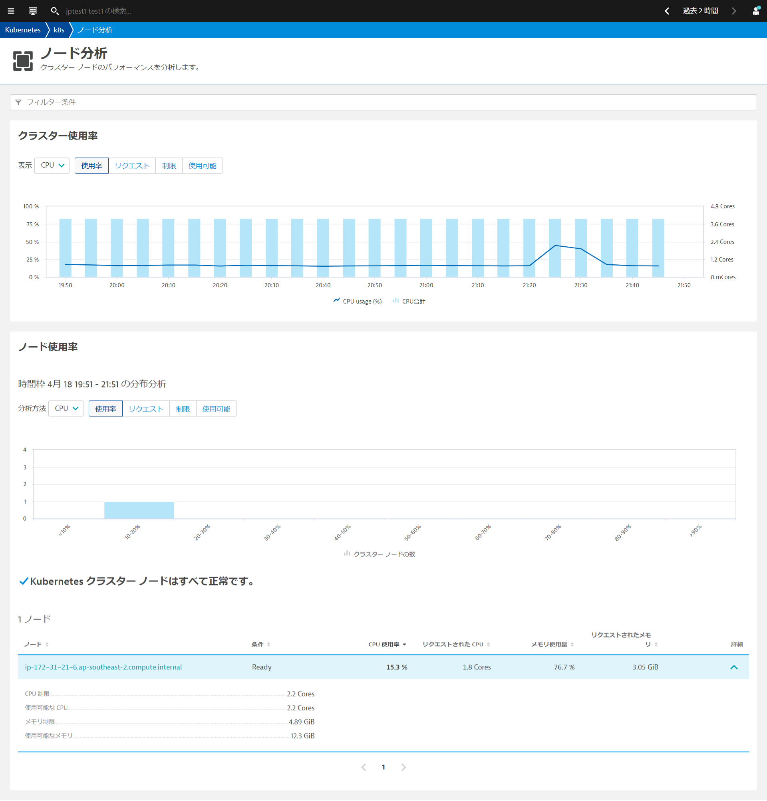
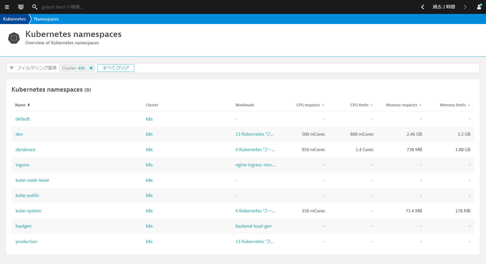
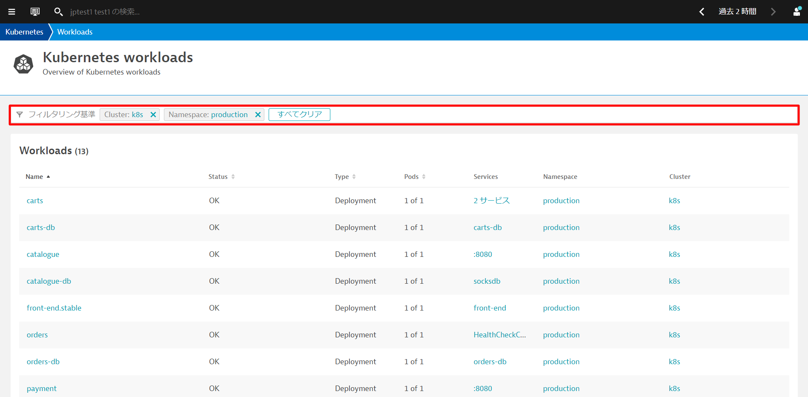
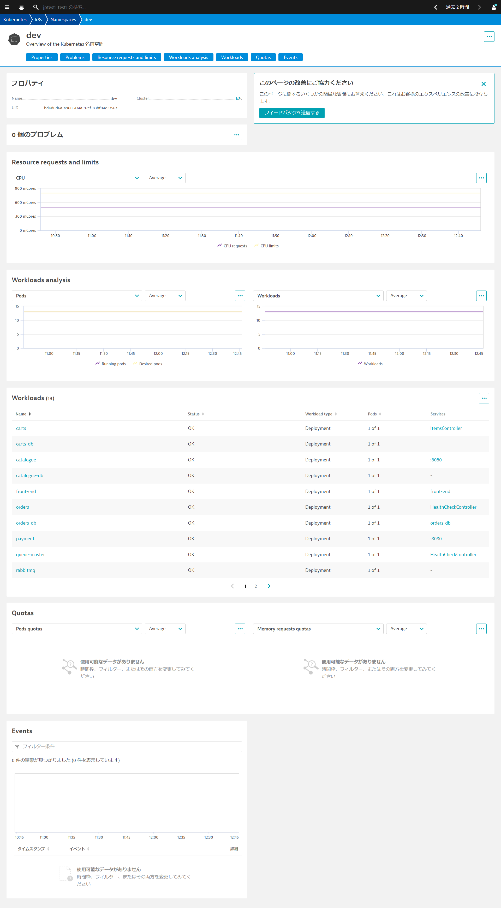
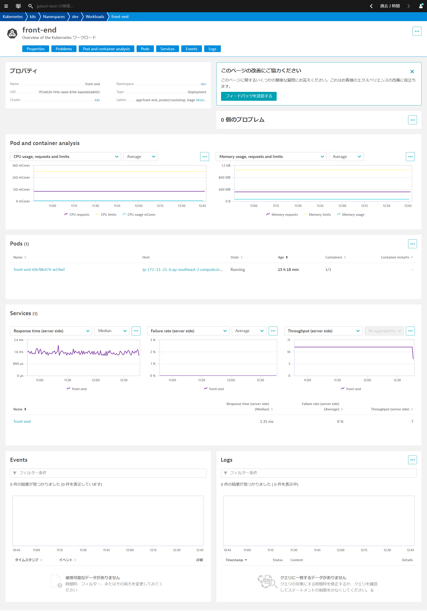
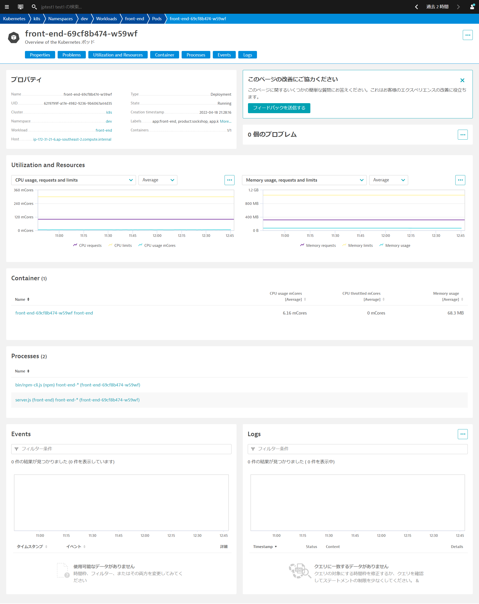

<!-- Code for k8s views -->

Kubernetes Viewからクラスタの使用状況、クラスタのワークロード、Kubernetes関連のイベントなどを確認できます。

* 左のメニューから**インフラストラクチャ > Kubernetes**を選ぶか**メニューのフィルタリング**から、**Kubernetes**でフィルターすることで簡単にアクセスできます。
* 情報を表示したいクラスタ名（例：k8s）をクリックします。

### Kubernetes クラスター使用率の分析

クラスターのリソースで重要なCPUコア数、合計メモリ数とそれぞれのPodsのリクエスト数、利用可能数やクラスタノード数が一目で確認できます。
クラスターレベルで最も重要な利用状況やパフォーマンスメトリクスを時系列データとして確認できます（マウスオーバーすることで最小値、最大値、中央値）。
* CPU使用率・メモリ使用率
* CPUリクエスト・メモリリクエストの合計値
* CPU制限・メモリ制限の合計値
* 利用可能なCPU・メモリリソース量

### Kubernetesクラスターのワークロードの分析

リソースをどのようなワークロードが使用しているのか簡単に確認することができます。
* ワークロードの種別毎、ポッドの種別毎にクラスター内でどのように実行していたか時系列データとして確認できます。
* クラスター内の名前空間（Namespace）毎にワークロードがどれだけ稼働しているか確認できます。

### Kubernetes イベントの分析

Kubernetesのデフォルトでは、`kubectl get events`は1時間しかデータが保持されません。Dynatraceにイベント情報をログとして取り組むことで、SaaS環境では35日間保存することが可能になります。
さらにイベントの種別毎に絞り込むことが可能です。

Positive
: もし、イベント情報が何も表示されていない場合は、以下のコマンドを実行してPodsを再起動してください。 
`kubectl delete pods --all -n dev`

### ノード単位の分析

**ノードの分析**ボタンをクリックすることで、ノード分析を開くことができます。ノード単位で詳細を把握することで、個々のノードの活用状況を把握することができます。ノードにまだどれだけのワークロードをデプロイできるか（つまり、利用可能なCPU・メモリの空きリソース ）についての知ることができます。

### ワークロード、ポッド、名前空間の統一された分析ビュー

**すべてのワークロードを表示**、**すべてのポッドを表示**、**すべての名前空間を表示**をクリックすることで、クラスター内のワークロード、ポッド、名前空間を表示することができます。
例えば**すべての名前空間を表示**をクリックするとワークロード数、CPU・メモリのリクエストと制限を一覧形式で確認することができます。

フィルタリング基準を利用することで、確認したいリソースを絞り込むことができます。例えば、ワークロードの一覧画面で`Namespace production`とすることで該当の名前空間のワークロードのみに絞り込むことができます。

ネームスペース分析ページでは、プロパティ、問題、リソースのリクエストと制限、ワークロード分析、そのネームスペースに属するワークロード、クォータ、およびイベントを確認できます。

ワークロード分析ページでは、プロパティ、リソースの使用状況、問題、脆弱性（Application Security を有効にしている場合）、それぞれのワークロードのポッド数とその状態、ポッドにトラフィックを送信しているサービス、イベントを確認できます。この情報は、ポッド内の特定の問題を調べるのではなく、全体的なパフォーマンスを分析するために有益です。

ポッド分析ページでは、プロパティ、問題、使用率とリソース、ポッドが所属するコンテナ、ホストにおけるプロセス、ポッドに関連したKubernetesのイベント情報、ログ取得の設定を行っている場合にはポッドのログを確認できます。ポッドがクラッシュしたり、CPUやメモリの飽和によって速度が低下したりする場合に、具体的な問題を解析できます。

