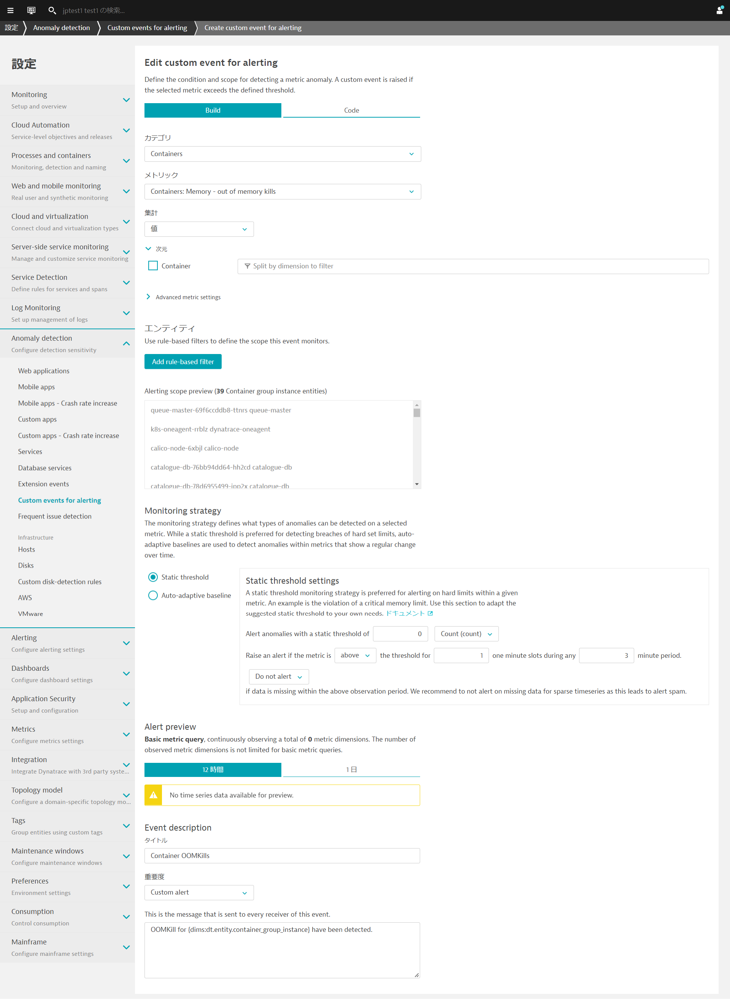
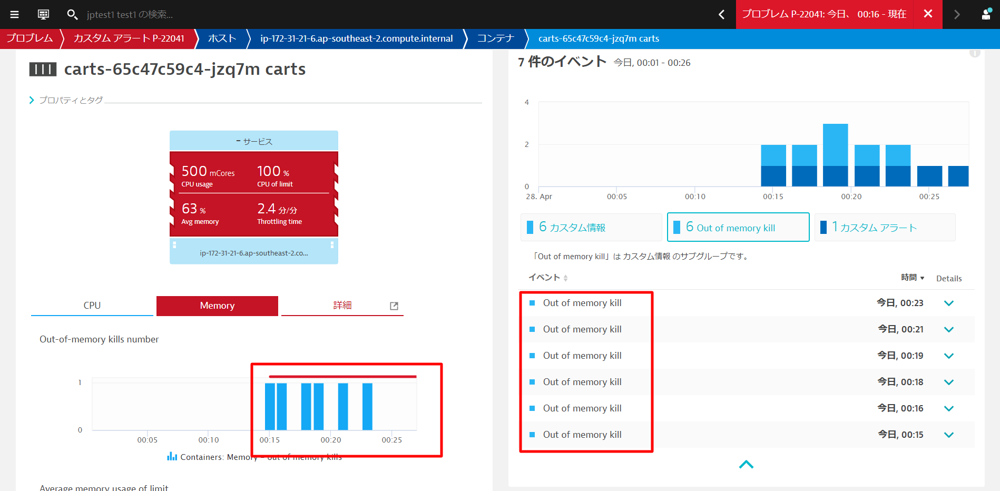

### ワークロードのリソース使用量の管理

Kubernetesプラットフォームは、多くの仮想化および抽象化レイヤーの上に構築されていますが、ワークロードが使用しているリソースを意識する必要があります。

これは、Kubernetesが通常、共有インフラ上で動作するプラットフォームとして設計されているため、使用するリソースの量が、同じクラスタ上で動作する他のアプリケーションに影響を与える可能性があるためです。

- Kubernetesプラットフォームの管理者は、プロジェクト（名前空間）が遵守する必要のあるリソースクォータを設定します。
- アプリケーションチームは、指定されたリソースを異なるマイクロサービスに割り当てる責任があります。

### アラートのためのカスタムイベントの設定

ここではOutOfMemory Killの発生を検知し、アラートを上げるための設定を行います。

**管理 > 設定**を開き、**Anomaly detection > Custom events for alerting**へ移動し、**Create custom event for alerting**をクリックします。

以下の通りに設定をします。（注：すぐにアラートが上がるように閾値はあえて低めに設定してあります）

* **カテゴリ:** `Containers`
* **メトリック:** `Containers: Memory - out of memory kills`（outofと入力すると絞り込みが可能です）
* Monitoring strategy
  * Static threshold
    * Alert anomalies with a static threshold of `0`
    * Raise an alert if the metric is `above` the threshold for
`1` the threshold for `3` minute period.
* **タイトル:** `Container OOMKills`
* **重要度:** `Custom alert`
* **Message:** `OOMKill for {dims:dt.entity.container_group_instance} have been detected.`



### 新しいビルドのデプロイ

以下のコマンドを実行して、このデプロイメントを適用します。

```bash
cd ~/sockshop
kubectl apply -f manifests/sockshop-app/newbuilds/newbuild-quota.yml
```

数分後にDynatraceはプロブレムを検知します。


**観察と探索 > プロブレム**を開きましょう。**Container OOMKills**が発生していることが確認できます。


新しいcartsポッドのコンテナが**OOMKilled**されました。これは、メモリ使用量が設定された上限を超えたことを意味します。


**コンテナーグループインスタンス**をクリックすると、コンテナービューに移動します。
コンテナビューでは、リソースの消費状況を把握するために必要なすべてのメトリクスとデータポイントが表示されます。



これは新しいビルドと関係があり、次のどちらかが問題の原因となります。

1. コンテナのメモリ制限が間違って設定されていた
2. 新しいビルドにメモリリークがあり、時間の経過とともに制限値以上のメモリを消費している。
  - このような場合、いくらメモリ制限を増やしても、結局は制限を超えてしまいます。これでは時間稼ぎをしているだけで、コード自体を修正する必要があります。
  - さまざまな条件でテストを行い、Javaのメモリメトリクスをプロセスビューから監視します。Dynatraceは、必要となるすべてのメトリクスを提供しています。


開発チームはすぐにこの問題を発見し、修正を行いました。この問題は、設定上の問題に関連しており、コンテナのメモリ制限が誤って設定されていました。

ターミナルでは、修正を適用します。

```bash
kubectl apply -f ~/sockshop/manifests/sockshop-app/newbuilds/newbuild-quota-fix.yml
```

しばらくするとDynatraceでも問題はクローズされます。


### 教訓として

- Kubernetesにおけるリソース管理は非常に重要です。
- インフラやクラウドサービスでは、リソースは常に制限されており、コストがかかります。
- ワークロードのリソース消費量を把握することは、様々なサービスに対してどのような要求や制限を設定すべきかを把握するための鍵となります。

k8sのインフラ運用チームは、常に必要な分だけのリソースを提供してくれます。彼らの責任は、プラットフォームを利用するすべての人のために、プラットフォームが健全に保たれるようにすることです。そのため、より多くのリソースが必要な場合には、プラットフォームチームと交渉しなければなりません。どのような交渉でも、できるだけ多くの情報を持ってテーブルにつくことが大切です。

そのためには、Dynatraceが頼りになります。