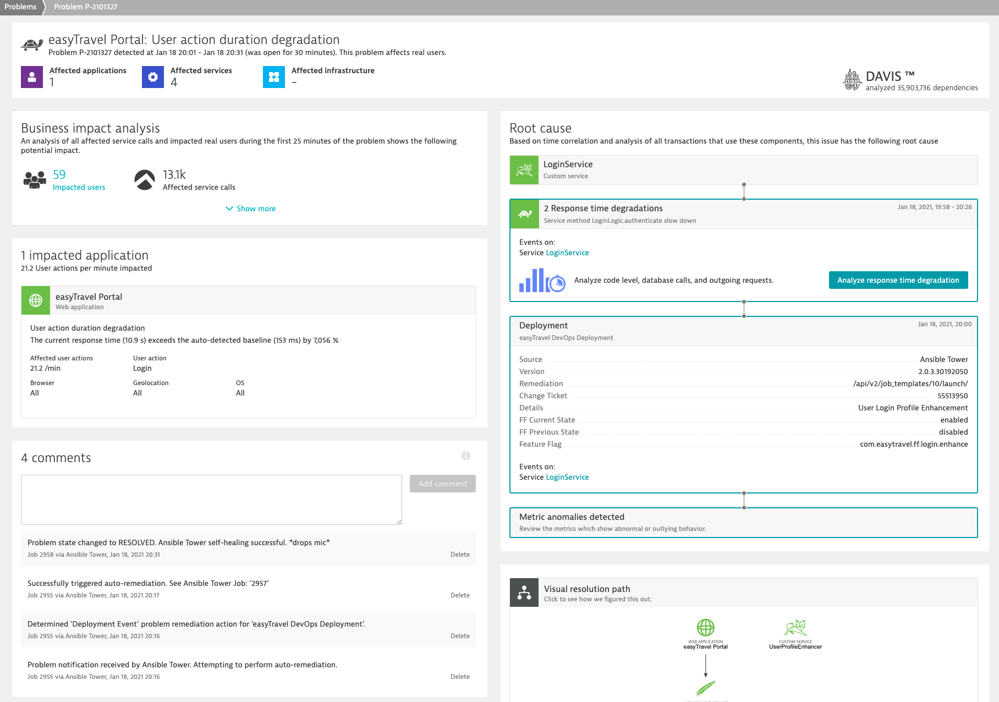

id: get-started-ansible
summary: Get started with Redhat Ansible and archive automation with Dynatrace
categories: ansible, get-started
tags: microlab, Introduction
status: Published 
authors: Brandon Neo
Feedback Link: mailto:APAC-SE-Central@dynatrace.com
Analytics Account: UA-175467274-1

# Get Started with Ansible
<!-- ------------------------ -->
## Introduction

This section contains the various approaches to get started with Redhat Ansible. This includes the various flavors of Ansible including Redhat Ansible Tower.

Positive
: If you need to use a **demo application**, you can use Dynatrace's sample app [easyTravel](https://community.dynatrace.com/community/display/DL/easyTravel)

### What You’ll Learn
- Installing Ansible
- Install OneAgent with Ansible
- Auto-Remediation use case
- Discover and Explore Dynatrace

<!-- ------------------------ -->
## Automated Deployment with Ansible
Duration: 15

In this exercise, we will deploy the OneAgent to a Linux instance with Ansible.

Based off our [Dynatrace Ansible Github](https://github.com/Dynatrace/Dynatrace-OneAgent-Ansible), you can rollout Dynatrace Oneagent easily across on Linux and Windows Operating Systems with different available configurations and ensures the OneAgent service maintains a running state. It also provides the tasks to interact with the various OneAgent configuration files.

Following the steps from our [documentation](https://www.dynatrace.com/support/help/setup-and-configuration/dynatrace-oneagent/deployment-orchestration/ansible/), we will use an Ansible collection to orchestrate OneAgent deployment.

You can also use other Ansible playbooks examples can be seen [here](https://github.com/popecruzdt/dt-ansible/blob/popecruzdt/dt-oneagent-install-linux.yml)

<<snippet/install/ansible.md>>

<<snippet/deploy/oneagent-ansible.md>>

<!-- ------------------------ -->
## Self Healing with Ansible
Duration: 15

Deploying applications efficiently requires using an **automated delivery pipeline**. Dynatrace tracks all key metrics through the various CI/CD stages into production. Through understanding the feedback loop, you can stop faulty builds before they reach production or even self-remediate issues based on problems which Dynatrace detects. This allows deploying software faster with higher quality.

There are various kinds of use cases for Ansible playbooks:
* Deployment change
* Rollback change
* Rollback deployment
* Auto remediation

Example of these playbooks could be found [here](https://github.com/Dynatrace-APAC/dt-ansible-autoremediation)

Positive
: This systematic and generic approach can be applied to any software that Dynatrace monitors and any CI/CD pipeline that our customers may use, meaning we can speed up 🚀 their delivery up to 80% while ensuring the functionality and a higher level of quality of their released software ✅.

[Dynatrace's DAVIS AI-engine](https://www.dynatrace.com/platform/artificial-intelligence/) will be able to detect problems and trigger the specific and appropriate responses based on playbooks. 

In the video below, we also demonstrate and explore how Ansible and Dynatrace can be used together to automate deployments and to build auto-remediation workflows which enable self-healing applications.

<video id='iNkDuCqOrXw'></video>

To experience in **Self-Healing as a Service**, you could refer to our [Autonomous Cloud lab](/workshops/autonomous-cloud/index.html?index=..%2F..index#8)

<!-- ------------------------ -->
## Advanced Use Cases

<<snippet/explore/use-cases.md>>