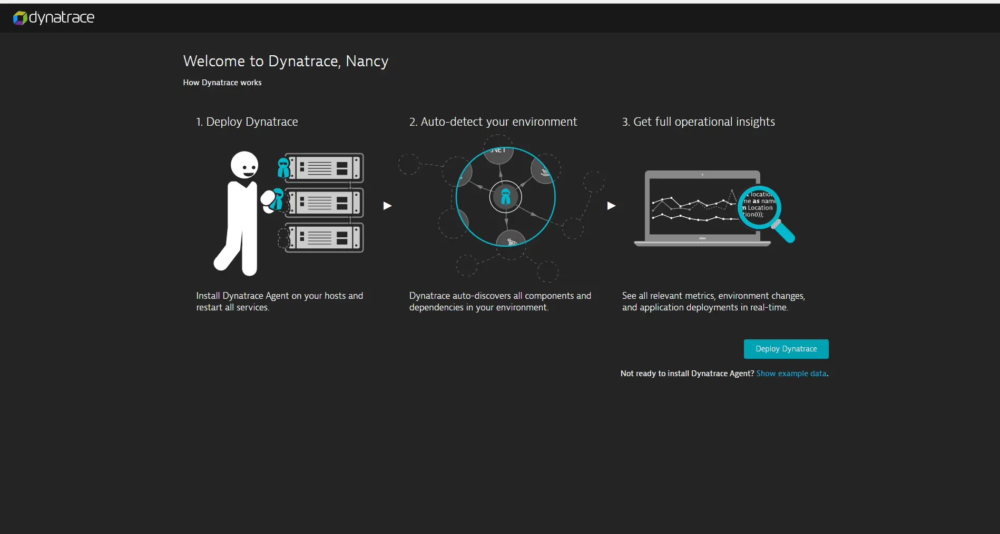

summary: Dynatrace実践入門
id: get-started-dt-jp
categories: get-started
tags: getting-started-jp
status: Published 
authors: Brandon Neo
Feedback Link: mailto:APAC-SE-Central@dynatrace.com
Analytics Account: UA-175467274-1

# Dynatrace実践入門
<!-- ------------------------ -->
## はじめに

このラボでは、Dynatraceを使い始めるために必要な簡単な手順を紹介しています。

Positive
: もし、 **デモアプリケーション** を使用する必要がある場合は、Dynatraceのサンプルアプリ [easyTravel](https://community.dynatrace.com/community/display/DL/easyTravel) をご利用ください。

### ラボの内容
- Dynatraceアカウントの作成
- OneAgentの展開
- Dynatrace UIの紹介

<!-- ------------------------ -->
## Dynatraceアカウントの作成
Duration: 5

### アカウントの作成

* [Dynatrace free trial page](https://www.dynatrace.com/trial/) へ行く。
* **business email address** を入力し **Start free trial** を選択する。
* アカウント情報を入力し、規約に同意いただく。
* アカウント作成を選択する。
* 作成に問題がなければ、以下のような画面が表示される。

これで終わりです。お客様専用のDynatrace SaaSテナントページに移動します。 (例 **abc12345.live.dyntrace.com**)

<!-- ------------------------ -->
## OneAgentの展開
Duration: 5

### OneAgentのダウンロード

以下の手順に従って、OneAgentをホストにインストールします。

* 左側のナビゲーションパネルから **Dynatrace Hub** を選びます。
* **OneAgent** を選びます。
* 右下にある **Download OneAgent** を選びます。
* インストールしたい **OS** もしくは **プラットフォーム** を選びます。
* 画面の指示に従って、OneAgentのダウンロードとインストールを実行します。

Positive
: Windowsの場合、追加のパラメータは必要ありません。OneAgentインストーラーをダウンロード」を選択すると、Windowsインストーラーがダウンロードされます。

完了すると、インストーラーはDynatrace OneAgentがDynatraceクラスタノードに正常に接続されたことを伝えるメッセージを表示します。

Negative
: インストールに関して問題が起きた場合は、次のドキュメントサイトをご確認ください。 [help documentation page](https://www.dynatrace.com/support/help/setup-and-configuration/dynatrace-oneagent/troubleshooting/troubleshoot-oneagent-installation/)

### 正しくデプロイメントされたか確認する

ホストとの接続性を確認するために、左側のナビゲーションパネルから **Deployment status** を選びます。

下の画像のように、接続されたホストが表示されているはずです。

## Dynatrace UIの紹介

Dynatraceは、お客様のアプリケーションのプロセスと依存関係を自動的に検出します。Dynatraceでは、以下のような様々な機能を利用することができます。

* [Smartscape](https://www.dynatrace.com/support/help/how-to-use-dynatrace/smartscape/)
* [Host view](https://www.dynatrace.com/support/help/how-to-use-dynatrace/hosts/) 
* [Processes](https://www.dynatrace.com/support/help/how-to-use-dynatrace/process-groups/)
* [Network](https://www.dynatrace.com/support/help/how-to-use-dynatrace/networks/) 
* [Logs](https://www.dynatrace.com/support/help/how-to-use-dynatrace/log-monitoring/)
* [Transactions and services](https://www.dynatrace.com/support/help/how-to-use-dynatrace/transactions-and-services/)

Negative
: なお、Dynatraceが**サービスレベルコール**を検出するためには、**アプリケーションサービス**を再起動する必要があります。

**Smartscapeの表示例**

### デモ動画

この5分間のデモでは、Dynatraceがどのようにお客様のシングルソースオブトゥルースになるのか、AIインテリジェンスがどのようにお客様に必要な情報を提供するのかをご覧いただけます。

<video id="0ihCziAJ07U"></video>

### Dynatrace Davis

これらはすべて、決定論的なAIを使用して自動フォールトツリー分析を行うAIエンジン、**Dynatrace DAVIS**によって分析されます。これは単なる相関関係ではなく、問題の因果関係を示すものです。

さらに詳しく知りたい方は [Interactive Demos](/interactive-demo) を使って [Dynatrace](https://www.dynatrace.com/platform/) がなぜ唯一のものなのか確認ください。

<!-- ------------------------ -->
## さらなる活用について
Duration: 5

[ホームダッシュボード](https://www.dynatrace.com/support/help/how-to-use-dynatrace/dashboards-and-charts/)にもアクセスできるようになりました。しかし、より高いオブザーバビリティを得るためには、デプロイ後にいくつかの追加手順が必要です。これらの手順は、[ドキュメントページ](https://www.dynatrace.com/support/help/shortlink/section-get-started#step-4-fine-tune-your-environment)に記載されています。

### 他のホストへの展開

1台のホストにDynatraceを導入し、すぐに監視を開始することがいかに簡単かがお分かりいただけると思います。しかし、これはDynatraceができることのほんの一例に過ぎません。

### その他のユースケース

Dynatraceは、幅広いユースケースに対応したオールインワンのプラットフォームです。

**インフラ監視** 
- Dynatraceは、ホスト、VM、コンテナ、ネットワーク、イベント、ログを幅広く可視化する、シンプルで自動化されたインフラストラクチャモニタリングを提供します。Dynatraceは、お客様のダイナミックな環境を継続的に自動検出し、インフラストラクチャのメトリクスをDavis®のAIエンジンに取り込むことで、ツールを統合し、MTTIを削減することができます。

**アプリケーションとマイクロサービス** 
- Dynatraceは、複雑なエンタープライズ・クラウド環境にまたがるアプリケーションに対して、コードレベルでの自動的な可視化と根本原因の解明を提供します。Dynatraceは、あらゆる階層のトランザクションのタイミングとコードレベルのコンテキストを自動的に取得します。また、モバイルからメインフレームまで、ハイブリッドクラウド全体でマイクロサービスを自動的に検出・監視します。

**デジタルエクスペリエンス監視 (DEM)** 
- Dynatrace DEMは、お客様の体験に対応するリアル・ユーザー・モニタリング（RUM）、グローバル・ネットワーク上のシンセティック・モニタリング、そして4Kムービーのようなセッション・リプレイを提供します。この強力な組み合わせにより、アプリケーションの最適化、ユーザーエクスペリエンスの向上、すべてのデジタルチャネルにおける優れたサポートの提供が可能になります。

**デジタルビジネス分析**
- ビジネス指標やKPIを、アプリケーション・パフォーマンスやデジタル・エクスペリエンス・モジュールにすでに流れているデータに結びつけることで、ビジネス上の重要な質問に対するAIによるリアルタイムの回答を得ることができます。

**クラウドオートメーション**
- Dynatrace AIOpsは、正確な答えを自動的に提供します。Dynatraceは、高忠実度のデータを収集し、リアルタイムに依存関係をマッピングすることで、Dynatraceの説明可能なAIエンジンであるDavis®が、問題や異常の正確な根本原因を示し、迅速な自動修復とインテリジェントなクラウドオーケストレーションを可能にします。

上記のユースケースに関してもラボを提供しています。（英語のみ）
* [Digital Experience Management with Dynatrace](/workshops/dem)
* [Advanced Observability with Dynatrace](/workshops/advanced-observability)
* [BizOps with Dynatrace](/workshops/bizops)
* [Autonomous Cloud with Dynatrace](/workshops/autonomous-cloud)

### 補足情報

- Dynatraceの機能をもっと知りたい方は、以下のビデオをご覧ください。 [Dynatrace Free Trial Resources](https://www.dynatrace.com/news/free-trial-resources/).

- オンプレミス版については、以下をご覧ください。 [Get started with Dynatrace Managed](https://www.dynatrace.com/support/help/get-started/get-started-with-dynatrace-managed/).