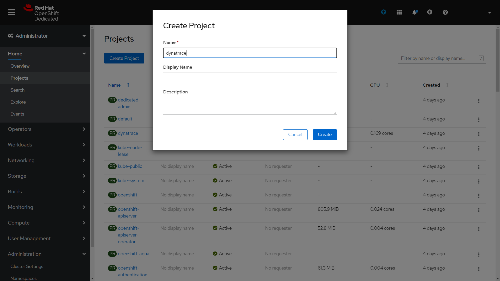
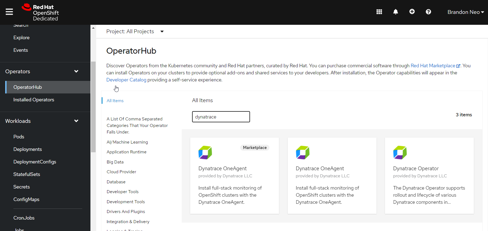
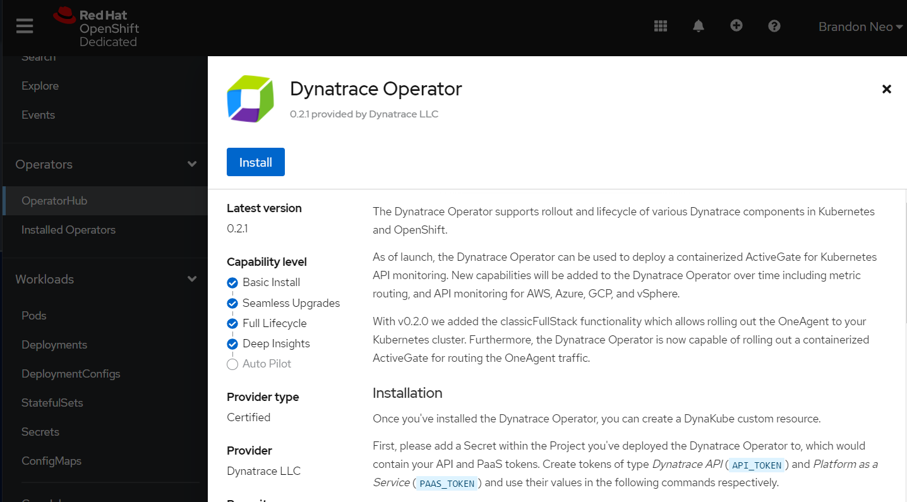
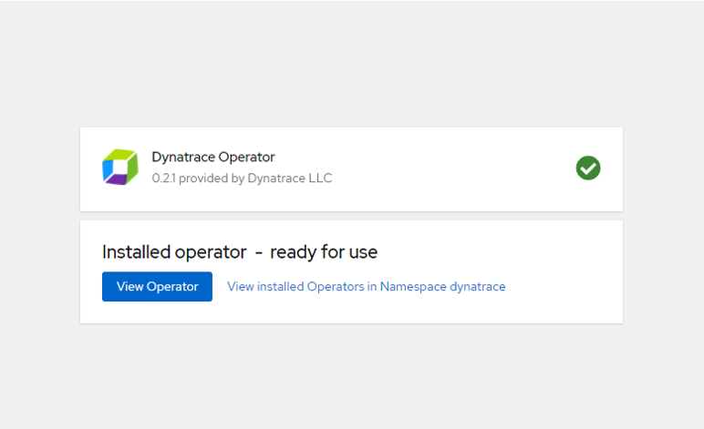
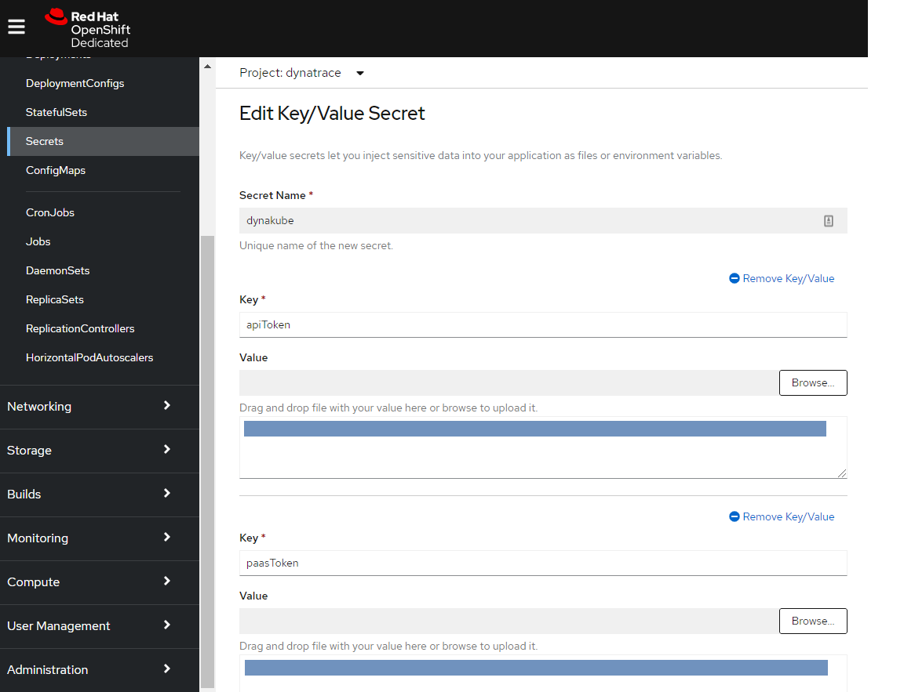
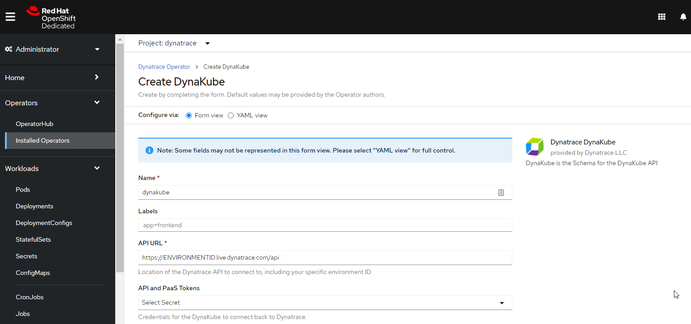
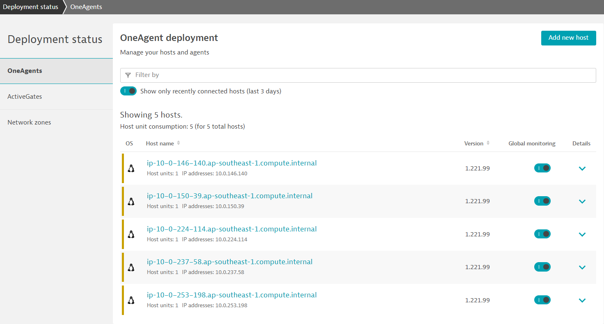
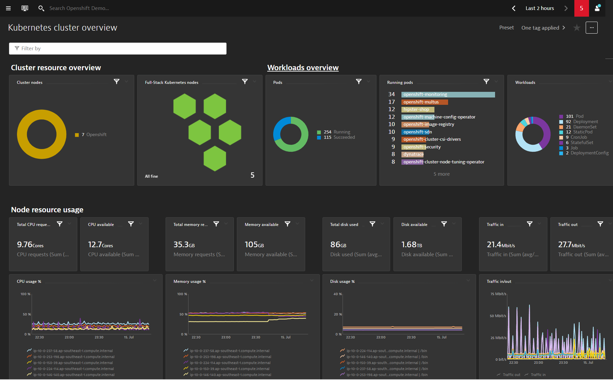
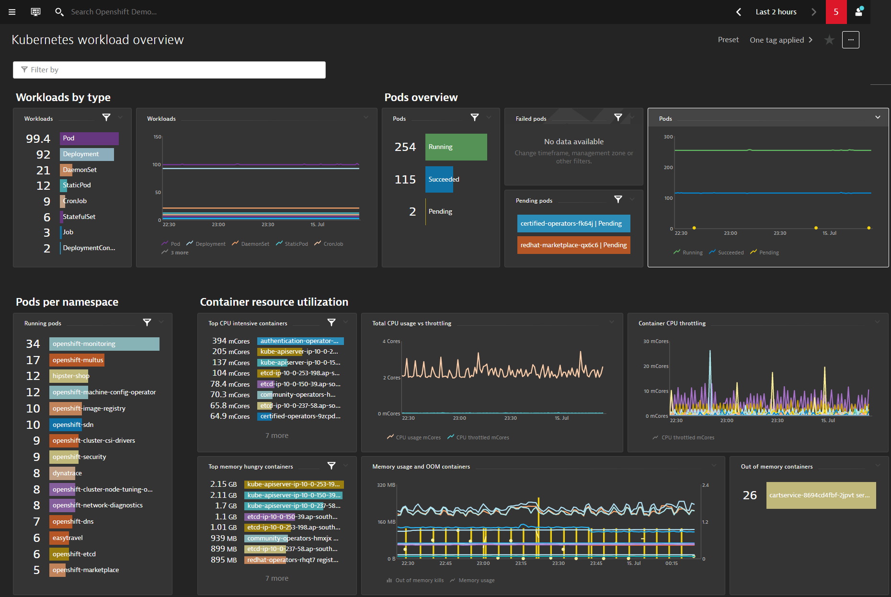

id: get-started-openshift
summary: Get started with Redhat Openshift and getting full observability with Dynatrace
categories: openshift, get-started
tags: microlab, Introduction
status: Published 
authors: Brandon Neo
Feedback Link: mailto:APAC-SE-Central@dynatrace.com
Analytics Account: UA-175467274-1

# Get Started with Openshift
<!-- ------------------------ -->
## Introduction

This section contains the simple steps required to get started with Redhat Openshift. 

Positive
: If you need to use a **demo application**, you can use Dynatrace's sample app [easyTravel](https://community.dynatrace.com/community/display/DL/easyTravel)

### What You’ll Learn
- Setting up Openshift
- Deploy Dynatrace Operator
- Discover and Explore Dynatrace

<!-- ------------------------ -->
## Setting up Openshift 
Duration: 5

### Choosing your deployment approach

There are various ways to setting up a [free Red Hat Openshift trial](https://www.openshift.com/try). You can also find other DIY apporaches on **Github via Terraform / Ansible**. The various approaches to creating the Openshift clusters are provided as **one-click options** with the [Redhat Hybrid Cloud Console](https://cloud.redhat.com/)

* Go to the [Redhat Hybrid Cloud Console](https://cloud.redhat.com/).
    * You can login with an existing account or create a new account

* Redhat Openshift could be created on the Cloud as a **Managed service (eg. AWS, Azure, IBM Cloud)** but also as **run-it-yourself** options

* For the purposes on this lab, we will be running the lab with **Red Hat Dedicated Trial**

<!-- ------------------------ -->
## Deploy Dynatrace Operator via OperatorHub
Duration: 15

We will now log into the Cluster and deploy Dynatrace OneAgent. Dynatrace supports various Openshift deployment approaches with the various rollouts. There are different ways to activate Dynatrace on OpenShift and each way has its own advantages. 
We recommend these deployment strategies in terms of feature completeness and lack of constraints.
Our [documentation link](https://www.dynatrace.com/support/help/technology-support/container-platforms/openshift/openshift-deployment-overview/) contains the various approaches.

We will be following the steps based on our following [documentation](https://www.dynatrace.com/support/help/technology-support/container-platforms/openshift/other-deployments-and-configurations/deploy-with-operatorhub/) 

### Deploy the Dynatrace Operator via OperatorHub

* Create a new project and deploy the operator.

* Within the Openshift dashboard, go to **Operators > OperatorHub**

* We will select the **Dynatrace Operator** and click on **Install**

* Once installed, click on **View Operator**.

### Create a Key/Value secret

To create an instance the Operator, we will need first need to create **key/value secret.**

Positive
: You can sign up for a [FREE Dynatrace trial](https://www.dynatrace.com/trial/) to get a SaaS instance. 

Within Dynatrace, use the following steps to get your **apiToken** and **paasToken**. 

* Select **Dynatrace Hub** from the navigation menu.
* Select **Openshift**
* Select **Monitor Openshift** button from the bottom right.  

Within the **Monitor Kubernetes / Openshift** page, follow these steps below:

* Enter a **Name** for the connection Eg. `openshift`
* Click on **Create tokens** to create PaaS and API tokens with appropriate permissions
* Copy the tokens and use them in Openshift 
* Back in Openshift, go to **Workload > Secrets**
* Name the key **dynakube**
* Click on **Add Key/Value** and paste the token value from Dynatrace
* Click on **Save**

### Create an instance of Dynatrace Dynakube

Dynatrace Dynakube is the schema which is used for Dynatrace Operator.

* In Openshift, go to **Operators > Installed Operators** and select **Dynatrace Operator**
* Click on **Create Instance**
* Fill up the **API URL** based on your Dynatrace environment
* Use your newly created **Dynakube** secret under API and PaaS Tokens
* Use the default values and click on **Create** at the bottom

Negative
: You can easily fine tune your setup based changing the options within this form

Positive
: Dynatrace will also handle automatic deployment of OneAgents through Operator as well as automatic k8s integration. 

### Validate the installation in Deployment status

Click on **Show deployment status** to check the status of the connected host. 

You should be able to see a connected Openshift nodes as per the image below.

<!-- ------------------------ -->
## Advance Observability on Openshift

With your setup done, explore what Dynatrace monitors automatically.

* On the left menu, filter for **Dashboards** to view the preset Kubernetes dashboards

### Exploring Kubernetes View

Explore the various functionalities within the Kubernetes View such as Cluster Utilization, Cluster Workloads, K8S Events

* On the left menu, filter for **Kubernetes** to view the Kubernetes dashboards

### Analyze the Kubernetes Cluster utilization
   -  Mouseover and note the CPU and Memory usage with the Min / Max
   -  Click on Analyze Nodes to drill deeper into each node
   

### Analyze the Kubernetes Cluster Workloads 
   -  Notice the Workloads and Pods running spilt between Kubernetes controllers

### Analyze the Kubernetes Events
   -  Notice the different types of events BackOff, Unhealthy

### Explore Kubernetes Workloads by clicking onto them
   - Click onto each of them and discover their supporting technologies
   

### Explore Kubernetes Namespaces and their workloads
   - Click onto each of them and discover their utilization and workloads
   

<!-- ------------------------ -->
## Extending Observability

Dynatrace allows multiple ways to extend the observability of your environment.

### Setup etcd for Openshift

To get deeper insights into your self-managed OpenShift control plane, you can also use an extension to **extract the etcd metrics** exposed on your cluster.

* Select **Dynatrace Hub** from the navigation menu.
* Type **etcd** within the filter
* Select **etcd for Openshift**
* Select **Add to environment** button from the bottom right. 

### Prometheus

You can also collect metrics from **Prometheus exporters in Kubernetes** to analyze and alert on them with Dynatrace.

* Select **Dynatrace Hub** from the navigation menu.
* Type **Prometheus** within the filter
* Select **Prometheus**
* Select **Activate Prometheus** button from the bottom right. 

<!-- ------------------------ -->
## Advanced Use Cases

Dynatrace is an all-in-one platform that's purpose-built for a wide range of use cases.

**Infrastructure Monitoring** 
- Dynatrace delivers simplified, automated infrastructure monitoring that provides broad visibility across your hosts, VMs, containers, network, events, and logs. Dynatrace continuously auto-discovers your dynamic environment and pulls infrastructure metrics into our Davis® AI engine, so you can consolidate tools and cut MTTI.

**Applications and Microservices** 
- Dynatrace provides automated, code-level visibility and root-cause answers for applications that span complex enterprise cloud environments. Dynatrace automatically captures timing and code-level context for transactions across every tier. It also detects and monitors microservices automatically across the entire hybrid cloud, from mobile to mainframe.

**Digital Experience Monitoring (DEM)** 
- Dynatrace DEM provides Real User Monitoring (RUM) for every one of your customer's journeys, synthetic monitoring across a global network, and 4K movie-like Session Replay. This powerful combination helps you optimize your applications, improve user experience, and provide superior support across all digital channels.

**Digital Business Analytics**
- By tying business metrics and KPIs to data that's already flowing through our application performance and digital experience modules, you get real-time, AI-powered answers to your critical business questions.

**Cloud Automation**
- Dynatrace AIOps gives you precise answers automatically. Dynatrace collects high-fidelity data and maps dependencies in real-time so that the Dynatrace explainable AI engine, Davis®, can show you the precise root causes of problems or anomalies, enabling quick auto-remediation and intelligent cloud orchestration.

The above use cases are setup as labs which you can run through:
* [Digital Experience Management with Dynatrace](/workshops/dem)
* [Advanced Observability with Dynatrace](/workshops/advanced-observability)
* [BizOps with Dynatrace](/workshops/bizops)
* [Autonomous Cloud with Dynatrace](/workshops/autonomous-cloud)

These are also conducted virtually as [Hands-On Workshops](/schedule). 

### Addtional Resources

- To learn more about what Dynatrace can do for you, watch the videos on [Dynatrace Free Trial Resources](https://www.dynatrace.com/news/free-trial-resources/).

- To learn about our on-premises alternative, read [Get started with Dynatrace Managed](https://www.dynatrace.com/support/help/get-started/get-started-with-dynatrace-managed/).