summary: Actionable-Infra
id: Actionable-infra
categories: actionable-infra
tags: bootcamp
status: Published 
authors: Brandon Neo
Feedback Link: mailto:APAC-SE-Central@dynatrace.com
Analytics Account: UA-175467274-1

# Actionable Infra Observability
<!-- ------------------------ -->

## Environment Setup
Here are a few quick steps to get your environment ready for today's exercises.

### Step 1. Turn on Metric Ingest in the Dynatrace UI
- Navigate to **Settings > Monitoring > Monitored Technologies**
  - Scroll down to the bottom of the list
- Turn on Dynatrace OneAgent StatsD, Pipe, HTTP Metric API

### Step 2. Create a Dynatrace API token with Metric Ingest permission
  - Navigate to **Settings > Integration > Dynatrace API > Generate Token with Ingest Metrics** toggle on
  - Copy and save the token in a secure place
### Step 3. Set up a browser monitor in the Dynatrace UI
- Navigate to **Synthetics > Create a Synthetic Monitor**
- Create a browser monitor against Dynatrace Home Page
  - Ex: https://dynatrace.com
  - Monitor Name: Dynatrace Home
- Leave all other defaults and select 3 locations  
&nbsp;    
<!-- ------------------------ -->

## Install Telegraf
<!--------------------->
###  Step 1. Download and install the latest release of Telegraf from https://portal.influxdata.com/downloads/
- Telegraf is written in Go, so there are no dependencies for the agent
  - Note: Plugins that run on top of Telegraf may have dependencies

```bash
wget https://dl.influxdata.com/telegraf/releases/telegraf-1.18.0-1.x86_64.rpm
sudo yum localinstall telegraf-1.18.0-1.x86_64.rpm
```

### Step 2. (Optional) After the installation is complete, navigate to https://github.com/influxdata/telegraf
- Navigate to plugins folder
  - Take a look at the different types of input plugins available
  - Take a look at the different types of output plugins available
- Any notable absentees in the output vendor list?

### Step 3. Let's configure Telegraf to send data to Dynatrace
  - Navigate to Telegraf config folder and edit telegraf.conf file

```
cd /etc/telegraf/
sudo vi telegraf.conf
```

#### Let's tell telegraf where to send the data - documentation here https://www.dynatrace.com/support/help/shortlink/telegraf
- Find `outputs.dynatrace` within the conf file and enable it by deleting the # at the beginning of the line
- Uncomment 'url' and add your Dynatrace environment URL with /api/v2/metrics/ingest appended at the end of the URL
- Uncomment 'api_token' and add API token from previous excercise
- Finally, uncomment 'prefix' parameter and leave "telegraf." - this helps us search metrics from telegraf easily within Dynatrace

#### By default, basic infrastructure metrics such as disk, memory and CPU should be enabled. Confirm by checking inputs.cpu, inputs.disk are uncommented
  - Uncomment those plugins if they're not already enabled
  - Save and close the conf file
  
### Step 4.  Let's start Telegraf service
```
sudo service telegraf start
```

## Metric Browser and Explorer

### Step 1. Clone Git Hub Repo
- In the DTU terminal

```bash
git clone https://github.com/JasonOstroski/Perform2021-ActionableInfraScripts.git
```

### Exercise Prep: CPU Temp
Let's generate some data for some later exercises

#### Kick off the CPU Temp Script
- In the DTU Terminal run the following

```bash
(ubuntuvm)$ cd Perform2021-ActionableInfraScripts
(ubuntuvm)$ python3 cputemp.py
```

### Metric Browser

- Search for Metric by name
  - Example: Telegraf.mem.used_percent
  - Favorite the Metric
  - Which dimensions are available?
- Create Chart and pin into a new dashboard
  - Give the dashboard a meaningful name
  - Ex: Infrastructure Overview
  - Tile Name: Memory Utilization

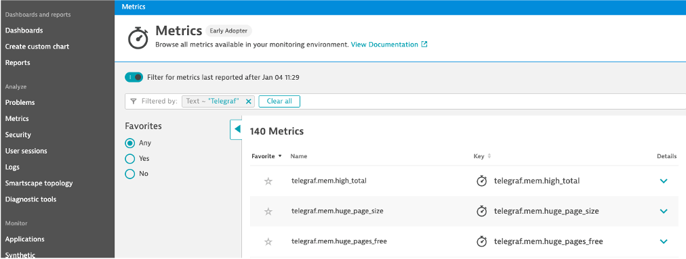
 
### Metric Browser vs Explorer

- Metric Explorer
  - Create Custom Chart > Try it out
  - Search for the CPU System Usage Telegraf Metric
  - Pin the CPU System Usage Telegraf Metric to the dashboard
- Which way was easier, browser or explorer? 
  - Why would you choose one over the other?

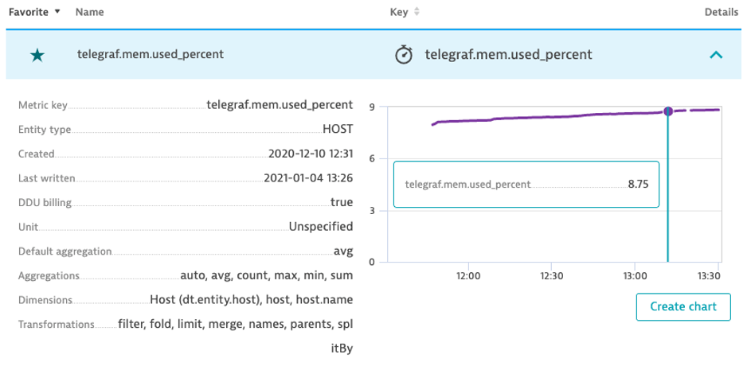

### Thresholds

#### Disk Used Threshold Chart

- Chart the Telegraf Disk Used Percent Metric in the Explorer
  - Aggregation: Average
- Thresholds: Green: Blank, Yellow: 40, Red: 75
- Chart Mode: Column
- Pin to dashboard
  - Tile name: Disk Used %

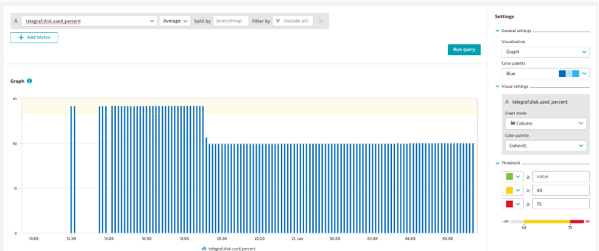
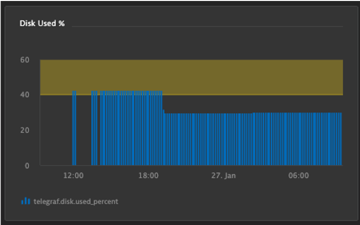

#### Top List with Thresholds: EC2 CPU

- Create a Top List with EC2 CPU Usage %
  - Aggregation: Average
  - Split by: de.entity.ec2_instance
  - Fold Transformation: Last
- Thresholds: Green: 0, Yellow: 40, Red: 60
- Pin to dashboard

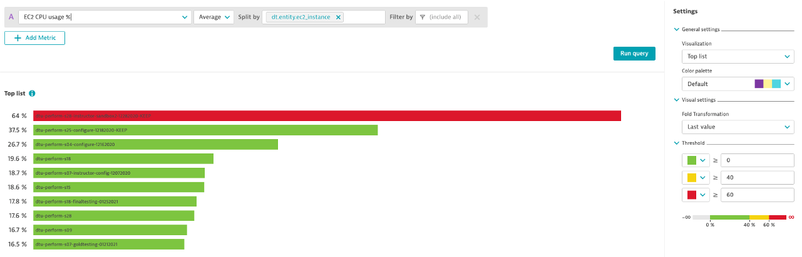
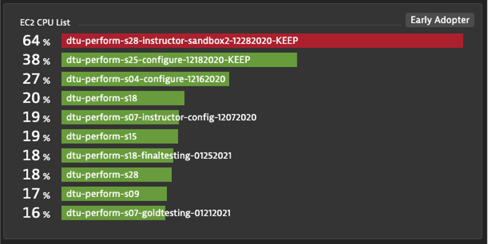

#### Optional: Top List with Threshold: Process CPU

- Create a Top List with Process CPU Usage
  - Aggregation: Average
  - Split by: Process
  - Fold Transformation: Last
- Thresholds: Green: 0, Yellow: 5, Red: 20
- Pin to dashboard

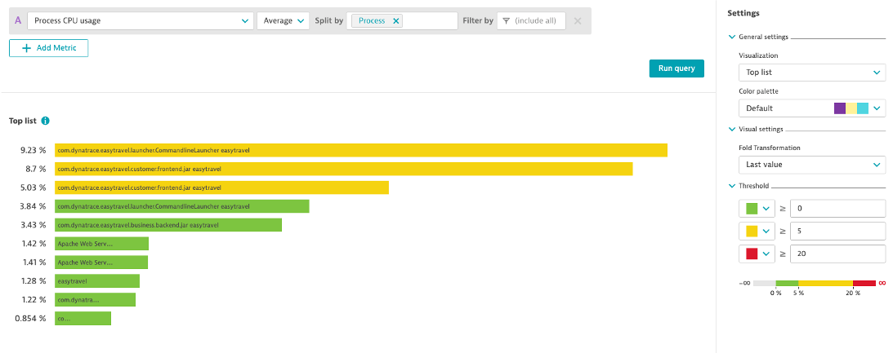
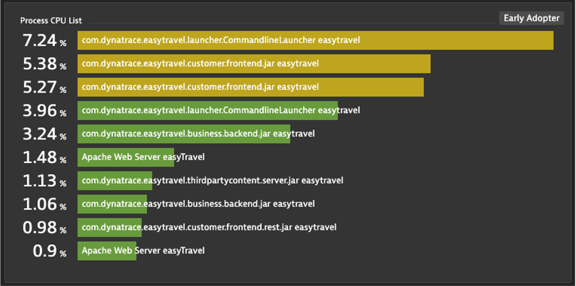

### Splitting and Filtering

#### Splitting
- Create an area chart with Process Network Load
  - Metric: builtin:tech.generic.network.load
  - Aggregation: Average
  - Split by: Process 
  - Filter: Only show EasyTravel Processes and Nginx
- Pin to dashboard

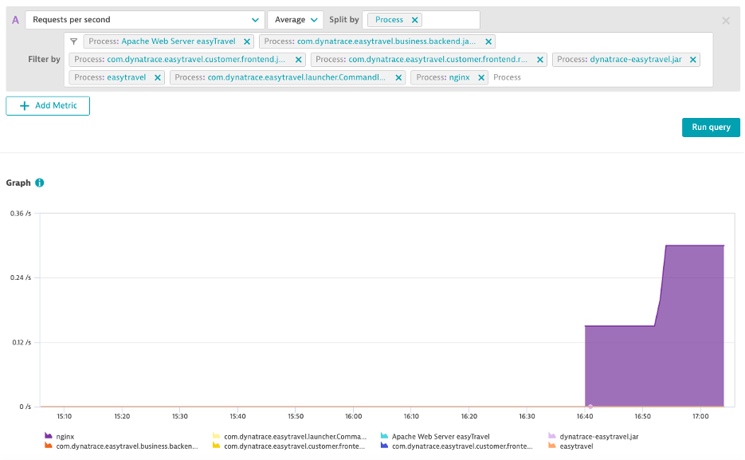

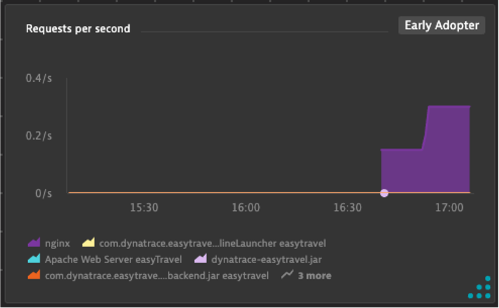

#### CPU Temp Split
- One of out servers is running high on CPU temp and we want to review the CPU temp vs usage 
- Create an area chart with CPU System Usage
  - Metric: builtin:host.cpu.system
  - Aggregation: Average
- Create a line chart with CPU Temp
  - This data comes from the script we started a few exercises back
  - Metric: cpu.temperature
  - Aggregation: Average
  - Split by: CPU
- Pin to dashboard

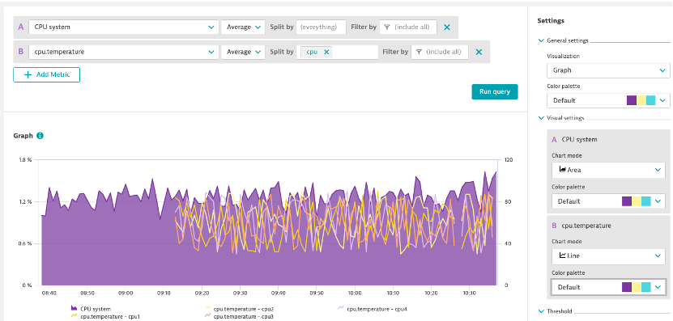

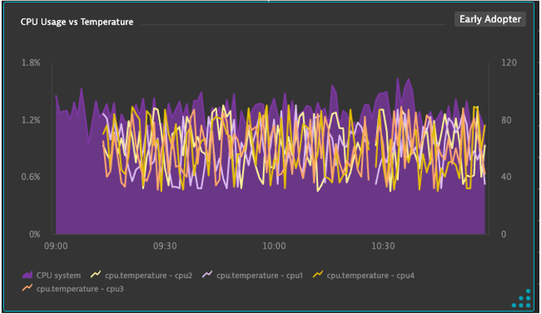

### Exercise Prep: Shop Response Time

#### Stop CPU and start shop response time
- Back in the DTU Terminal 
  - Stop the cpu temp script with Ctrl + C
  - Start the retail shop response time script

  ```bash
  (ubuntuvm)$ python3 retailresponsetime.py
  ```
  
### Dashboarding

#### Let's clean up the Infrastructure Overview dashboard
- Add Tags: Infrastructure, Ops
- Favorite the dashboard
- Add Tiles: Host Health, Problems
- Headers: Overview, Shop Performance, Infrastructure Detail
  
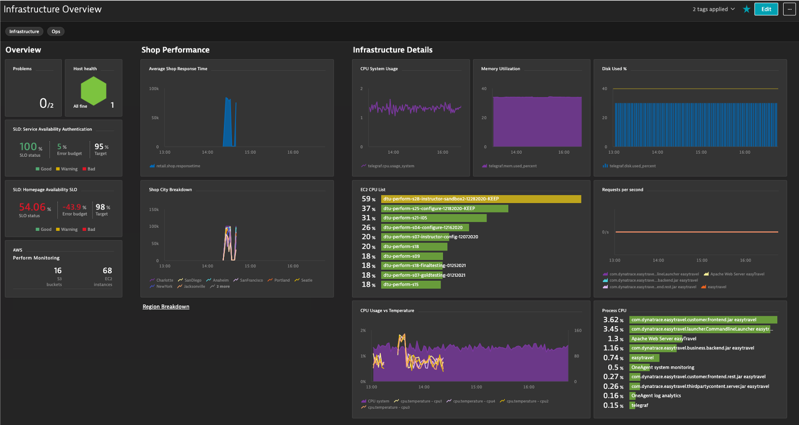

### Shop Performance

#### Create an area chart of average response time
- Metric: retail.shop.responsetime
- Aggregation: Average
- Pin to Infrastructure Overview dashboard

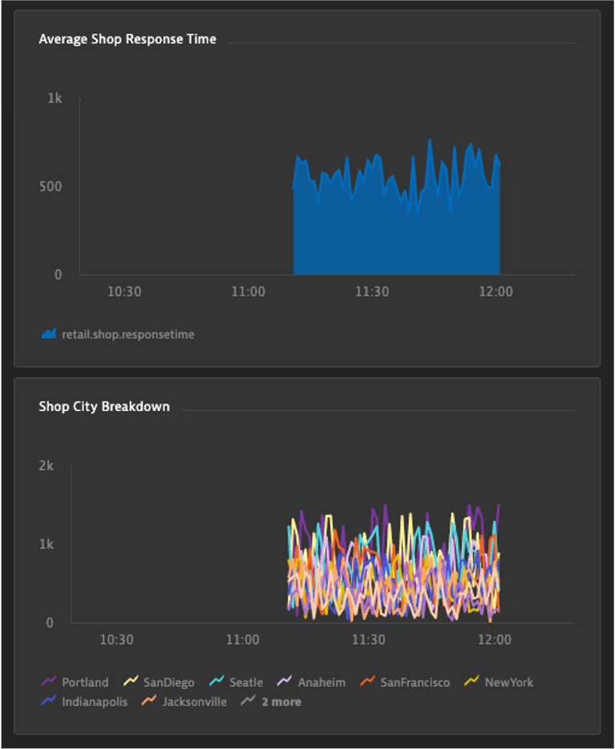

#### Create a line chart, breaking down the response time by city
- Aggregation: Average
- Split by: city
- Pin to Infrastructure Overview dashboard

#### Optional Exercise: Shop Performance Dashboard
- Create a 2nd Dashboard called Shop Performance to highlight East vs West Shop Performance
- Track East and West response times in different tiles of the dashboard
  - Metric: retail.shop.responsetime
  - Aggegration: Average
  - Split By: City
  - Filter by: Region useast or uswest
- Create a mark down link from the Infrastructure Overview dashboards
  - Create a mark down link from the Shop Performance Dashboard back to the Infrastructure Overview dashboard
  - Mark down example: ```[Region Breakdown](#dashboard;id=4e0089b5-8f38-4e8f-949f-1113acf79f5c)```
  - Mark down back button example: ```## [⇦](#dashboard;id=bbbbbbbb-0008-0000-0000-000000000000)```
- Where do I get the id values from?

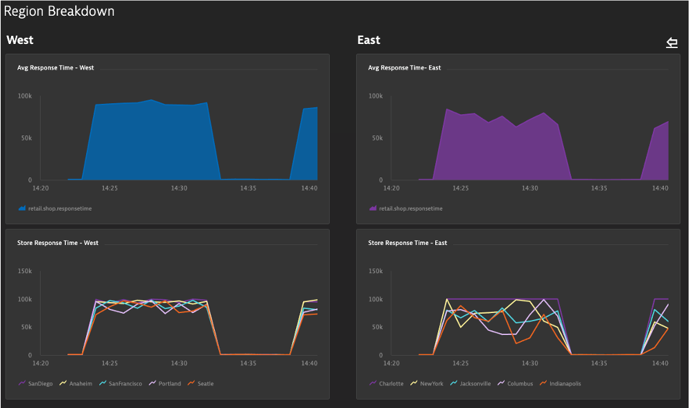

<!-- ------------------------ -->

## Management Zones

### Creating a dimension mananagement zone
- Look at the retail.shop.responsetime metric in the metric browser and gain insights on available data dimensions
### Scenario
  - You have different IT teams for East and West stores
  - Each team only wants to analyze their region’s performance
  - Create 2 different management zones to cover this
  - Add the required management zone rules (Dimensional data rules)
- What happens to the shop tiles in the dashboards when you select the different management zones?
  - Explore this in the Metric Explorer too!

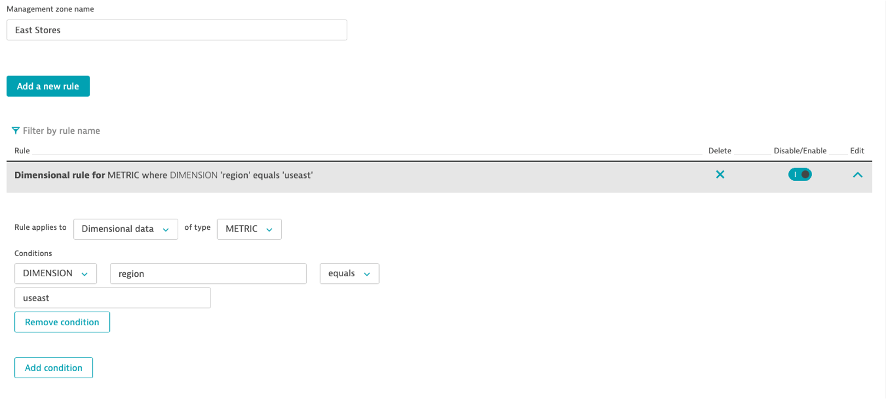

<!-- ------------------------ -->

## SLOs

### Synthetic SLO

#### Create a synthetic availablity SLO
- Name: Homepage Availability SLO
  - Use existing percentage Toggle
  - Metric: builtin:synthetic.browser.availability.location.total
  - Evaluation Type: Aggregate
  - SLO Filter: type("SYNTHETIC_TEST"),entityName("Dynatrace Home")
  - Target Percentage: 98%
  - Warning Percent: 99%
  - Timeframe: -1d
- Where do I get Metric Name from?
- Where do I get SLO Filter from?
- Add to Dashboard via SLO page pin icon

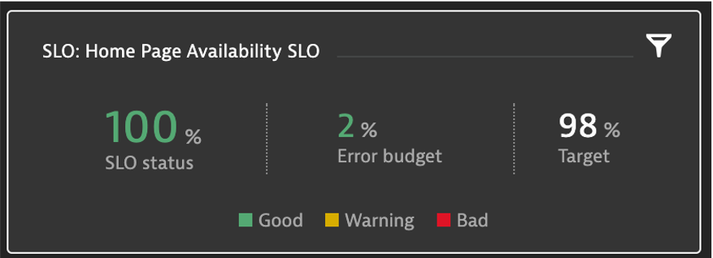

### Service Availablity SLO

#### Create a Service Availablity SLO

- Name: Service Availability Authentication 
  - Count of success metric: builtin:service.errors.server.successCount
  - Total count metric: builtin:service.requestCount.server
  - Evaluation Type: Aggregate
  - SLO Filter: type("SERVICE"), entityId("SERVICE-12345XYZ")
    - Where do I get the entityId from?
  - Target percentage: 95%
  - Warning percentage: 97.5%
  - Timeframe: -1d
- Add it to the dashboard from the dashboard editor

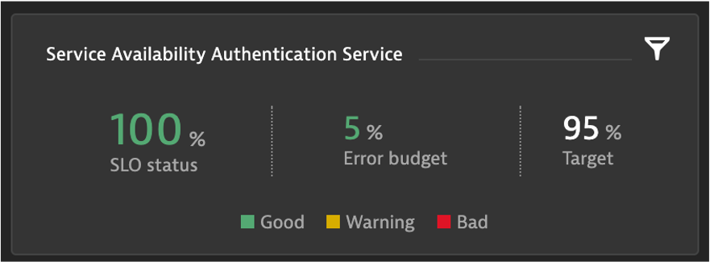

<!-- ------------------------ -->

## Alerting

### Auto-Adaptive Baselines

#### Create an auto-adaptive baseline alert for shop response time
- Navigate to Settings > Anomaly Detection > Custom Events for Alerting
- Create an auto-adaptive baseline
  - Metric: retail.shop.responsetime
  - Aggregation: Average
  - City: NewYork
  - Entity: None
  - Alert of anomalies of 1 time the normal signal fluctuation.
  - Metric is above baseline for 1 minute during any 5 minute period
  - Name: New York Response Time
  - Severity: Slowdown

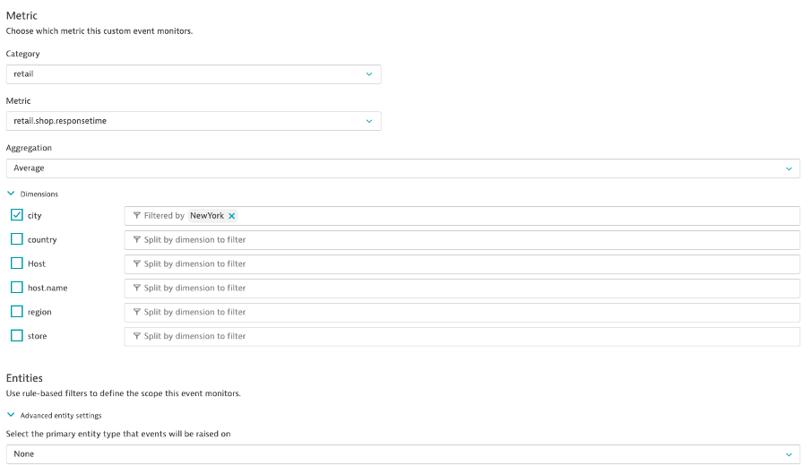

### Static Thresholds

#### Create a Static Threshold on CPU Temp
- Navigate to Settings > Anomaly Detection > Custom Events for Alerting
  - Metric: cpu.temperature
  - Aggregation: Average
  - Entity: Host
  - Static Threshold: 95
    - What’s the recommended threshold?
  - Raise if above threshold for 1 minute during 5 minute period
  - Review the Alert Preview
    - What happens if you change the threshold to 85?
    - Change back to 95 after review
- Title: CPU Temperature
- Severity: Resource

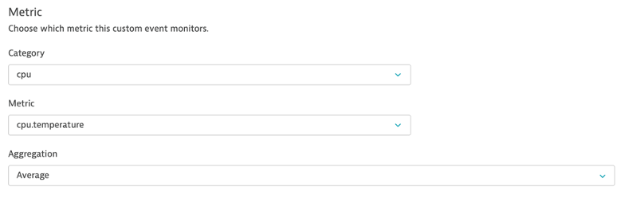

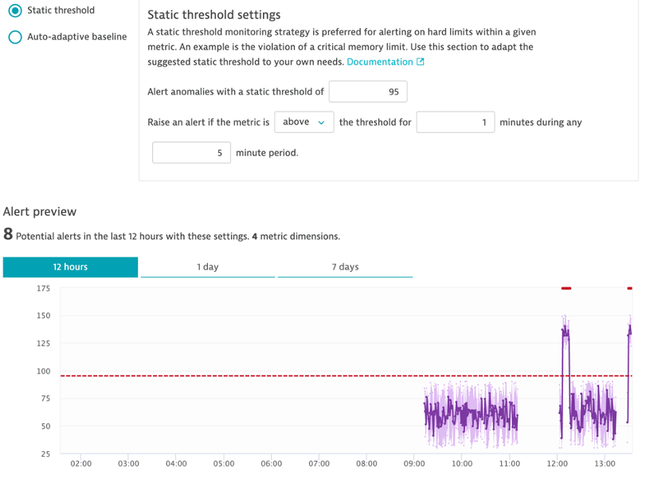

### Let's turn up the heat!
- Back in the DTU Terminal 
- Stop the retailresponsetime.py script if it’s still running (Ctrl + C)
- Start the retail script: 

```bash
(ubuntuvm)$ python3 cputemp.py HHMM 10
```

  - HHMM is the time you’d like the CPU scenario to start
  - Start it a few minutes after the current time
  - You can run timedatectl to check current time
  - Ex: 1828 is 1:28 PM EST or 18:28 UTC
  - 10 is the number of minutes you’d like the scenario to run for
- Wait a few minutes and let’s see the problem!


### Problem Evaluation
- Review the problem ticket
- Drill into the host and view the events
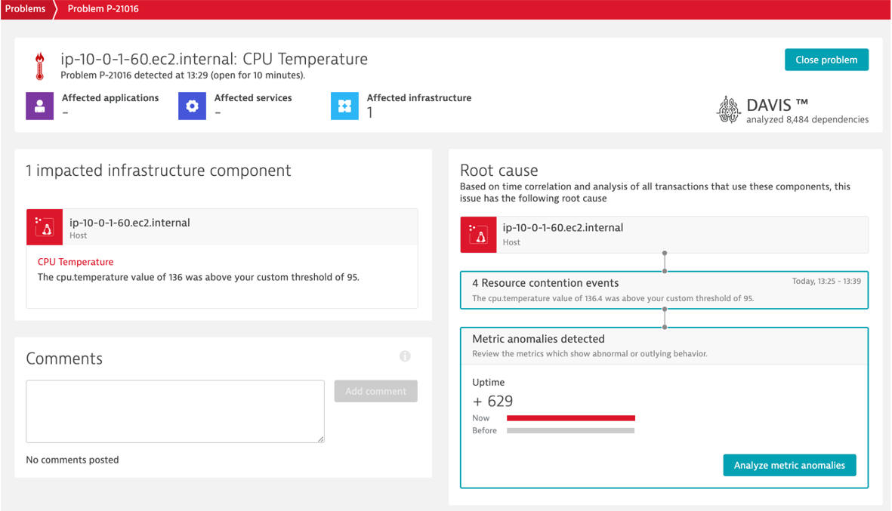

<!-- ------------------------ -->

## Metric API

### Create an API Token
- Settings>Integration>Dynatrace API
- Generate Token, name it, and turn on:
  - API v1 - Access problem and event feed, metrics, and topology, Read Configuration, Write Configuration, User Sessions
  - API v2 - Read Metrics
  - Copy the value and store in a safe place
- Navigate to the API Explorer: Environment API v2
  - Authorize and paste in API Token
- GET /metrics/query 
  - Metric Selector: telegraf.cpu.usage_user
  - View available options and output

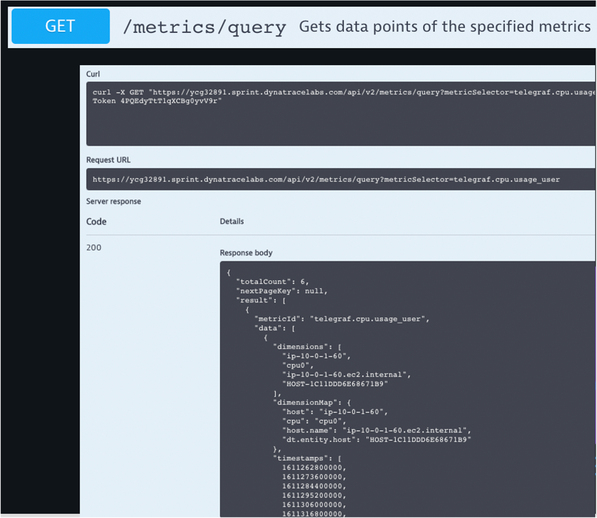

### Postman Prep
Create a workspace: PerformHOT2021
- Import from RAW Text
- Open a new browser tab: https://github.com/JasonOstroski/Perform2021-ActionableInfraScripts/
- View Raw of metrics_api_postman_collection.json
- Copy the entire text and paste into Postman

### Postman
- Let’s get data from the Dynatrace Metric API!
- For the CPU and Disk GET Requests:
  - Replace {{URL}} in GET with your Dynatrace Environment
  - Be mindful that it’s easy to copy and paste https:// and it’s already in the GET
  - Replace {{API_TOKEN}} in the header with your API Token
- You can also do the replacements via Postman environments

<!--- ----------------- ------------>

## Configurator

### Let's add some more dashboards!
- https://dynatrace.github.io/BizOpsConfigurator 
  - Enter your tenant URL and API Token
  - Deploy Ops, Platform Overview CPU Utilization (no diamond)
  
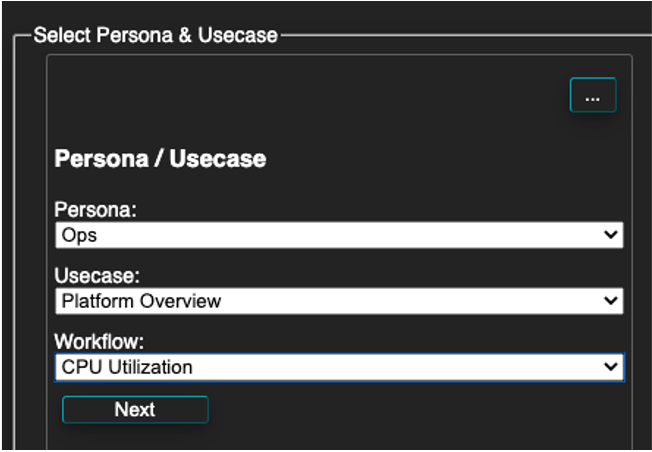

  - Deploy Ops, Capacity Management, AWS Overview
  
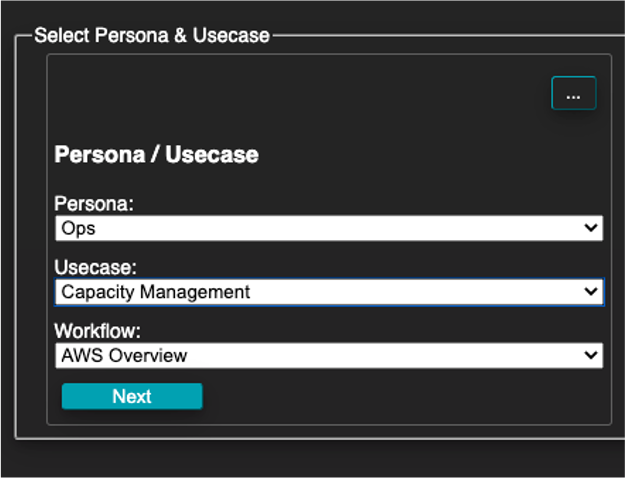

  - Deploy Ops, AIOps, Dashboard Basics
  - Deploy any other dashboard templates you want to try out.
- Navigate back to the Dynatrace UI and see the new dashboards!

### How can I bring my dashboard home with me?
- Go to your Infrastructure Overview dashboard
- Click ... Button in upper right corner > Share > Advanced Settings
- Click dashboard JSON > Download
- This is also available in the Configuration API for managing dashboards at scale

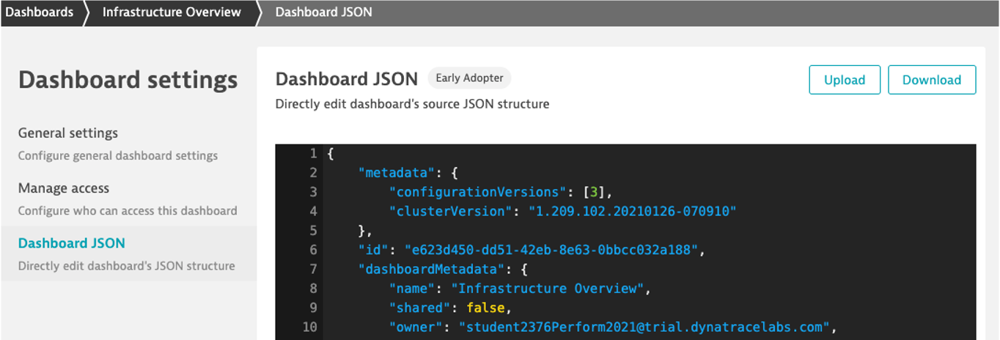
