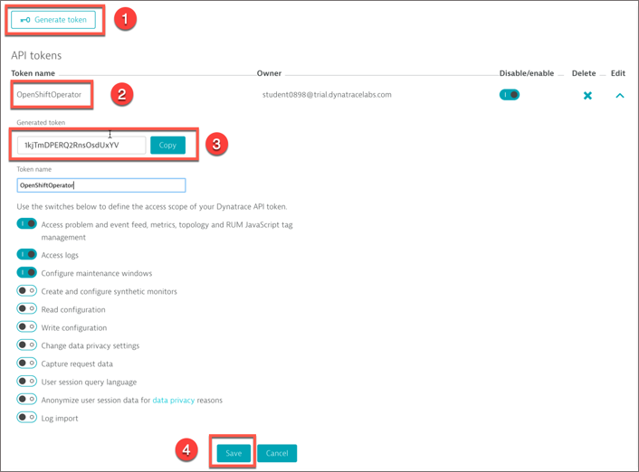
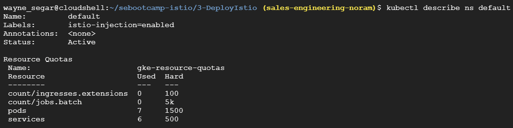
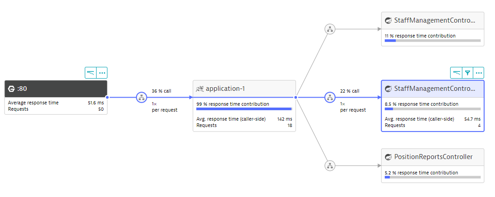
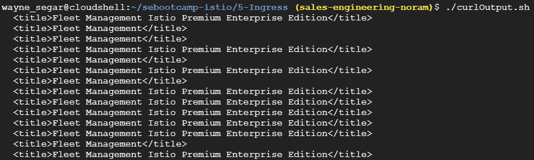
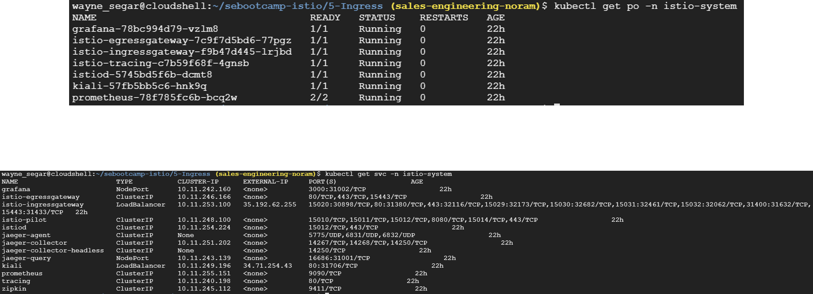
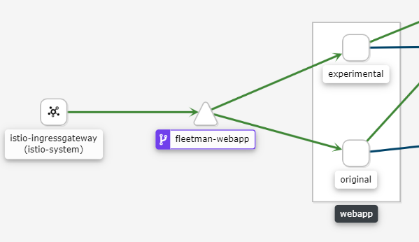
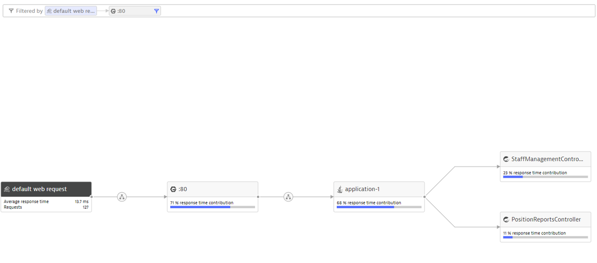

summary: Istio Hands-On
id: istio
categories: istio
tags: bootcamp
status: Published 
authors: Brandon Neo
Feedback Link: mailto:APAC-SE-Central@dynatrace.com
Analytics Account: UA-175467274-1

# Dynatrace with Istio
<!-- ------------------------ -->
## Introduction 
Duration: 1

This repository contains labs for the Istio Hands-On Session. We will be using Google Kubernetes Engine (GKE) for this hands-on but for China participants, please attempt to use Microk8s on AWS. You can use [Keptn in a box](https://github.com/keptn-sandbox/keptn-in-a-box) to easily spin up a Istio based K8s instance 

### Prerequisites
- Google Cloud account with access to GKE. Use **ANY** of the following:
  - Corporate account via #team-gotc on Slack (eg. brandon.neo@dynatrace.com on **ACM Workshops APAC** project)
  - Free trial access [here](https://cloud.google.com/free/).
- Chrome Browser with [browser extension](https://chrome.google.com/webstore/detail/modify-header-value-http/cbdibdfhahmknbkkojljfncpnhmacdek)
- Enable Envoy Tracing in your Dynatrace Environment 
   - **Settings > Monitored Technologies > Envoy**

### What You’ll Learn 
- How to leverage Istio in Dynatrace
- Learn Kiali and its difference with Dynatrace
- Setting up GKE on Istio

<!-- ------------------------ -->
## Setting up your Google Kubernetes Environment (GKE)
Duration: 10

### Login to Google Cloud Platform Account

Either login to your corporate account or signup with Google Cloud Platform free [here](https://cloud.google.com/free/)

You can login to your GCP console [here](https://console.cloud.google.com/home/).

### Enable Kubernetes Engine API 

You will also need to **Enable your API Billing** with Kubernetes Engine API. 

You should be prompted to the billing page while setting up your GKE instance. 

If not, you can follow the steps [here](https://support.google.com/googleapi/answer/6158867?hl=en)

### Activate Cloud Shell

Click on the Terminal Icon on the top right

A Cloud based Terminal lookalike will appear at the bottom of the page

We will start setting up our GKE Cluster 

### Download the Istio Hands-on Repo

Run the following command to download from our Github Repo

`https://github.com/dynatrace-acm/istio-handson`

The above will create a folder call **istio-handson**. This will contain the scripts we will use for the remainder of the workshop 

### Dynatrace Tokens

In order to proceed further we need to make note of our Dynatrace Tenant/Environment and API/PaaS Tokens

For the Tenant ID, you can find it in the first part of your URL 
https://<TENANT_ID>.managed-dev.dynalabs.io
For example, for https://abc123.managed-dev.dynalabs.io, Tenant ID=abc123

The Environment ID - You can find this value in the second half of your URL
https://<TENANT_ID>.managed-dev.dynalabs.io/e/<ENVIRONMENT_ID>
For example, for https://abc1234.managed-dev.dynalabs.io/e/1234-5678, Environment ID=1234-5678 

Go in **Settings -> Integration -> Dynatrace API**
- Click on Generate Token
- Enter a name for your token (e.g. GKE)
- Don't forget to click on the Save button

Go in **Settings -> Integration -> Platform as a Service**
- Either copy the existing InstallerDownload token or click on Generate Token
- Enter a name for your token (e.g. GKE), click Save

### Creating Credentials

We now need to store a local copy of our Dynatrace Tenant and API info for use when creating our cluster

Navigate to the directory **1-Credentials** and execute the script `defineCredentials.sh`
This will ask for your Dynatrace Tenant/Environment information as well as your API and PaaS tokens
These values can be obtained from your Dynatrace tenant (see previous instructions)
Once you have entered the values and confirmed they are correct, we can move on to creating our cluster

Positive
:This step will take about 10 minutes to complete

### Setup GKE Cluster

Back in your GCP account, launch a **Cloudshell session**
Navigate to the directory **2-CreateCluster**
Execute the script **setupenv.sh** and confirm that your credentials are correct

<!-- ------------------------ -->
## Istio Setup
Duration: 5

### Istio Installation

Navigate to the directory **3-DeployIstio**, where there will be two scripts:
Execute the script **./1-deployIstio.sh**

After the script runs, you will be presented with a URL to the **Kiali web interface** along with the username and password:

### Define Istio Namespace

Now that we have Istio and Kiali installed, we need to tell it which namespaces can use it.  
We do this by adding the following label to any namespace where we plan to use Istio:
`istio-enabled=enabled`
In our case we are going to label the default namespace by running the script **./2-labelNamespace.sh**

<!-- ------------------------ -->
## Traffic Routing
Duration: 15

### Traffic Routing Setup

First let’s deploy our application:
Navigate to the folder **4-TrafficRouting** and execute the script **./1-trafficroutingapplication.sh**
This will deploy our sample application and output the URL where the application can be accessed via a browser
This is plain Kubernetes, nothing Istio related is deployed yet

Once the deployment complete, navigate to the output URL to view the application:

### Explore Sample App Fleet

Clicking the different truck names on the left you will notice that the driver picture changes to either a placeholder photo or a real photo

If you take a look at the running pods, you will see that we have two different pods running the staff service

Explore Service Flow in Dynatrace and you should see the below

### Explore Kiali

In the Kiali UI, navigate to the Graph view and find the “fleetman-staff-service” and “Show Details”

Select Actions and **Create Weighted Routing**
Set the **“Risky”** service to 10% Traffic Weight

You will now see that a **Virtual Service** and **Destination Rule** was create and we can view the YAML

You will also see this in the console via kubectl

In the UI we should now see the traffic weighting take affect and we should see the actual person image ~10% of the time and the placeholder image **~90% of the time**
We can also see in the in the command line via cURL.  In the folder **4-TrafficRouting**, execute the command `./curlOutput.sh`

Run the script **./2-cleanUp.sh** to remove the application and make sure you deleted the VirtualService and DestinationRules

<!-- ------------------------ -->
## Ingress
Duration: 5

First let’s deploy our application, navigate to the folder **5-Ingress** and execute the script 
`./1-ingressapplication.sh`

When the script completes you will end up with URL for the application

There is NO Istio specific configuration for this application (yet)

### Blue Green versions of Fleet Manager

You will notice if you refresh the page a few times, there are two different versions of the application:

Since there is no Istio involved, traffic is currently weighted at **50/50**
We can also see this via cURL, by running the script `./curlOutput.sh` in the folder **5-Ingress**

### Explore Kiali

Now let’s create a traffic weighting so 90% of the traffic goes to the stable version and 10% of the traffic goes to the experimental version in Kiali

However, when running the cURL script again, we still see a ~50/50 traffic weighting?

Istio already provides us with an Ingress Service, we just need to configure it:

Run the script `./2-createIstioGateway.sh` in the folder **5-Ingress** which will create our Gateway, Virtual Service and Destination Rules. This will also output the URL for accessing the application through the Gateway

We should now see that we are getting about a 90/10 traffic weighting in the browser
If we check Kiali we will also see the Gateway Service created, along with the Virtual Service and Destination Rules

We should also be able to see this in Dynatrace's Service Flow

Run the script ./cleanUp.sh to remove the Gateway Service, Virtual Service and Destination Rules
The application will remain deployed

<!-- ------------------------ -->
## Dark Releases
Duration: 15

What are Dark Releases? 

- Deploying a “dormant” version of an application/service
- Control the exposed use base
- Based on Feature Flags, IP Address, Header, URL, etc…

### Deploy Dark Releases

Let’s deploy our Dark Release configuration:

Navigate to the folder **6-DarkReleases** and execute the script `./1-createRoutingRules.sh`

When you out the application in the output URL, the application should appear WITHOUT the red banner

If we take a look at the yaml file with the routing rules we see how the traffic is routing:

If we access the application with the **HTTP Header my-header:canary**,we should see the experimental version, with the red banner displayed. We can add this header via a browser extension:

We can determine what traffic is canary and which is not in Dynatrace with a Request Attribute:

<!-- ------------------------ -->

## Feedback
Duration: 3

We hope you enjoyed this lab and found it useful. We would love your feedback!
<form>
  <name>How was your overall experience with this lab?</name>
  <input value="Excellent" />
  <input value="Good" />
  <input value="Average" />
  <input value="Fair" />
  <input value="Poor" />
</form>

<form>
  <name>What did you benefit most from this lab?</name>
  <input value="Using OneAgent Operator to deploy in Kubernetes" />
  <input value="Setting up Kubernetes integation" />
  <input value="Enabling early access feature flags" />
  <input value="Learning Kubernetes View in Dynatrace" />
</form>

<form>
  <name>How likely are you to recommend this lab to a friend or colleague?</name>
  <input value="Very Likely" />
  <input value="Moderately Likely" />
  <input value="Neither Likely nor unlikely" />
  <input value="Moderately Unlikely" />
  <input value="Very Unlikely" />
</form>

Positive
: 💡 For other ideas and suggestions, please **[reach out via email](mailto:APAC-SE-Central@dynatrace.com?subject=Kubernetes Workshop - Ideas and Suggestions")**.