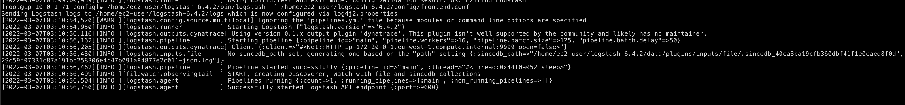
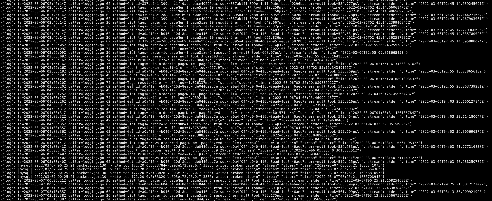
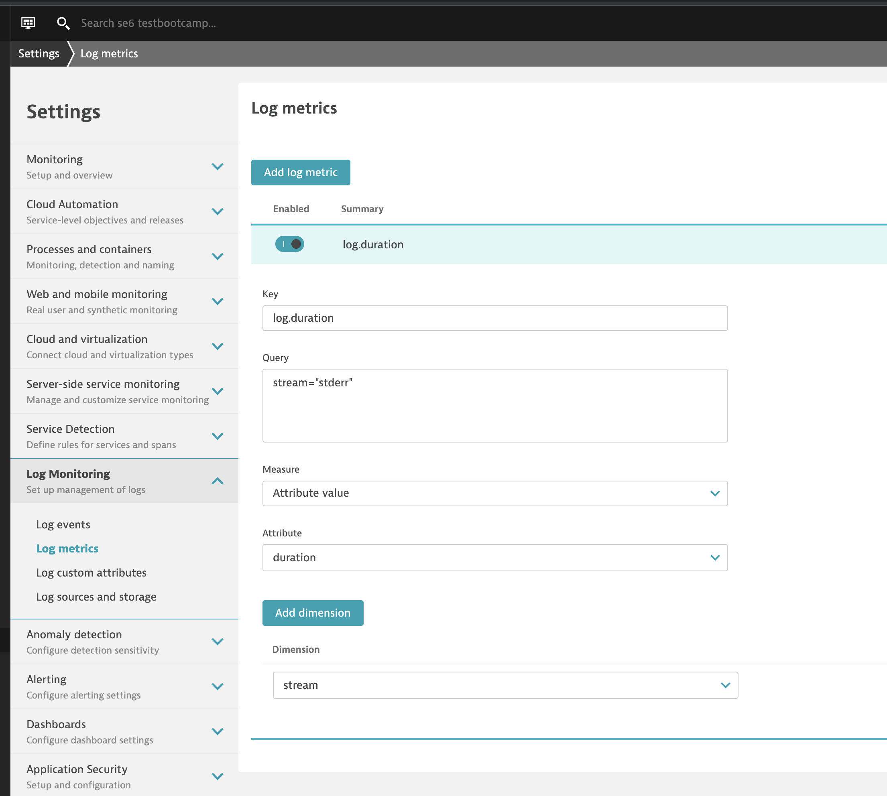
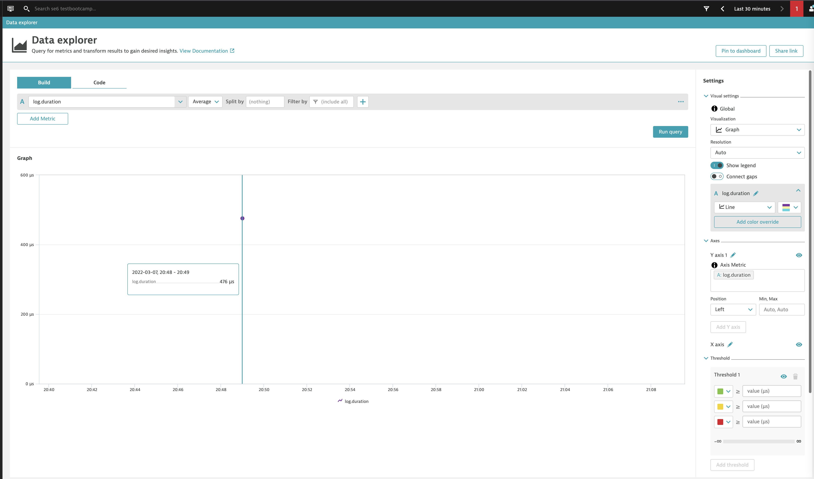
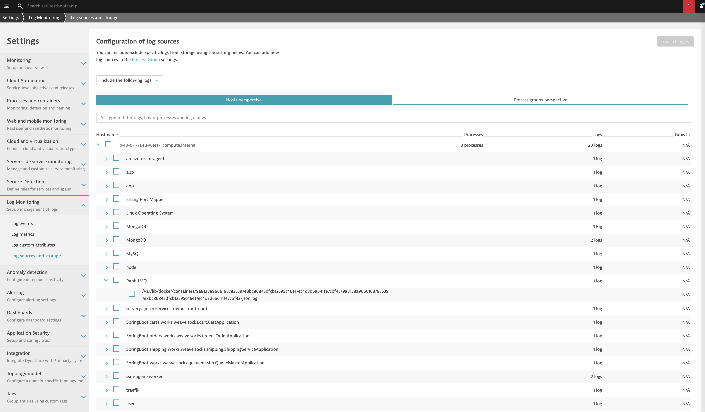

summary: Logs deep dive (2022)
id: log2022
categories: logmon-2
tags: bootcamp
status: Published 
authors: Suraj
Feedback Link: mailto:APAC-SE-Central@dynatrace.com
Analytics Account: UA-175467274-1

# Logs deep dive (2022 edition)
<!-- ------------------------ -->
## Introduction
This repository contains the hands on session for Log Monitoring v2.0.

### Prerequisites
- Dynatrace SaaS/Managed Account. Get your free SaaS trial [here](https://www.dynatrace.com/trial/).
- AWS account, with the ability to create an EC2 instance from a public AMI. Signup to a free trial [here](https://aws.amazon.com/free/).
- Modern web browser
    >- Chromimum based, e.g. Google Chrome, MS Edge
    >- Firefox

### Lab Setup
Following are the details used in this lab.

- [Sock-shop application](https://microservices-demo.github.io/deployment/docker-compose.html) is being run in docker.
- Docker and docker-compose is already setup in the EC2 instance for the participants.
- Logstash, an open-source tool for ETL, is also installed in the user's directory: /home/ec2-user/logstash-6.4.2

### What You'll Learn
- Ingest logs using Logstash
- Transform logs to fit Dynatrace's Log monitoring platform
- How to use the new Log Viewer
- Create and use custom log attributes
- Create and use log metrics
- Create dashlet from custom log metrics
- Create log events

<!-- ------------------------ -->
## Bootcamp Environment Setup

Please claim the EC2 instance from the list. Put your name against the EC2 on the shared excel sheet. The link to the sheet will be provided on the day.

### SSH into your instance

You will be given the .pem (or .ppk) file so you can login to your EC2 instance.

### For Linux users

```
ssh -i ~/.ssh/dt_bootcamp_suraj.pem ec2-user@ec2-54-247-46-254.eu-west-1.compute.amazonaws.com
```

### For Windows users
Use Putty (or similar) to load the "private key file" under the auth section and start a ssh session.


### Start the Application

You should be logged in as ec2-user.

### Enter the following commands on the cli

This command will start the sock-shop application in docker. 

```
cd /home/ec2-user/microservices-demo
sudo /usr/local/bin/docker-compose -f /home/ec2-user/microservices-demo/deploy/docker-compose/docker-compose.yml up -d
```

The [Sock-shop application](https://microservices-demo.github.io/deployment/docker-compose.html) is being run in docker. During the session we will briefly go through the application architecture.


### Install an environment ActiveGate

In order for us to ingest logs into Dynatrace, we need an active gate. The bootcamp cluster is a managed cluster, so we will be installing an environment AG.

1. Install/Deploy an ActiveGate

>Navigate to the Dynatrace HUB
> - Using the Dynatrace Menu -> Manage -> HUB
> - Search for and click on `ActiveGate`


Click on `Install ActiveGate`


>Install ActiveGate
> - Select Linux
> - Click on Generate Token
> - Copy & Execute WGET Command into Linux Server
> - Copy & Execute Install command into Linux Server (*Note: `sudo` is required on this step)


<!-- ------------------------ -->
## Logs via POST

In this module, we'll:
- Ingest a sample log using Log Ingestion API 

### Log Ingest API
The Log Ingestion API allows for you to push custom logs into Dynatrace. 

1. POST Ingest Logs

> - Replace ADDRESS with the environment AG URL
> - Replace Tenant_ID with valid tenant ID
> - Replace APITOKEN with the value of you API TOKEN
> - Replace HOST_ID with valid host id
> - Replace PG_ID with valid process group id

```
curl -X POST "https://<ADDRESS>:9999/e/<Tenant_ID>/api/v2/logs/ingest" -H "accept: application/json; charset=utf-8" -H "Authorization: Api-Token <APITOKEN>" -H "Content-Type: application/json; charset=utf-8" -d "[{\"content\":\"example log content 1\",\"status\":\"error\",\"log.source\":\"/var/log/syslog\",\"dt.entity.host\":\"<HOST ID>\",\"dt.entity.process_group_instance\":\"<PG_ID>\"},{\"content\":\"example log content 2\",\"status\":\"info\",\"log.source\":\"/var/log/syslog\",\"dt.entity.host\":\"<HOST ID>\",\"dt.entity.process_group_instance\":\"<PG_ID>\"}]" --insecure
```

> - Example LOG JSON

```
[
    {
    "content": "example log content 1",
    "status" : "error",
    "log.source": "/var/log/syslog",
    "dt.entity.host" : "<HOST ID>",
    "dt.entity.process_group_instance": "<PG_ID>"
    "response":12
  },
  {
    "content": "example log content 2",
    "status" : "info",
    "log.source": "/var/log/syslog",
    "dt.entity.host" : "<HOST ID>",
    "dt.entity.process_group_instance": "<PG_ID>",
     "response":1
  }
]
```


<!-- ------------------------ -->
## Logs via Logstash - As IS

In your EC2 environment, we have installed logstash 6.4.2 (Apache version 2.0). 
We also have installed the Dynatrace output plugin in the logstash instance for you. For more details, see: [dynatrace-oss/logstash-output-dynatrace](https://github.com/dynatrace-oss/logstash-output-dynatrace)


In this module, we'll:
- Create a Logstash pipeline to read local log files
- Ingest all the logs from the beginning of the file as is
- Understand why we need to transform the ingested logs

### Application logs

First, lets understand whats running in your environment.

```
sudo su
docker ps
```


These container logs (by the way they are setup in this env) are going to write logs in the below folder.

```
ls /var/lib/docker/containers/
/var/lib/docker/containers/<container_id>/<container_id>-json.log
```

For instance, the front-end container with ID: `3257c79d012c` will have a logfile "3257c79d012c....... -json.log".

```
cat /var/lib/docker/containers/3257c79d012c1845029c59f07331c87a191bb258306e4c47b091a84877e2c011/3257c79d012c1845029c59f07331c87a191bb258306e4c47b091a84877e2c011-json.log
```


### Create a Logstash Pipeline

Lets now create a config file (a pipeline) for Logstash so that it can read the front-end's log file from the `beginning`.

Steps:

```
sudo su
docker ps |grep front-end
cd /home/ec2-user/logstash-6.4.2/config
vi frontend.conf
```

Paste the below content into the file. Remember to change the `CONTAINER_ID`, `ENV_ACTIVEGATE_HOST`, `TENANT_ID` based on your environment.

(Tip: An easier way to find the file for that container would be to hit tab after you paste the container id after /var/lib/docker/containers/ )

```
input{
  file{
    path => "/var/lib/docker/containers/<FULL_CONTAINER_ID>/<FULL_CONTAINER_ID>-json.log"
    start_position => "beginning"
    codec => json
  }
}

output {
  dynatrace {
    ingest_endpoint_url => "https://<ENV_ACTIVEGATE_HOST>:9999/e/<TENANT_ID>/api/v2/logs/ingest"
    api_key => "<API-KEY>"
    ssl_verify_none => true
  }
}
```
### Execute the pipeline

Test if your pipeline is fine using the below command (note the filename and path may be different each time you run it):

```
/home/ec2-user/logstash-6.4.2/bin/logstash -f /home/ec2-user/logstash-6.4.2/config/frontend.conf -t
```


Execute it using below command:

```
/home/ec2-user/logstash-6.4.2/bin/logstash -f /home/ec2-user/logstash-6.4.2/config/frontend.conf
```



### Check the ingested logs in Log Viewer

The logs are ingested as is. 


### Repeat the above steps and create another pipeline for catalogue container

Steps:

```
docker ps |grep catalogue
cd /home/ec2-user/logstash-6.4.2/config
cp frontend.conf catalogue.conf
```

Paste the below content into the file. Remember to change the `CONTAINER_ID`, `ENV_ACTIVEGATE_HOST`, `TENANT_ID` based on your environment.

(Tip: An easier way to find the file for that container would be to hit tab after you paste the container id after /var/lib/docker/containers/ )

REPLACE the file path to the log file of the `catalogue` container. 

Execute it using below command: (optionally test it using -t)

```
/home/ec2-user/logstash-6.4.2/bin/logstash -f /home/ec2-user/logstash-6.4.2/config/catalogue.conf
```

The logs are ingested as is. 


<!-- ------------------------ -->
## Custom Log Attribute

In this module, we'll:
- Create custom attributes
- Reingest the application logs
- Filter logs


### Create a custom log attribute

- In the Dynatrace menu, go to Settings.
- Select Log Monitoring > Log custom attributes and then select Add custom attribute.
- Enter the Key as "stream"
- Switch the "Show attribute values in side bar". Save changes


You can filter logs based on this new attribute as per below:


However, the facets will be visible only when new logs with that attribute gets ingested. To emulate this behaviour, we could reingest the same application logs we did in our last step. We just need to delete the `.since_db*` files, which keep tracks of what we have already ingested.


```
sudo su
rm -rf /home/ec2-user/logstash-6.4.2/data/plugins/inputs/file/.sincedb_*
/home/ec2-user/logstash-6.4.2/bin/logstash -f /home/ec2-user/logstash-6.4.2/config/catalogue.conf
```

Once the logs are re-ingested, you will be able to see the attribute "stream" on the facets.


<!-- ------------------------ -->
## Logs via Logstash - Formatted


In this module, we'll:
- Create transformation in Logstash pipeline to format log files
- Ingest all the logs from the beginning of the file again
- Understand why we need to transform the ingested logs

### Application logs

Lets look at the logs emitted by the catalogue container.



You will see a mixed set of log lines. Majority of them are based on key=value pairs. Based on this info, lets construct a "filter" (aka a transformation step) in Logstash.

Steps:

```
cd /home/ec2-user/logstash-6.4.2/config
cp catalogue.conf catalogue_filtered.conf 
vi catalogue_filtered.conf 
```

Enter the below filter declaration in the file between input and output sections:

```
filter { kv { source => "log" } }
```

Execute it using below command: (optionally test it using -t)

```
sudo su
rm -rf /home/ec2-user/logstash-6.4.2/data/plugins/inputs/file/.sincedb_*
/home/ec2-user/logstash-6.4.2/bin/logstash -f /home/ec2-user/logstash-6.4.2/config/catalogue_filtered.conf 
```

Once ingested, you will be able to see the individual key-value pairs as root level attributes.


We want to extract the number from the attribute `took`. So lets apply one more filter as per below:

```
vi catalogue_filtered.conf 
```

```
  grok {
    match => { "took" => "%{NUMBER:duration}" }
  }
```

Execute the below commands to re-injest the logs.

```
rm -rf /home/ec2-user/logstash-6.4.2/data/plugins/inputs/file/.sincedb_*
/home/ec2-user/logstash-6.4.2/bin/logstash -f /home/ec2-user/logstash-6.4.2/config/catalogue_filtered.conf 
```

The result will look like below:


Now, lets go and define one additional log attribute: duration.


We will use this custom attribute in our next section.

<!-- ------------------------ -->
## Create metric using log viewer

- In the Dynatrace menu, go to Logs.
- Create a log viewer query or use log viewer facets to extract the log data that interests you. 
  

- Select Create metric. Your log viewer query is now displayed on the Log metrics page.

Adding dimensions allows you to split the log metric occurrences according to specific log data attribute.
Append the metric name to the metric key log. and save changes to create the log metric.




### Using the metric

Now that you have defined the metric, you can chart it, pin it to a dashboard, and even create an alert based on it.

- Chart: Go to Explore data, set Select metric… to log.duration, and select Run query.
  

- Dashboard: After you create a chart, select Pin to dashboard to add the chart to one of your dashboards.

- Alert: Go to Settings > Anomaly detection > Custom events for alerting, select Create custom event for alerting, and create a custom event based on log.duration.
  


<!-- ------------------------ -->
## Lets use OneAgent (TM) For Log Collection
- Navigate to Deploy Dynatrace -> Linux
- Generate PaaS token


Copy the complete URL and API-Tokens. A sample is listed below:

```
wget -O Dynatrace-OneAgent-Linux-1.235.185.sh "https://mou612.managed-sprint.dynalabs.io/e/53d6282c-8893-40b0-ba03-4120b5f10615/api/v1/deployment/installer/agent/unix/default/latest?arch=x86&flavor=default" --header="Authorization: Api-Token ######"
```

Use the URL and API-Tokens obtained to construct the below command:

```
sudo docker run -d --restart=unless-stopped --privileged=true --pid=host --net=host -v /:/mnt/root -e ONEAGENT_INSTALLER_SCRIPT_URL="<PASTE THE URL HERE>" -e ONEAGENT_INSTALLER_DOWNLOAD_TOKEN="<PASTE THE API-TOKEN HERE>" dynatrace/oneagent
```

A sample command would look like below:

```
sudo docker run -d --restart=unless-stopped --privileged=true --pid=host --net=host -v /:/mnt/root -e ONEAGENT_INSTALLER_SCRIPT_URL="https://mou612.managed-sprint.dynalabs.io/e/#####-#####-#####-####-#####/api/v1/deployment/installer/agent/unix/default/latest?arch=x86&flavor=default" -e ONEAGENT_INSTALLER_DOWNLOAD_TOKEN="<PASTE THE API-TOKEN HERE>" dynatrace/oneagent
```

Execute the above command in your EC2 instance.

### Lets explore the log sources found by OneAgent



<!-- ------------------------ -->
## Troubleshooting 

### 1. Another instance running
When running Logstash you receive error such as below: 

```
[2022-03-07T06:14:10,345][FATAL][logstash.runner          ] Logstash could not be started because there is already another instance using the configured data directory.  If you wish to run multiple instances, you must change the "path.data" setting.
```

Kill the logstash process that is running. 

### 2. Mistake in pipline/no logs are ingested
If you made a typo/mistake in the pipeline config file and no logs are ingested....

Delete the .since_db file. Those files are under: `/home/ec2-user/logstash-6.4.2/data/plugins/inputs/file/` and named as .sincedb_numbers


### 3. 404 erros

Receiving 404 errors during logstash run - Make sure your AG address and api-token are correct.

<!-- ------------------------ -->
## Feedback

We hope you enjoyed this lab and found it useful. We would love your feedback!

Positive
: 💡 For other ideas and suggestions, please **[reach out via email](mailto:APAC-SE-Central@dynatrace.com?subject=OpenTelemetry - Ideas and Suggestions")**.