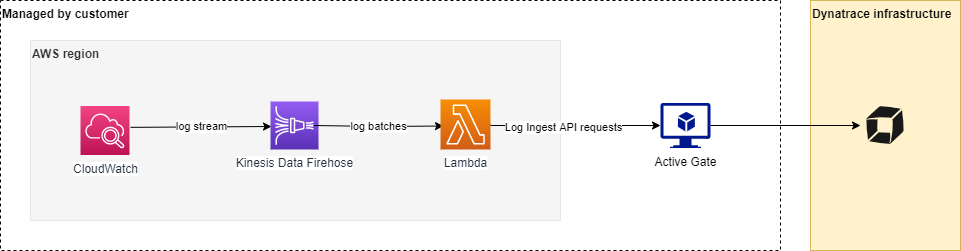

summary: Log Monitor 2.0
id: logmon-2
categories: logmon-2
tags: bootcamp
status: Published 
authors: Brandon Neo
Feedback Link: mailto:APAC-SE-Central@dynatrace.com
Analytics Account: UA-175467274-1

# Log Monitoring 2.0
<!-- ------------------------ -->
## Introduction
Duration: 1

This repository contains the hands on session for Log Monitoring 2.0

### Prerequisites

* Dynatrace SaaS/Managed Account. Get your free SaaS trial [here](https://www.dynatrace.com/trial/).
* AWS account, with the ability to create an EC2 instance from a public AMI. Signup to a free trial [here](https://aws.amazon.com/free/).
* Modern web browser
  - Chromimum based, e.g. Google Chrome, MS Edge
  - Firefox

### Lab Setup
The following steps are used for this lab:
- Sample Application 
    * [Sockshop](https://github.com/dynatrace-sockshop)
	* Docker based app - Wordsmith

### What You’ll Learn
- Deploy OneAgent to a Kubernetes / Microservice Environment
- How to use the new Log Viewer 
- Ingest Logs via FluentD
- Using Log Metrics
- Cloud Forwarder ingestion with AWS Log Forwarder

<!-- ------------------------ -->
## Deploy OneAgent to start monitoring
Duration: 10

In this exercise, we will deploy the OneAgent to a Linux instance running Kubernetes(Microk8s) and let the OneAgent discover what is running in that instance.

### Using Terminal via Web Browser

To faciliate the labs, we will access the Linux instance **via terminal through a web browser**.

Use the **URL** was provided in your email to access the SSH terminal. Make sure the URL looks like `Public IP Address/wetty`

Use the **login name** and **password** as provided in your email.


### Download the OneAgent

Open your browser and access the Dynatrace URL.

Follow these steps below:

* Select **Dynatrace Hub** from the navigation menu.
* Select **Kubernetes**
* Select **Monitor Kubernetes** button from the bottom right.  


Within the **Monitor Kubernetes / Openshift** page, follow these steps below:

* Enter a **Name** for the connection Eg. `k8s`
* Click on **Create tokens** to create PaaS and API tokens with appropriate permissions
* **Toggle ON** Skip SSL Certificate Check
* Click **Copy** button to copy the commands. 
* **Paste** the command into your terminal window and execute it.


Example:

```bash
Connecting to github-releases.githubusercontent.com (github-releases.githubusercontent.com)|185.199.108.154|:443... connected.
HTTP request sent, awaiting response... 200 OK
Length: 7310 (7.1K) [application/octet-stream]
Saving to: ‘install.sh’

install.sh                      100%[=====================================================>]   7.14K  --.-KB/s    in 0s      

2021-06-01 05:46:36 (40.7 MB/s) - ‘install.sh’ saved [7310/7310]


Check for token scopes...

Check if cluster already exists...

Creating Dynatrace namespace...

Applying Dynatrace Operator...
Warning: apiextensions.k8s.io/v1beta1 CustomResourceDefinition is deprecated in v1.16+, unavailable in v1.22+; use apiextensions.k8s.io/v1 CustomResourceDefinition
customresourcedefinition.apiextensions.k8s.io/dynakubes.dynatrace.com created
serviceaccount/dynatrace-dynakube-oneagent created
serviceaccount/dynatrace-dynakube-oneagent-unprivileged created
serviceaccount/dynatrace-kubernetes-monitoring created
serviceaccount/dynatrace-operator created
serviceaccount/dynatrace-routing created
podsecuritypolicy.policy/dynatrace-dynakube-oneagent created
podsecuritypolicy.policy/dynatrace-dynakube-oneagent-unprivileged created
podsecuritypolicy.policy/dynatrace-kubernetes-monitoring created
podsecuritypolicy.policy/dynatrace-operator created
podsecuritypolicy.policy/dynatrace-routing created
role.rbac.authorization.k8s.io/dynatrace-dynakube-oneagent created
role.rbac.authorization.k8s.io/dynatrace-dynakube-oneagent-unprivileged created
role.rbac.authorization.k8s.io/dynatrace-kubernetes-monitoring created
role.rbac.authorization.k8s.io/dynatrace-operator created
role.rbac.authorization.k8s.io/dynatrace-routing created
clusterrole.rbac.authorization.k8s.io/dynatrace-kubernetes-monitoring created
clusterrole.rbac.authorization.k8s.io/dynatrace-operator created
rolebinding.rbac.authorization.k8s.io/dynatrace-dynakube-oneagent created
rolebinding.rbac.authorization.k8s.io/dynatrace-dynakube-oneagent-unprivileged created
rolebinding.rbac.authorization.k8s.io/dynatrace-kubernetes-monitoring created
rolebinding.rbac.authorization.k8s.io/dynatrace-operator created
rolebinding.rbac.authorization.k8s.io/dynatrace-routing created
clusterrolebinding.rbac.authorization.k8s.io/dynatrace-kubernetes-monitoring created
clusterrolebinding.rbac.authorization.k8s.io/dynatrace-operator created
deployment.apps/dynatrace-operator created
W0601 05:46:39.025776   29593 helpers.go:553] --dry-run is deprecated and can be replaced with --dry-run=client.
secret/dynakube configured

Applying DynaKube CustomResource...
dynakube.dynatrace.com/dynakube created

Adding cluster to Dynatrace...
Kubernetes monitoring successfully setup.
$

```

Negative
: Note that it will take about 5 mins for data to appear within Dynatrace

Positive
: Dynatrace handles automatic deployment of OneAgents as well as automatic k8s integration. 

### Validate the installation in Deployment status

Click on **Show deployment status** to check the status of the connected host. 

You should be able to see a connected host as per the image below.


Positive
: Dynatrace Documentation is referenced [here](https://www.dynatrace.com/support/help/technology-support/operating-systems/linux/)

### Restart Sockshop application

To restart the sample app Sockshop execute the following command:

```bash
kubectl delete po --all -n production
```

### Accessing the production Sockshop Application

Within Dynatrace, follow the steps below to get Sockshop URL:

* Click on the **hostname** in the OneAgent deployment screen.
* Expand **Properties and tag** in Host view
* **Select and Copy** Public Host name from the metadata
* **Amend the Public Host name** to match the following format:
  - Sockshop Production `http://production.front-end.PUBLIC-IP.nip.io/`

<!-- ------------------------ -->
## Deploy Wordsmith app
Duration: 5

To run the Wordsmith app, based on traditional Docker containers, first clone the github repo

```bash
$ git clone https://github.com/Nodnarboen/k8s-wordsmith-demo
$ cd k8s-wordsmith-demo
```
Negative
: Note: The next command will lock up the screen. Please open a new tab with a new WeTTy terminal before running the command. Alternatively, you can start the Wordsmith via the 2nd method.

### Method 1 - Duplicate terminals
This will take about 5 mins to build the image and run the docker image. Ensure that you have 2 terminal tabs and in one of the terminals, execute the following:

```bash
$ cd k8s-wordsmith-demo
$ docker-compose up
...
...
db_1     | PostgreSQL init process complete; ready for start up.
db_1     |
db_1     | 2021-06-19 06:15:18.953 UTC [1] LOG:  listening on IPv4 address "0.0.0.0", port 5432
db_1     | 2021-06-19 06:15:18.953 UTC [1] LOG:  listening on IPv6 address "::", port 5432
db_1     | 2021-06-19 06:15:18.957 UTC [1] LOG:  listening on Unix socket "/var/run/postgresql/.s.PGSQL.5432"
db_1     | 2021-06-19 06:15:18.987 UTC [48] LOG:  database system was shut down at 2021-06-19 06:15:18 UTC
db_1     | 2021-06-19 06:15:19.007 UTC [1] LOG:  database system is ready to accept connections

```
***Note:*** You will not be able to access the command prompt.

### Method 2 - Using nohup
This will take about 5 mins to build the image and run the docker image. In one of the terminals, execute the following:

```bash
$ cd k8s-wordsmith-demo
$ nohup docker-compose up &
[1] 9667
$ nohup: ignoring input and appending output to 'nohup.out'
$
```

The `nohup` command will return the command prompt to you. If you `tail` the `nohup.out` file, you will be able to see the progress of the output.

### Accessing the application
Open up another browser tab, access the following URL: `http://Public IP Address:8082`. You should see a page similar to the image below


<!-- ------------------------ -->
## Log Monitoring with Dynatrace!
Duration: 10

### Initial configuration - selection of log sources

Positive
: Although the OneAgent **automatically detects all logs**, based on the conditions listed in the [documentation](https://www.dynatrace.com/support/help/how-to-use-dynatrace/log-monitoring/log-monitoring-v2/log-content-auto-discovery-v2/), ***ingestion*** of **all** log data is **not enabled by default**.

1. Go to **Settings** > **Log Monitoring** > **Log sources and storage**
   
2. Choose either the **Host prespective** or **Process groups perspective**. For this exercise, please select the EC2 instance under **Host prespective**.

Positive
: Most admins understand servers/cloud instances better than process groups. If not sure, or in a POC situation, it is advisable to enable the **entire host** as a log source, as this will help in discovering the "unknowns". As the POC progresses, you ***should*** revisit the log sources to fine tune which logs need to be monitored and which can be ignored.

### Explore the New Log Viewer

Notice how Docker Logs are automatically generated for Log Mononitoring 2.0

You can use the **facets** or top filter bar to look for **log_analytics_special_file_header** to identify the automatic detected Docker Logs.

The log events are fed in with context to the entities that they are related to them. 

As you refresh the browser page for the WordSmith app, go back to the console and observe the output. Notice how the output reflects what is seen in the Dynatrace Log viewer.

```
web_1    | 2021/06/19 06:18:06 /noun 1 available ips: [172.18.0.3]
web_1    | 2021/06/19 06:18:06 /noun I choose 172.18.0.3
web_1    | 2021/06/19 06:18:06 /noun Calling http://172.18.0.3:8080/noun
web_1    | 2021/06/19 06:18:06 /adjective 1 available ips: [172.18.0.3]
web_1    | 2021/06/19 06:18:06 /adjective I choose 172.18.0.3
web_1    | 2021/06/19 06:18:06 /adjective Calling http://172.18.0.3:8080/adjective
web_1    | 2021/06/19 06:18:06 /verb 1 available ips: [172.18.0.3]
web_1    | 2021/06/19 06:18:06 /verb I choose 172.18.0.3
web_1    | 2021/06/19 06:18:06 /verb Calling http://172.18.0.3:8080/verb
words_1  | {"word":"the røtten"}
words_1  | {"word":"fjørd"}
words_1  | {"word":"will ship"}
web_1    | 2021/06/19 06:18:06 /adjective 1 available ips: [172.18.0.3]
web_1    | 2021/06/19 06:18:06 /adjective I choose 172.18.0.3
web_1    | 2021/06/19 06:18:06 /adjective Calling http://172.18.0.3:8080/adjective
words_1  | {"word":"the røtten"}
web_1    | 2021/06/19 06:18:06 /noun 1 available ips: [172.18.0.3]
web_1    | 2021/06/19 06:18:06 /noun I choose 172.18.0.3
web_1    | 2021/06/19 06:18:06 /noun Calling http://172.18.0.3:8080/noun
words_1  | {"word":"fjørd"}

```

<!-- ------------------------ -->
## FluentD Ingestion
Duration: 15

Dynatrace's new Log monitoring allows easy to use generic log ingestion. Using plugins such as FluentD, we can easily ingest log streams into Dynatrace.

We will be using the FluentD plugin found [here](https://github.com/dynatrace-oss/fluent-plugin-dynatrace)

### Setting up Active Gate

With generic ingestion, you'll need to rely on an Activgate. Follow the documentation [instructions]((https://www.dynatrace.com/support/help/setup-and-configuration/dynatrace-activegate/installation/linux/linux-install-an-environment-activegate/)) to install the Active Gate software in your current EC2 instance.

Because we are installing Activegate on an AWS instance, we'll need to change it to use a public facing domain name.

Negative
: Remember to use **sudo** to execute the commands in this section!
 
* Go to `/var/lib/dynatrace/gateway/config/`
* Edit the custom.properties file: `sudo nano custom.properties`
* Add the following at the end of the file:

```bash
[connectivity]
dnsEntryPoint = https://PUBLIC_DOMAIN_NAME:9999
```

* You can find the Public domain name
  - As a metadata within **Host View**, or
  - Copy the URL from your WeTTy tab/WordSmith tab
* Save and restart Active Gate with the command `sudo systemctl restart dynatracegateway`

### Setting up FluentD

We will easy FluentD with following their [official instructions](https://docs.fluentd.org/installation/install-by-deb)

1. Run the following command:

   ```bash
   $ curl -L https://toolbelt.treasuredata.com/sh/install-ubuntu-bionic-td-agent3.sh | sh
   ```
2. Next refering to the [Dynatrace's Opensource Repo](https://github.com/dynatrace-oss/fluent-plugin-dynatrace), we can install the plugin with the command

   ```bash
   $ sudo td-agent-gem install fluent-plugin-dynatrace
   ```

### Ingesting logs via commandline

With the plugin and you simplify integrations to Dynatrace. But you might still need to transform logs into a format readable by Dynatrace.

We will use our [documentation page](https://www.dynatrace.com/support/help/how-to-use-dynatrace/log-monitoring/log-monitoring-v2/log-data-ingest/) to apply necessary transformation.

1. Create or reuse a **Dynatarace API token**.
2. Ensure that the token has the necessary scope. If you are not sure, you can refer to the online [documentation](https://www.dynatrace.com/support/help/shortlink/api-log-monitoring-v2-post-ingest#authentication).
3. Edit the config file with this command

   ```bash
   $ sudo nano /etc/td-agent/td-agent.conf
   ```
4. Use the code below to output of `system.loadavg` to Dynatrace. We will also run that at an **interval of 1m** while adding adding additional parameters such as **dt.process.commandline** and **status**

   ```yaml
   <source>
     @type exec
     tag system.loadavg
     command printf 'd system.loadavg ' | cat - /proc/loadavg | cut -d ' ' -f 1,2,3,4,5
     run_interval 1m
     <parse>
       @type tsv
       keys status,dt.process.commandline,avg1,avg5,avg15
       delimiter " "
     </parse>
   </source>
   
   <match **>
      @type dynatrace
      active_gate_url https://<PUBLIC_DOMAIN_NAME>:9999/e/<TENANT_ID>/api/v2/logs/ingest
      api_token <TOKEN_NAME>
      ssl_verify_none    true
      <buffer>
       flush_thread_count 1
       chunk_limit_size 1048576
      </buffer>
   </match>
   ```

Negative
: Make sure you amend the values within **Placeholder** values such as **PUBLIC_DOMAIN_NAME** and **TENANT_ID** and **TOKEN_NAME**

5. Within the Log Viewer, you can also **toggle on Advanced query** and use this query `status="info" AND loglevel="DEBUG"` to filter down the data stream

   

<!-- ------------------------ -->
## Log Metrics

Create a log metric based on the data ingested by Dynatrace thus far.

Positive
: Goal: Configure Log Monitoring to search through **all the ingested logs** for the keyword **server** and count the number of times this word appears.

1. From the log viewer, apply the **content** filter and enter the text `server` (press the  **enter** key)
2. Notice how the left hand selection boxes change according to the what you can further filter for. We will be using these as **dimensions** for the metric
3. Click **Create metric**
4. Specify a key: `log.myword`
5. Click on **Add dimension** and select the following:
   - dt.process.name
   - status
   - log.source
6. Save your changes
7. Click on **Metrics** on the left navigation panel
8. Search for `Text:log` to locate the log metric
9. Click on **create chart**
10. You can spilt Log metrics with various dimensions attached to it

<!-- ------------------------ -->
## AWS Log Forwarder

Next, we will try to ingest logs from Cloud vendors such as AWS. We will use the AWS Log Forwarder from [here](https://github.com/dynatrace-oss/dynatrace-aws-log-forwarder)



### Deploying the Infrastructure
We will need to setup the AWS Infrastructure setup via running a Cloudformation script.

Follow the steps to do that 

1. Login to the [AWS Portal](https://console.aws.amazon.com/console/home?nc2=h_ct&src=header-signin)


Negative
: For those using Dynatrace Employee credentials, you can login via the [ACE User Permission Manager](https://internal.devops-services.dynatrace.com/upm/) on VPN 

2. Choose the right **role** with the appropriate permissions
3. In the AWS portal, Search bar at the top, search for **CloudWatch** and click on Logs > **Log groups**


4. Take note of the **region** (e.g. Virgina, Sydney etc.) that you are in. Not all regions can access the CloudWatch Log groups. Choose a region that you are able to see the Log groups page.

5. Ensure that you are in the the right region and click on the AWS CloudShell icon on top right area, next to the alarm icon
6.  Amend the **Placeholder** values such as **PUBLIC_DOMAIN_NAME** and **TENANT_ID** and **TOKEN_NAME** in the script below

   ```bash
   TARGET_URL=https://<PUBLIC_DOMAIN_NAME>:9999/e/<TENANT_ID>
   TARGET_API_TOKEN=<TOKEN_NAME>
   REQUIRE_VALID_CERTIFICATE=false
   ```

7. Run this script to download the script from the repo and to deploy the infrastructure. **Copy and paste** the command below AWS CloudShell:

   ```bash
   wget -O dynatrace-aws-log-forwarder.zip https://github.com/dynatrace-oss/dynatrace-aws-log-forwarder/releases/latest/download/dynatrace-aws-log-forwarder.zip && unzip -qo dynatrace-aws-log-forwarder.zip && ./dynatrace-aws-logs.sh deploy --target-url $TARGET_URL --target-api-token $TARGET_API_TOKEN --require-valid-certificate $REQUIRE_VALID_CERTIFICATE
   ```


### Creating Demo Lamda Function

For the purpose of sending Cloudwatch, we will create a new Lambda function.

1. Duplicate the tab and search for Lambda within the AWS Search Bar and go to **Lambda**
2. Click on **Create Function**
3. Use default option of **Author from scratch**
4. Give a Function name `firstname.lastname`
5. Click on **Create Function**

### Subscribing to the Cloudwatch Logs

1. Back within the AWS Cloudshell, run the following command:
`./dynatrace-aws-logs.sh discover-log-groups > LOG_GROUPS_FILE`
2. You see the discovered log groups with `more LOG_GROUPS_FILE`
3. To subscribe, use the command below:
`./dynatrace-aws-logs.sh subscribe --log-groups-from-file LOG_GROUPS_FILE`

### View Cloudwatch logs in Dynatrace

Back in Dynatrace, go to the new Log Viewer to see the new Log events from Cloudwatch logs


### [Optional] Instrumenting the Lambda function with Dynatrace
We can also instrument this function with Dynatrace as a [Lambda extension](https://www.dynatrace.com/support/help/technology-support/cloud-platforms/amazon-web-services/integrations/deploy-oneagent-as-lambda-extension/)

Positive
: Benefit of instrumentation: "Full stack" observability, i.e. metrics + traces + logs!! :-)

1. Using **Configure with JSON file**, configure the function wtih Dynatrace instrumentation
   - Add environment variable to the function
   - Add `dtconfig.json` with code snippet to the root folder
   - Add Lambda layer ARN
2. Once configured, click on **Deploy*** and **Test**

### [Optional] Creating metrics based on the AWS ingested data
* Filter on your aws.account.id
* Apply a filter for content with `REPORT RequestId:`
- This would reduce your search to only log events with RequestId
* Click on **create metric**
* Give a key `log.lambda`
* Click on **Add dimension** with the following:
  - aws.region
  - aws.resource.id
  - aws.log_stream​
* Click on **Metrics** on the left navigation panel
* Search for `Text:Log` to locate the log metric
* Click on **create chart**
* You can spilt Log metrics with various dimensions attached to it

<!-- ------------------------ -->

## Feedback
Duration: 3

We hope you enjoyed this lab and found it useful. We would love your feedback!
<form>
  <name>How was your overall experience with this lab?</name>
  <input value="Excellent" />
  <input value="Good" />
  <input value="Average" />
  <input value="Fair" />
  <input value="Poor" />
</form>

<form>
  <name>What did you benefit most from this lab?</name>
  <input value="How to use the new Log Viewer" />
  <input value="Ingest Logs via FluentD" />
  <input value="Cloud Forwarder ingestion with AWS Log Forwarder" />
  <input value="Using Log Metrics" />
</form>

<form>
  <name>How likely are you to recommend this lab to a friend or colleague?</name>
  <input value="Very Likely" />
  <input value="Moderately Likely" />
  <input value="Neither Likely nor unlikely" />
  <input value="Moderately Unlikely" />
  <input value="Very Unlikely" />
</form>

Positive
: 💡 For other ideas and suggestions, please **[reach out via email](mailto:APAC-SE-Central@dynatrace.com?subject=Kubernetes Workshop - Ideas and Suggestions")**.