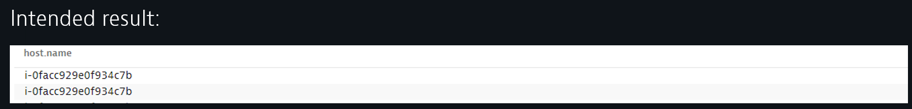
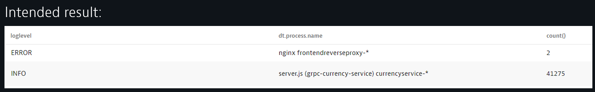
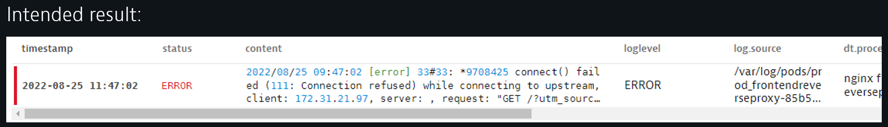
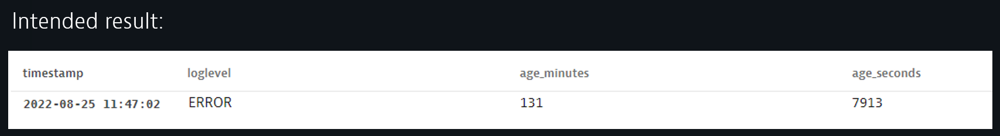
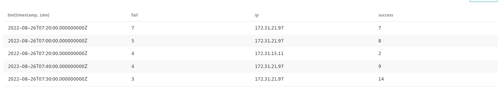
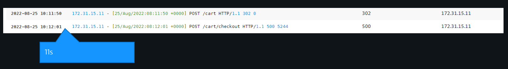
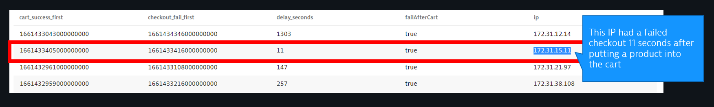

summary: Unleashing the value in logs with DQL
id: logs-dql
categories: logmon-2
tags: bootcamp, dql
status: Published
authors: Peter Zahrer
new: 1
Analytics Account: UA-54510554-1

# Using DQL for Logs and Events
<!-- ------------------------ -->
## Using DQL for Logs and Events
Duration: 1

This Repo contains the labs we are going to work though as part of the Log on Grail - DQL Hands On Workshop.

For the purposes of the Hands-On, we will automate and make the steps seamless for the participants

### Prerequisites

- Access the environment used in this workshop [here](https://guu84124.live.dynatrace.com/ui/logs-events?gtf=-2h&gf=all).
- get an overview of the DQL documentation [here](https://www.dynatrace.com/support/help/how-to-use-dynatrace/dynatrace-query-language)

### What You’ll Learn

We will start with simple use-cases such as simple filters and aggregations to more refined scenarios where arithmetics is used to calculate time distances between significant events.

- DQL Goals from a business perspective
- What DQL is and it's building blocks
    * DQL overview and introduction
    * DQL Syntax and top things to know about
- What DQL can do for Log and Event data 
    * DQL overview and introduction
    * Field selection and typecasting
    * First level and conditional aggregates
    * Getting in touch with Log parsing on read
    * Arithmetic calculations

<!-- ------------------------ -->
## DQL Introduction
Duration: 10

In this part the workshop tutor will explain the fundamentals of DQL. 

**Task: Get an Overview of the current state of the DQL capabilities by exploring the documentation** 

- Access the DQL doc landing page [here](https://www.dynatrace.com/support/help/how-to-use-dynatrace/dynatrace-query-language).

    
<!-- ------------------------ -->
## Hands-on 1 - Explorative analysis
Duration: 5

**Task: Try to find narrow down the hosts where hipstershop is running**
- Set the query start timestamp to now()-10m
- Look whether the string „hipster“ occurs in the log content field
- Inspect the results. Look for the host.name field
- Finalize the result by selecting the field host.name 

**Intended result:**


**Directions and supporting material**
- Start with `fetch logs`
- Use and inspect the suggestions 
- [Logs on Grail DQL examples:](https://www.dynatrace.com/support/help/how-to-use-dynatrace/log-monitoring/logs-on-grail/logs-on-grail-examples).
- [Commands:](https://www.dynatrace.com/support/help/how-to-use-dynatrace/dynatrace-query-language/commands).
- [String matching functions:](https://www.dynatrace.com/support/help/how-to-use-dynatrace/dynatrace-query-language/functions#dql-string-functions).

<!-- ------------------------ -->
## Hands-on 2 - Explorative analysis
Duration: 15

**Task: Get an overview about whether processes suffer from significant logs on a specific host.**
- Start with `fetch logs` and extend the timeframe to `last 3h`
- Filter the logs by the host name we found in hands-on 1. If you were not successful, use host.name `"i-040585ffc09e5c519"`.
- Aggregate (summarize) the result into table showing the event count grouped by loglevel.
- Get rid of the „NONE“ loglevel in the final result.

**Intended result:**



**Directions and supporting material**
- [Summarize command:](https://www.dynatrace.com/support/help/how-to-use-dynatrace/dynatrace-query-language/commands#summarize).
- [Aggregation functions:](https://www.dynatrace.com/support/help/how-to-use-dynatrace/dynatrace-query-language/functions#dql-aggregation-functions).


<!-- ------------------------ -->
## Hands-on 3 - Timing and atithmetics
Duration: 5

**Task: Find the most recent ERROR log for a specific host**
- Start with this query:

```
fetch logs, from:now()-6h
| filter contains(dt.process.name,"reverseproxy") and loglevel == "ERROR"
```
- Try to sort the result to see the newest ERROR log
- Get rid of all but the newest logline
- You can also use `filter host.name == "i-040585ffc09e5c519" and loglevel == "ERROR"`, assuming this host exists

**Intended result:**




**Directions and supporting material**
- [Sort command:](https://www.dynatrace.com/support/help/how-to-use-dynatrace/dynatrace-query-language/commands#sort).
- [Limit command:](https://www.dynatrace.com/support/help/how-to-use-dynatrace/dynatrace-query-language/commands#limit).


<!-- ------------------------ -->
## Hands-on 4 - Timing and atithmetics
Duration: 5

**Task: Calculate the age in seconds and minutes of the most recent Error log**
- Start with this query:

```
fetch logs, from:now()-1h
| filter host.name == "i-040585ffc09e5c519" and loglevel == "ERROR"
| sort timestamp desc 
| limit 1
| fieldsAdd age_seconds = (now()-timestamp)/1000000000
```
- If you did not find a match, extend the query time frame to last 2h or more.
- Now, add a new field called age_minutes and devide the number of seconds by 60
- Select only the timestamp, age_seconds, age_minutes,  loglevel fields!

**Intended result:**



**Directions and supporting material**
- [fieldsAdd command:](https://www.dynatrace.com/support/help/how-to-use-dynatrace/dynatrace-query-language/commands#fields-add).

<!-- ------------------------ -->
## Hands-on 5 - Application monitoring - Parsing, typecasts and more
Duration: 10

**Task: Did the same ip-address have both a successful and unsuccessful checkout event within a 10 minute time window?**
- Start with this query

```
fetch logs, from: now()-1h
| filter host.name == "i-040585ffc09e5c519" 
| filter contains(content, "POST /cart/checkout")
| sort timestamp desc
| parse content, "IPADDR:ip LD 'HTTP/1.1' SPACE LONG:http_s SPACE LD " 
```
- Select the timestamp, content, ip, http_s fields!
- Use the `summarize` command in combination with the countIf() function to callculate the number of successful checkouts and failed checkouts
- In this example we consider a successful checkout if the http status is below 302 
- Use the `by:` Parameter of summarize to group the result by ip and 10 minte timebuckets
- If successful, explore the current visualization options the UI provides.

**Intended result:**



**Directions and supporting material**
```
…
| summarize success = countIf(http_s>=200 and http_s <=400), fail = …  , by:{ip, bin(timestamp, 10m)}  | sort fail desc
```

<!-- ------------------------ -->
## Hands-on 6 - Application monitoring - Event sequences
Duration: 15

Now let's go a few steps ahead and get a glimps what can already be done with DQL! 

**Task 6.1: Let‘s find all IP addresses that first have put a product into the cart and afterwards failed to checkout. Also, let‘s calculate the time distance between those events** 
- Start with this query:

```
fetch logs, from:now()-30m
| filter host.name == "i-040585ffc09e5c519"
| filter contains(content, "POST /cart")
| parse content, "IPADDR:ip LD 'HTTP/1.1' SPACE LONG:http_s SPACE LD"
| fields timestamp, content, ip, http_s
```
- Inspect and observe the events over time. See how the same IP-s have sequences of successful and failed events

**Intended result:**




**Task 6.2: Calculating the time distance between cart events and checkout fails**

Extend the query used in task 6.1 and add the following five pipeline processing steps and try to understand what happens. Feel free to add each line sequentially to see the intermediate results up to the final stage!

```
...
| fieldsAdd isCheckout = contains(content,"checkout")
| fieldsAdd checkout_fail_ts = if(isCheckout and http_s == 500, toLong(timestamp)), 
            cart_success_ts = if(NOT isCheckout and http_s <= 302, toLong(timestamp))
| summarize cart_success_first = first(cart_success_ts), checkout_fail_first = first(checkout_fail_ts), by:ip
| fieldsAdd delay_seconds = (checkout_fail_first - cart_success_first)/1000000000 
| fieldsAdd failAfterCart = if(delay_seconds > 0, true, else:false)
```

**Intended result:**
```
fetch logs, from:now()-30m
| filter host.name == "i-040585ffc09e5c519"
| filter contains(content, "POST /cart")
| parse content, "IPADDR:ip LD 'HTTP/1.1' SPACE LONG:http_s SPACE LD"
| fields timestamp, content, ip, http_s
| fieldsAdd isCheckout = contains(content,"checkout")
| fieldsAdd checkout_fail_ts = if(isCheckout and http_s == 500, toLong(timestamp)), 
 cart_success_ts = if(NOT isCheckout and http_s <= 302, toLong(timestamp))
| summarize cart_success_first = first(cart_success_ts), checkout_fail_first = first(checkout_fail_ts), by:ip
| fieldsAdd delay_seconds = (checkout_fail_first - cart_success_first)/1000000000 
| fieldsAdd failAfterCart = if(delay_seconds > 0, true, else:false)
```

