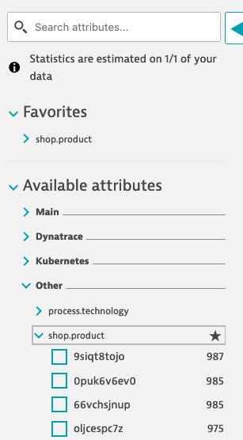

summary: Log Monitoring advanced use cases
id: logs2022-adv
categories: biz-ops, business-analytics
tags: biz-ops, Intermediate
status: Published 
authors: Blazej Przyluski, Tomasz Rybczynski, Michal Franczak, Hans Lougas
Feedback Link: mailto:APAC-SE-Central@dynatrace.com
new: 1
Analytics Account: UA-54510554-1

# Log Monitoring - Data onboarding, processing and analysis


<!-- ------------------------ -->
## Introduction
Duration: 5

### Get more insights from logs
Logs as pillars of observability (together with Metrics and Traces) can provide answers to what is really happening in your infrastructure, software, and environment. Not only simple application troubleshooting.

Today, logs can contain simple contextual information like timestamps or log level but also business contexts like shopping cart value or PII of a user who triggered a transaction. Additionally, Dynatrace adds context by connecting logs to monitored entities, traces, and user sessions to provide an e2e view and enable Davis AI.

In order to start log analysis, we first need to ingest and process data. Enterprises generate hundreds of TB of log data every data. It is important to not only bring the logs to Dynatrace but also ensure configuration at scale and privacy compliance - as the starting point.

Once data is on the platform you'll see many different log formats from log4j to JSON. To add meaning to raw data we must extract attributes to cover customers' use cases like filtering, dashboarding, anomaly detection, automation, and more...

### Today, you will learn how to:
- Onboard log data from files auto-detected by OneAgent
- Set log filtering to limit data transfer and focus only on Logs that matter
- Stay compliant and mask data on the source
- Write log processing rules to extract attributes from log events and use them for: 
  - filtering in log viewer using indexed custom attributes, 
  - custom metrics for dashboarding and alerting 
  - report problems based on events from logs


### Notice
Every exercise that you do today will work on both Dynatrace Managed with Log Monitoring v2 AND Dynatrace SaaS with Log powered by Grail.

### Reference materials
- [Log monitoring documentation](https://www.dynatrace.com/support/help/how-to-use-dynatrace/log-monitoring)


<!-- ------------------------ -->
## New log storage and data filtering configuration
Duration: 5


In the first steps of this lab you will learn how to configure log storage, filter data, and mask sensitive data.

The goal of those actions is to send logs to Dynatrace cluster in a way that gives you flexibility in log source selection.
Filtering and sensitive data masking features lets you perform the transformation and more granular selection of logs before sending them to the Dynatrace cluster.


### OneAgent log storage configuration
All tasks, that you'll be working on within the first part of this workshop will result in defining configurations that
are stored on the Dynatrace cluster and then automatically sent to OneAgents.
OneAgnets perform logs acquisition of autodetected logs and transformations on them before sending data to the Dynatrace cluster.

### Settings 2.0 frameworks implementation
Log storage, data filtering configuration, and sensitive data masking are built on the basis of the Settings 2.0 framework.
As a result, you'll be able to define a set of rules in three hierarchy scopes:
* Host
* Host group
* Environment

The following image illustrates rule processing priority. 


Rules are executed in the order in which they're listed, from top to bottom.
Order is critical because a preceding rule may impact the log configuration that a subsequent rule uses in its definition.
This means that if a mechanism discovers a rule that has matched a given log line it stops iterating the next rules.

<!-- ------------------------ -->
## Enabling new Log storage and data filtering configuration
Duration: 5

In this lab, we will enable new Log storage and data filtering configuration.

Log storage configuration is a mechanism that lets you define which auto-detected by OneAgent log sources will be collected by Dynatrace.

Version requirements: 
* Dynatrace cluster version 1.251
* OneAgent version 1.243

### Enable new Log storage and data filtering
1. In the Dynatrace menu go to **Settings > Log Monitoring > Log sources and storage**

2. Expand the teaser at the top of the page by clicking **Learn more and update**


3. Check if all conditions are met 

Prerequisites met:


#### Prerequisites not met:
In case prerequisites are not met, you'll get an appropriate message with the reasons explained.
You would still be able to update the configuration. It would be useful if the customer is aware of the consequences and still wants to use new configurations. 
For example, if a small number of OneAgents with older versions run in testing environments.


4. Click **Update configuration** at the bottom of the teaser

5. At this point you should be able to see the new **Log storage configuration** screen.


**Note:** 

If log storage rules would have been defined before updating configuration they will be converted.
* Rule configured on Process group level would be converted to environment scope rules.
* Rule configured on the host level would be converted to host scope rules.

<!-- ------------------------ -->
## Log storage configuration rules
Duration: 10

In this lab, we will be configuring log storage of auto-detected Kubernetes logs.

At this point, no logs are collected. 
Log viewer shows an empty list. You can check this by navigating from the Dynatrace menu to **Observe and explore > Logs**

### Creating rules for k8s deployments
Let's work on the use case where we want to include logs for chosen k8s deployments from the online shop and we want to exclude logs generated by health service.

In the Dynatrace menu go to **Settings > Log Monitoring > Log sources and storage** to view log storage rules that are in effect.
If you work in a freshly created environment list of rules is empty. You may also need to enable the new log storage configuration first.
You can reorder the existing rules, and create new rules here.

Let's upload logs for k8s **frontend-\*** and **paymentservice-\*** deployments.


You need to submit matcher configurations with **Add matcher** before saving changes to the rule with **Save changes** button.

### Configure k8s deployment 'frontend-\*' and 'paymentservice-\*' logs acquisition at the environment scope

1. In the Dynatrace menu, go to **Settings > Log Monitoring > Log storage configuration** and click on **Add rule** button
2. Fill out the form
   * Insert name
   * Select rule type **Include in storage**
   * Click **Add matcher**
	   * From the **Matcher attribute** dropdown select **K8s deployment name**
	   * Copy **frontend-\*** and paste in **Value** field and click on the "drop down" to select it
     * Copy **paymentservice-\*** and paste in **Value** field and click on the "drop down" to select it
	   * Confirm inserted value and click **Add matcher**
3. Click **Save changes** at the bottom of the screen


**Note:**
* There is **OR relation** between values of the matcher
* There is **AND relation** between matchers inside the rule

### Excluding logs with log storage configuration rule
Now, we want to exclude health logs on environment scope (e.g. because of cost control reasons).
Please note that this time we choose **Exclude from storage** rule type.

You need to submit matcher configurations with **Add matcher** before saving changes to the rule.

1. In the Dynatrace menu, go to **Settings > Log Monitoring > Log storage configuration** and click on **Add rule** button
2. Fill out the form
   * Insert name
   * Select rule type **Exclude from storage**
   * Click **Add matcher**
	   * From the **Matcher attribute** dropdown select **Log content**
	   * Type in **\*_healthz\*** in **Value** field (\* - asterisk is used as a wildcard)
	   * Confirm inserted value and click **Add matcher**
3. Click **Save changes** at the bottom of the screen


**Make sure that 'Exclude from storage' rule type is first on the list**.

Rules that have a higher position on the list take precedence over those placed in the following positions.
This means that if a mechanism discovers a rule that has matched a given log line it stops iterating the next rules.
For this reason, excluded from storage rule type in our example needs to be first on our list.

Rules that have a higher position on the list take precedence over those placed in the following positions.
This means that if a mechanism discovers a rule that has matched a given log line it stops iterating the next rules.
For this reason, excluded from storage rule type in our example needs to be first on the list.

You can preview created rules on the list


At this point, logs containing keyword '_healthz' will not be sent do Dynatrace cluster.

**Congratulations** :) You have created your first log storage configuration rule.
In a moment the rule will be propagated to OneAgents and you'll be able to explore logs collected by OneAgent.

Positive
: Configurations will be applied and visible in the log viewer after around 3 minutes.

In the Dynatrace menu go to **Observe and explore > Logs** to check the effects.

<!-- ------------------------ -->
## Sensitive data masking 
Duration: 5

The frequent use case is masking credit card numbers.
In the log viewer, we can observe that logs contain strings like this one 'credit_card_number":"4432-8015-6152-0454' and we want to anonymise it by replacing it with a string.

In the Dynatrace menu go to **Settings > Log Monitoring > Sensitive data masking**.


After around 3 minutes you will see the effects of masking in log viewer. In the following example image, you can see a moment when sensitive data started to be masked.


### Reference materials
- Log storage configuration [https://www.dynatrace.com/support/help/how-to-use-dynatrace/log-monitoring/log-monitoring-configuration/log-storage](https://www.dynatrace.com/support/help/how-to-use-dynatrace/log-monitoring/log-monitoring-configuration/log-storage)
- Sensitive data masking [https://www.dynatrace.com/support/help/how-to-use-dynatrace/log-monitoring/log-monitoring-configuration/sensitive-data-masking](https://www.dynatrace.com/support/help/how-to-use-dynatrace/log-monitoring/log-monitoring-configuration/sensitive-data-masking)
- Additional reference: 
[https://dynatrace.sharepoint.com/sites/Infrastructuresolution/SitePages/How-to-take-part-in-new-Log-Storage-Configuration-&-Masking-Preview.aspx](https://dynatrace.sharepoint.com/sites/Infrastructuresolution/SitePages/How-to-take-part-in-new-Log-Storage-Configuration-&-Masking-Preview.aspx)


<!-- ------------------------ -->
## Why do we process logs? 
Duration: 5

In this introduction you will learn more about why do we process logs.

### Why do we need attributes from logs?

Information can be logged in a very wide variety of formats depending on the application or process, operating system or other factors. Extracting attributes from logs bring meaning to data and helps with troubleshooting, analysis and allows for automation.

Example use cases enabled by log processing:
- unification of log formats among multiple microservices (userId attribute present in many services)
- faster filtering on indexed data
- additional dimensions for metrics that can be later used for automation 
- content manipulation: masking, replacing, categorization

### Introduction to Log processing
In the Dynatrace menu, go to **Settings > Log Monitoring > Log processing** to view log processing rules that are in effect, reorder the existing rules, and create new rules. Rules are executed in the order in which they're listed, from top to bottom. This order is critical because a preceding rule may impact the log data that a subsequent rule uses in its definition.

Positive
: You can test the entire pipeline if you use **Test all the rules** mode.


### Example of attributes extraction from payment-service
In this lab you will use an onlineshop as sample application. Onlineshop runs a payment-service which writes logs in JSON format.

```
{
  "severity": "info",
  "time": 1661408972959,
  "pid": 1,
  "hostname": "paymentservice-7dd8c8d7bf-892rf",
  "name": "paymentservice-charge",
  "message": "Transaction processed: visa ending 0454     Amount: CAD111.1114552",
  "v": 1
}
```

For us it's important to:
- identify most popular currencies for credit card processor
- summarize daily total transactions per currency
- mask credit card endings

To achieve it we need to write a **Processer rule definition** that
- parses JSON like in this [example](https://dynatrace.com)
- extracts credit card processor, currency and amount
- masks ending

```SQL
USING(INOUT content) | 
PARSE(content, "JSON{STRING:message}(flat=true)") | 
FIELDS_ADD(message: REPLACE_PATTERN(message, "'ending ' INT", "ending ****")) |
PARSE(message, "'Transaction processed: ' NSPACE:card_processor ' ending ****' BLANK* 'Amount: ' UPPER:currency DOUBLE:amount") | 
FIELDS_ADD(content: message) | 
FIELDS_REMOVE(message)
```

As a result of processing your log event is enriched with extracted attributes. You can see the output of processing in log viewer.


### What comes next?
In the next labs you will learn how to:
- write your own processing rules
- use extracted attributes for filtering
- use log data as source for metrics
- generate events based on logs to report problems

<!-- ------------------------ -->
## Process logs to extract attributes for filtering
Duration: 15

In this lab you will extract attribute from log and use it as filter in log viewer.

### Before you start
Make sure that you have logs from `k8s.deployment.name = 'frontend-*'` available in Log Viewer. If not configure storage under **Settings > Log Monitoring > Log sources and storage**


### Configure log processing to extract attributes
Difficult to start? Check the example from previous section, and *Reference materials* at the end of this section.

- In the Dynatrace menu, go to **Settings > Log Monitoring > Log processing** and **Add a processing rule**

- set a **matcher** `k8s.deployment.name="frontend-\*" AND content="request complete"` and **download sample log**
  


- make sure that the downloaded example has `http.req.path` starting with `/product/`. If not replace the value with `/product/ABC` or click **download sample log** again
- parse `content` as JSON and extract `http.req.path` 
- use **test the rule** to **run the test** and check the **Test results**, you should see `http.req.path` attribute extracted
- parse `http.req.path` to extract `shop.product` from the uri and **test the rule** you should see `shop.product` extracted


- **Save changes** and go to **Log viewer** and wait for new log lines - processing rules will apply to new lines only


### Configure log custom attribute for filtering

- to make `shop.product` an attribute that can be used as filter in Log viewer you must configure **Log custom attributes**
- In the Dynatrace menu, go to **Settings > Log Monitoring > Log custom attributes** 


- When you go back to **Log viewer** you will see `shop.product` under **Available attributes > Other > shop.product** 



- You can use it as filter and to **format table**


### Reference materials
- Log processing example: [Parse out specific fields from JSON content](https://www.dynatrace.com/support/help/how-to-use-dynatrace/log-monitoring/acquire-log-data/log-processing/log-processing-examples#example-4-parse-out-specific-fields-from-json-content) 
- Log processing example: [Multiple PARSE commands within a single processing rule](https://www.dynatrace.com/support/help/how-to-use-dynatrace/log-monitoring/acquire-log-data/log-processing/log-processing-examples#lpexample6) 
- Log processing example: [Use specialized matchers](https://www.dynatrace.com/support/help/how-to-use-dynatrace/log-monitoring/acquire-log-data/log-processing/log-processing-examples#example-7-use-specialized-matchers)
- [Dynatrace Pattern Language](https://www.dynatrace.com/support/help/how-to-use-dynatrace/dynatrace-pattern-language)
- [Log custom attributes](https://www.dynatrace.com/support/help/how-to-use-dynatrace/log-monitoring/analyze-log-data/log-custom-attributes)


<!-- ------------------------ -->
## Use logs as metrics for dashboarding 
Duration: 15

In this lab you will create metric from logs to monitor average times for loading product details in an onlineshop.

### Extract shop.product.time_took_ms attribute from log event
- Go to **Settings > Log Monitoring > Log processing**  and modify previously created processing rule to extract `http.resp.took_ms` as INTEGER
- Use `FIELDS_RENAME` and change `http.resp.took_ms` to `shop.product.time_took_ms`
- Run the and validate the output


- Go to **Log Viewer** and validate if `shop.product.time_took_ms` attribute was extracted properly

### Create metric 
- To use extracted attribute as metric value or dimension you must create a **custom attribute**
- Go to **Settings > Log Monitoring > Log custom attributes** and create a custom attribute `shop.product.time_took_ms` - do NOT enabled **Show attribute values in side bar**. When attribute is added you will be able to use it as value for your new metric.
- use Log Viewer to find logs you processed: `k8s.deployment.name="frontend-\*" AND content="request complete"`
- click on **Create metric** and set **Key** `log.shop.product.time_took_ms`
- from **Measure** drop-down select **Attribute value** and as **Attribute** select `shop.product.time_took_ms`
- **Add dimension** an new `shop.product` and **Save changes**


### Visualize metric data
- Metric will start collecting data points once it's created - so you have to wait for the first data points.
- Go to **Data explorer** and search for `log.shop.product.time_took_ms`
- Try different visualizations like: top 10 slowest products or average time for product request to finish


### Reference materials
- Log processing example: [Rename attributes](https://www.dynatrace.com/support/help/how-to-use-dynatrace/log-monitoring/acquire-log-data/log-processing/log-processing-examples#example-14-rename-attributes) 
- [Metrics from logs](https://www.dynatrace.com/support/help/how-to-use-dynatrace/log-monitoring/analyze-log-data/log-metrics)

<!-- ------------------------ -->
## Use logs as metrics for events
Duration: 15

In this lab you will use logs, metrics and events all combined to report Problems.

### Before you start 
Run a few request to your onlineboutique instance with uri /product/OLD. This will generate errors in logs.
Check in **Log Viewer** that errors are ingested. You can filter by `shop.product` attribute you created before.


### Extract status code and set log status to error
- Go to **Settings > Log Monitoring > Log processing** and update previously created processing rule to extract `http.resp.status` as INTEGER
- Use `FIELDS_RENAME` to rename it to `http.status_code`. It is important because `http.status_code` is a common attribute for Dynatrace. This means there is not need to create a custom attribute.
- Use `FIELDS_ADD` and `IF` expression to set `status` attribute to `ERROR` if `http.status_code >= 500` else `INFO`
- Use `FIELDS_ADD` and `IF` expression to set `loglevel` attribute to `ERROR` if `http.status_code >= 500` else `DEBUG`
- Before you test new rules adjust **Log sample**. Change `http.resp.status` to `500`


- When click **Test the rule** you should see `status` and `loglevel` set to error.


- Run a few request to your onlineboutique instance with uri /product/OLD. This will generate errors in logs.
- Go to **Log Viewer** and use **Advanced mode** query for `k8s.deployment.name="frontend-\*" AND content="product/\*" AND (status = "ERROR" OR status = "INFO")`


### Configure Davis events from logs
- Go to **Settings > Log Monitoring > Log events** add a new event configuration using **Add log event**
- Fill in required fields including **Log query** you can use `k8s.deployment.name="frontend-\*" AND http.status_code="500"`
- From **Event type** drop-down select **Error**


- For automation or more details you can add **Properties**


- Run a few request to your onlineboutique instance with uri /product/OLD to trigger Problem (in 1-3 minutes)


### Using thresholds for anomaly detection
You can also use **Custom events for alerting** if you want to report a Problem depending on the thresholds. It will require you to create **Log metric** before.

### Reference materials
- Log processing [IF function](https://www.dynatrace.com/support/help/how-to-use-dynatrace/log-monitoring/acquire-log-data/log-processing/log-processing-functions/log-processing-functions-flow-control#if) 
- [Advanced queries for Log Viewer](https://www.dynatrace.com/support/help/how-to-use-dynatrace/log-monitoring/analyze-log-data/log-viewer#search) - this will change with Log powered by Grail and DQL!
- [Log events configuration](https://www.dynatrace.com/support/help/how-to-use-dynatrace/log-monitoring/analyze-log-data/log-events)

<!-- ------------------------ -->
## Summary
Duration: 5

We configured storage to ingest logs from our onlineshop and processed them to add more meaning to data using a simple processing rule, similar to this one:

```
PARSE(content, "JSON{
   STRING:http.req.path, 
   INTEGER:http.resp.took_ms, 
   INTEGER:http.resp.status}(flat=true)"
) | 
PARSE(http.req.path, "'/product/'STRING:shop.product") |
FIELDS_RENAME(
  shop.product.time_took_ms: http.resp.took_ms,
  http.status_code: http.resp.status
) |
FIELDS_ADD(
  status: IF (http.status_code >= 500, 'ERROR', 'INFO'),
  loglevel: IF (http.status_code >= 500, 'ERROR', 'DEBUG')
) 
```

### You have learned how to:
- Extract attributes using Log processing, learn more in docs
- Create custom attributes for filtering, learn more in docs
- Create metrics based on logs, learn more in docs
- Generate problems using events from Logs, learn more in docs

Everything that you learned today will work on both Dynatrace Managed and Dynatrace SaaS with Log powered by Grail.

### You need help or have feedback?
- Dynatrace community
- [Log monitoring documentation](https://www.dynatrace.com/support/help/how-to-use-dynatrace/log-monitoring)