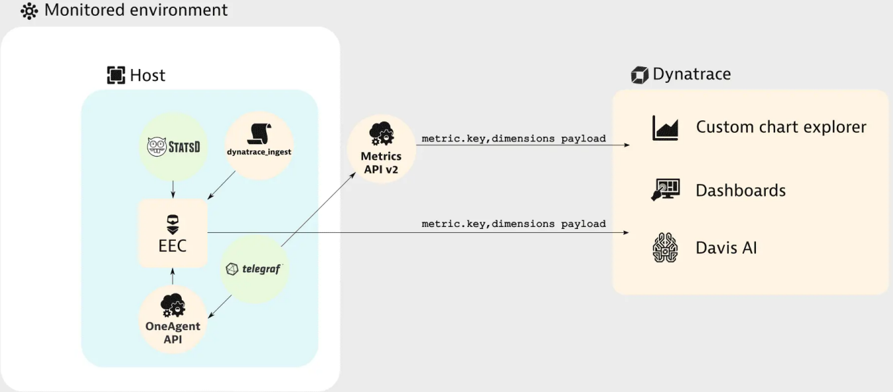

summary: OpenTelemetry
id: opentelemetry
categories: opentel
tags: bootcamp
status: Published 
authors: Myrvin Yap
Feedback Link: mailto:APAC-SE-Central@dynatrace.com
Analytics Account: UA-175467274-1

# Dynatrace with OpenTelemetry
<!-- ------------------------ -->
## Introduction 
This repository contains labs for the OpenTelemetry Hands-On Session. The tech stack used are `Go` and `Kafka`.

### Prerequisites
- Chrome Browser (**recommended**)
- Dynatrace Tenant/Environment

### What You’ll Learn 
- Tracing
  - Use OpenTelemetry SDKs to create SPANs and SPAN attributes
  - Use Dynatrace to analyze the PurePaths with the Otel Spans
  - Create Request Attributes using the OpenTelemetry SPAN attributes
  - Make use of pre-instrumented libraries in your code
- Metrics
  - Make use of Dynatrace OpenTelemetry Metrics Exporter
  - Use Dynatrace to browse and visualize the metrics

<!-- ------------------------ -->
## Prepare the environment
In this step we will prepare the environment for the hands on exercises
- Enable OpenTelemetry instrumentation
- Install OneAgent
- Clone the repos for the exercise

### Step 1: Enable OpenTelemetry instrumentation
- Go to your environment, under `Settings` > `Server-side service monitoring` > `Deep Monitoring` > `OpenTelemetry and OpenTracing`
  

### Step 2: Install OneAgent
- Launch browser-based VS Code Server
- Enter the supplied password
- Open a new Terminal
  
- Access the Dynatrace tenant provided to you
- Deploy Dynatrace OneAgent (Linux)
- Start the installation with default settings

### Step 3: Clone the repos
- Click on `clone repository` on the Welcome tab
  
- Enter `https://github.com/Dynatrace-APAC/Workshop-otel.git`
- Click on Clone from GitHub and choose the default home directory `/home/dynatrace`
- Click on OK
- When asked "Would you like to open the cloned repository?" Click on OPEN.
- After the clone, you should get a folder structure similar to the one below
  

### You've arrived
- You are now ready to start the hands on!

<!-- ------------------------ -->
## Exercise 1 Producing a simple Span and report it to Dynatrace
In this step we extend a sample program with an additional OpenTelemetry Span.
The sample consists of an HTTP Server which is able to calculate any Fibonacci number.
The result of that calculation is getting sent to a Kafka Broker.

### Compile and launch the program
- Open a terminal window
- `source` the profile file and validate `go` version

  ```bash
  $ souce ~/.profile
  $ go version
  go version go1.15.7 linux/amd64
  ```

- Change diretory to `ex1` directory and compile the program using the command line `go build`. This produces a file name `fib` within the current directory.

  ```bash
  $ cd ex1
  $ go build
  ```
  
- Launch `fib.exe` via your current Terminal

  ```bash
  $ ./fib
  ```
- Spilt a new terminal window
  
- Fire transactions to access your new HTTP Service

  ```bash
  $ curl http://localhost:28080/fib?n=1;echo
  ```

- In your Dynatrace Environment navigate to `Hosts` and select the host
- Wait until `fib` shows up among the Processes on this host
- Dynatrace by default has decided to disable monitoring for this executable (`Process isn't monitored`). Click on the link `monitored technologies` and override the defaults for this Process Group.
  
- Within your Terminal press `Ctrl-C` to shut down `fib`. Launch `fib` again. 
- Fire transactions to access the http service, using n=1

  ```bash
  $ curl http://localhost:28080/fib?n=1;echo
  ```
  
- Wait for a couple of seconds. After that you should see a PurePath for the HTTP request you just sent to your HTTP Service.
  - The contents of this PurePath is produced by out of the box Sensors of OneAgent
  

### 1-1 Declaring a Global Tracer
- Shut down `fib` using `Ctrl-C` within your Terminal if you haven't done so already
- In this section, we will introduce code that are required to initialize OpenTelemetry and configure a minimal Span Exporter

Positive
: We will be editing `main.go` in the `ex1` folder

- Expand the ex1 folder and open `main.go` by clicking on the filename
- Line 15 and 19 - Insert // on each line - this is the **NEW** code that we want to introduce
- This code snippet tells Go to instantiate the OpenTelemetry Global Tracer SDK. This is part of the specs to implement OpenTelemetry in any language

  ```go
  if err := initGlobalTracer(nil); err != nil {
     panic(err)
  }
  ```
  
### 1-2 Producing SPAN on http request
- Within function `FibServer` are codes accessing the OpenTelemetry SDK.
- Line 27 and 34 - Insert // on each line this is the **NEW** code that we want to introduce
- This code snippet declares the tracing SDK for `http` and together with the `context`, Go will `start` the trace for all `http requests` and `end` the trace when the requests completes 
  
  ```go
  	tracer := otel.Tracer("http")
	ctx := context.Background()

	var span trace.Span
	ctx, span = tracer.Start(ctx, "http-request")
	defer span.End()
  ```
  
### Recompile and execute transactions again
- VS Code Server auto-saves any edits made, however, if you would like to be sure, press `Ctrl-S` to save your changes in `main.go`
- In your Terminal, compile the program using the command line `go build`, launch `fib` and in the other terminal, access the http service, using n=2 to differentiate the transactions
  
  ```bash
  $ go build
  $ ./fib
  $ curl http://localhost:28080/fib?n=2;echo
  ```

### You've arrived
- The PurePath you just created now contains an additional PurePath Node created via OpenTelemetry
  

<!-- ------------------------ -->
## Exercise 2 Creating Child Spans and Span Attributes
The OpenTelemetry Span we just created is more or less redundant. The HTTP Sensor of Dynatrace already created the necessary PurePath Node. Whatever we have introduced via OpenTelemetry doesn't really enrich our experience.
In this task our goal is to grant users of Dynatrace deeper insight into what is going on when the Fibonacci number is getting calculated.

### Prerequisites
- You have completed the previous task `Producing a simple Span and report it to Dynatrace`
- Shut down `fib` using `Ctrl-C` within your Terminal if you haven't done so already
- In this section, we will introduce code that governs OpenTelemetry functionality into the Fibonacci function

Positive
: We will be editing `main.go` and `fibonacci.go` in the `ex1` folder

### 2-1 Passing the trace context into Fibonacci function

Positive
: `fibonacci.go` in the `ex1\fibonacci` folder

- Expand the `ex1\fibonacci` folder and open `fibonacci.go` by clicking on the filename
- Line 17 and 22 - Delete // on each line - this is OLD code that we want to remove
- Line 24 and 29 - Insert // on each line - this is the **NEW** code that we want to introduce
- Line 31 and 33 - Delete // on each line - this is OLD code that we want to remove
- Line 35 and 39 - Insert // on each line - this is the **NEW** code that we want to introduce
- These code snippet mandates that the `trace context` is sent as a parameter and returned together with the function
  
  ```go
  func New(ctx context.Context) Fibonacci {
	return &fibonacci{Context: ctx}
	
  type fibonacci struct {
	Context context.Context
  }
  ```
  
### 2-2 Producing SPAN inside Calc method
- Line 46 and 51 - Insert // on each line - this is the **NEW** code that we want to introduce
- These code snippets produce a SPAN and starts the tracer inside the Calc method. The `trace context` must also be sent so that it can be propergated from the parent, and linked to the child
  
  ```go
	var span trace.Span
	tracer := otel.Tracer("")
	f.Context, span = tracer.Start(f.Context, fmt.Sprintf("fib(%d)", n))
	defer span.End()
  ```

### 2-3 Creating a SPAN attribute
- Line 64 and 66 - Insert // on each line - this is the **NEW** code that we want to introduce
- This code snippets calls the OpenTelemetry SDK to set a SPAN attribute with a specific name and the data type
  
  ```go
  span.SetAttributes(label.Key("fib.result").Int(result))
  ```
  
- VS Code Server auto-saves any edits made, however, if you would like to be sure, press `Ctrl-S` in order to save the changes you've made in `fibonacci.go`

### 2-4 Execution of Fibonacci function in main.go now requires trace context
- Because of these changes we are now getting an error in `main.go`. Creating a Fibonacci Calculator now requires an additional parameter

Positive
: `main.go` in the `ex1` folder

- Open `main.go`
- Line 39 and 41 - Delete // on each line - this is OLD code that we want to remove
- Line 43 and 45 - Insert // on each line - this is the **NEW** code that we want to introduce
- The previous `fibonacci.New().Calc(n)` is not valid any more and thus, this code snippet shows how we can pass the `trace context` from the parent `http-request` to the child request
  
  ```go
  result, numIterations := fibonacci.New(ctx).Calc(n)
  ```
  
### Recompile and execute transactions again
- VS Code Server auto-saves any edits made, however, if you would like to be sure, press `Ctrl-S` to save your changes in `main.go`
- In your Terminal, compile the program using the command line `go build`, launch `fib` and in the other terminal, access the http service, using n=3 to differentiate the transactions
  
  ```bash
  $ go build
  $ ./fib
  $ curl http://localhost:28080/fib?n=3;echo
  ```
  
- The PurePath you just created now contains an additional PurePath Node per invocation of the Fibonacci Calculator's `Calc` function.
  

### 2-5 Tell Dynatrace which OpenTelemetry Attributes are of interest for you
- In Dynatrace navigate to `Settings` > `Server-side service monitoring` > `Span Attributes`. Add an additional item here. The key you want Dynatrace to capture is `fib.result`.
  

### 2-6 Capture a Request Attribute based on the OpenTelemetry Key
- In Dynatrace navigate to `Settings` > `Server-side service monitoring` > `Request Attributes`.
- The Data Source for our Request Attribute needs to be a `Span Attribute`.
- We are just interested in the **last value** within the PurePath - any intermediate results should be ignored.
- The Key of the Request Attribute is called `fib.result` (unless you have chosen a different name)
- Remember to click on `SAVE` in order for the Request Attribute to be registered!
  
- In your Terminal access the http service with a few transactions, using n=5 and n=6 to differentiate the transactions
  
  ```bash
  $ curl http://localhost:28080/fib?n=5;echo
  $ curl http://localhost:28080/fib?n=6;echo
  ```
  
Positive
: Why do both n=5 and n=6 produce the same Fibonacci result in the request attribute?

### You've arrived
- The PurePath you just created now contains an additional PurePath Node per invocation of the Fibonacci Calculator's `Calc` function. In addition the Request Attribute you just created is also available on every PurePath.
  

<!-- ------------------------ -->
## Exercise 3 Creating your own instrumentation libraries
With Exercise 2 we actually overshot.
First of all, we had to modify the existing source code of the Fibonacci Calculator. This is rarely possible for third party libraries. But even then you'd rather prefer to use the original libraries instead of patching them.
Second, our solution traces ALL the invocations of the `Calc` function. Trace sizes easily explode given a sufficiently high input value.

### Prerequisites
- Shut down `fib` using `Ctrl-C` within your Terminal if you haven't done so already
- In this section, we will introduce code that governs OpenTelemetry functionality into the Fibonacci function
- Close the `main.go` and `fibonacci.go` tabs from ex1, in order not to get confused

Positive
: We will be editing `main.go` and `fibonacci.go` in the **ex3** folder

### 3-1 Wrapping trace+context over Fibonacci function 

Positive
: `fibonacci.go` in the `ex3\fibonacci` folder

- In your terminal, change diretory to `ex3` directory.
  
  ```bash
  $ cd ..
  $ cd ex3
  ```
  
- Expand the `ex3\fibonacci` folder and open `fibonacci.go` by clicking on the filename
- Line 34 and 54 - Insert // on each line - this is the **NEW** code that we want to introduce
- These code snippets creates a wrapper around the Fibonacci function. The structure of the code mandates that
  - `Trace Context` needs to be maintained in order for the tracing relationship to be visualized
  - `start` and `end` tracers will also need to be defined correctly
  
  ```go
  // Wrap produces a Fibonacci Calculator with tracing capabilities
  func Wrap(ctx context.Context, f Fibonacci) Fibonacci {
  	return &tracingFib{Context: ctx, Fibonacci: f}
  }
  
  type tracingFib struct {
  	Fibonacci Fibonacci
  	Context   context.Context
  }
  
  func (tf *tracingFib) Calc(n int) (int, int) {
  	var span trace.Span
  	tracer := otel.Tracer("")
  	tf.Context, span = tracer.Start(tf.Context, fmt.Sprintf("fib(%d)", n))
  	defer span.End()
  	result, iterations := tf.Fibonacci.Calc(n)
  	span.SetAttributes(label.Key("fib.result").Int(result))
  	return result, iterations
  }
  ```
  
### 3-2 Changes are required on main.go - Producing SPAN on http request
- The changes we've made to fibonacci.go again are creating errors within main.go.

Positive
: `main.go` in the `ex3` folder

- Expand the **ex3** folder and open `main.go` by clicking on the filename
- As we are working on a clean set of codes, this step assumes that ex1 was not done before
- Line 28 and 35 - Insert // on each line this is the **NEW** code that we want to introduce

### 3-2 Execute Fibonacci function that has the trace WRAPPER function
- Line 40 and 42 - Delete // on each line - this is OLD code that we want to remove
- Line 44 and 46 - Insert // on each line - this is the **NEW** code that we want to introduce
- This code snippet is modfied based on how the **NEW** Fibonacci function is designed - OpenTelemetry SDK wrapped around the function
  
  ```go
  result, numIterations := fibonacci.Wrap(ctx, fibonacci.New()).Calc(n)
  ```

### Recompile and execute transactions again
- VS Code Server auto-saves any edits made, however, if you would like to be sure, press `Ctrl-S` to save your changes in `main.go`
- In your Terminal, compile the program using the command line `go build`, launch `fib` and in the other terminal, access the http service, using n=7 and n=8 to differentiate the transactions
  
  ```bash
  $ go build
  $ ./fib
  $ curl http://localhost:28080/fib?n=7;echo
  $ curl http://localhost:28080/fib?n=8;echo
  ```

### You've arrived
- The PurePath you just created does no longer report a Span for every single invocation of the function `Calc`. Most importantly the code of the original Fibonacci Calculator remains untouched. You've managed to create an instrumentation library that performs the necessary work.
  

<!-- ------------------------ -->
## Exercise 4 Using pre-instrumentation libraries
Compile Time instrumentation might be fun to some extent, but it's usually not your job to do that.
The idea behind OpenTelemetry is that third party software either already comes fully instrumented (with all the necessary source code for OpenTelemetry included) or alternatively is getting provided as an optional feature via a helper library.

### Prerequisites
- You have completed the previous task `Child Spans and Span Attributes`
- Shut down `fib` using `Ctrl-C` within your Terminal if you haven't done so already
- In this section, we will introduce code a kafka library created and contributed by a member of the OpenTelemetry Community: Shopify Sarama Kafka libraries

Positive
: We will be editing `kafka.go` in the **ex3** folder

### 4-1 Kafka Broker URL
- Expand the **ex3\kafka** folder and open `kafka.go` by clicking on the filename
- Line 12 in `kafka.go` refers to the Kafka Broker that is supposed to receive messages. Replace only `kafka.mushroom.home` with the URL you've been given.

### 4-2 Introduce the Sarama lib wrapper
- Line 37 in `kafka.go` represents the magic that's required to introduce OpenTelemetry Tracing capabilities to an existing Kafka Producer
- Line 36 and 38 - Insert // on each line - this is the **NEW** code that we want to introduce
- The code snippet wraps the Sarama libraries to the Kafka `producer` function
  
  ```go
  producer = otelsarama.WrapSyncProducer(config, producer)
  ```

### Recompile and execute transactions again
- VS Code Server auto-saves any edits made, however, if you would like to be sure, press `Ctrl-S` to save your changes in `kafka.go`
- In your Terminal, compile the program using the command line `go build`, launch `fib` and in the other terminal, access the http service, using n=9 to differentiate the transactions
  
  ```bash
  $ go build
  $ ./fib
  $ curl http://localhost:28080/fib?n=9;echo
  ```
  
- The PurePath you just created contains an additional PurePath Node for when the application reaches out to the Kafka Broker
  

Positive
: Investigate the additional PurePath Node. What additional data does it potentially offer? Optionally you can also make that data available via Request Attribute. Why is not necessarily EVERY Span Attribute also a candidate for a Request Attribute?

### You've arrived
- You have successfully instrumented Kafka Client communication without modifying the original library.

<!-- ------------------------ -->
## Exporting Metrics via Dynatrace Exporter
Apart from getting deeper insight into what's going on within an application on a transactional level, OpenTelemetry also covers the ability to gather metrics.
In this lesson we learn how to enable the OpenTelemetry Metric Exporter for Dynatrace.

### Prerequisites
- You have completed the previous task `Creating Instrumentation Libraries`
- Shut down `fib` using `Ctrl-C` within your Terminal if you haven't done so already
- In this section, we will introduce code to initate the metrics library and control how Dynatrace collects the metrics via the Otel Dynatrace Exporter
- A good reference is available on the Dynatrace Help online documentation [Metric Ingestion](https://www.dynatrace.com/support/help/how-to-use-dynatrace/metrics/metric-ingestion/)



Positive
: We will be editing `metrics.go` and `main.go` in the **ex3** folder

### 5-1 Instantiate Dynatrace Exporter

Positive
: `main.go` in the **ex3** folder

- Expand the **ex3** folder and open `main.go` by clicking on the filename
- Line 18 and 20 - Insert // on each line - this is the **NEW** code that we want to introduce
- This code snippet ensures that `initMetricsProvider()` will get called upon process start
- Function `main` in `main.go` should now look like this:
  
  ```go
    func main() {
        if err := initGlobalTracer(nil); err != nil {
            panic(err)
        }
        initMetricsProvider()
        http.HandleFunc("/fib", FibServer)
        http.HandleFunc("/favicon.ico", faviconHandler)
        http.ListenAndServe(":28080", nil)
    }
  ```
  
### 5-2 Using OneAgent endpoint for metrics ingestion

Positive
: `metrics.go` in the **ex3** folder

- Expand the **ex3** folder and open `metrics.go` by clicking on the filename
- Line 19 refers to the OneAgent REST API URL. You do not need to modify anything here.
- Line 59 refers to metric name. You do not need to modify anything here.

Negative
: What **Settings** are **required** before metrics can be ingested by the OneAgent REST API?

### Recompile and execute transactions again
- VS Code Server auto-saves any edits made, however, if you would like to be sure, press `Ctrl-S` to save your changes in `metrics.go` and `main.go`
- In your Terminal, compile the program using the command line `go build`, launch `fib` and in the other terminal
- Access the http service by creating a series of requests like these. Feel free to repeat some of these requests a couple of times
  
  ```bash
  $ go build
  $ ./fib
  $ curl http://localhost:28080/fib?n=1;echo
  $ curl http://localhost:28080/fib?n=2;echo
  $ curl http://localhost:28080/fib?n=3;echo
  $ curl http://localhost:28080/fib?n=4;echo
  $ curl http://localhost:28080/fib?n=5;echo
  $ curl http://localhost:28080/fib?n=6;echo
  $ curl http://localhost:28080/fib?n=7;echo
  $ curl http://localhost:28080/fib?n=8;echo
  $ curl http://localhost:28080/fib?n=9;echo
  $ curl http://localhost:28080/fib?n=10;echo
  $ curl http://localhost:28080/fib?n=11;echo
  $ curl http://localhost:28080/fib?n=12;echo
  ```

Negative
: Challenge - Does this metric consume DDUs?

### Visualize the metrics using the Data Explorer
- Open the metrics browser in Dynatrace WebUI, find the metric, and click on the button `create chart`
- Alternatively, you can also use the Data Explorer and click on the Dropdown box `Filter metrics by` and type in `otel`.
- Click on the input box `Split by`. You should be able to select `input` here.
- For this specific kind of metric it makes sense to select `Pie` as the Visualization on the right hand side menu
  
- Click on `Run query`

### 5-3 Using DynatraceAPI endpoint for metrics ingestion

Positive
: `metrics.go` in the **ex3** folder

- Modify `metrics.go` to cater for the DynatraceAPI
- Line 19 - Insert // - this is OLD endpoint that we want to remove
- Line 22 - requires you to specify an API Token. It is required for authentication. Copy the API Token to your clipboard and paste into the String
    - In the Dynatrace WebUI navigate to `Settings` > `Integration` > `Dynatrace API`
    - Generate a new API Token here
    - The access scope (= permissions) needs to include `Ingest metrics`
    - The name of the API Token can get chosen freely
    - You can now copy the API Token to your clipboard and paste into the String on Line 22 of `metrics.go`
    - 
- Line 25 - Delete // - this is **NEW** endpoint that we want to introduce
- Line 25 - Edit the URL to include your environment ID

Negative
: https://mou612.managed-sprint.dynalabs.io/e/**REPLACE with environmentID**/api/v2/metrics/ingest

- Line 30 - Delete // - this is to INTRODUCE the Dynatrace API token into the code
- Line 59 - Insert // - this is OLD metric name that we want to remove
- Line 60 - Delete // - this is **NEW** metric name that we want to introduce

### Recompile and execute transactions again
- VS Code Server auto-saves any edits made, however, if you would like to be sure, press `Ctrl-S` to save your changes in `metrics.go`
- In your Terminal, compile the program using the command line `go build`, launch `fib` and in the other terminal
- In your terminal, create a series of requests like these. Feel free to repeat some of these requests a couple of times
  
  ```bash
  $ go build
  $ ./fib
  $ curl http://localhost:28080/fib?n=12;echo
  $ curl http://localhost:28080/fib?n=13;echo
  $ curl http://localhost:28080/fib?n=14;echo
  $ curl http://localhost:28080/fib?n=15;echo
  $ curl http://localhost:28080/fib?n=16;echo
  ```
  
Negative
: Challenge - Does this metric consume DDUs?

### You've arrived
- You have successfully reported a metric via OpenTelemetry and charted it in Dynatrace
- Like with additional Spans you can expect third party libraries to already have chosen a set of metrics for you, that are worth reporting.

<!-- ------------------------ -->

## Feedback

We hope you enjoyed this lab and found it useful. We would love your feedback!
<form>
  <name>How was your overall experience with this lab?</name>
  <input value="Excellent" />
  <input value="Good" />
  <input value="Average" />
  <input value="Fair" />
  <input value="Poor" />
</form>

<form>
  <name>What did you benefit most from this lab?</name>
  <input value="Using OneAgent Operator to deploy in Kubernetes" />
  <input value="Setting up Kubernetes integation" />
  <input value="Enabling early access feature flags" />
  <input value="Learning Kubernetes View in Dynatrace" />
</form>

<form>
  <name>How likely are you to recommend this lab to a friend or colleague?</name>
  <input value="Very Likely" />
  <input value="Moderately Likely" />
  <input value="Neither Likely nor unlikely" />
  <input value="Moderately Unlikely" />
  <input value="Very Unlikely" />
</form>

Positive
: 💡 For other ideas and suggestions, please **[reach out via email](mailto:APAC-SE-Central@dynatrace.com?subject=OpenTelemetry - Ideas and Suggestions")**.