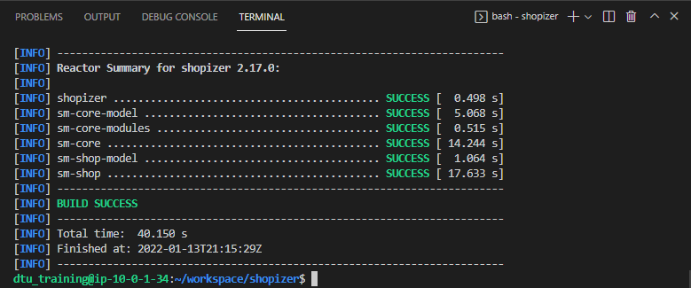
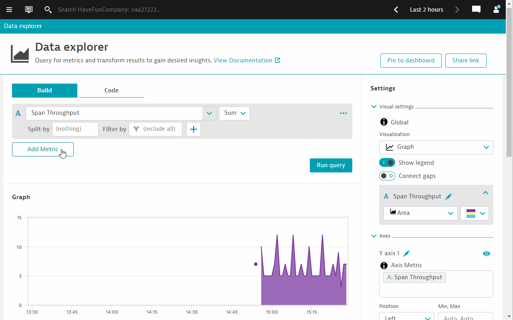
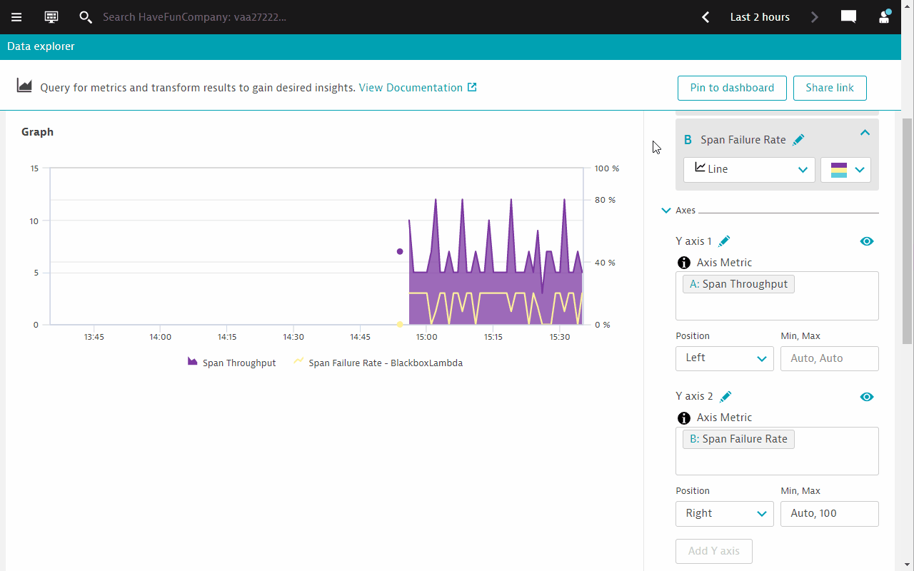

summary: OpenTelemetry + Open observerbility 2022
id: opentelemetry2022
categories: opentel
tags: bootcamp
status: Published 
authors: Myrvin Yap
Feedback Link: mailto:APAC-SE-Central@dynatrace.com
Analytics Account: UA-175467274-1

# OpenTelemetry + Open observerbility (2022 edition)
<!-- ------------------------ -->
## Introduction 
This repository contains labs for the OpenTelemetry Hands-On Session. Content updated as of March 2022. The tech stack used are `java` and `Go` 

### Prerequisites
- Chrome Browser (**recommended**)
- Dynatrace Tenant/Environment

### What You’ll Learn 
- Appreciate the various methods that Dynatrace can ingest Open Telemetry data (mainly traces)
- Understand the different scenarios where ingestion is applied
- Appreciate open and intelligent observerbility

<!-- ------------------------ -->
## Prepare the environment
In this step we will prepare the environment for the hands on exercises
- Install OneAgent
- Build the app

### Accessing the environment
- Launch browser-based VS Code Server
- Enter the supplied password
- Click on the Menu Button  in the top left corner
- Select **Terminal** and in here **New Terminal**
  

### Install OneAgent
- Access the Dynatrace tenant provided to you in the email
- Deploy Dynatrace OneAgent (Linux)
- Start the installation with default settings

Negative
: Remember to use `sudo` when executing the installation shell script as your user is `dynatrace`. You will be prompted for a password when you use sudo. Use the same password supplied to you.

### Build the app
- Click on the Menu button again > File > Open folder
- Choose the **shopizer** folder
- Click on **OK** buton
- The window will now be refreshed to show **SHOPIZER** in the Explorer pane
  
- Open a new terminal again
- Verify that you are already in the `shopizer` directory, else change directory by executing `cd ~/shopizer`
- execute this command to build the app

  ```bash
  mvn clean install
  ```


The final output should look like the following image 



If you would like to download the source repo for your own use, you can get it here `https://github.com/Dynatrace-APAC/Workshop-otel-shopizer`

### You've arrived
You are now ready to start the hands on!

<!-- ------------------------ -->
## Ex1 OOTB OneAgent + Otel traces

**Persona**: IT Operations

**Objective**: OpenTelemetry complementing OOTB OneAgent instrumentation

**Scenario**
- You are an operations person
- Developer has ***"decorated"*** or in another words, **instrumented** their code with OpenTelemetry.
- OneAgent is auto-instrumenting java code out of the box.
- Combine OneAgent auto instrumentation with OpenTelemetry instrumentation.

### Running the application

Within your terminal navigate into the folder **sm-shop** by entering

```bash
cd sm-shop
```

Now we are ready to launch the Web Application using the following command.

```bash
mvn spring-boot:run
```


### Validate that the Vintage Handbag Shop is up and running

Open a new browser window and navigate to `http://the.public.ip:8080`


Feel free to navigate around within that application. In the interest of simplicity we have introduced a load generator that requests the pages that are relevant for todays session automatically.

### Verify that Service Calls are getting monitored

Switch to the Dynatrace environment.

- Go to **Services** via the Dynatrace menu
- Click on **Requests executed in background threads of com.salesmanager.shop.application.ShopApplication** service

You will also notice that it contains two different kinds of service calls:

```
http://127.0.0.1:8080/shop/product/*
```

and 

```
http://127.0.0.1:8080/shop/category/*
```

Take a look at a PurePath that is named similar to this.

```
http://127.0.0.1:8080/shop/category/laptop-bags.html/ref=c:3
```


This is what Dynatrace captures out of the box with its very own Sensors. After a small configuration change we will see that there's a lot more data available.

<!-- ------------------------ -->
## Ex1-1 Enable OpenTelemetry for Java
The application we are working with is as a matter of fact already augmented with OpenTelemetry. We just haven't told Dynatrace yet to take advantage of it.

- Open the **Dynatrace menu** > **Settings** > **Server-side service monitoring** > **Deep Monitoring**
- Under the a section called **OpenTelemetry and OpenTracing**
- Enable the switch **OpenTelemetry for Java**
  

### Restart the application
- Go to VS Code Terminal
- Within the terminal window, execute **Ctrl-C** to terminate the running process
- Launch the Web Application again

   ```bash
   mvn spring-boot:run
   ```

### Investigate the new Service Calls

Switch to the Dynatrace environment and within the **Requests executed in background threads of com.salesmanager.shop.application.ShopApplication** service > **PurePaths**, look for the transaction

```
http://127.0.0.1:8080/shop/category/laptop-bags.html/ref=c:3
```

Among the well known PurePath nodes (Database Calls, ...) you will now notice additional entries with the OpenTelemetry Icon.


The developer has chosen to "signal" to monitoring solutions which portions of the service flow are of importance. In this case, the developer has already augment the necessary codes with the OpenTelemetry. Each of these items/nodes are called ***Spans***. What we have just done is to tell Dynatrace to "recognize* these spans as part of the PurePath.

Positive
: In technical terms, what we have just done is to enable the ***OpenTelemetry sensors*** for **Java** specifically in the OneAgent. 

<!-- ------------------------ -->
## Ex1-2 Controlling span capturing

In this specific case the developer might have been a bit too overzealous. The Span ***query-category*** is visible countless times within the PurePath. Dynatrace by default captures every span.

As a personnel in the "IT Operations" team, you do not have access to the application code and making the developer do this small change is not feasible. Dynatrace offers a way to configure this via the Dynatrace UI. You can control the capturing the spans by adding an exclusion rule within the **Settings** menu.

- Open the **Dynatrace menu** > **Settings** > **Server-side service monitoring** > **Span capturing**
- In our case it's sufficient enough to specify the span name that should be excluded. But you'll notice that the configuration allows for much more specific exclusion rules


### In summary...
- OneAgent automatically integrates OpenTelemetry Spans into ongoing PurePaths
- Additional configuration is possible in order to tweak the results

<!-- ------------------------ -->
## Ex2 Extending Otel instrumention

**Persona**: Application developers

**Objectives**:
- Appreciate work required for instrumentation
- Hands on to add OpenTelemetry instrumenation code to another function (Java)

**Scenario**
- A new function has been coded
- The same observerbility is required
Extend existing OpenTelemetry instrumentation to the new function

### The "vintage-courier-bag" transaction

In the Dynatrace UI > **Services** > **Requests executed in background threads of com.salesmanager.shop.application.ShopApplication** service > **PurePaths**, look for the transaction

```
http://127.0.0.1:8080/shop/product/vintage-courier-bag.html/ref=c:2
```

Take a look at the PurePath nodes:


You'll notice that it also contains a Span named ***calc***

We are looking to introduce a bit more context information to the outgoing HTTP request following the initial call of the **calc** method. Let's take a look at the source code that makes it possible.

<!-- ------------------------ -->
## Ex2-1 Understanding implementation of OTel in Java

Let's investigate and understand the Java code that provides OpenTelemetry instrumentation via the Otel Java SDK.

Within Visual Studio Code expand the following folders:

```
shopizer/sm-shop/src/main/java/com/salesmanager/shop/store/controller/product
```


Select the file ***ShopProductController.java***.

Scroll down to line **100**. The method `calcPrice` is the one that currently produces this additional span.

```java
public void calcPrice(Model model) {
	Span span = getTracer().spanBuilder("calc")
	.setAttribute("model", model.toString())
	.startSpan();
	try (Scope scope = span.makeCurrent()) {
		HttpUtil.Get("http://127.0.0.1:8090/calc");						
	} finally {
		span.end();
	}
}
```

The code below creates a basic span and names it  ***calc***. Reference [Otel SDK doc - Create a basic span](https://opentelemetry.io/docs/instrumentation/java/manual/#create-a-basic-span)

```java
Span span = getTracer().spanBuilder("calc")
```

The code below annotates the span using `Span attributes`. Reference [Otel SDK doc - Span Attribute](https://opentelemetry.io/docs/instrumentation/java/manual/#span-attributes)

```java
.setAttribute("model", model.toString())
```

The code below signals the start of the span and also start timing it. The start and end time of the span is automatically set by the OpenTelemetry SDK. Reference [Otel SDK doc - Create a basic span](https://opentelemetry.io/docs/instrumentation/java/manual/#create-a-basic-span)

```java
.startSpan();
```

The `.makeCurrent()` function of the code below is an an automated way offered by the SDK to propagate the parent span on the current thread. After all, we want **calc** to be nested under the "caller", which by the way, is automatically done by the OneAgent instrumentation. Reference [Otel SDK doc - Create nested span](https://opentelemetry.io/docs/instrumentation/java/manual/#create-nested-spans)

```java
try (Scope scope = span.makeCurrent())
```

The final code below signal the end of the span.

```java
span.end();
```

<!-- ------------------------ -->
## Ex2-2 Instrument handleQuote

It is now YOUR turn to augment additional methods with OpenTelemetry. A few lines above method calcPrice you will find the method ***handleQuote*** at line **91**.

Line **92** makes an outbound HTTP GET call to another API called **quote**

```java
public void handleQuote(final String reference) {
	HttpUtil.Get("http://127.0.0.1:8090/quote");
}
```

In the Dynatrace PurePaths, although we see a Golang icon next to the outgoing HTTP GET, the only reason why this is happening is because the HTTP call is also within the same server. What if the call is made to a remote server, or a Lambda fucntion? The call will never be listed in ***vintage-courier-bag.html*** PurePaths at all...

Positive
: Let's augment the method `handleQuote` also with OpenTelemetry so that we can demarcate the `calcPrice` and `quote` outbound API calls . You can use `calcPrice` as a template.

Negative
: ***HINT:*** You may want to report the `reference` instead of the `model` here, though.

### Restart the application after making the changes
- Go to VS Code Terminal
- Within the terminal window, execute **Ctrl-C** to terminate the running process
- Launch the Web Application again

   ```bash
   mvn spring-boot:run
   ```

### Inspect the new Service Calls

The new Service Calls should now contain an additional OpenTelemetry Span.


Let's take a closer look at the `quote` span.


Dynatrace realizes, that this span comes with additional metadata - a so-called `Span Attribute`. Its value is however not getting captured by default. Click on the link below the attribute and configure Dynatrace to also collect its value.

There is no requirement to rebuild or restart the application for that. The attribute is already getting reported. Dynatrace just has ignored it up to now.

Wait for new Service Calls to come in and verify that the value for the reference is getting captured.


Positive
: Up till this stage, does collecting the Open Telemetry spans consume DDU licenses? Why?

### In summary...
- At least for the programming language Java we have explored the basics of producing additional Spans that are nested within the PurePaths.

<!-- ------------------------ -->
## Ex3 TraceIngest via Dynatrace API

**Persona**: Application developer

**Objective**: Configure "remote" trace ingest and send OTel traces to Dynatrace

**Scenario**
- Go process cannot be instrumented by OneAgent
- Can be residing in the same server or a different remote machine (cloud, AWS Lambda)
- Go process has already been pre-instrumented with OpenTelemetry
- Also need to extend the instrumenation

In the previous section we successfully added context information to these outbound web requests. Unfortunately that doesn't get us insight into what's happening within the application that receives these calls. The server side of these calls is a locally running application written in Golang - unfortunately a version of Golang that's not yet supported by OneAgent.

The application is however already prepared for sending OpenTelemetry Spans to Dynatrace. We just need to configure where to send that data to.

Within Visual Studio Code expand the following folders and navigate to

```
shopizer/gosrvc/main.go
```


<!-- ------------------------ -->
## Ex3-1 Configure the OpenTelemetry Exporter

Around line **38** OpenTelemetry is getting configured. In our code, we are using the [OLTP exporter that sends trace telemetry data to the collector using HTTP with protobuf-encoded payloads](https://github.com/open-telemetry/opentelemetry-go/tree/main/exporters/otlp/otlptrace#otlptracehttp). This eliminates the need for an OpenTelemetry Collector as Dynatrace has an API endpoint that can accept such contents.

```go
client := otlptracehttp.NewClient(
	otlptracehttp.WithEndpoint("######.sprint.dynatracelabs.com"),
	otlptracehttp.WithURLPath("/api/v2/otlp/v1/traces"),
	otlptracehttp.WithHeaders(map[string]string{
		"Authorization": "Api-Token ############################################################################################",
	}),
)
```

What is left is to configure the Dynatrace URL and also the API token.

### Dynatrace URL
```go
// SaaS
otlptracehttp.WithEndpoint("######.live.dynatrace.com")

// Managed with Let's Encrypt SSL cert
otlptracehttp.WithEndpoint("######.managed-dynatrace.com")
// Domain with own SSL cert
otlptracehttp.WithEndpoint("<BASE URL>")
```

Take note that the SDK automatically appends `https`, so you do ***NOT*** need to specify the full URL, only the full domain.

***Specially for Managed***

As Managed requires additonal path for the environment, the URLPath will need to also include `/e/Dynatrace-Environment-ID/`

```go
otlptracehttp.WithURLPath("/e/<EnvID>/api/v2/otlp/v1/traces"),
```

### Dynatrace API token
Navigate to **Access Tokens** within your Dynatrace environment and generate a token with the ***OpenTelemetry trace ingest*** permissions.


Copy and Paste the Access token in this line. Ensure that everything gets copied correctly without additional spaces or characters, especially hidden or special character sets.

```
"Authorization": "Api-Token ############################################################################################"
```

### Restart the application after making the changes
- Go to VS Code Terminal
- Within the terminal window, execute **Ctrl-C** to terminate the running process
- Launch the Web Application again

   ```bash
   mvn spring-boot:run
   ```

### Inspect the new Service Calls
In the Dynatrace UI > **Services** > **Requests executed in background threads of com.salesmanager.shop.application.ShopApplication** service > **PurePaths**, look for the transaction

```
http://127.0.0.1:8080/shop/product/vintage-courier-bag.html/ref=c:2
```

The PurePath nodes under the Go node should now show what's going on for the ***quote*** calls.


What's not covered yet are the ***calc*** calls.

<!-- ------------------------ -->
## Ex3-2 Understanding implementation of OTel in Golang

Let's investigate and understand the Go code that provides OpenTelemetry instrumentation via the Otel Golang SDK.

Take another look at the file ***main.go*** and scroll down to line **70** where function ***quote*** starts.

```go
func quote(w http.ResponseWriter, req *http.Request) {
	ctx := otel.GetTextMapPropagator().Extract(req.Context(), propagation.HeaderCarrier(req.Header))
	var span trace.Span
	ctx, span = otel.Tracer(name).Start(ctx, "quote", trace.WithSpanKind(trace.SpanKindServer))

	process(ctx, uint(rand.Intn(20)))
	span.End()
	fmt.Fprintf(w, "done\n")
}
```

Since the Java code is making a call to the Go service, we need to capture the `traceid` from the caller. Perhaps we can refer to the caller (i.e. Java code/process) as the **parent**, and so the parent normally passes some "DNA information" (blood type for example) to the **child** (i.e. separate Golang code/process). Parent and child are different but share similar traits because of how the DNA is passed down. This is call ***trace context propagation***. 

Reference
- [Otel SDK doc - Propagators and Context](https://opentelemetry.io/docs/instrumentation/go/manual/#propagators-and-context)
- [Dynatrace doc - Span context propagation](https://www.dynatrace.com/support/help/shortlink/opentracing#span-context-propagation)

The code below extracts the `traceid` from the HTTP header.

```go
ctx := otel.GetTextMapPropagator().Extract(req.Context(), propagation.HeaderCarrier(req.Header))
```

The code below initiates a variable called `span` with type `trace.Span`.

```go
var span trace.Span
```

We need to start the span and name it. In addition, we give it a label - `spand kind`, which indicates the role a Span plays in a Trace. Since we are starting the span in the main function, we will label the role of this span as ***Server***. This is because we are expecting the main function to call sub-functions (i.e. "clients"). Thereby the `SpanKind` is way to help the observerbility tool understand the relationship between the spans and can be used to represent  "Client-Server", "callee-caller" relationship metaphorical.

Reference
- [Otel SDK doc - Creating spans](https://opentelemetry.io/docs/instrumentation/go/manual/#creating-spans)
- [Go Otel SDK pkg - Span kind](https://pkg.go.dev/go.opentelemetry.io/otel/trace#SpanKind)

The code below starts the span, names it ***quote*** and labels it as a ***Server*** type. 
```go
ctx, span = otel.Tracer(name).Start(ctx, "quote", trace.WithSpanKind(trace.SpanKindServer))
```

The code below calls the `process` method, however, because we also want to nest all other callees under the caller (in this case, the main go program), then we ***must*** remember to pass the trace context `ctx` with the callee (i.e. `process`).

```go
process(ctx, uint(rand.Intn(20)))
```

The final code below then ends the span and stops the timer. Reference [Otel SDK doc - Creating spans](https://opentelemetry.io/docs/instrumentation/go/manual/#creating-spans)
```go
span.End()
```

<!-- ------------------------ -->
## Ex3-3 Instrument calc

It is now YOUR turn to augment additional methods with OpenTelemetry. Line **80** is the code for the function ***calc***. It handles the incoming `calc` requests.

```go
func calc(w http.ResponseWriter, req *http.Request) {
	process(req.Context(), uint(rand.Intn(20)))
	fmt.Fprintf(w, "done\n")
}
```

Positive
: Let's augment the method `calc` with OpenTelemetry so that we can get more details of what is happening inside `calc` . We can use the function `quote` as a template.

Negative
: ***HINT:*** Be careful of the passing the trace context `ctx`.

### Restart the application after making the changes
- Go to VS Code Terminal
- Within the terminal window, execute **Ctrl-C** to terminate the running process
- Launch the Web Application again

   ```bash
   mvn spring-boot:run
   ```

### Inspect the new Service Calls

The new Service Calls should now contain an additional OpenTelemetry Spans for `calc`, in the same way as `quote`.


When inspecting the ingested traces together with the full trace or full PurePath, you might come across this


Positive
: What does the [warning sign next to the spans](https://www.dynatrace.com/support/help/extend-dynatrace/opentelemetry/opentelemetry-ingest#expand--there-is-a-warning-sign-next-to-the-spans-what-does-it-mean--2) mean?

### In summary...
- We have successfully traced across process boundaries - even if OneAgent is not of assistance.

<!-- ------------------------ -->
## Ex4 Open observerbility

**Persona**: IT Operations

**Objectives**
- Configure an alert
- Build a chat via built in metrics
- Investigating span errors
- Optional SLO

<!-- ------------------------ -->
## Ex4-1 Create a custom event for alerting

1. Go to **Settings** > **Anomaly detection** > **Custom events for alerting**
1. Click on **Create custom event for alerting**.
   
1. Under **Metric** section, select **Span Failure Rate**.
   
1. Scroll down to the **Static threshold** section, configure the following parameters
   - Alert anomalies with a static threshold of ***20*** percent (%), or any value that is below the average failure rate in the chart
   - Raise alert if ... the threshold for ***1*** minute slots
   - during any ***3*** minute period.
1. Scroll down further down to the **Event description** section and configure the event description as follows
   - Title: **Processing limits alert** (or any name that you wish to give)
   - Severity: **Error**
1. Finally, click on **Create custom event for alerting** button.
1. The final configuration screen should look like the following.


<!-- ------------------------ -->
## Ex4-2 Setting up charts to track key metrics

### Step 1: Use the new Unified Analysis view
1. In the standard Dynatrace **Service** view, the ingested spans via the Dynatrace API will appear with an OpenTelemetry Icon
1. Click on the **gosrvc-blackbox** service.
   
1. You will be brought to a new screen. This screen consolidates all relevant analysis workflows (including logs, events, problems etc.) in one screen.
   
1. Click on the `...` button of the **Failure rate** chart and click on **Show in Data Explorer**.
   

### Alternatively - Browser for the relevant metrics
1. Go to Dynatrace menu -> **Metrics**.
1. Search for **span**.
1. Expand the **Span Throughput** metric.
1. Click on **Create chart** button.


### Step 2: Use the Data Explorer to configure charts
1. Configure the **Span Throughput** metric to display **SUM**.
1. And select the **Area** graph visualization.
   
1. Add a 2nd metric, select **Span Failure rate**.
1. Configure **Split by** to **Span service**.
1. Click on **Run query**. You will notice the chart below changes with the 2nd metric added as an overlay.
   
1. Configure the Y-axis to display the full range of percentages.
1. Enter **Auto, 100** in the **Min, Max** configuration box.
1. Click on anywhere outside the configuration box to effect the changes.
1. See the changes on the chart.
   

### Step 3: Pin chart to a dashboard
1. Choose either an existing dashboard or create a new dashboard.
1. Click on **Pin to Dashboard**.



<!-- ------------------------ -->
## Ex4-3 Investigating errors

A problem card should appear after a few minutes. If no problem card appears, check the threshold settings and ensure that it is below the average failure rate in the chart


### Step 1: Deep dive into the distributed traces
1. Open the problem card and drill down to the **gosrvc blackbox span service**
1. Click on the elipsis button `...` on the top right hand corner.
1. Click on **Analyze distributed traces**
   
1. Filter on **Failed state** > **only failed**
1. The traces view wil start to show all traces where an error occured.
   

### Step 2: Explore Span errors and events
1. Expand one of the traces. All the relevant metrics/attributes of the traces are captured.
1. Click on one of the traces. You will now see the full ***distributed traceing*** that covers the OneAgent PurePath together with the spans that were ingested from the Go service.
   
1. Click on the **Events** and **Errors** tabs. You will notice that it contains some information. These are retrieved from the pre-instrumented Go application.

### Span events - Events tab


### Trigger an error status - Errors tab


These are retrieved from the pre-instrumented Go application.

### Bring addition context using Span attributes
1. If the app developer has also included **Span attributes**, Dynatrace allows you to configure it very quickly.
1. In the details of the span, under the section **Attributes**, expand the section by clicking on the down arrow.
1. Following which, all available attributes are listed there for you to choose which one would you like to include in Dynatrace.
1. Click on the **+** sign beside the attribute to add in.


Once the span attributes are added, wait a little while and inspect the latest transactions again.


What can you tell about the conditions surounding the errors?


<!-- ------------------------ -->
## Ex4-4 Setting up SLOs (Optional)

An SRE team is responsible for finding good service-level indicators (SLIs) for a given service in order to closely monitor the reliable delivery of that service. SLIs can differ from one service to the other, as not all services are equally critical in terms of time and error constraints.

Being able to use a typical ***failure rate*** metric as a SLI, this helps the SRE team understand what kind of service levels that the organization needs to uphold in order to provide a resilient service for the business. This then allows the SRE team to define and then further tweak the operational goal within a service-level objective (SLO) to further improve.

Follow the online guide to [define an SLO](https://www.dynatrace.com/support/help/shortlink/service-level-objectives#create-your-own-service-level-objective-definition).

For the SLO name, use `Processing limit SLO`.

For the metric expression, use

```
100-builtin:span_failure_rate:filter(eq("span.kind",internal))
```

Target percentage, use `80`.

Warning percentage, use `90`.

Timeframe to evaluate, use `-1h`

Positive
: What do each of these numbers (i.e. metric expression, Target percentage, eval timeframe etc.) mean in terms of upholding the SLOs and providing a resilent service (i.e. error budgets etc.)? Further, what does the data in Dynatrace tell you? ***HINT:*** read [Dynatrace docs - Service-level objective basics](https://www.dynatrace.com/support/help/shortlink/slo-basics) 

<!-- ------------------------ -->

## Feedback

We hope you enjoyed this lab and found it useful. We would love your feedback!

Positive
: 💡 For other ideas and suggestions, please **[reach out via email](mailto:APAC-SE-Central@dynatrace.com?subject=OpenTelemetry - Ideas and Suggestions")**.