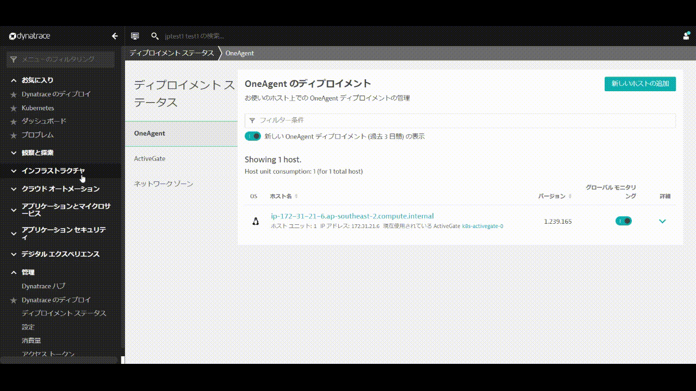
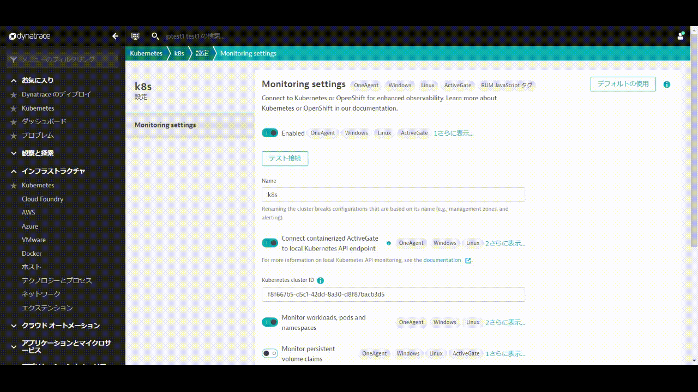

<!-- Code for k8s Settings-->

### Kubernetes integrationの設定

Prometheus exportsのアノテーション監視およびKubernetes Events監視を有効にします。

* DynatraceのUIから**インフラストラクチャ > Kubernetes**を開きます。
* 先ほど作成した**Kubernetesクラスタ**をクリックします。
* 画面右上の**3点ボタン「・・・」**をクリックし、**設定**をクリックします。

* **Monitor annotated Prometheus exports**を有効にします。
* **Monitor events**を有効にします。
* **変更の保存**をクリックします。

