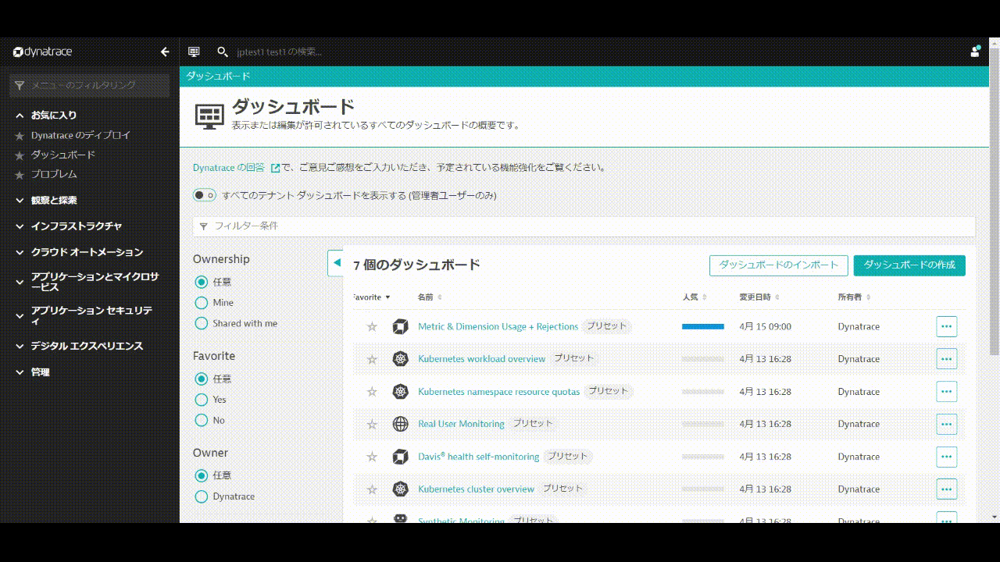
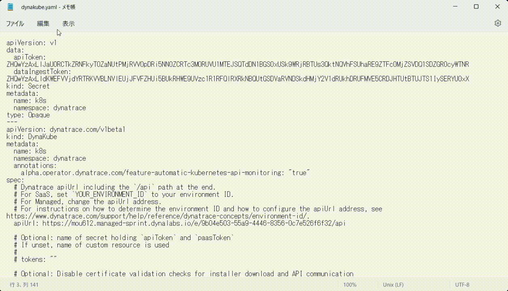
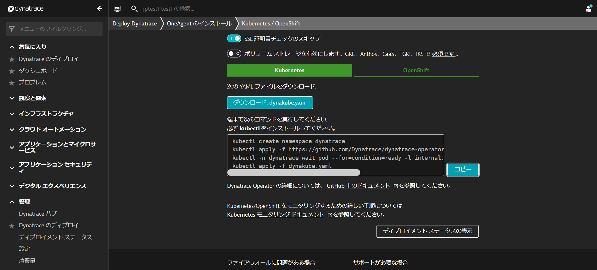
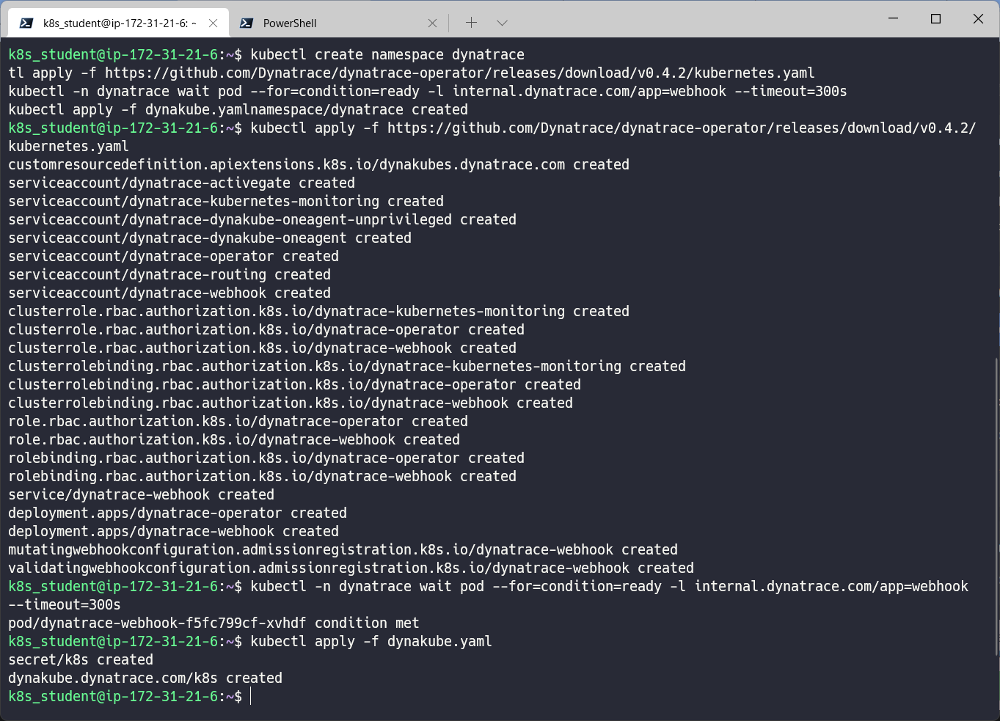

<!-- Code for deploying OneAgent via Operator -->

この演習では、Kubernetes(Microk8s)を実行しているLinuxインスタンスにDynatrace Operatorをデプロイします。

### Linuxターミナルへアクセス

Linuxインスタンスの**ターミナル**にアクセスします。

Positive
: ハンズオンワークショップへ参加されている方はメールに記載されている**EC2インスタンスの情報**を使用して、SSHでアクセスします。メールに記載されている**SSH Username**と**SSH Password**を使用します。

### Dynatrace Operatorのインストール

ブラウザを開き、DynatraceのGUIにアクセスしてください。

以下の手順で進めてください。

* ナビゲーションメニューから **管理 > Dynatraceハブ** を開きます。
* **Kubernetes** を選択します。
* 右下の **Kubernetesのモニター** ボタンをクリックします。 

**Kubernetes / Openshiftのモニター**ページ内で、以下の手順を行います。

* **名前** を入力します 例：`k8s`
* Dynatrace Operator トークンおよびデータ取り込みトークンの**トークンのさくせい**をクリックして、適切なパーミッションのPaaSおよびAPIトークンを作成します。
* **SSL証明書チェックのスキップ**を有効にします。
* **ダウンロード: dynakube.yaml** ボタンをクリックしてdynakube.yamlファイルをダウンロードします。

* メモ帳などでdynakube.yamlファイルを開き、dynakube.yamlファイルを全て選択し、コピーします。

* ターミナルで`vim dynakube.yaml`などを実行し、dynakube.yamlファイルを貼り付けます。

* Dynatrace UIに戻り、**コピー**ボタンをクリックして、ターミナルに貼り付け実行します。

出力例

Negative
: Dynatraceにデータが表示されるまで約5分かかります。

Positive
: Dynatraceは、OneAgentsの自動展開や、k8sの自動統合を行います。

### インストールの確認

**ディプロイメントステータスの表示**をクリックすると、接続されているホストの状態を確認することができます。

下の画像のように、接続されたホストが表示されているはずです。

Positive
: 詳しいドキュメントは[こちら](https://www.dynatrace.com/support/help/shortlink/full-stack-dto-k8)を参照ください。

### ⚠️ トラブルシューティングの手順

Negative
: **ポッドの状態を確認**するには、以下のコマンドを実行します。すると、**Running**という結果が返ってくるはずです。 
`kubectl get pods -n dynatrace`

Negative
: **ログの確認**は、以下のコマンドを実行します。 
`kubectl logs -f deployment/dynatrace-oneagent-operator -n dynatrace`

Negative
: **シークレットを削除**するには、以下のコマンドを実行してください。誤ったシークレットが含まれている可能性があります。  
`kubectl delete secret --all -n dynatrace`

Negative
: **すべてのポッドを削除**するには、以下のコマンドを実行してください。これにより、すべてのポッドが削除され、新しいポッドインスタンスが作成されます。 
`kubectl delete --all pods -n dynatrace`

Negative
: 公式サイトのトラブルシューティングページは[こちら](https://www.dynatrace.com/support/help/shortlink/kubernetes-troubleshoot)を参照ください。
