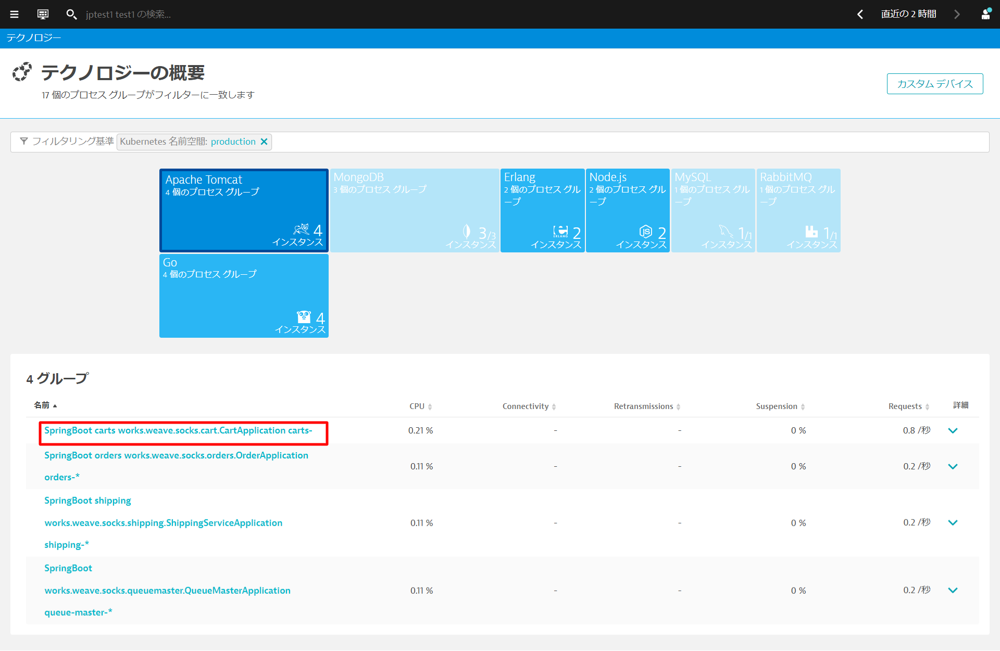
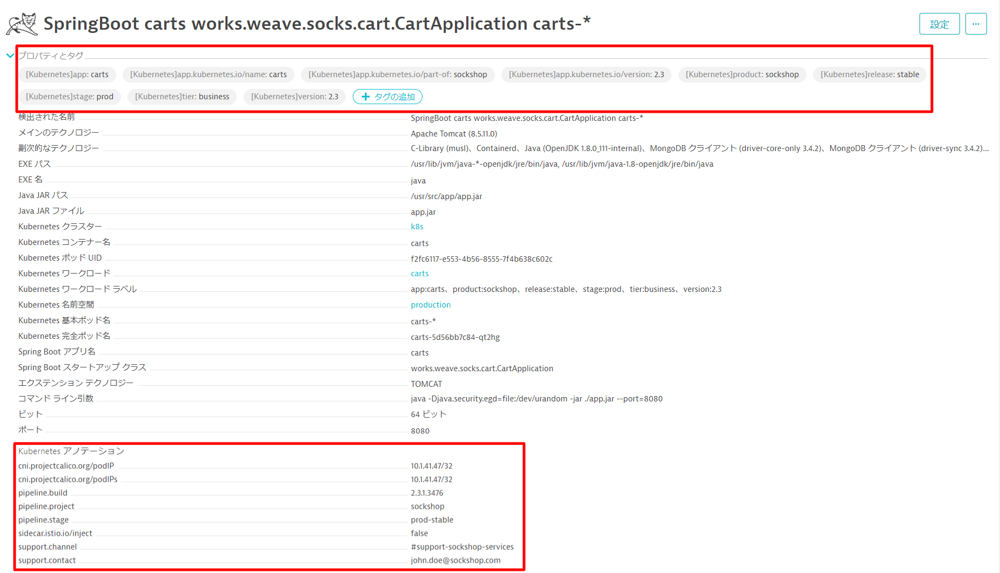
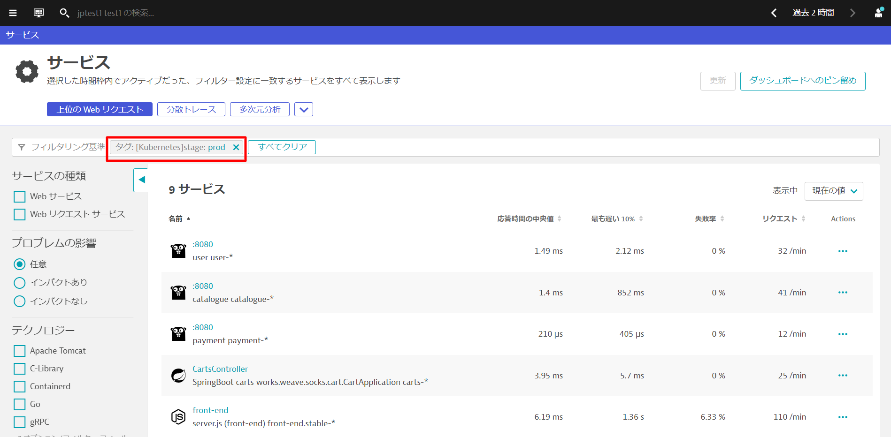
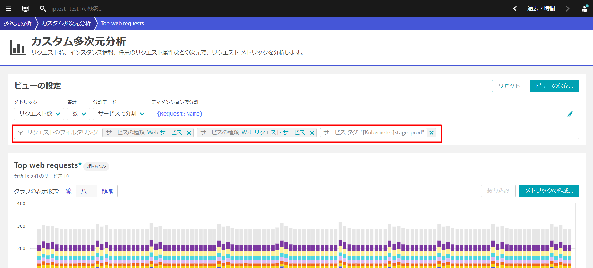

<!-- Step to setup labels and annotations -->

Dynatraceは、Kubernetes/OpenShiftのラベルを取得し、自動でタグ付けすることができます。また、同様にアノテーションを取得し、プロセスグループのプロパティとして登録することができます。

### ラベルとアノテーションの確認

`kubectl -n production describe deployments.apps front-end.stable`を実行するか
`~/sockshop/manifests/sockshop-app/production/front-end.yml`を確認することでどのようなラベルとアノテーションが設定されているか確認することができます。

```bash
---
apiVersion: apps/v1
kind: Deployment
metadata:
  creationTimestamp: null
  labels:
    app: front-end.stable
    product: sockshop
    release: stable
    stage: prod
    tier: frontend
    version: "1.4"
  name: front-end.stable
  namespace: production
spec:
  replicas: 1
  selector:
    matchLabels:
      app: front-end.stable
      product: sockshop
      release: stable
      stage: prod
      tier: frontend
      version: "1.4"
  strategy:
    rollingUpdate:
      maxSurge: 1
      maxUnavailable: 1
    type: RollingUpdate
  template:
    metadata:
      annotations:
        pipeline.build: 1.4.0.7424
        pipeline.project: sockshop
        pipeline.stage: prod-stable
        sidecar.istio.io/inject: "false"
        support.channel: '#support-sockshop-frontend'
        support.contact: jane.smith@sockshop.com
      labels:
        app.kubernetes.io/name: front-end
        app.kubernetes.io/version: "1.4"
        app.kubernetes.io/part-of: sockshop
        app: front-end.stable
        product: sockshop
        release: stable
        stage: prod
        tier: frontend
        version: "1.4"
```

**インフラストラクチャ > テクノロジーとプロセス**を開きます。フィルタリング基準から**Kubernetes名前空間 production**を選びます。production名前空間で動作しているプロセスグループがフィルタリングされますので、**Apache Tomcat**をクリックし、表示されたグループから1つ開きます。



**プロパティとタグ**を開くとKubernetesで設定したラベルとアノテーションが登録されていることが確認できます。



### サービスアカウントへのview role の割り当て

Dynatraceはサービスアカウントを使用して、Kubernetes APIを介してラベル・アノテーション情報を取得します。そのためサービスアカウントに、**viewer role**が付与されている必要があります。
もし、**プロパティとタグ**でKubernetesで設定したラベルとアノテーションが確認できない場合、以下の手順で**default**のサービスアカウントに必要なroleを割り当てます。

* 以下のファイルを作成し、アプライします。

```
# dynatrace-oneagent-metadata-viewer-production.yaml
kind: Role
apiVersion: rbac.authorization.k8s.io/v1
metadata:
  namespace: production
  name: dynatrace-oneagent-metadata-viewer
rules:
- apiGroups: [""]
  resources: ["pods"]
  verbs: ["get"]
---
kind: RoleBinding
apiVersion: rbac.authorization.k8s.io/v1
metadata:
  name: dynatrace-oneagent-metadata-viewer-binding
  namespace: production
subjects:
- kind: ServiceAccount
  name: default
  apiGroup: ""
roleRef:
  kind: Role
  name: dynatrace-oneagent-metadata-viewer
  apiGroup: ""
```

```bash
kubectl -n production create -f dynatrace-oneagent-metadata-viewer-production.yaml
```

* **dev**に対しても同様に実行します。

```
# dynatrace-oneagent-metadata-viewer-dev.yaml
kind: Role
apiVersion: rbac.authorization.k8s.io/v1
metadata:
  namespace: dev
  name: dynatrace-oneagent-metadata-viewer
rules:
- apiGroups: [""]
  resources: ["pods"]
  verbs: ["get"]
---
kind: RoleBinding
apiVersion: rbac.authorization.k8s.io/v1
metadata:
  name: dynatrace-oneagent-metadata-viewer-binding
  namespace: dev
subjects:
- kind: ServiceAccount
  name: default
  apiGroup: ""
roleRef:
  kind: Role
  name: dynatrace-oneagent-metadata-viewer
  apiGroup: ""
```

```bash
kubectl -n dev create -f dynatrace-oneagent-metadata-viewer-dev.yaml
```

以下のコマンドを実行して、**devとproduction**の2つのNamespacesに含まれるPodsを作り直します。

```bash
kubectl delete pods --all -n dev
kubectl delete pods --all -n production
```

### タグの活用方法

テクノロジーとプロセスやサービスで該当のタグがついているものだけに絞り込むことができます。



また、多次元分析でもリクエストのフィルタリングに利用することができます。



Positive
: 詳細は[公式サイト](https://www.dynatrace.com/support/help/shortlink/kubernetes-tagging)をご確認ください。<br>
また、さらなるタグの活用に関するベストプラクティスを知りたい方はこちらの[公式サイト](https://www.dynatrace.com/support/help/shortlink/tagging-best-practices)をご確認ください。
