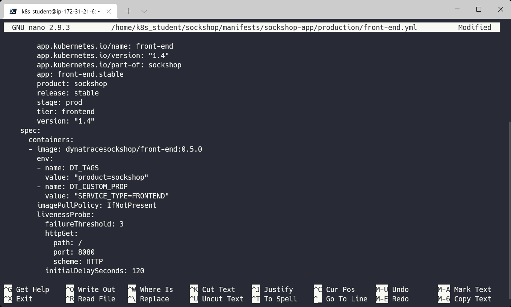

<!-- Code for k8s Container Environment Variables-->

タグやメタデータ情報はKubernetesのラベル・アノテーションを利用する方法以外にもDynatrace同時の環境変数を使用することで付与することができます。

### 事前確認

**インフラストラクチャ > テクノロジーとプロセス**を開きます。フィルタリング基準から**Kubernetesワークロード front-end.stable**を選び、**server.js**から始まるプロセスグループをクリックします。
プロパティとタグには**[Kubernetes]**から始まるタグのみ存在することを確認します。

### 環境変数の追加

ターミナルで、以下のコマンドを実行し、環境変数を追加します。

`nano ~/sockshop/manifests/sockshop-app/production/front-end.yml`

`spec.containers`のimage行の下に追加します。**インデントが正しく行われているか、エラープロンプトが表示されていないかを確認してください。**

```bash
        env:
        - name: DT_TAGS
          value: "product=sockshop"
        - name: DT_CUSTOM_PROP
          value: "SERVICE_TYPE=FRONTEND"
```


修正したファイルを**Ctrl-X**、**Y**、**Enter**で保存し、以下のコマンドを実行して変更を再適用します。

```bash
kubectl apply -f ~/sockshop/manifests/sockshop-app/production/front-end.yml
```

### 確認

作業が完了したら、Dynatraceで変更を検証することができます。
**インフラストラクチャ > テクノロジーとプロセス**を開きます。フィルタリング基準から**Kubernetesワークロード front-end.stable**を選び、**server.js**から始まるプロセスグループをクリックします。


先ほど追加した環境変数がタグおよびメタデータとして反映されていることが確認できます。


追加した内容はproduction名前空間のfront-endワークロードのみなので、dev名前空間のfront-endワークロードや、他のワークロードには追加されていないことを確認してみましょう。
ヒント：**テクノロジーとプロセス**画面でフィルタリングを利用すると簡単に絞り込むことができます。