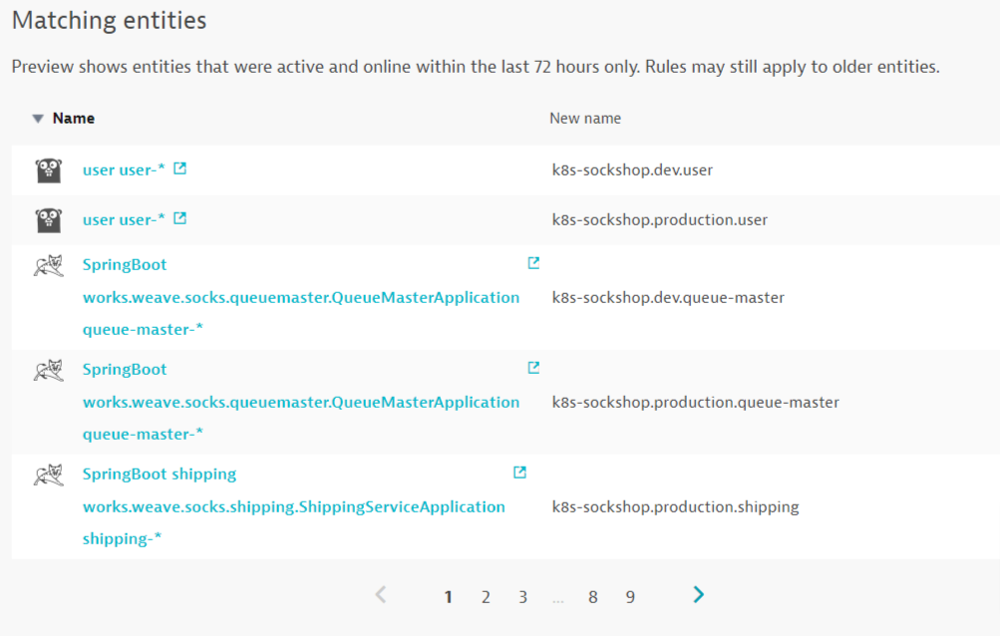
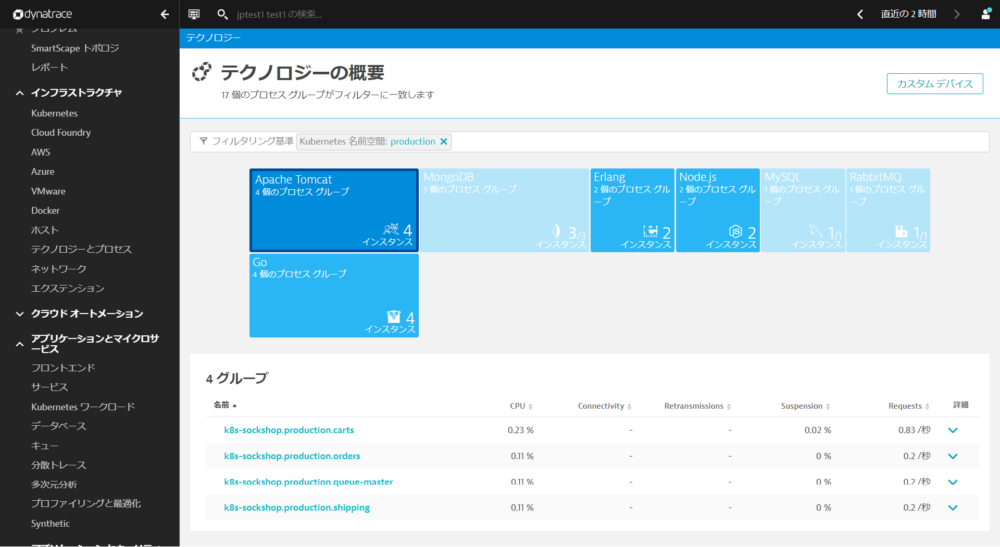
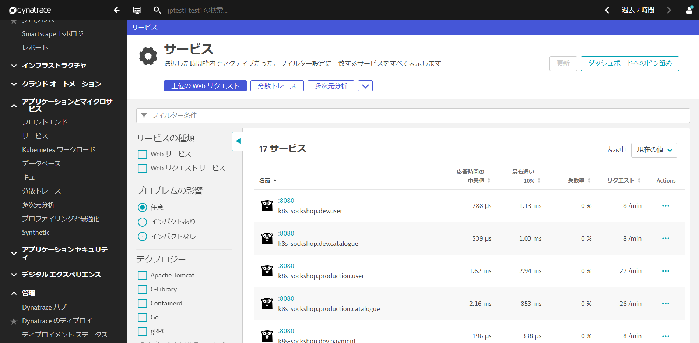
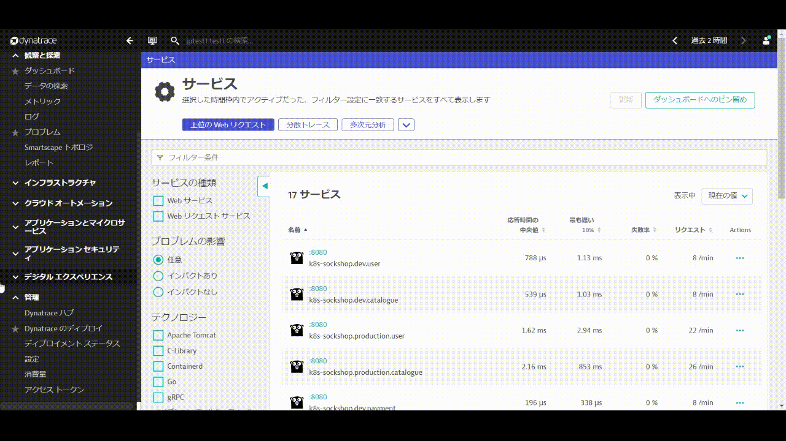
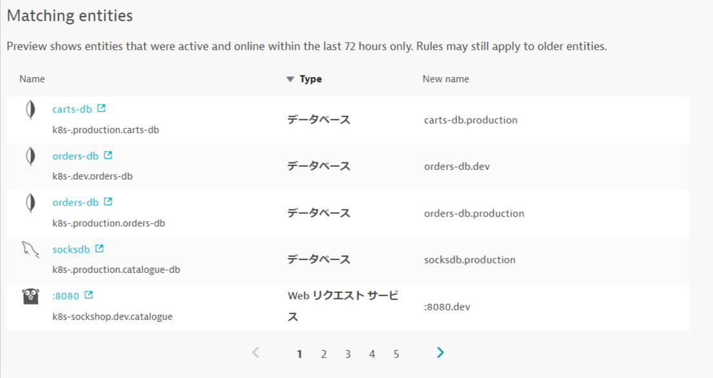

<!-- Code for k8s Process Group & Service Naming Rules -->

プロセスグループやサービスの命名規則を設定することにより、プロセスグループ名やサービス名とKubernetes環境との関係性がわかりやすくなります。

### プロセスグループの命名規則

**管理 > 設定**を開き、**Processes and containers > Process group naming**へ移動し、**Add a new rule**をクリックします。

**Rule name**にルールの名前を入力します。（例: `Kubernetes Project.Namespace.Container`）

**Process group name forat**に命名規則を入力します。
ここでは以下のように入力してください。

`k8s-{ProcessGroup:Kubernetes:pipeline.project}.{ProcessGroup:KubernetesNamespace}.{ProcessGroup:KubernetesContainerName}`

**Conditions**は, **Kubernetes 名前空間**と**exists**を選択します。

**Preview**をクリックし、マッチしているエントリーを確認します。

**Create Rule**と**変更の保存**をクリックします。

### プロセスグループの確認

**インフラストラクチャ > テクノロジーとプロセス**を開きます。フィルタリング基準から**Kubernetes 名前空間 production**を選び、**Apache Tomcat**をクリックします。

プロセスグループ名が変更されていることが確認できます（設定が反映されない場合はブラウザを更新してみてください）。

### サービス名の命名規則

**アプリケーションとマイクロサービス > サービス**を開き、現在のサービス名を確認します。

**管理 > 設定**を開き、**Server-side service monitoring > Service naming rules**へ移動し、**Add a new rule**をクリックします。

**Rule name**にルールの名前を入力します。（例: `Kubernetes.Namespace`）

**Service name forat**に命名規則を入力します。
ここでは以下のように入力してください。

`{Service:DetectedName}.{ProcessGroup:KubernetesNamespace}`

**Conditions**は, **Kubernetes 名前空間**と**exists**を選択します。

**Preview**をクリックし、マッチしているエントリーを確認します。

**Create Rule**と**変更の保存**をクリックします。

### サービスの確認

**アプリケーションとマイクロサービス > サービス**を開き、名前の後ろに名前空間がついていることを確認します（設定が反映されない場合はブラウザを更新してみてください）。

