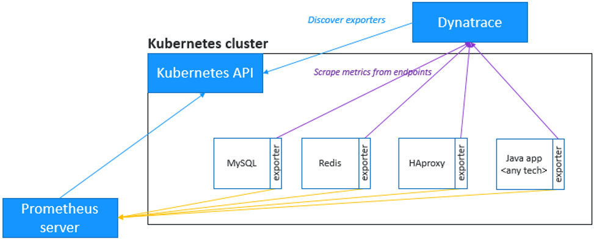
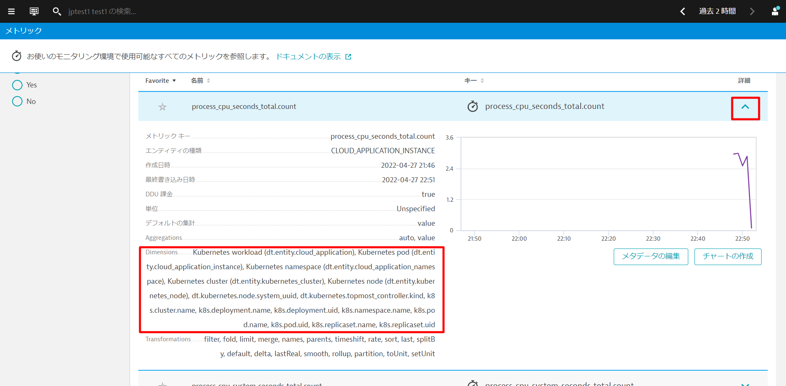

<!-- Code for k8s Prometheus-->

アプリケーションには、Nginx、Redis、RabbitMQ、MySQL、MongoDBなどのサードパーティのテクノロジーが使用されていることが多く、これらについては、メトリクスの観点からさらなる洞察が必要となります。

Dynatraceでは、Prometheusと同じ形式のメトリクスを取り込むことができ、マイクロサービスやポッドのより大きな文脈の中にそれらを取り込み、これらのメトリクスの**自動適応ベースライン化**による**強化されたアラート**を可能にします。

さらに良いことに、Dynatraceはスクレイピングを実行してくれるので、**Prometheusサーバーは必要ありません**。



### Prometheusエクスポーターポッドのアノテーション

ターミナルに戻り、次のコマンドを実行して、ポッドに**Prometheus scraping**のためのアノテーションを付与します。

このコマンドは、**Production** namespace内のポッドにアノテートを付与します。

```bash
kubectl annotate po -n production --all --overwrite metrics.dynatrace.com/scrape=true
kubectl annotate po -n production --all --overwrite metrics.dynatrace.com/port=8080
```

Positive
: 上記手順に関する詳細は[公式サイト](https://www.dynatrace.com/support/help/shortlink/monitor-prometheus-metrics)を参照ください。

### メトリクスの探索

1～2分ほど待ってから、**観察と探索 > メトリック**を開きます。**Filtered by:**テキストボックスに`process_`と入力し、**"Enter "**キーを押します。

複数のメトリクスが表示されます。これらはPrometheusのメトリックから収集したものです。何も表示されない場合は、もう少し待ってから、画面を更新して再度試してみてください。


いずれかの項目の詳細を開くと、収集されたメトリックの**Dimensions**などを確認することができます。Dynatraceは、Kubernetesのワークロード、ネームスペース、ノードなどを **自動的に関連付け**、これをAIエンジンに送り込んでいます。



PrometheusのメトリクスをDynatraceで利用できるようになりました。サードパーティ製ではありますが、これらのメトリクスもDynatraceのメトリクスとして扱われます。
また、これらのメトリクスを簡単に**チャート化**したり、**ダッシュボード**に貼り付けることができます。

### メトリクスに基づくカスタムアラートを設定する方法

メトリクスに基づいてアラートを作成することもできます。収集しているメトリクスに関する異常があった場合に通知されるよう設定することが可能です。

Negative
: Kubernetesワークロードのインテリジェントオブザーバビリティでカスタムアラートを行いましたが、Prometheusが収集したメトリックでも同様のことができるか、セッション終了後、ご自身で自由にお試しいただけます。

[Metric events for alerting](https://www.dynatrace.com/support/help/shortlink/metric-events-for-alerting)が参考になります。

セッション終了後、お時間のある方はぜひお試しください。
