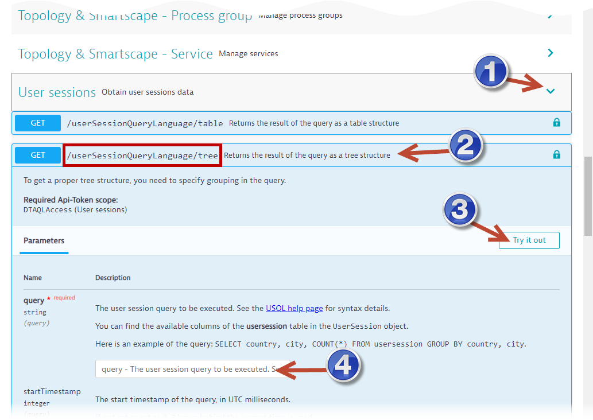
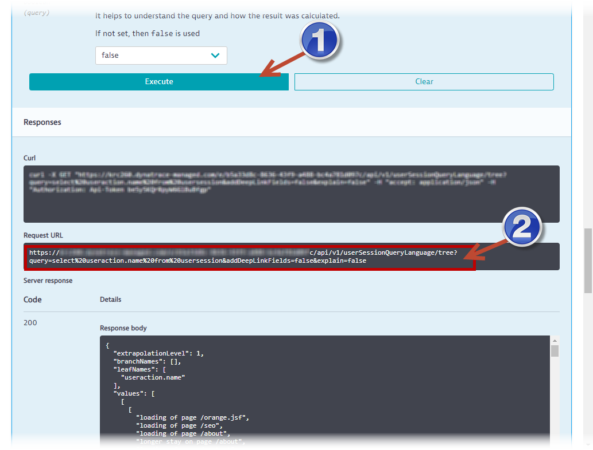
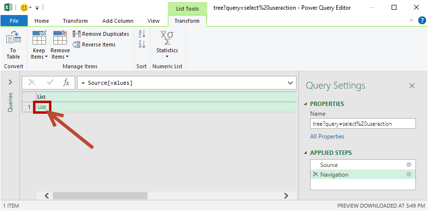
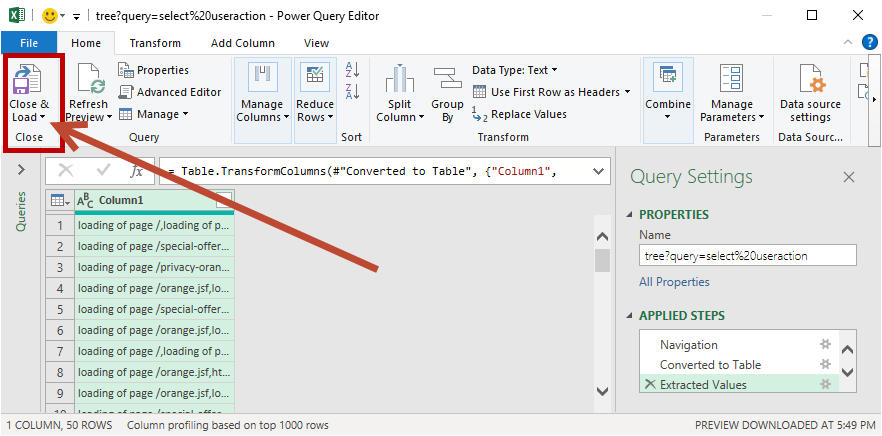
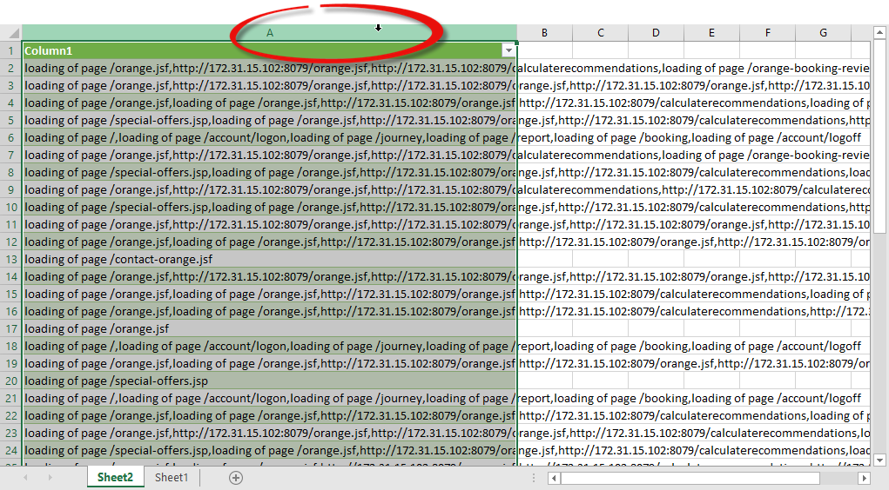
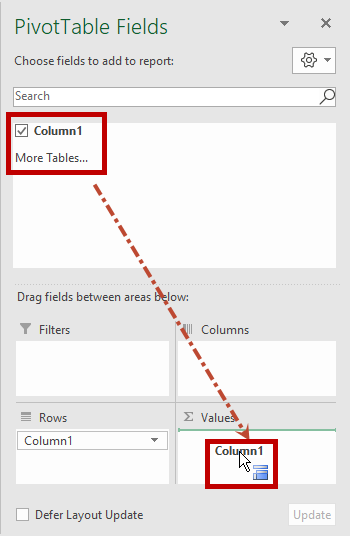
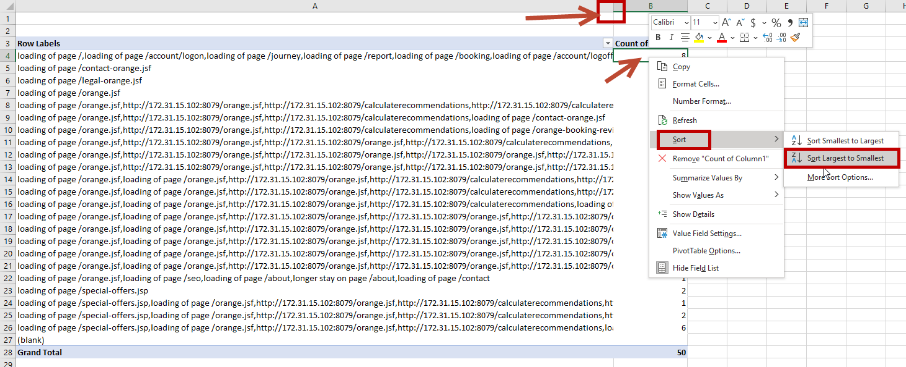
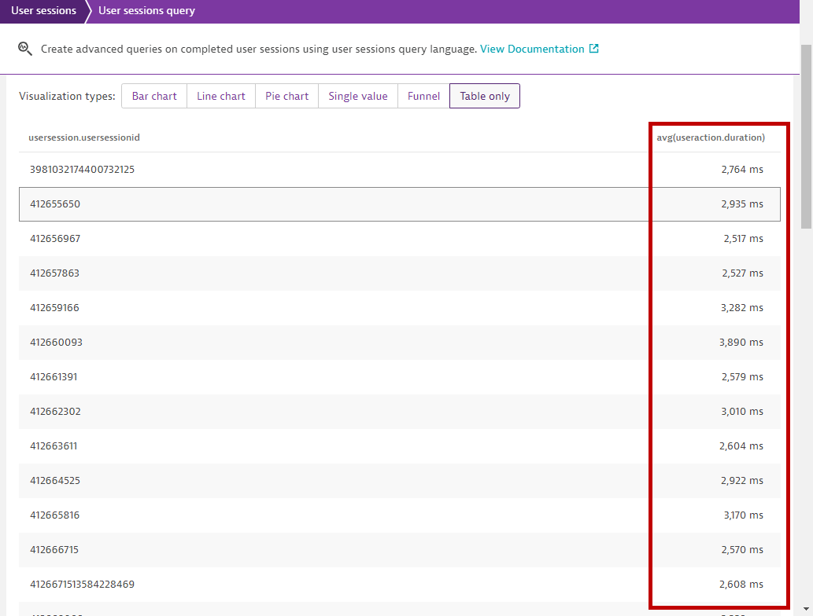
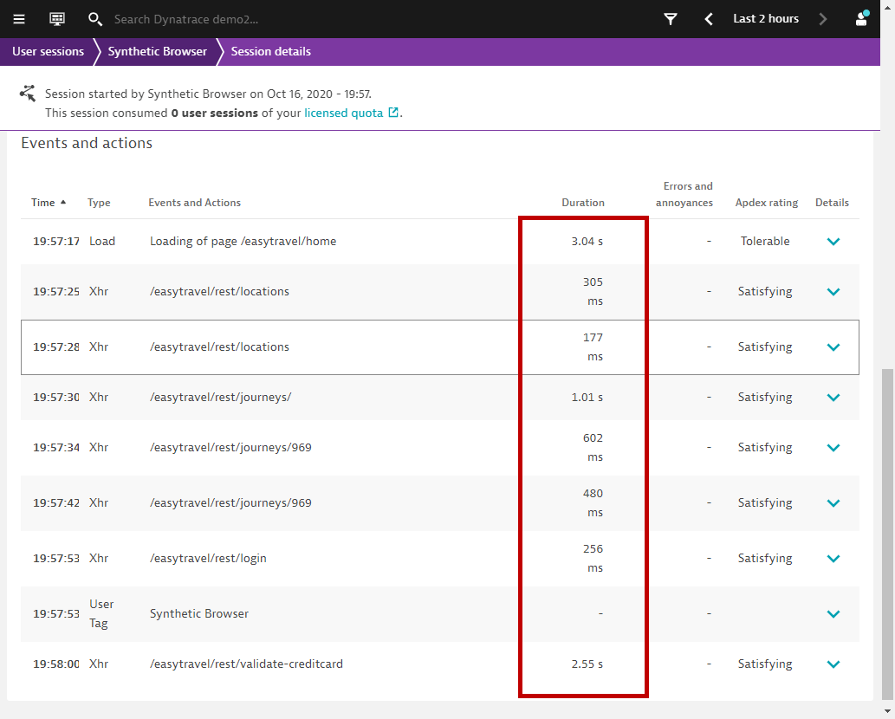
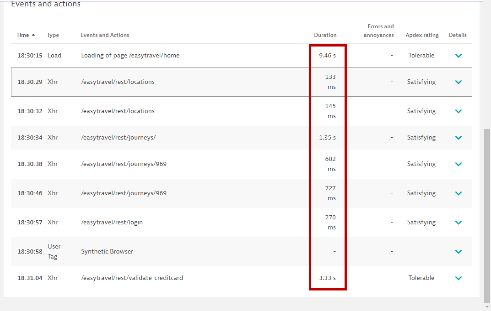

summary: How to use USQL in your POCs
id: usql
categories: DEM, BizOps
tags: bootcamp
status: Published 
authors: Myrvin Yap
Feedback Link: mailto:APAC-SE-Central@dynatrace.com
Analytics Account: UA-175467274-1

# Advanced USQL
<!-- ------------------------ -->
## Introduction 

This repository contains the exercises for the Advanced USQL session. 

### Prerequisites
- Access to http://demo.live.dynatrace.com
- Microsoft Excel

### What You’ll Learn 
- Intricacies/Gotchas of USQL
- USQL Tips and tricks in the field
- Extracting and manupulating the data in Excel
- Some advanced USQL for BizOps use cases

<!-- ------------------------ -->
## Intricacies/Gotchas of USQL


### Warm up

What does each of the query do?

Go ahead to run this in http://demo.live.dynatrace.com -> User sessions

**Query 1**

`select distinct hour(usersession.starttime), count(*) from usersession order by count(*) DESC`

**Query 2**

`select distinct hour(usersession.starttime), count(useraction.name) from usersession order by count(useraction.name) DESC`

**Query 3**

`select distinct hour(usersession.starttime), count(useraction.name) from useraction order by count(useraction.name) DESC`

### Challenge

- What does each of the query do?
- What are we actually querying for?

**Hint**: Focus on the table name, and condition ` useraction.name like "%rest%" `


**Query 1**

`SELECT useraction.name as "Page Name", COUNT(*) as "Page Views", COUNT(DISTINCT usersession.internalUserId) AS "Unique Page Views", AVG(useraction.duration) As "Average Session" FROM usersession WHERE useraction.name like "%rest%" GROUP BY useraction.name`

**Case in point:** `select useraction.name from usersession LIMIT 10`

**Query 2**

`SELECT useraction.name as "Page Name", COUNT(*) as "Page Views", COUNT(DISTINCT usersession.internalUserId) AS "Unique Page Views", AVG(useraction.duration) As "Average Session" FROM useraction WHERE useraction.name like "%rest%" GROUP BY useraction.name`

<!-- ------------------------ -->
## Hands on exercise
Duration: 15

### Setting up the query
1. Access:
2. Launch API V1


3. Authenticate


4. Go to User Sessions
5. Expand /userSessionQueryLanguage/tree (DO NOT USE TABLE)
6. Click try it out
7. Enter in your query

`select useraction.name from usersession`



8. Execute
9. Copy Request URL



### Using Excel to slice and dice the data
1. Open new spreadsheet, select Data and then select From Web


2. Insert Request URL w/ token as a query parameter (use &pageSize=[N] to expand result set)

`&pageSize=50000&api-token=[YourToken]`

Example:

`https://<URL>/e/<envid>/api/v1/userSessionQueryLanguage/tree?query=select%20useraction.name%20from%20usersession&addDeepLinkFields=false&explain=false&pageSize=50000&api-token=[YourToken]`


3. Click OK
4. Select List (next to values)


5. Select List again



6. Select To Table Convert (Delimiter None)


7. Click expand icon in Value header
8. Extract values (Delimiter – comma)


9. Click Close & Load



10. Highlight Column A and Insert->Pivot Table




11. Select box for Column 1 and drag Column 1 to Values



12. Select a value in Column B and sort Largest to Smallest. Resize Column A as neccessary



Final Result


13. Save spreadsheet

<!-- ------------------------ -->
## Advanced USQL for BizOps use cases

### FUNNEL Query

```Bash
SELECT FUNNEL(useraction.name="Loading of page /easytravel/home" AS "Home", 
useraction.name = "/easytravel/rest/login" AS "LOGIN",
useraction.name = "/easytravel/rest/locations" AS "Search", 
useraction.matchingConversionGoals = "Credit card validated" AS "Payment") 
FROM usersession
```


### FILTER Query

**Use Case:** I want all the user sessions & avg(duration) that hit validate credit card and the avg duration for all user actions is longer than 2 seconds.

Query
```Bash
SELECT usersession.usersessionid, avg(useraction.duration)
FROM usersession
WHERE useraction.application='www.angular.easytravel.com'
AND useraction.duration>2000
AND useraction.name="/easytravel/rest/validate-creditcard"
GROUP BY usersession.usersessionid
```
Result: If **any one** of user action in the session has duration>2 seconds

So if we pull from `useraction` table, will it give us what we want?

```Bash
SELECT usersession.usersessionid, avg(useraction.duration)
FROM useraction
WHERE useraction.application='www.angular.easytravel.com'
AND useraction.duration>2000
AND useraction.name="/easytravel/rest/validate-creditcard"
GROUP BY usersession.usersessionid
```

Looks better.



But am I getting the result that I want? Take any Usersession ID...

`SELECT usersession.usersessionid FROM usersession WHERE usersession.usersessionid=<anyid>`



What is the average user action duration here? (i.e. SUM(useraction duration) divide by total number of user actions)

What I really want: average user action >2 sec for **every** usersession.

**Solution**

If avg of **all** user actions duration>2 seconds

```Bash
SELECT usersession.usersessionid, avg(useraction.duration) FILTER>2000
FROM usersession
WHERE useraction.application='www.angular.easytravel.com'
AND useraction.name="/easytravel/rest/validate-creditcard"
GROUP BY usersession.usersessionid
```


Take any Usersession ID...

`SELECT usersession.usersessionid FROM usersession WHERE usersession.usersessionid=<anyid>`



(9.46+0.133+0.145+1.35+0.602+0.727+0.27+3.33)/8 = 2.0002

GOAL!

<!-- ------------------------ -->

## Feedback
Duration: 3

We hope you enjoyed this lab and found it useful. We would love your feedback!
<form>
  <name>How was your overall experience with this lab?</name>
  <input value="Excellent" />
  <input value="Good" />
  <input value="Average" />
  <input value="Fair" />
  <input value="Poor" />
</form>

<form>
  <name>What did you benefit most from this lab?</name>
  <input value="USQL tips and ticks in the field" />
  <input value="Hands on exercise" />
</form>

Positive
: 💡 For other ideas and suggestions, please **[reach out via email](mailto:APAC-SE-Central@dynatrace.com?subject=Kubernetes Workshop - Ideas and Suggestions")**.